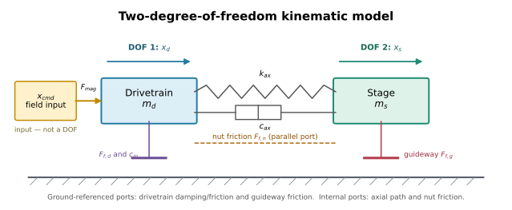
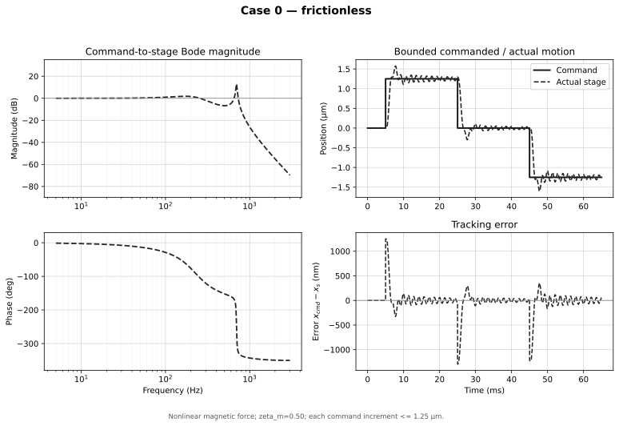
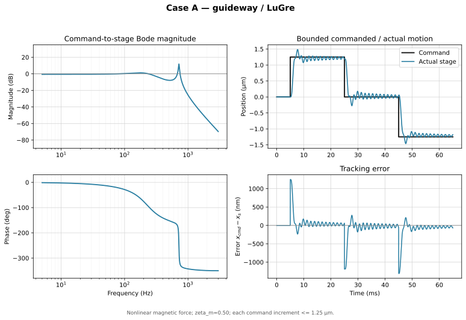
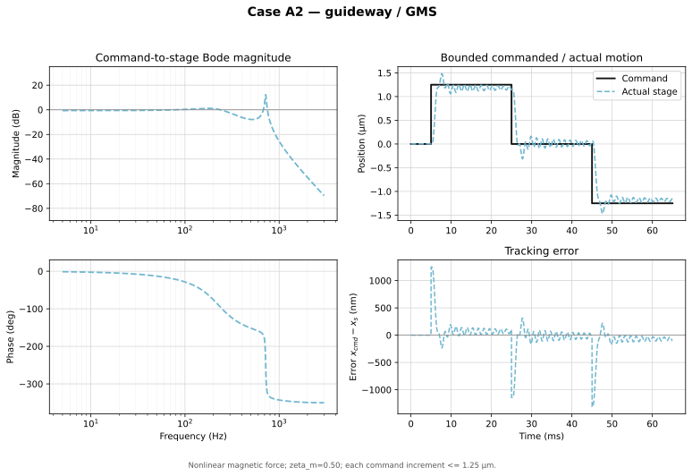
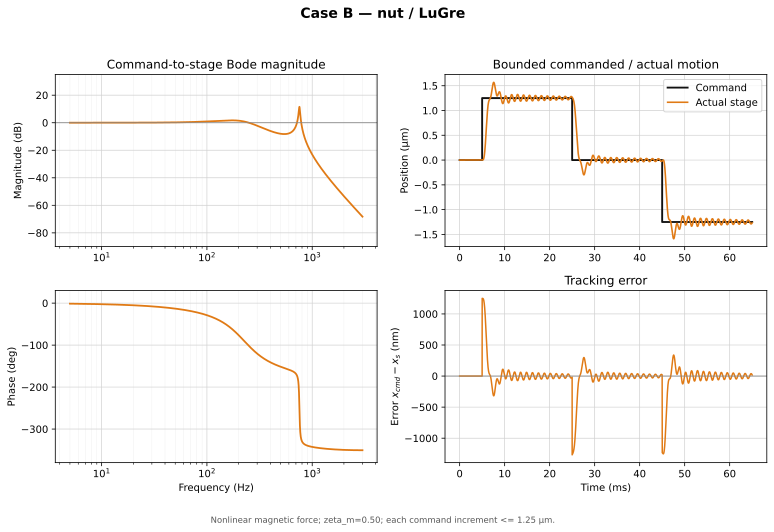
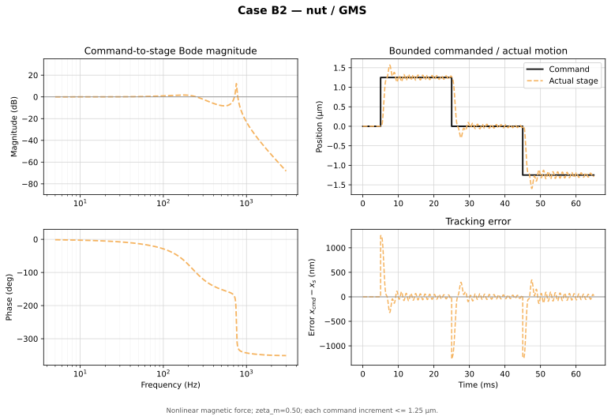
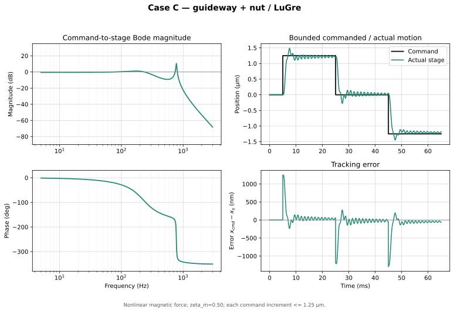
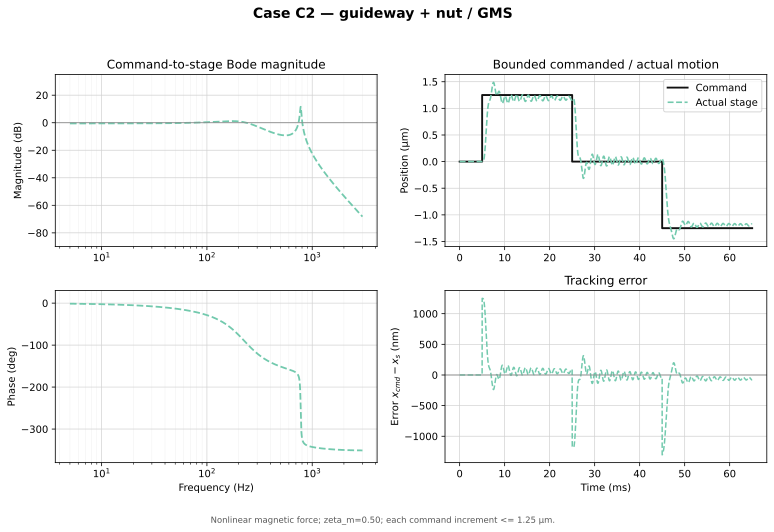
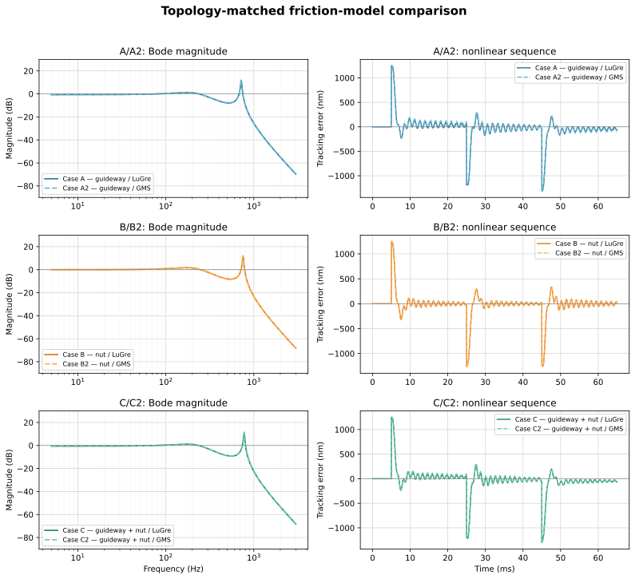

# Analytical Derivation and Response Study of the Precision Ball-Screw Stage

**Revision 1 — executable companion to the system-description document**

This document derives the equations of motion without skipping the force, sign, coordinate-transformation, damping, friction-state, or linearization steps. The compact result of each step remains visible; supporting algebra is placed in expandable sections. The executable cases are Case 0, LuGre A/B/C, and topology-matched GMS A2/B2/C2.

> **Read this first.** The model topology is defined in [Simulation Description](Simulation_description.html). Unidentified inputs are not text-labeled inside the input tables; they are highlighted in amber. They exercise model structure and must not be interpreted as identified hardware values.

---

## 1. Scope, outputs, and reproducibility

The response study uses one common two-coordinate plant and changes only the active friction sites:

| Case | Friction law | Guideway site $g$ | Nut site $n$ |
|---|---|:---:|:---:|
| 0 | none | — | — |
| A | LuGre | active | — |
| A2 | GMS | active | — |
| B | LuGre | — | active |
| B2 | GMS | — | active |
| C | LuGre | active | active |
| C2 | GMS | active | active |

The frequency response is the linearized command-to-stage transfer function $G(s)=X_s(s)/X_{cmd}(s)$. Each case receives its own Bode/step/error figure directly after its equations. The ending compares only the matched pairs A/A2, B/B2, and C/C2. Detent is disabled because no measured or sourced $T_{det}$ is available.

Run the complete build from this directory with:

```powershell
python .\build_model_documentation.py
```

That single build script regenerates all per-case figures, the paired comparison, the kinematic diagram, the numerical summary, and both browser-ready HTML documents. There are no separate simulation, plotting, or rendering scripts.

<details>
<summary>Exact numerical methods and conventions</summary>

- Frequency response: direct solution of the complex $2\times2$ dynamic-stiffness matrix at 3,200 logarithmically spaced points from 5 Hz to 3 kHz.
- Modal values: eigenvalues of $M^{-1}K$ for each presliding case.
- Nonlinear response: fixed-step classical fourth-order Runge–Kutta (RK4), $\Delta t=5\ \mu$s, total time 65 ms.
- Staircase handling: true zero-order hold; every command transition lies on the integration grid and one held value is used across all RK4 stages in each interval.
- LuGre physical state dimension: $4+$ number of active sites. GMS physical state dimension: $4+4$ states per active site in this study. The implementation uses one fixed 19-entry workspace vector so all cases share one integrator layout; inactive entries remain zero and are not physical DOFs.
- Plotted tracking error: $e(t)=x_{cmd}(t)-x_s(t)$; positive error means the stage is behind the command in the positive direction.
- Figure units: micrometres for command/position and nanometres for tracking error.

</details>

## 2. Parameter ledger used for the executable study

The input fields below are editable in the browser. Amber fields are assumptions requiring identification. Edits persist locally and can be written into an HTML copy using the toolbar; they do not rerun the static Python-generated figures.

### 2.1 Carried-through physical values

| Quantity | Editable value | Units | Use |
|---|---:|---|---|
| Screw lead $L$ | [[input:lead=1.000e-3]] | m | Kinematic transform |
| Rotor teeth $N_r$ | [[input:rotor_teeth=50]] | — | Magnetic spatial period |
| Reflected drivetrain mass $m_d$ | [[assumed:m_d=59.0]] | kg | Mechanical inertia |
| Stage mass $m_s$ | [[input:m_s=0.600]] | kg | Measured modal mass |
| Axial stiffness $k_{ax}$ | [[input:k_ax=1.14e7]] | N/m | Drivetrain-to-stage spring |
| Linear magnetic stiffness $K_m$ | [[assumed:K_m=1.20e8]] | N/m | Magnetic spring |
| Guideway presliding stiffness $\sigma_{0,g}$ | [[assumed:sigma0_g=7.60e5]] | N/m | A/A2/C/C2 |

### 2.2 Response-model inputs requiring identification

| Site/element | $c_{ax}$, $\zeta_m$, or $\sigma_0$ | $\sigma_1$ | $\sigma_2$ | $F_s$ | $F_c$ | $v_s$ | $\delta$ / $C$ |
|---|---:|---:|---:|---:|---:|---:|---:|
| Axial structural damping | [[assumed:c_ax=55.0]] | — | — | — | — | — | N·s/m |
| Electromagnetic modal damping $\zeta_m$ | [[assumed:zeta_m=0.50]] | — | — | — | — | — | dimensionless |
| Guideway $g$ | [[assumed:sigma0_g=7.60e5]] | [[assumed:sigma1_g=3.0]] | [[assumed:sigma2_g=0.40]] | [[assumed:Fs_g=3.0]] | [[assumed:Fc_g=2.4]] | [[assumed:vs_g=2.5e-4]] | [[assumed:C_g=5.0e3]] |
| Nut $n$ | [[assumed:sigma0_n=2.00e6]] | [[assumed:sigma1_n=5.0]] | [[assumed:sigma2_n=0.25]] | [[assumed:Fs_n=5.0]] | [[assumed:Fc_n=4.0]] | [[assumed:vs_n=2.0e-4]] | [[assumed:C_n=5.0e3]] |

The GMS banks use $N=4$, $\nu=[0.10,0.20,0.30,0.40]$, and stiffness fractions $[0.40,0.30,0.20,0.10]$. These opposing distributions retain the same aggregate $\sigma_0$ and $F_s$ as LuGre while producing distinct yield distances and reversal memory.

<details>
<summary>Derived magnetic and step quantities</summary>

The screw transform is

$$r=\frac{L}{2\pi}=1.59155\times10^{-4}\ \text{m/rad}.$$

From $K_m=T_{max}N_r/r^2$,

$$T_{max}=\frac{K_m r^2}{N_r}=6.0793\times10^{-2}\ \text{N·m},$$

and therefore

$$F_{max}=\frac{T_{max}}{r}=381.97\ \text{N}, \qquad
\kappa=\frac{N_r}{r}=\frac{2\pi N_r}{L}=3.14159\times10^5\ \text{rad/m}.$$

The mechanical pitch of one 1.8° full step and one quarter-step command are

$$x_{full}=\frac{L}{4N_r}=5.000\ \mu\text{m}, \qquad
x_{1/4}=\frac{x_{full}}{4}=\frac{L}{16N_r}=1.250\ \mu\text{m}.$$

At the instant of a quarter-step command, before the rotor moves, the electrical lag is

$$\kappa x_{1/4}=\frac{\pi}{8}=22.5^\circ,$$

so the nonlinear force begins at $F_{max}\sin(\pi/8)$ rather than at the linear approximation $K_m x_{1/4}$.

</details>

### 2.3 Degrees of freedom and rendered kinematic diagram



The plant has exactly two independent mechanical coordinates:

1. $x_d$: reflected linear motion of the lumped rotor–coupling–screw drivetrain.
2. $x_s$: linear motion of the stage, nut, carriages, and payload.

$x_{cmd}$ is a prescribed field-position input, not a DOF. The ideal transform $x_d=r\theta_d$ means rotor angle and $x_d$ are the same coordinate expressed in different units. LuGre bristle deflections and GMS force states are internal constitutive states: they increase the first-order state dimension but do not create additional rigid-body DOFs.

<details>
<summary>Toggle: complete model-variable and parameter glossary</summary>

| Symbol | Meaning | Units / type |
|---|---|---|
| $x_{cmd}$ | Commanded magnetic-field position | m, imposed input |
| $x_d$, $\dot x_d$, $\ddot x_d$ | Drivetrain position, velocity, acceleration | m, m/s, m/s² |
| $x_s$, $\dot x_s$, $\ddot x_s$ | Stage position, velocity, acceleration | m, m/s, m/s² |
| $\mathbf q=[x_d,x_s]^T$ | Mechanical generalized-coordinate vector | 2 DOFs |
| $L$ | Ball-screw lead | m/rev |
| $r=L/(2\pi)$ | Screw transform | m/rad |
| $N_r$ | Stepper rotor-tooth count | dimensionless |
| $m_d$ | Reflected rotor/coupling/screw mass | kg |
| $m_s$ | Stage/nut/carriage/payload mass | kg |
| $k_{ax}$ | Sliding-regime axial drivetrain stiffness | N/m |
| $c_{ax}$ | Axial relative-motion damping | N·s/m |
| $K_m$ | Linearized magnetic stiffness | N/m |
| $F_{max}$ | Peak commutation-force amplitude | N |
| $T_{max}$ | Peak commutation-torque amplitude | N·m |
| $\kappa=2\pi N_r/L$ | Spatial electrical wavenumber | rad/m |
| $c_m$ | Reflected electromagnetic drivetrain damping | N·s/m |
| $\zeta_m$ | Assumed low-mode damping ratio used to derive $c_m$ | dimensionless |
| $T_{det}$ | Detent-torque amplitude | N·m |
| $F_{mag}$ | Magnetic spring force before damping | N |
| $F_{ax}$ | Axial spring/damper transmitted force | N |
| $F_{f,g}$ | Guideway friction force | N |
| $F_{f,n}$ | Screw–nut interface friction force | N |
| $F_{f,d}$ | Support/motor-bearing friction force | N |
| $v_g=\dot x_s$ | Guideway friction-port velocity | m/s |
| $v_n=\dot x_d-\dot x_s$ | Nut friction-port velocity | m/s |
| $v_d=\dot x_d$ | Drivetrain ground-port velocity | m/s |
| $H_g,H_n,H_d$ | Rows mapping body velocities to port velocities | dimensionless matrices |
| $M,C,K,B$ | Linear mass, damping, stiffness, and input matrices | mixed matrix units |
| $F_s$, $F_c$ | Static/breakaway and Coulomb forces | N |
| $v_s$, $\delta$ | Stribeck velocity and curve exponent | m/s, dimensionless |
| $\sigma_0$ | Aggregate presliding/bristle stiffness | N/m |
| $\sigma_1$, $\sigma_2$ | LuGre microdamping and viscous coefficient | N·s/m |
| $z_\alpha$ | LuGre mean-bristle-deflection state | m |
| $N$, $\nu_i$, $k_i$ | GMS count, force weight, element stiffness | —, —, N/m |
| $F_{i,\alpha}$ | GMS element force state | N |
| $C_\alpha$ | GMS slip-attraction rate | N/s |
| $a_g,a_n,a_d$ | Binary friction-port activation flags | 0 or 1 |
| $e=x_{cmd}-x_s$ | Signed tracking error | m |

</details>

## 3. Coordinates, signs, and kinematic reflection

Let

$$\mathbf q=\begin{bmatrix}x_d\\x_s\end{bmatrix}, \qquad
\dot{\mathbf q}=\begin{bmatrix}\dot x_d\\\dot x_s\end{bmatrix}.$$

$x_d$ is the linear-equivalent position of the rigidly lumped rotor–coupling–screw drivetrain. $x_s$ is the stage position. Both are positive in the commanded travel direction. A positive friction force magnitude is defined to oppose a positive velocity at that friction site.

<details open>
<summary>Step 3.1 — derive the screw position and force transforms</summary>

For screw lead $L$, one revolution $2\pi$ rad produces translation $L$. Thus

$$x=r\theta, \qquad r=\frac{L}{2\pi}, \qquad \dot x=r\dot\theta.$$

Equate ideal mechanical power on both sides of the transform:

$$T\dot\theta=F\dot x=F r\dot\theta.$$

For nonzero $\dot\theta$,

$$T=Fr \quad\Longleftrightarrow\quad F=\frac{T}{r}.$$

This power argument fixes the reflection direction and prevents the common $r^2$ inversion error.

</details>

<details>
<summary>Step 3.2 — reflect rotary inertia into a linear mass</summary>

The rotary kinetic energy of the lumped rotor, coupling, and screw is

$$\mathcal T_d=\frac12(J_m+J_c+J_s)\dot\theta_d^2.$$

Since $\dot\theta_d=\dot x_d/r$,

$$\mathcal T_d=\frac12\frac{J_m+J_c+J_s}{r^2}\dot x_d^2.$$

Matching this to $\frac12m_d\dot x_d^2$ gives

$$\boxed{m_d=\frac{J_m+J_c+J_s}{r^2}}.$$

The complete kinetic energy is therefore

$$\boxed{\mathcal T=\frac12m_d\dot x_d^2+\frac12m_s\dot x_s^2}.$$

</details>

<details>
<summary>Step 3.3 — define relative coordinates for every two-terminal element</summary>

The axial element is driven by

$$\delta_{ax}=x_d-x_s, \qquad \dot\delta_{ax}=\dot x_d-\dot x_s.$$

The three friction-site displacements and velocities can be written with row vectors $H_\alpha$:

$$\xi_\alpha=H_\alpha\mathbf q, \qquad v_\alpha=H_\alpha\dot{\mathbf q},$$

where

$$H_g=\begin{bmatrix}0&1\end{bmatrix}, \qquad
H_n=\begin{bmatrix}1&-1\end{bmatrix}, \qquad
H_d=\begin{bmatrix}1&0\end{bmatrix}.$$

Hence

$$v_g=\dot x_s, \qquad v_n=\dot x_d-\dot x_s, \qquad v_d=\dot x_d.$$

This operator form is valuable because the same $H_\alpha$ maps both the site velocity and its equal-and-opposite generalized forces.

</details>

## 4. Element laws before assembling the bodies

### 4.1 Axial spring and damper

Define the force magnitude transmitted from drivetrain to stage as

$$\boxed{F_{ax}=k_{ax}(x_d-x_s)+c_{ax}(\dot x_d-\dot x_s)}.$$

If $x_d>x_s$, this force acts backward on the drivetrain and forward on the stage. Its generalized-force vector is therefore $[-F_{ax},+F_{ax}]^T$.

<details>
<summary>Matrix form of the axial element</summary>

Define

$$D=H_n^T H_n=
\begin{bmatrix}1\\-1\end{bmatrix}
\begin{bmatrix}1&-1\end{bmatrix}
=\begin{bmatrix}1&-1\\-1&1\end{bmatrix}.$$

Then

$$-\begin{bmatrix}1\\-1\end{bmatrix}F_{ax}
=-k_{ax}D\mathbf q-c_{ax}D\dot{\mathbf q}.$$

The matrix $D$ is singular because an internal element cannot resist rigid translation $x_d=x_s$.

</details>

### 4.2 Magnetic drive

The nonlinear commutation force, optional detent force, and small-lag linearization are

$$F_{comm}=F_{max}\sin\!\left(\kappa(x_{cmd}-x_d)\right),$$

$$F_{det}=-\frac{T_{det}}{r}\sin(4\kappa x_d),$$

$$F_{comm}\approx K_m(x_{cmd}-x_d), \qquad K_m=F_{max}\kappa.$$

The magnetic force acts only on the drivetrain coordinate, so its generalized-force vector is $[F_{mag},0]^T$.

The source model's ideal magnetic spring contains no loss. To represent current-regulator/back-EMF damping at the same mechanical port, add

$$\boxed{F_{em,damp}=-c_m\dot x_d}, \qquad c_m=2\zeta_m\sqrt{K_m m_d}.$$

The assumed $\zeta_m=0.50$ gives $c_m=8.414\times10^4$ N·s/m in reflected linear units. This parameter is highlighted because it must ultimately come from measured ring-down or an electromechanical current-loop model.

<details>
<summary>Derive the nonlinear linear-domain drive from motor torque</summary>

Start with the torque-angle law

$$T_{mag}=T_{max}\sin\!\left(N_r(\theta_{cmd}-\theta_d)\right).$$

Use $F=T/r$ and $\theta=x/r$:

$$F_{comm}=\frac{T_{max}}{r}\sin\!\left(\frac{N_r}{r}(x_{cmd}-x_d)\right).$$

Identifying $F_{max}=T_{max}/r$ and $\kappa=N_r/r$ gives the nonlinear expression above. For $\epsilon=\kappa(x_{cmd}-x_d)$ and $|\epsilon|\ll1$, $\sin\epsilon\approx\epsilon$, hence

$$F_{comm}\approx F_{max}\kappa(x_{cmd}-x_d)=K_m(x_{cmd}-x_d).$$

</details>

### 4.3 Friction force and generalized-force mapping

At site $\alpha$, $F_{f,\alpha}$ is positive when opposing positive $v_\alpha$. The virtual work dissipated by that force is

$$\delta W_{f,\alpha}=-F_{f,\alpha}\,\delta\xi_\alpha
=-F_{f,\alpha}H_\alpha\delta\mathbf q.$$

Therefore

$$\boxed{\mathbf Q_{f,\alpha}=-H_\alpha^T F_{f,\alpha}}.$$

<details>
<summary>Expand the generalized force at each physical site</summary>

Guideway to ground:

$$-H_g^T F_{f,g}=-\begin{bmatrix}0\\1\end{bmatrix}F_{f,g}
=\begin{bmatrix}0\\-F_{f,g}\end{bmatrix}.$$

Nut between drivetrain and stage:

$$-H_n^T F_{f,n}=-\begin{bmatrix}1\\-1\end{bmatrix}F_{f,n}
=\begin{bmatrix}-F_{f,n}\\+F_{f,n}\end{bmatrix}.$$

Drivetrain bearings to ground:

$$-H_d^T F_{f,d}=-\begin{bmatrix}1\\0\end{bmatrix}F_{f,d}
=\begin{bmatrix}-F_{f,d}\\0\end{bmatrix}.$$

The nut entries sum to zero, as any internal-action pair must. The guideway and drivetrain-bearing entries do not sum to zero because their reaction is carried by ground.

</details>

## 5. Newton–Euler derivation of the master equations

The free-body derivation is the primary construction used by the executable model.

<details open>
<summary>Step 5.1 — drivetrain free-body balance</summary>

Positive forces on $m_d$ are:

- $+F_{mag}$ from the stepper magnetic field;
- $-c_m\dot x_d$ from electromagnetic drivetrain damping;
- $-F_{ax}$ from the axial element;
- $-F_{f,n}$ from nut friction when $v_n>0$;
- $-F_{f,d}$ from drivetrain-bearing friction when $v_d>0$.

Newton's second law gives

$$m_d\ddot x_d=F_{mag}-c_m\dot x_d-F_{ax}-F_{f,n}-F_{f,d}.$$

Substituting $F_{ax}$,

$$\boxed{m_d\ddot x_d=F_{mag}-c_m\dot x_d-k_{ax}(x_d-x_s)-c_{ax}(\dot x_d-\dot x_s)-F_{f,n}-F_{f,d}}.$$

</details>

<details open>
<summary>Step 5.2 — stage free-body balance</summary>

Positive forces on $m_s$ are:

- $+F_{ax}$ from the axial element;
- $+F_{f,n}$, the reaction paired with the nut force on $m_d$;
- $-F_{f,g}$ from guideway friction when $v_g>0$.

Thus

$$m_s\ddot x_s=F_{ax}+F_{f,n}-F_{f,g},$$

or

$$\boxed{m_s\ddot x_s=k_{ax}(x_d-x_s)+c_{ax}(\dot x_d-\dot x_s)+F_{f,n}-F_{f,g}}.$$

</details>

<details>
<summary>Step 5.3 — assemble the scalar balances into the master matrix equation</summary>

Define

$$M=\begin{bmatrix}m_d&0\\0&m_s\end{bmatrix}, \qquad
D=\begin{bmatrix}1&-1\\-1&1\end{bmatrix}, \qquad
\mathbf e_d=\begin{bmatrix}1\\0\end{bmatrix}.$$

Stacking the two scalar balances gives

$$\boxed{
M\ddot{\mathbf q}+(c_{ax}D+c_mH_d^TH_d)\dot{\mathbf q}+k_{ax}D\mathbf q
=\mathbf e_dF_{mag}-\sum_{\alpha\in\{g,n,d\}}a_\alpha H_\alpha^T F_{f,\alpha}
}.$$

$a_\alpha\in\{0,1\}$ is the case activation flag. Expanding the right side recovers

$$
\begin{bmatrix}m_d&0\\0&m_s\end{bmatrix}
\begin{bmatrix}\ddot x_d\\\ddot x_s\end{bmatrix}
+\left(c_{ax}\begin{bmatrix}1&-1\\-1&1\end{bmatrix}
+c_m\begin{bmatrix}1&0\\0&0\end{bmatrix}\right)
\begin{bmatrix}\dot x_d\\\dot x_s\end{bmatrix}
+k_{ax}\begin{bmatrix}1&-1\\-1&1\end{bmatrix}
\begin{bmatrix}x_d\\x_s\end{bmatrix}
=\begin{bmatrix}F_{mag}-a_nF_{f,n}-a_dF_{f,d}\\a_nF_{f,n}-a_gF_{f,g}\end{bmatrix}.
$$

</details>

## 6. Independent energy-based cross-check

The Lagrange derivation is not required by the code, but it independently checks every spring, damper, and friction sign.

<details>
<summary>Step 6.1 — write kinetic energy, potential energy, and Rayleigh dissipation</summary>

For the linear magnetic model,

$$\mathcal T=\frac12m_d\dot x_d^2+\frac12m_s\dot x_s^2,$$

$$\mathcal V=\frac12k_{ax}(x_d-x_s)^2+\frac12K_m(x_d-x_{cmd})^2,$$

$$\mathcal R=\frac12c_{ax}(\dot x_d-\dot x_s)^2+\frac12c_m\dot x_d^2.$$

$x_{cmd}(t)$ is an imposed base coordinate. Friction is retained as a nonconservative generalized force rather than inserted into $\mathcal R$, because LuGre and GMS contain internal memory states and are not generally equivalent to viscous dissipation.

</details>

<details>
<summary>Step 6.2 — apply Lagrange's equation coordinate by coordinate</summary>

Use

$$\frac{d}{dt}\frac{\partial\mathcal T}{\partial\dot q_j}
-\frac{\partial\mathcal T}{\partial q_j}
+\frac{\partial\mathcal V}{\partial q_j}
+\frac{\partial\mathcal R}{\partial\dot q_j}=Q_{f,j}.$$

For $x_d$:

$$m_d\ddot x_d+k_{ax}(x_d-x_s)+K_m(x_d-x_{cmd})+c_{ax}(\dot x_d-\dot x_s)+c_m\dot x_d
=-F_{f,n}-F_{f,d}.$$

Move $K_m(x_d-x_{cmd})$ to the force form $-F_{mag}$ or retain it on the left. For $x_s$:

$$m_s\ddot x_s-k_{ax}(x_d-x_s)-c_{ax}(\dot x_d-\dot x_s)
=F_{f,n}-F_{f,g}.$$

These equations match the Newton balances exactly.

</details>

<details>
<summary>Step 6.3 — energy and internal-force sanity checks</summary>

Set $x_{cmd}=0$, all friction to zero, and $c_{ax}=c_m=0$. Then

$$E=\mathcal T+\mathcal V$$

must be constant. Also, adding the two scalar Newton equations cancels both $F_{ax}$ and $F_{f,n}$:

$$m_d\ddot x_d+m_s\ddot x_s=F_{mag}-c_m\dot x_d-F_{f,d}-F_{f,g}.$$

The nut interaction cannot change total mechanical momentum because it is internal. Either failed check would expose a sign error.

</details>

## 7. Friction-state equations and their insertion into the plant

### 7.1 Shared Stribeck curve

At any active site,

$$s_\alpha(v_\alpha)=F_{c,\alpha}+(F_{s,\alpha}-F_{c,\alpha})
\exp\!\left[-\left|\frac{v_\alpha}{v_{s,\alpha}}\right|^{\delta_\alpha}\right].$$

### 7.2 LuGre realization used in the nonlinear response

For each active site $\alpha$,

$$\dot z_\alpha=v_\alpha-\sigma_{0,\alpha}
\frac{|v_\alpha|}{s_\alpha(v_\alpha)}z_\alpha,$$

$$\boxed{F_{f,\alpha}=\sigma_{0,\alpha}z_\alpha
+\sigma_{1,\alpha}\dot z_\alpha+\sigma_{2,\alpha}v_\alpha}.$$

<details open>
<summary>Step 7.2a — write the complete first-order nonlinear state model</summary>

Let

$$\mathbf y=\begin{bmatrix}x_d&x_s&v_d&v_s&z_g&z_n&z_d\end{bmatrix}^T.$$

The kinematic rows are

$$\dot x_d=v_d, \qquad \dot x_s=v_s.$$

The acceleration rows are

$$\dot v_d=\frac{F_{mag}-c_m v_d-F_{ax}-a_nF_{f,n}-a_dF_{f,d}}{m_d},$$

$$\dot v_s=\frac{F_{ax}+a_nF_{f,n}-a_gF_{f,g}}{m_s}.$$

The active-site velocity arguments are

$$v_g=v_s, \qquad v_n=v_d-v_s, \qquad v_d=v_d.$$

The active LuGre rows are the corresponding state equations multiplied by the activation flags. The implementation reserves three LuGre slots and twelve GMS slots so all seven cases share one integrator layout. Reserved inactive entries remain zero and are not physical states of that case.

</details>

<details>
<summary>Step 7.2b — why the LuGre force has the signs used in the body equations</summary>

Starting from $z_\alpha(0)=0$, a positive site velocity initially gives $\dot z_\alpha>0$. Therefore the elastic term $\sigma_{0,\alpha}z_\alpha$, the microdamping term $\sigma_{1,\alpha}\dot z_\alpha$, and the viscous term $\sigma_{2,\alpha}v_\alpha$ are initially positive. $F_{f,\alpha}$ is thus a positive resisting-force magnitude. The generalized-force mapping $-H_\alpha^TF_{f,\alpha}$ supplies its direction on the bodies.

</details>

### 7.3 GMS alternative and state-count implication

For GMS element $i$ at site $\alpha$, the stuck rule is

$$\dot F_{i,\alpha}=k_{i,\alpha}v_\alpha,
\qquad |F_{i,\alpha}|<\nu_{i,\alpha}s_\alpha(v_\alpha),$$

and the sliding rule is

$$\boxed{\dot F_{i,\alpha}=C_\alpha
\left(\operatorname{sgn}(v_\alpha)-\frac{F_{i,\alpha}}{\nu_{i,\alpha}s_\alpha(v_\alpha)}\right)}.$$

The equilibrium is $F_{i,\alpha}=\operatorname{sgn}(v_\alpha)\nu_{i,\alpha}s_\alpha$. This corrected signed-attractor form is stable for both velocity directions. The previously written product form has the wrong equilibrium for $v<0$ and is not used.

The site output is

$$F_{f,\alpha}=\sum_{i=1}^{N_\alpha}F_{i,\alpha}+\sigma_{2,\alpha}v_\alpha.$$

<details>
<summary>How the mechanical derivation changes when LuGre is replaced by GMS</summary>

It does not change. The body equations see only the port pair $(v_\alpha,F_{f,\alpha})$. Replacing one LuGre state $z_\alpha$ with $N_\alpha$ GMS force states changes the internal friction evolution and event logic, but the generalized force remains $-H_\alpha^TF_{f,\alpha}$.

The physical first-order dimension becomes

$$n_x=4+\sum_{\alpha\ \text{active}}N_\alpha$$

for GMS, compared with

$$n_x=4+\#\{\text{active friction sites}\}$$

for LuGre. For the A2/B2/C2 structural comparison, each active GMS site uses four elements with

$$\boldsymbol\nu=[0.10,0.20,0.30,0.40],$$

$$\frac{\mathbf k}{\sigma_0}=[0.40,0.30,0.20,0.10].$$

Both vectors sum to one, so each GMS bank matches the corresponding LuGre site's aggregate breakaway force and presliding stiffness. Their opposing distributions create four different yield displacements. The distributions and $C_\alpha=5.0\times10^3$ N/s are highlighted assumptions, not identified parameters.

</details>

## 8. Comprehensive case-by-case equations of motion

Each case section contains its complete equations followed immediately by its own Bode, commanded/actual, and tracking-error result. $c_m$ is damping, not friction, so it remains active in the response realization of frictionless Case 0. Set $c_m=c_{ax}=0$ only when extracting the undamped modal baseline.

### Case 0 — frictionless modal baseline

<details open>
<summary>Expand Case 0 equations</summary>

Activation vector:

$$[a_g,a_n,a_d]=[0,0,0].$$

Equations:

$$m_d\ddot x_d=F_{mag}-c_m\dot x_d-k_{ax}(x_d-x_s)-c_{ax}(\dot x_d-\dot x_s),$$

$$m_s\ddot x_s=k_{ax}(x_d-x_s)+c_{ax}(\dot x_d-\dot x_s).$$

Physical first-order state dimension: 4. The friction forces are all zero. The undamped modes are obtained from $M$ and $K$ with damping suppressed; the plotted transient retains $c_m$ and $c_{ax}$.

</details>



### Case A — guideway friction with LuGre

<details>
<summary>Expand Case A equations</summary>

Activation vector:

$$[a_g,a_n,a_d]=[1,0,0].$$

Equations:

$$m_d\ddot x_d=F_{mag}-c_m\dot x_d-k_{ax}(x_d-x_s)-c_{ax}(\dot x_d-\dot x_s),$$

$$m_s\ddot x_s=k_{ax}(x_d-x_s)+c_{ax}(\dot x_d-\dot x_s)-F_{f,g},$$

$$v_g=\dot x_s,$$

$$\dot z_g=v_g-\sigma_{0,g}\frac{|v_g|}{s_g(v_g)}z_g,$$

$$F_{f,g}=\sigma_{0,g}z_g+\sigma_{1,g}\dot z_g+\sigma_{2,g}v_g.$$

Physical LuGre state dimension: 5. This case adds a stage-to-ground memory element.

</details>



### Case A2 — guideway friction with GMS

<details>
<summary>Expand Case A2 equations and GMS state bank</summary>

The mechanical equations and activation vector are identical to Case A:

$$[a_g,a_n,a_d]=[1,0,0],$$

$$m_d\ddot x_d=F_{mag}-c_m\dot x_d-k_{ax}(x_d-x_s)-c_{ax}(\dot x_d-\dot x_s),$$

$$m_s\ddot x_s=k_{ax}(x_d-x_s)+c_{ax}(\dot x_d-\dot x_s)-F_{f,g}.$$

The port velocity is $v_g=\dot x_s$. For $i=1,\ldots,4$,

$$\dot F_{i,g}=\begin{cases}
k_{i,g}v_g, & |F_{i,g}|<\nu_i s_g(v_g)\ \text{or unloading},\\
C_g\left[\operatorname{sgn}(v_g)-\dfrac{F_{i,g}}{\nu_i s_g(v_g)}\right], & \text{sliding},
\end{cases}$$

$$F_{f,g}=\sum_{i=1}^{4}F_{i,g}+\sigma_{2,g}v_g.$$

Physical GMS state dimension: $4+4=8$. Only the friction law changes relative to A; the mechanical topology and aggregate $\sigma_{0,g},F_{s,g},F_{c,g}$ are matched.

</details>



### Case B — nut/screw friction with LuGre

<details>
<summary>Expand Case B equations</summary>

Activation vector:

$$[a_g,a_n,a_d]=[0,1,0].$$

Equations:

$$m_d\ddot x_d=F_{mag}-c_m\dot x_d-k_{ax}(x_d-x_s)-c_{ax}(\dot x_d-\dot x_s)-F_{f,n},$$

$$m_s\ddot x_s=k_{ax}(x_d-x_s)+c_{ax}(\dot x_d-\dot x_s)+F_{f,n},$$

$$v_n=\dot x_d-\dot x_s,$$

$$\dot z_n=v_n-\sigma_{0,n}\frac{|v_n|}{s_n(v_n)}z_n,$$

$$F_{f,n}=\sigma_{0,n}z_n+\sigma_{1,n}\dot z_n+\sigma_{2,n}v_n.$$

Physical LuGre state dimension: 5. The nut force is internal and appears with equal magnitude and opposite sign. In presliding it behaves as an additional memory-dependent element parallel to $k_{ax}$.

</details>



### Case B2 — nut/screw friction with GMS

<details>
<summary>Expand Case B2 equations and GMS state bank</summary>

$$[a_g,a_n,a_d]=[0,1,0],$$

$$m_d\ddot x_d=F_{mag}-c_m\dot x_d-k_{ax}(x_d-x_s)-c_{ax}(\dot x_d-\dot x_s)-F_{f,n},$$

$$m_s\ddot x_s=k_{ax}(x_d-x_s)+c_{ax}(\dot x_d-\dot x_s)+F_{f,n}.$$

With $v_n=\dot x_d-\dot x_s$, each of the four elements follows

$$\dot F_{i,n}=\begin{cases}
k_{i,n}v_n, & |F_{i,n}|<\nu_i s_n(v_n)\ \text{or unloading},\\
C_n\left[\operatorname{sgn}(v_n)-\dfrac{F_{i,n}}{\nu_i s_n(v_n)}\right], & \text{sliding},
\end{cases}$$

$$F_{f,n}=\sum_{i=1}^{4}F_{i,n}+\sigma_{2,n}v_n.$$

Physical GMS state dimension: 8. The nut force remains an internal equal-and-opposite pair and therefore cannot by itself anchor the plant to ground.

</details>



### Case C — guideway and nut/screw friction with LuGre

<details>
<summary>Expand Case C equations</summary>

Activation vector:

$$[a_g,a_n,a_d]=[1,1,0].$$

Equations:

$$m_d\ddot x_d=F_{mag}-c_m\dot x_d-k_{ax}(x_d-x_s)-c_{ax}(\dot x_d-\dot x_s)-F_{f,n},$$

$$m_s\ddot x_s=k_{ax}(x_d-x_s)+c_{ax}(\dot x_d-\dot x_s)+F_{f,n}-F_{f,g}.$$

The two independent LuGre laws use different velocities:

$$v_g=\dot x_s, \qquad v_n=\dot x_d-\dot x_s.$$

Physical LuGre state dimension: 6. This is the minimum model that can distinguish absolute guideway motion from differential screw–nut motion.

</details>



### Case C2 — guideway and nut/screw friction with GMS

<details>
<summary>Expand Case C2 equations and both GMS state banks</summary>

$$[a_g,a_n,a_d]=[1,1,0],$$

$$m_d\ddot x_d=F_{mag}-c_m\dot x_d-k_{ax}(x_d-x_s)-c_{ax}(\dot x_d-\dot x_s)-F_{f,n},$$

$$m_s\ddot x_s=k_{ax}(x_d-x_s)+c_{ax}(\dot x_d-\dot x_s)+F_{f,n}-F_{f,g}.$$

The independent banks use $v_g=\dot x_s$ and $v_n=\dot x_d-\dot x_s$. Each bank follows the Case A2/B2 piecewise law and produces

$$F_{f,g}=\sum_{i=1}^{4}F_{i,g}+\sigma_{2,g}v_g, \qquad
F_{f,n}=\sum_{i=1}^{4}F_{i,n}+\sigma_{2,n}v_n.$$

Physical GMS state dimension: $4+4+4=12$. This is the GMS counterpart to the minimum two-site identification topology.

</details>



> **Case D scope.** The full three-port architecture remains defined in the system-description document, but it is deliberately excluded from this response set. The requested comparison isolates friction-law differences at identical A/B/C topologies; adding an unpaired drivetrain-bearing site would confound that comparison.

## 9. Linearization used for modal and Bode analysis

Frequency response requires a linear time-invariant model. The commutation law and friction states are therefore linearized about $x_d=x_s=x_{cmd}=0$, zero velocity, and zero bristle deflection.

<details open>
<summary>Step 9.1 — linearize the magnetic force</summary>

For $\epsilon=\kappa(x_{cmd}-x_d)$,

$$F_{max}\sin\epsilon=F_{max}\left(\epsilon-\frac{\epsilon^3}{6}+\cdots\right).$$

Keeping the first-order term,

$$F_{mag}\approx F_{max}\kappa(x_{cmd}-x_d)=K_m(x_{cmd}-x_d).$$

Move $-K_mx_d$ to the left and retain $K_mx_{cmd}$ as the input.

</details>

<details open>
<summary>Step 9.2 — linearize one LuGre friction site in presliding</summary>

Near $(v,z)=(0,0)$, the term $|v|z$ is second order. Therefore

$$\dot z\approx v.$$

With zero initial displacement reference, integration gives $z\approx\xi=H\mathbf q$. The force becomes

$$F_f\approx\sigma_0\xi+(\sigma_1+\sigma_2)v
=\sigma_0H\mathbf q+(\sigma_1+\sigma_2)H\dot{\mathbf q}.$$

Map it back to the generalized coordinates:

$$H^TF_f\approx\sigma_0H^TH\mathbf q+(\sigma_1+\sigma_2)H^TH\dot{\mathbf q}.$$

Thus each active presliding LuGre site contributes a positive-semidefinite stiffness and damping matrix.

</details>

<details>
<summary>Step 9.3 — note the corresponding GMS presliding linearization</summary>

If every GMS element is stuck,

$$\dot F_i=k_i v \quad\Longrightarrow\quad F_i\approx k_i\xi.$$

Since $\sigma_0=\sum_i k_i$,

$$F_f\approx\sigma_0\xi+\sigma_2v.$$

The topology and $H^TH$ insertion are identical to LuGre; only the small-signal damping coefficient differs because the stated GMS output has no $\sigma_1\dot z$ term.

</details>

### 9.4 Common linear model

The result is

$$\boxed{M\ddot{\mathbf q}+C\dot{\mathbf q}+K\mathbf q=B x_{cmd}},$$

where

$$B=\begin{bmatrix}K_m\\0\end{bmatrix},$$

$$C=c_{ax}D+c_mH_d^TH_d+\sum_\alpha a_\alpha d_\alpha H_\alpha^TH_\alpha,$$

where $d_\alpha=\sigma_{1,\alpha}+\sigma_{2,\alpha}$ for LuGre and $d_\alpha=\sigma_{2,\alpha}$ for the stated GMS output law.

$$K=k_{ax}D+K_mH_d^TH_d+\sum_\alpha a_\alpha\sigma_{0,\alpha}H_\alpha^TH_\alpha.$$

<details>
<summary>Expanded $C$ and $K$ matrices for 0, A/A2, B/B2, and C/C2</summary>

Define $d_\alpha^L=\sigma_{1,\alpha}+\sigma_{2,\alpha}$ for LuGre, $d_\alpha^G=\sigma_{2,\alpha}$ for GMS, and

$$E_g=\begin{bmatrix}0&0\\0&1\end{bmatrix}, \qquad
E_d=\begin{bmatrix}1&0\\0&0\end{bmatrix}.$$

The base matrices are

$$C_0=c_{ax}D+c_mE_d,$$

$$K_0=\begin{bmatrix}K_m+k_{ax}&-k_{ax}\\-k_{ax}&k_{ax}\end{bmatrix}.$$

Then:

| Case | Damping matrix | Stiffness matrix |
|---|---|---|
| 0 | $C_0$ | $K_0$ |
| A | $C_0+d_g^LE_g$ | $K_0+\sigma_{0,g}E_g$ |
| A2 | $C_0+d_g^GE_g$ | $K_0+\sigma_{0,g}E_g$ |
| B | $C_0+d_n^LD$ | $K_0+\sigma_{0,n}D$ |
| B2 | $C_0+d_n^GD$ | $K_0+\sigma_{0,n}D$ |
| C | $C_0+d_n^LD+d_g^LE_g$ | $K_0+\sigma_{0,n}D+\sigma_{0,g}E_g$ |
| C2 | $C_0+d_n^GD+d_g^GE_g$ | $K_0+\sigma_{0,n}D+\sigma_{0,g}E_g$ |

</details>

## 10. Modal equation and transfer-function derivation

### 10.1 Undamped frictionless characteristic equation

For free motion, set $x_{cmd}=0$, $C=0$, and assume $\mathbf q=\boldsymbol\phi e^{j\omega t}$. Then

$$\left(K_0-\omega^2M\right)\boldsymbol\phi=0.$$

A nonzero mode shape exists only if

$$\det(K_0-\omega^2M)=0.$$

<details open>
<summary>Expand the determinant to the scalar fourth-order modal polynomial</summary>

$$
\det\begin{bmatrix}
K_m+k_{ax}-m_d\omega^2&-k_{ax}\\
-k_{ax}&k_{ax}-m_s\omega^2
\end{bmatrix}=0.
$$

Expanding,

$$(K_m+k_{ax}-m_d\omega^2)(k_{ax}-m_s\omega^2)-k_{ax}^2=0.$$

Collecting powers of $\omega$ gives

$$\boxed{m_dm_s\omega^4-left[m_dk_{ax}+m_s(K_m+k_{ax})\right]\omega^2+K_mk_{ax}=0}.$$

With $m_d\gg m_s$ and $K_m>k_{ax}$, the limiting estimates are

$$\omega_1\approx\sqrt{\frac{K_m}{m_d}}, \qquad
\omega_2\approx\sqrt{\frac{k_{ax}}{m_s}}.$$

</details>

### 10.2 Command-to-stage transfer function

Taking the Laplace transform with zero initial conditions gives

$$\underbrace{(Ms^2+Cs+K)}_{Z(s)}\mathbf Q(s)=B X_{cmd}(s).$$

Thus

$$\boxed{G(s)=\frac{X_s(s)}{X_{cmd}(s)}
=\mathbf e_s^T Z(s)^{-1}B}, \qquad
\mathbf e_s=\begin{bmatrix}0\\1\end{bmatrix}.$$

<details open>
<summary>Expand the $2\times2$ inverse into a scalar transfer function</summary>

Write

$$Z(s)=\begin{bmatrix}z_{11}(s)&z_{12}(s)\\z_{21}(s)&z_{22}(s)\end{bmatrix},$$

where

$$z_{ij}(s)=M_{ij}s^2+C_{ij}s+K_{ij}.$$

Since

$$Z^{-1}=\frac{1}{z_{11}z_{22}-z_{12}z_{21}}
\begin{bmatrix}z_{22}&-z_{12}\\-z_{21}&z_{11}\end{bmatrix}$$

and $B=[K_m,0]^T$,

$$\boxed{G(s)=\frac{-K_m z_{21}(s)}{z_{11}(s)z_{22}(s)-z_{12}(s)z_{21}(s)}}.$$

The Bode magnitude and phase plotted below are

$$20\log_{10}|G(j2\pi f)|, \qquad \angle G(j2\pi f).$$

</details>

<details>
<summary>Closed-form frictionless transfer function</summary>

For Case 0,

$$z_{21}=-(c_{ax}s+k_{ax}),$$

$$z_{11}=m_ds^2+(c_{ax}+c_m)s+K_m+k_{ax},$$

$$z_{22}=m_ss^2+c_{ax}s+k_{ax}.$$

Therefore

$$G_0(s)=\frac{K_m(c_{ax}s+k_{ax})}
{(m_ds^2+(c_{ax}+c_m)s+K_m+k_{ax})(m_ss^2+c_{ax}s+k_{ax})-(c_{ax}s+k_{ax})^2}.$$

At $s=0$, $G_0(0)=1$. The same is true for B/B2 because nut friction is internal; ground-referenced presliding stiffness in A/A2/C/C2 can produce a DC tracking offset.

</details>

## 11. Why the original commanded/actual response kept oscillating

The sustained oscillation was a damping omission, not a sign error in the two-body stiffness equations and not primarily the nonlinear sine law.

<details open>
<summary>Expand the cause-and-fix audit</summary>

1. In the low mode, $x_d$ and $x_s$ move nearly together. Therefore $\dot x_d-\dot x_s\approx0$, so $c_{ax}$ dissipates almost no energy in that mode.
2. Case 0 has no friction. The original drive law was a conservative magnetic spring, so the low mode had essentially zero damping.
3. An ideal field-position jump applied to an undamped second-order system produces 100% overshoot and persistent ringing. That is exactly the former plot's roughly $0$ to $2.5\ \mu$m swing around a $1.25\ \mu$m command.
4. A quarter step begins at $\epsilon=\kappa x_{1/4}=\pi/8$. The nonlinear-to-linear force ratio is

$$\frac{\sin(\pi/8)}{\pi/8}=0.9745.$$

The sine nonlinearity changes the initial force by only 2.55%; it cannot explain the sustained ringing.
5. The response model now includes $-c_m\dot x_d$ with highlighted $\zeta_m=0.50$. For an isolated second-order mode, the nominal overshoot formula

$$M_p=\exp\!\left(-\frac{\pi\zeta_m}{\sqrt{1-\zeta_m^2}}\right)$$

falls from 100% at $\zeta_m=0$ to 16.3% at $\zeta_m=0.50$. Coupling to the stage and friction states modifies the exact per-case value, which is reported in the generated comparison table.

The fix is physically motivated but remains provisional. A measured rotor/stage ring-down or a current-loop/electrical model should replace the assumed $\zeta_m$.

</details>

The Bode panels beside each case are local presliding transfer functions. Once a LuGre or GMS state changes regime, a single amplitude-independent Bode function no longer represents the nonlinear motion.

## 12. Bounded nonlinear stepping sequence

The command uses three position increments:

| Time | Command | Increment at boundary |
|---:|---:|---:|
| $0\le t<5$ ms | $0$ | — |
| $5\le t<25$ ms | $+1.25\ \mu$m | $+1.25\ \mu$m |
| $25\le t<45$ ms | $0$ | $-1.25\ \mu$m |
| $45\le t\le65$ ms | $-1.25\ \mu$m | $-1.25\ \mu$m |

Every individual increment is at most one quarter of a full step, and the absolute command never exceeds one quarter step. This is a command bound; the magnetic force remains separately bounded by the sine law, $|F_{comm}|\le F_{max}$.

<details>
<summary>Exact nonlinear equations integrated during the stepping run</summary>

For every case,

$$F_{mag}=F_{max}\sin\!\left(\kappa[x_{cmd}(t)-x_d]\right),$$

$$F_{ax}=k_{ax}(x_d-x_s)+c_{ax}(v_d-v_s).$$

For every active LuGre site,

$$\dot z_\alpha=v_\alpha-\sigma_{0,\alpha}
\frac{|v_\alpha|}{s_\alpha(v_\alpha)}z_\alpha,$$

$$F_{f,\alpha}=\sigma_{0,\alpha}z_\alpha
+\sigma_{1,\alpha}\dot z_\alpha+\sigma_{2,\alpha}v_\alpha.$$

For every active GMS site, each of the four force states follows the corrected stuck/sliding rule of Section 7.3 and

$$F_{f,\alpha}=\sum_{i=1}^{4}F_{i,\alpha}+\sigma_{2,\alpha}v_\alpha.$$

The accelerations are

$$\dot v_d=\frac{F_{mag}-c_m v_d-F_{ax}-a_nF_{f,n}-a_dF_{f,d}}{m_d},$$

$$\dot v_s=\frac{F_{ax}+a_nF_{f,n}-a_gF_{f,g}}{m_s}.$$

$T_{det}=0$ in this study because no defensible value is available. Electrical winding/current dynamics are also outside the source model; current is assumed to establish the commanded field position instantaneously.

</details>

## 13. Final topology-matched LuGre/GMS comparison



The individual commanded/actual and error plots are located beside each case derivation in Section 8. This final figure overlays only matched model-law pairs. The signed tracking error is

$$\boxed{e(t)=x_{cmd}(t)-x_s(t)}.$$

The error jumps at each ideal command discontinuity because physical position is continuous. The table reports local presliding modes/DC gain, first positive-step overshoot, and final-window RMS tracking error.

<!-- BEGIN GENERATED RESPONSE SUMMARY -->
| Case | Friction law | Presliding modes (Hz) | DC gain $X_s/X_{cmd}$ | First-step overshoot | Final-window RMS error |
|---|---|---:|---:|---:|---:|
| 0 | none | 225.7, 697.7 | 1.00000 | 26.1% | 40.3 nm |
| A | LuGre | 226.5, 720.0 | 0.93197 | 18.8% | 45.1 nm |
| A2 | GMS | 226.5, 720.0 | 0.93197 | 18.6% | 73.3 nm |
| B | LuGre | 225.7, 756.3 | 1.00000 | 25.4% | 28.5 nm |
| B2 | GMS | 225.7, 756.3 | 1.00000 | 25.6% | 35.2 nm |
| C | LuGre | 226.5, 777.0 | 0.94069 | 18.8% | 48.8 nm |
| C2 | GMS | 226.5, 777.0 | 0.94069 | 19.1% | 62.3 nm |

The final column summarizes the last 2 ms of the nonlinear run; it is not an identified settling specification. All cases include the separately highlighted electromagnetic damping assumption; Case 0 remains frictionless.
<!-- END GENERATED RESPONSE SUMMARY -->

<details>
<summary>How to interpret the tracking-error comparison</summary>

- The immediate post-command error is primarily inertial and should not be mistaken for lost motion.
- A nonzero mean late in a plateau can come from a ground-referenced presliding state, persistent ringing, or both.
- B/B2 nut friction can redistribute motion and shift the differential resonance, but because it is internal it cannot alone anchor the mechanism to ground.
- A/A2 and C/C2 differ in reversal memory and yield progression while retaining matched aggregate stiffness and breakaway force.
- A LuGre/GMS difference under these highlighted assumptions demonstrates law sensitivity; it does not establish which law fits the hardware.
- Case 0 now decays because electromagnetic damping is explicitly present. The undamped modal baseline still uses $C=0$ for eigenfrequency extraction.

</details>

## 14. Validation checks and limits of the present run

### 14.1 Algebraic checks

| Check | Expected result | Outcome encoded in model |
|---|---|---|
| Internal axial-force sum | $-F_{ax}+F_{ax}=0$ | satisfied |
| Internal nut-force sum | $-F_{f,n}+F_{f,n}=0$ | satisfied |
| Symmetry of $M$, $C$, $K$ | symmetric | satisfied |
| Positive masses | $m_d,m_s>0$ | satisfied |
| Frictionless DC gain | $G_0(0)=1$ | satisfied |
| Nut-only DC gain | $G_B(0)=G_{B2}(0)=1$ | satisfied |
| Command increments | $|\Delta x_{cmd}|\le1.25\ \mu$m | satisfied |
| GMS signed sliding equilibrium | $F_i=\operatorname{sgn}(v)\nu_i s(v)$ | satisfied |
| Electromagnetic damping sign | $-c_m\dot x_d$ removes energy | satisfied |

<details>
<summary>What still requires experimental identification</summary>

1. Rotor, coupling, and screw inertias used to establish $m_d$.
2. Bellows torsional stiffness used to justify rigid lumping across the full bandwidth.
3. Axial damping $c_{ax}$ and electromagnetic damping $c_m$ acting on the low mode.
4. $F_s$, $F_c$, $v_s$, $\delta$, $\sigma_0$, $\sigma_1$, and $\sigma_2$ independently at each active site.
5. GMS $N$, $\nu_i$, $k_i$, and $C_\alpha$ at each site.
6. Detent torque amplitude and phase if detent is to be enabled.
7. Position dependence of $k_{ax}$ over the screw travel.
8. Integration-step convergence after identified friction stiffnesses are inserted; stiffer fitted bristles may require event-aware or implicit integration.

</details>

<details>
<summary>What the current plots can and cannot establish</summary>

They can establish that the seven requested case equations were assembled consistently, that each site's force acts through the correct velocity/sign mapping, that the LuGre/GMS pairs use identical mechanical topologies, that the known two-mode baseline is recovered, and that the bounded command can be simulated reproducibly.

They cannot establish which friction case best represents the hardware, validate a settling time, predict pull-out, or support parameter transfer. Those conclusions require measured site parameters and comparison with testbed data.

</details>

## 15. Compact implementation recipe

1. Choose Case 0, A/A2, B/B2, or C/C2; set $a_g,a_n,a_d$ and choose none/LuGre/GMS.
2. Build $M$ from $m_d,m_s$ and the damping/stiffness matrices from $c_m,c_{ax},k_{ax},K_m$.
3. Select linear or nonlinear magnetic force; enable detent only with a sourced $T_{det}$.
4. For every active friction site, compute $v_\alpha=H_\alpha\dot{\mathbf q}$, advance its internal state, compute $F_{f,\alpha}$, and apply $-H_\alpha^TF_{f,\alpha}$.
5. For Bode/modal work, use the presliding $C,K$ matrices and $G(s)=\mathbf e_s^T(Ms^2+Cs+K)^{-1}B$.
6. For time-domain work, keep the command staircase discrete and integrate the coupled mechanical and friction states together.
7. Treat every amber input as unidentified until measurement replaces it; an edited HTML value does not regenerate a figure.

This sequence is the shortest complete path from the physical topology to every equation and response shown here.
