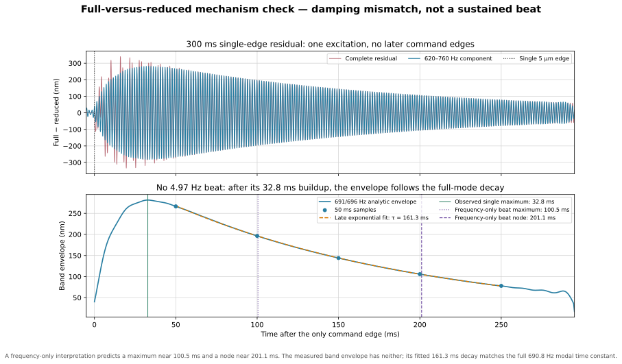

# Revision 3: Analytical Derivation and Executable Responses

This is the executable companion to [the Revision 3 model specification](ball_screw_stage_dynamic_derivation_v3.html). It derives the ten-coordinate plant, audits the two-DOF reduction, and compares the friction cases.

> **Reproducibility boundary.** Browser edits update the full scalar dependency chain, live numerical equations, and the live transfer panel. Rebuild to refresh publication SVGs, nonlinear simulations, and generated metrics.

Amber cells still require identification.

<details>
<summary>How to reproduce both HTML documents and every figure</summary>

From the `Rev 3` folder, run:

```text
python build_model_documentation.py
```

The build writes both HTML documents and every figure, including the response overlay, reduction audit, and position sweep. There is no second simulation or rendering script.

</details>

## 1. Model hierarchy and case map

There are two structural models and seven executed friction cases.

| Layer | Coordinates | Purpose |
|---|---:|---|
| Full Revision 3 plant | 10 mechanical DOFs | Trace every inertia, compliance, and nut-interface sign; expose discarded modes |
| Reduced plant | 2 mechanical DOFs | Execute the ≤900 Hz response and keep nut/guideway friction identifiable |
| Friction states | 0, 1/site, or 4/site | Internal constitutive memory; these are states, not additional mechanical DOFs |

| Case | Active sites | Law | Role |
|---|---|---|---|
| 0 | none | none | frictionless modal baseline |
| A | lumped drive drag + guideway | LuGre | guideway hypothesis with common drive-side loss |
| A2 | lumped drive drag + guideway | GMS | topology-matched alternative to A |
| B | lumped drive-side drag + nut microslip | LuGre | nut hypothesis |
| B2 | lumped drive-side drag + nut microslip | GMS | topology-matched alternative to B |
| C | all three identifiable ports | LuGre | combined hypothesis |
| C2 | all three identifiable ports | GMS | topology-matched alternative to C |

$F_{f,d}$ is active in every friction case. Case 0 remains the only frictionless run.

## 2. Entry parameters

Open only the parameter group you need. Browser edits update dependent values, live equations, and the live transfer panel. Rebuild to refresh publication figures and nonlinear simulations.

<details class="parameter-group">
<summary>Geometry, reduced plant, and excitation</summary>

| Symbol | Meaning | Executed value | Unit |
|---|---|---:|---|
| $L$ | screw lead | [[input:lead=1.000e-3]] | m/rev |
| $N_r$ | rotor teeth | [[input:rotor_teeth=50]] | – |
| $r=L/(2\pi)$ | transmission ratio, derived | [[derived:transmission_ratio=1.59155e-4]] | m/rad |
| $m_d=J_\Sigma/r^2$ | reflected drivetrain mass, derived | [[derived:reduced_drive_mass=106.042]] | kg |
| $m_{stage}$ | measured stage body mass | [[input:stage_mass=0.355]] | kg |
| $m_n$ | nut body mass retained at the stage node | [[assumed:nut_mass=0.050]] | kg |
| $m_s=m_{stage}+m_n$ | reduced stage-side effective mass, derived | [[derived:reduced_stage_mass=0.405]] | kg |
| $T_{max}$ | rated-current holding torque, 0674A | [[input:holding_torque=0.060]] | N·m |
| $\hat T_{det}$ | published detent torque, enabled | [[input:detent_torque=0.005]] | N·m |
| $\phi_{det}$ | detent phase at the stable report origin | [[assumed:detent_phase=0.0]] | rad |
| $K_m=N_rT_{max}/r^2$ | commutation tangent, derived | [[derived:magnetic_stiffness=1.18435e8]] | N/m |
| $K_{det}(x_0)=4N_r\hat T_{det}\cos(4\kappa x_0+\phi_{det})/r^2$ | local detent tangent only; excluded from global $\mathbf K$ | [[derived:detent_stiffness=3.94784e7]] | N/m |
| $f_{2,target}$ | measured upper axial-mode calibration target | [[input:axial_mode_target_hz=695.82]] | Hz |
| $k_{ax}$ | modal-calibrated reduced axial-path stiffness, derived | [[derived:reduced_axial_stiffness=7.70993e6]] | N/m |
| $c_{ax}$ | retained structural damping | [[assumed:axial_damping=55.0]] | N·s/m |
| $\zeta_m$ | provisional open-loop drive damping ratio | [[assumed:electromagnetic_zeta=0.10]] | – |
| $n_\mu$ | external STEP/DIR microstep divisor | [[assumed:microstep_divisor=64]] | – |
| $p_{step}$ | 1.8° full-step linear pitch, derived | [[derived:full_step_pitch=5.000e-6]] | m |
| $p_{step}/4$ | maximum command increment, derived | [[derived:quarter_step_bound=1.250e-6]] | m |
| $p_{step}/n_\mu$ | executed STEP/DIR quantum, derived | [[derived:command_step=7.81250e-8]] | m |
| $p_{step}/256$ | optional interpolated quantum, derived | [[derived:interpolated_step=1.95313e-8]] | m |
| axial play | accuracy grade O | 0.0 | m |
| lead accuracy class | installed screw | [[input:lead_accuracy_class=IT1]] | – |
| stage travel | full commanded range | [[input:stage_travel=0.150]] | m |
| usable screw distance | approximate usable length | [[input:usable_screw_travel=0.170]] | m |

</details>

<details class="parameter-group">
<summary>Ten-DOF inertias and masses</summary>

| Symbol | Meaning | Executed value | Unit |
|---|---|---:|---|
| $J_m$ | 0674A motor rotor inertia, datasheet | [[input:J_m=9.000e-7]] | kg·m² |
| $J_c$ | coupling inertia estimate from the 23.8 g annulus | [[assumed:J_c=1.180e-6]] | kg·m² |
| $m_c$ | coupling mass, datasheet | 0.0238 | kg |
| $L_s$ | complete screw length | [[input:screw_length=0.192]] | m |
| $d_s$ | nominal screw diameter | [[input:screw_diameter=8.000e-3]] | m |
| $\rho_s$ | steel density | [[assumed:screw_density=7850]] | kg/m³ |
| $J_s$ | complete screw polar inertia, derived | [[derived:screw_inertia=6.06083e-7]] | kg·m² |
| $J_{s1}=J_{s2}=J_{s3}$ | one-third screw inertia | [[derived:screw_segment_inertia=2.02028e-7]] | kg·m² |
| $m_{screw}$ | complete screw mass, derived | [[derived:screw_mass=0.075760]] | kg |
| $m_b=m_e=m_f$ | one-third axial screw mass | [[derived:screw_segment_mass=0.025253]] | kg |

</details>

<details class="parameter-group">
<summary>Full-model stiffnesses and damping</summary>

| Symbol | Meaning | Executed value | Unit |
|---|---|---:|---|
| $k_c$ | coupling series torsion, datasheet | [[input:k_c_series=68.7549]] | N·m/rad |
| $k_{c1}=k_{c2}=2k_c$ | two equal half-springs, derived | [[derived:k_c_half=137.510]] | N·m/rad |
| $k_{\theta a}$ | screw torsion before nut | [[assumed:k_theta_a=211.0]] | N·m/rad |
| $k_{\theta b}$ | screw torsion beyond nut | [[assumed:k_theta_b=211.0]] | N·m/rad |
| $k_{brg}$ | support-bearing axial stiffness | [[assumed:k_brg=2.500e7]] | N/m |
| $k_{sha}$ | screw axial stiffness before nut | [[assumed:k_sha=6.700e7]] | N/m |
| $k_{shb}$ | screw axial stiffness beyond nut | [[assumed:k_shb=2.000e8]] | N/m |
| $k_{ball}$ | ball-contact stiffness from compliance closure, derived | [[derived:k_ball=1.54375e7]] | N/m |
| $k_{mnt}$ | nut-mount stiffness | [[assumed:k_mnt=1.000e8]] | N/m |
| $\zeta_{int}$ | proportional element damping ratio | [[assumed:zeta_internal=0.010]] | – |

</details>

The screw uses $m=\rho\pi d_s^2L_s/4$ and $J_s=md_s^2/8$. The three screw coordinates receive equal thirds. The coupling value remains an estimate because its datasheet publishes 23.8 g mass but not polar inertia. No target value is imposed on $m_d$.

## 3. Kinematic diagram and degrees of freedom


The main axial load path is ground, $k_{brg}$, $u_b$, $k_{sha}$, $u_e$, the screw transformer and $k_{ball}$, $u_n$, $k_{mnt}$, then $x_s$. The $u_f$ and $\theta_{s3}$ coordinates are beyond-nut overhang stubs and do not carry the stage load. The commanded displacement $x_{cmd}$ is drawn as an imposed moving wall, while the sensor glyph identifies $x_s$ as the measured output.

Figure 1 is snapped to fixed torsional, transformer, and axial bands and to the nine physical station columns. Ground connections are local to their band. The guideway branch joins the terminal line from $x_s$ at an explicit node, so the stage-to-ground path is continuous. At the nut, $u_e$ and $r\theta_{s2}$ meet at the filled summing node before $k_{ball}$ continues to $u_n$.

Figure 2 retains the two independent coordinates $x_d$ and $x_s$. The spring $k_{ax}$, damper $c_{ax}$, and internal friction port $F_{f,n}$ each terminate on both mass boxes. The shared legend holds the color mapping, reduction map, registry-derived compliance bar, constitutive symbols, and friction-port case matrix rather than repeating them in either mechanism drawing.

For clarity, the distributed dampers are not drawn in Figure 1: every spring $k_j$ has a parallel $c_j$ in the equations. Figure 2 displays $c_{ax}$ and $c_m$ explicitly. The drive-side loss is the identifiable lump $F_{f,d}\leftarrow\{T_{mb},T_{h1},T_{h2},T_{brg},T_{f,r}\}$; $F_{f,n}$ remains internal and $F_{f,g}$ remains stage-to-ground. Detent is periodic and conservative, so it is keyed separately and excluded from the friction-port matrix.

The one-DOF collapse is not drawn. It remains rejected because it enforces $\dot x_d=\dot x_s$, destroys the relative nut-port velocity, and removes the retained relative mode.

The honest full enumeration is ten mechanical DOFs:

| Index | Coordinate | Physical motion | Native unit |
|---:|---|---|---|
| 1 | $\theta_m$ | motor rotor rotation | rad |
| 2 | $\theta_c$ | coupling body rotation | rad |
| 3 | $\theta_{s1}$ | screw rotation at drive end | rad |
| 4 | $\theta_{s2}$ | screw rotation at nut plane | rad |
| 5 | $\theta_{s3}$ | screw rotation beyond nut | rad |
| 6 | $u_b$ | axial screw motion at bearing | m |
| 7 | $u_e$ | axial screw motion at nut plane | m |
| 8 | $u_f$ | axial screw motion beyond nut | m |
| 9 | $u_n$ | nut-body axial motion | m |
| 10 | $x_s$ | stage axial motion | m |

$x_{cmd}$ is an imposed electromagnetic-field input. It has no independently solved inertia and is not a DOF. LuGre bristle deflections and GMS element forces are constitutive internal states, not mechanical generalized coordinates.

## 4. Full ten-DOF derivation

Define

$$\mathbf q=[\theta_m,\theta_c,\theta_{s1},\theta_{s2},\theta_{s3},u_b,u_e,u_f,u_n,x_s]^T.$$

The full linear mechanical system has the form

$$\mathbf M\ddot{\mathbf q}+\mathbf C\dot{\mathbf q}+\mathbf K\mathbf q=\mathbf b\,x_{cmd}+\mathbf Q_f.$$

<details>
<summary>Step 1: kinetic energy and diagonal mass matrix</summary>

Because every coordinate is defined at a physical inertia or lumped axial mass, no kinematic substitution is made before the energy is written:

$$
\begin{aligned}
\mathcal T={}&\tfrac12J_m\dot\theta_m^2+\tfrac12J_c\dot\theta_c^2
+\tfrac12J_{s1}\dot\theta_{s1}^2+\tfrac12J_{s2}\dot\theta_{s2}^2
+\tfrac12J_{s3}\dot\theta_{s3}^2\\
&+\tfrac12m_b\dot u_b^2+\tfrac12m_e\dot u_e^2+\tfrac12m_f\dot u_f^2
+\tfrac12m_n\dot u_n^2+\tfrac12m_{stage}\dot x_s^2.
\end{aligned}
$$

Therefore

$$\mathbf M=\operatorname{diag}(J_m,J_c,J_{s1},J_{s2},J_{s3},m_b,m_e,m_f,m_n,m_{stage}).$$

The diagonal form is a consequence of coordinate choice, not an assumption that the branches are uncoupled. Their coupling enters through potential energy.

</details>

<details>
<summary>Step 2: every elastic deflection and the complete potential energy</summary>

The elementary deformations are

$$
\begin{array}{lll}
d_m=\theta_m-\theta_{cmd}, & d_{c1}=\theta_m-\theta_c, & d_{c2}=\theta_c-\theta_{s1},\\
d_{\theta a}=\theta_{s1}-\theta_{s2}, & d_{\theta b}=\theta_{s2}-\theta_{s3}, & d_{brg}=u_b,\\
d_{sha}=u_e-u_b, & d_{shb}=u_f-u_e, & d_{mnt}=u_n-x_s.
\end{array}
$$

The thread/ball contact is the only mixed rotational–axial deformation:

$$\boxed{\delta_n=u_n-u_e-r\theta_{s2}}.$$

The complete linearized potential is

$$
\begin{aligned}
\mathcal V={}&\tfrac12 k_m d_m^2+\tfrac12k_{c1}d_{c1}^2+\tfrac12k_{c2}d_{c2}^2
+\tfrac12k_{\theta a}d_{\theta a}^2+\tfrac12k_{\theta b}d_{\theta b}^2\\
&+\tfrac12k_{brg}d_{brg}^2+\tfrac12k_{sha}d_{sha}^2+\tfrac12k_{shb}d_{shb}^2
+\tfrac12k_{ball}\delta_n^2+\tfrac12k_{mnt}d_{mnt}^2.
\end{aligned}
$$

For any scalar element $\tfrac12k(\mathbf h^T\mathbf q)^2$, its matrix contribution is $k\mathbf h\mathbf h^T$. This outer-product rule is the direct bridge from the physical diagram to code.

</details>

<details>
<summary>Step 3: nut-interface virtual work and sign audit</summary>

Let the ball-contact force be positive in extension:

$$F_n=k_{ball}\delta_n+c_{ball}\dot\delta_n.$$

The gradient of the deformation is

$$\mathbf h_n=\frac{\partial\delta_n}{\partial\mathbf q}
=[0,0,0,-r,0,0,-1,0,+1,0]^T.$$

The contact’s generalized force on the coordinates is $-F_n\mathbf h_n$. Hence:

- on $\theta_{s2}$: $+rF_n$;
- on $u_e$: $+F_n$;
- on $u_n$: $-F_n$.

The corresponding stiffness and damping contributions are

$$\mathbf K_n=k_{ball}\mathbf h_n\mathbf h_n^T,\qquad
\mathbf C_n=c_{ball}\mathbf h_n\mathbf h_n^T.$$

This construction guarantees equal-and-opposite internal work and symmetric passive matrices. It also prevents the common sign mistake of applying the same axial force direction to $u_e$ and $u_n$.

</details>

<details>
<summary>Step 4: Rayleigh dissipation and the electromagnetic damping repair</summary>

For each structural element with deformation $d_j=\mathbf h_j^T\mathbf q$, use

$$\mathcal R_j=\tfrac12c_j\dot d_j^2,\qquad \mathbf C_j=c_j\mathbf h_j\mathbf h_j^T.$$

The executable provisional values use $c_j=2\zeta_{int}\sqrt{k_jm_{rel,j}}$ with $\zeta_{int}=0.01$. These are damping assumptions, not identified loss factors.

Revision 2 exposed a separate missing term: the ideal position-source stepper model supplied restoring stiffness but no effective drive damping. That lossless oscillator rang around every command. The same phenomenological term is retained here:

$$c_{\theta m}=2\zeta_m\sqrt{k_mJ_\Sigma},\qquad
c_m=\frac{c_{\theta m}}{r^2}=2\zeta_m\sqrt{K_mm_d}.$$

It enters as $-c_{\theta m}\dot\theta_m$ in the full rotor equation and $-c_m\dot x_d$ in the reduced drive equation. The executed $\zeta_m=0.10$ is the requested 10% baseline, not an identified driver property. The sensitivity plot spans 0.02 to 0.50. The TMC2209 can use StealthChop2 or SpreadCycle, so driver mode and current settings are required before assigning a measured damping ratio. See the [official TMC2209 datasheet](https://www.analog.com/media/en/technical-documentation/data-sheets/TMC2209_datasheet_rev1.09.pdf).

</details>

<details>
<summary>Step 5: scalar equations recovered from Lagrange’s equation</summary>

Using $\frac{d}{dt}(\partial\mathcal T/\partial\dot q_i)-\partial\mathcal T/\partial q_i+\partial\mathcal V/\partial q_i+\partial\mathcal R/\partial\dot q_i=Q_{f,i}$ gives:

$$J_m\ddot\theta_m=T_{mag}+T_{det}-c_{\theta m}\dot\theta_m-k_{c1}(\theta_m-\theta_c)-c_{c1}(\dot\theta_m-\dot\theta_c)-T_{h1}-T_{mb},$$

$$J_c\ddot\theta_c=k_{c1}(\theta_m-\theta_c)+c_{c1}(\dot\theta_m-\dot\theta_c)+T_{h1}-k_{c2}(\theta_c-\theta_{s1})-c_{c2}(\dot\theta_c-\dot\theta_{s1})-T_{h2},$$

$$J_{s1}\ddot\theta_{s1}=k_{c2}(\theta_c-\theta_{s1})+c_{c2}(\dot\theta_c-\dot\theta_{s1})+T_{h2}-k_{\theta a}(\theta_{s1}-\theta_{s2})-T_{brg},$$

$$J_{s2}\ddot\theta_{s2}=k_{\theta a}(\theta_{s1}-\theta_{s2})-k_{\theta b}(\theta_{s2}-\theta_{s3})+rF_n-T_{f,n}-T_{f,r},$$

$$J_{s3}\ddot\theta_{s3}=k_{\theta b}(\theta_{s2}-\theta_{s3}),$$

$$m_b\ddot u_b=-k_{brg}u_b-c_{brg}\dot u_b+k_{sha}(u_e-u_b)+c_{sha}(\dot u_e-\dot u_b),$$

$$m_e\ddot u_e=-k_{sha}(u_e-u_b)-c_{sha}(\dot u_e-\dot u_b)+k_{shb}(u_f-u_e)+c_{shb}(\dot u_f-\dot u_e)+F_n-F_{f,n},$$

$$m_f\ddot u_f=-k_{shb}(u_f-u_e)-c_{shb}(\dot u_f-\dot u_e),$$

$$m_n\ddot u_n=-F_n+F_{f,n}-k_{mnt}(u_n-x_s)-c_{mnt}(\dot u_n-\dot x_s),$$

$$m_{stage}\ddot x_s=k_{mnt}(u_n-x_s)+c_{mnt}(\dot u_n-\dot x_s)-F_{f,g}.$$

The nut contact microslip port uses

$$v_n=r\dot\theta_{s2}+\dot u_e-\dot u_n=-\dot\delta_n,\qquad T_{f,n}=rF_{f,n}.$$

It applies $-T_{f,n}$ to $\theta_{s2}$, $-F_{f,n}$ to $u_e$, and $+F_{f,n}$ to $u_n$. The port is internal and power consistent before reduction.

Gross nut rolling remains a named physical source in the ten-DOF bookkeeping, where $T_{f,r}=rF_{f,r}$. After reduction it shares exactly the velocity $\dot x_d$ and incidence row $[1,0]$ with motor/support-bearing drag, so the executable model folds it into $F_{f,d}$. This retains its force budget without claiming an unidentifiable separation.

</details>

## 5. Stepper input: nonlinear law, linearization, and bound

The commanded linear position maps to field angle through $\theta_{cmd}=x_{cmd}/r$. With $N_r$ rotor teeth,

The 0674A motor is assumed to run at rated current, so its 0.060 N·m holding torque is used as $T_{max}$.

$$T_{mag}=T_{max}\sin\!\left[N_r(\theta_{cmd}-\theta_m)\right].$$

Under the reduced coordinate $x_d=r\theta_m$,

$$F_{mag}=\frac{T_{max}}r\sin\!\left[\frac{N_r}{r}(x_{cmd}-x_d)\right]
=F_{max}\sin[\kappa(x_{cmd}-x_d)].$$

The small-signal stiffness is

$$K_m=\left.\frac{\partial F_{mag}}{\partial(x_{cmd}-x_d)}\right|_0
=\frac{N_rT_{max}}{r^2}=F_{max}\kappa.$$

For the current inputs, one full step is [[derived:full_step_pitch=5.000e-6]] m. The nonlinear audit bound remains [[derived:quarter_step_bound=1.250e-6]] m. The executed response step is [[derived:command_step=7.81250e-8]] m at 64 microsteps per full step. The optional 256-interpolated quantum is [[derived:interpolated_step=1.95313e-8]] m. The TMC2209 supports 8, 16, 32, or 64 STEP/DIR settings and interpolation to 256, according to the [official datasheet](https://www.analog.com/media/en/technical-documentation/data-sheets/TMC2209_datasheet_rev1.09.pdf).

At the quarter-step audit bound, $\kappa e=\pi/8$ and

$$\frac{\sin(\pi/8)}{\pi/8}=0.9745.$$

Thus the sine law is only 2.55% below its tangent at the largest commanded increment. It can shift amplitude and frequency slightly, but it was not the source of the old sustained oscillation; missing damping was.

### 5.1 Why the 150–250 Hz stepper feature is difficult to see


The global command-to-position linear model has a commutation-only low pole of [[derived:mode_1_hz=167.70]] Hz. It is the common drive mode, approximately

$$f_m\approx\frac{1}{2\pi}\sqrt{\frac{K_m}{m_d}}.$$

The executed $\zeta_m=0.10$ gives 10% electromagnetic modal damping. The plotted output still matters: stage motion $X_s/X_{cmd}$ has weaker low-mode participation than the internal drive coordinate. The 0.02, 0.05, 0.10, and 0.50 curves are sensitivity cases, not identified driver properties.

The orange band is different from the global Bode pole. It evaluates the local detent tangent at every phase, giving **136.93 to 193.63 Hz** after the corrected 192 mm screw inertia. This is the appropriate prediction for microstep-dependent smearing; a single 193.63 Hz upper limit would be a best-case tangent, not the general prediction.

### 5.2 Rotor-equivalent drive and stage transfer functions


For the frictionless two-DOF linear model define

$$
a(s)=m_ds^2+(c_m+c_{ax})s+K_m+k_{ax},\qquad
b(s)=-(c_{ax}s+k_{ax}),\qquad
d(s)=m_ss^2+c_{ax}s+k_{ax},
$$

and $\Delta(s)=a(s)d(s)-b(s)^2$. The three relevant transfer functions are

$$\boxed{\frac{X_d}{X_{cmd}}=\frac{K_md(s)}{\Delta(s)}},$$

$$\boxed{\frac{X_s}{X_{cmd}}=\frac{-K_mb(s)}{\Delta(s)}},$$

$$\boxed{\frac{X_s}{X_d}=\frac{-b(s)}{d(s)}
=\frac{c_{ax}s+k_{ax}}{m_ss^2+c_{ax}s+k_{ax}}}.$$

$X_d/X_{cmd}$ is the clearest view of the low rotor/drive pole. $X_s/X_{cmd}$ contains both plant poles but can show weaker low-mode participation. $X_s/X_d$ treats rotor-equivalent drive motion as a prescribed input, so the common motor/magnetic pole cancels and only the stage-following dynamics remain. Therefore rotor-to-stage alone cannot be used to prove that the lower mode is absent.

The panel below is computed in the browser. Changing lead, component inertias, screw geometry, holding torque, detent torque, or plant parameters updates the derived values and these curves. Static SVGs still require a Python rebuild.

<div id="live-transfer-panel" class="live-transfer-panel" data-live-transfer-plots></div>

<details>
<summary>Enabled detent torque and its linearization</summary>

The published $\hat T_{det}=0.005$ N·m is enabled in the nonlinear simulation:

$$T_{det}(\theta_m)=-\hat T_{det}\sin(4N_r\theta_m+\phi_{det}).$$

Around an equilibrium $\theta_0$, it contributes the position-dependent tangent stiffness

$$k_{det,lin}=4N_r\hat T_{det}\cos(4N_r\theta_0+\phi_{det}).$$

The report origin uses $\phi_{det}=0$, a stable detent equilibrium. Its current tangent is $K_{det}=$ [[derived:detent_stiffness=3.94784e7]] N/m, but that value is used only for a **local sensitivity calculation**. It is not placed on the drive diagonal of the global stiffness matrix.

The global model therefore has $X_s/X_{cmd}|_{s=0}=1$ in Case 0. A local perturbation about one detent minimum may temporarily use $K_m+K_{det}(x_0)$ on the drive diagonal while retaining $K_m$ in the command vector. That approximation is useful only over roughly $\pm0.4\ \mu$m, where the detent sine remains near its tangent. Over multiple microsteps the tangent changes sign and the nonlinear periodic torque must be used.

Balancing commutation and detent torque gives the worst-case drive-only bound

$$|x_{err}|_{max}=\frac{r}{N_r}\sin^{-1}\!\left(\frac{\hat T_{det}}{T_{max}}\right)=266\ \mathrm{nm}.$$

Its spatial period is one full step, $p_{step}=5.00\ \mu$m, because $\sin(4N_r\theta)$ repeats after $2\pi/(4N_r)=1.8^\circ$. The earlier quarter-step statement confused the four detent cycles per rotor-tooth pitch with the 1.8° full-step interval. The 266 nm equilibrium-error amplitude remains correct. Compliance and friction modify the realized stage error, but the periodic term must not be absorbed into friction identification.

Detent alone is not the whole “stepper resonance” mechanism. Current-loop dynamics, back-EMF, driver delay, current quantization, and mechanical damping set the response amplitude and stability. A higher-fidelity model still needs detent phase, an identified damping ratio, and current-controller states.

</details>

<details>
<summary>Cautious comparison with the physical modal-test folder</summary>

The motor-excited chirp results in `TempScripts/Modal Comparison` show a broad 155–190 Hz feature in all payload configurations. Only the +1 kg up/down pair, about 159–160 Hz, passed the report’s 3× local-floor criterion. Its weak payload dependence is compatible with a motor/base/grounded mode, but does not uniquely prove detent resonance.

Important limitations prevent treating all plotted features as identified modes:

- the chirp normalization divides acceleration by $f^2$, amplifying the low-SNR region below about 250 Hz;
- the second-pass impact analysis starts at 200 Hz, so it cannot validate most of the 155–190 Hz band;
- its +1 kg PLA result retained only 4 of 15 impacts and reported a weak 256.3 Hz candidate;
- DitherV2 applies a high-pass centered at 250 Hz and therefore intentionally removes the frequency range in question;
- the fixed approximately 345 Hz feature does not shift with payload and was already flagged as probable chopper/measurement contamination;
- the 0 kg 685–700 Hz chirp feature is direction-dependent and did not clear the formal prominence threshold.

The physical data support comparison with the 137–194 Hz local-tangent band and the 168 Hz global commutation pole, but do not identify detent phase or damping.

</details>

### 5.3 Can the present model reproduce every measured feature?

**No - not every feature.** The corrected global two-DOF modes are [[derived:mode_1_hz=167.70]] Hz and [[derived:mode_2_hz=695.82]] Hz; the local detent tangent sweeps the lower mode from 136.93 to 193.63 Hz. These align with the broad 155–190 Hz response and the 685–700 Hz band. The transfer matrix still has only two mechanical modal pairs:

$$\det\!\left(\mathbf M_rs^2+\mathbf C_rs+\mathbf K_r\right)=0,$$

which is fourth order in $s$. With the 192 mm screw and global detent treatment, the rebuilt ten-DOF model predicts 166.8, 686.0, 2002.3, and 2955.5 Hz below 3 kHz. It still has no independent mode near 256, 345, or 1007–1044 Hz. Friction can move or damp existing poles, but cannot create missing coordinates.

<details>
<summary>Evidence audit from the referenced Modal Comparison folder</summary>

| Observed feature | Local-test evidence and caution | Present-model interpretation |
|---|---|---|
| Broad 155-190 Hz response | Seen across chirp runs, but only the +1 kg up/down pair at about 159-160 Hz clears the 3x local-floor rule. It changes little with payload. | The 168 Hz global pole and 137-194 Hz local detent-tangent sweep overlap this band. Matching still requires the same measured input/output definition. |
| 256.3 Hz hammer candidate | Appears in the +1 kg PLA second-pass result, whose accepted-tap accounting is weak and internally cautioned. | Insufficient evidence for a new plant pole; repeat with a reliable mount before adding a coordinate. |
| Approximately 345 Hz notch | Fixed across payload and sweep direction; the local report identifies chopper/ambient contamination. | Must not be fitted as a mechanical mode. |
| Approximately 592-614 Hz hammer and 685-700 Hz chirp features | The tests use different inputs, outputs, boundaries, and normalization. | The updated 676–696 Hz relative mode is a plausible match. Co-located FRFs are still needed. |
| Approximately 1007-1044 Hz PLA-mounted impact peaks | Coherent hammer peaks appear with added PLA-mounted payloads. | Likely requires an explicit payload/bracket or sensor-mount compliance; that coordinate is absent from both the reduced model and the present rigid-stage output. |
| Dither candidates | No configuration passes both the prominence and visible-fade criteria in the DitherV2 report. | Do not use these candidates for parameter fitting yet. |

The audited sources are Results Summary/modal_testing_summary.pdf, Results Summary/chirp_results_summary_v2.pdf, MotorExcitation/Chirp Tests/chirp_results/summary.md, V2 Testing/v2_modal_second_pass/summary.md, and MotorExcitation/DitherV2/ditherv2_coherent_results/summary.md under TempScripts/Modal Comparison.

</details>

<details>
<summary>Minimum defensible extensions, in order</summary>

1. **Match the measured transfer function first.** Generate impact inertance $A_s/F_{impact}$ at the accelerometer point and motor-excited $A_s/X_{cmd}$ or $A_s/I_{cmd}$, rather than comparing both tests directly with displacement ratio $X_s/X_{cmd}$. Poles are shared only when the same structure and boundary are excited; modal residues and antiresonances depend strongly on input/output location.
2. **Add a grounded base/support coordinate** $x_b$ with identified $m_b,k_b,c_b$, and express guideway/bearing forces relative to $x_b$ instead of an immovable ground. This is the leading candidate for a broad, weakly payload-dependent 155-190 Hz mode.
3. **Add payload/bracket compliance** between the stage body and accelerometer/payload coordinate. This is the leading candidate for the approximately 1 kHz PLA-mounted impact peaks.
4. **Identify the motor dynamics.** Detent amplitude is now sourced and enabled. Its phase, current-controller dynamics, and low-mode damping still require dedicated tests.
5. **Add transverse/rocking coordinates only if cross-axis measurements support them.** Rail bending, stage pitch/yaw, screw lateral bending, and bearing-housing motion are excluded by the present one-axis topology but can appear in an accelerometer FRF through sensor misalignment or structural coupling.

This is a representability issue, not a reason to add arbitrary fitted resonances. Each new coordinate needs a mode-shape or mass/stiffness experiment that distinguishes it from measurement artifacts.

</details>

## 6. Reduction from ten DOFs to two

### The reduction in one picture

The ten-DOF model contains the measured stage motion, the motor/screw motion that drives it, and eight internal motions that describe how components deform between those two ends. The reduced model keeps the two end motions and replaces the eight internal motions by equivalent inertia, stiffness, damping, and force-port terms:

$$
\underbrace{\mathbf q\in\mathbb R^{10}}_{\text{all component motions}}
\xrightarrow[\text{retain low-frequency endpoint behaviour}]
{\text{change coordinates, then eliminate internal motion}}
\underbrace{\mathbf x=
\begin{bmatrix}x_d\\x_s\end{bmatrix}}_{\text{drive side and measured stage}}.
$$

$x_d=r\theta_m$ is the motor/screw rotation expressed as an equivalent linear displacement. It is not a second end-effector direction. The second DOF is required because the drivetrain can stretch:

$$x_d-x_s\ne0.$$

If only $x_s$ were retained, that stretch, its stored energy, the approximately 696 Hz relative mode, and the nut differential-friction velocity would all be forced to zero.

The reduction uses four different operations. Keeping them separate is the key to understanding the derivation:

| Operation | Engineering purpose | Exact or approximate? |
|---|---|---|
| Change coordinates | separate overall drive/stage motion from internal deformation | exact |
| Group co-moving inertia | preserve kinetic energy of components moving together in the retained band | low-frequency approximation |
| Condense spring junctions | preserve endpoint force versus endpoint displacement without retaining every junction coordinate | exact statically; frequency dependent dynamically |
| Calibrate $k_{ax}$ | use the measured upper mode because the complete static stiffness has not been measured independently | parameter-identification assumption |

The derivation below is organized around five key equations. Each equation is visible first; its toggle then explains what the operation is for, defines its local variables, and performs the matrix multiplication.

### Key equation A — describe the same ten motions using two endpoint coordinates and eight internal deformations

**Purpose:** separate motion that must remain from deformation that may be eliminated later.

$$
\boxed{
\mathbf q=\mathbf T_r\mathbf x+\mathbf T_i\boldsymbol\eta},
\qquad
\mathbf x=\begin{bmatrix}x_d\\x_s\end{bmatrix}.
$$

This equation is only a change of coordinates. No DOF has been removed yet.

<details>
<summary>Derivation A — define every coordinate and multiply out $\mathbf T_r\mathbf x+\mathbf T_i\boldsymbol\eta$</summary>

The local symbols are:

| Symbol | Meaning |
|---|---|
| $\mathbf T=[\mathbf T_r\ \mathbf T_i]$ | complete $10\times10$ coordinate-transformation matrix. It reconstructs the original coordinates from $[\mathbf x^T\ \boldsymbol\eta^T]^T$. Its columns are motion patterns, not forces, modes, or transfer functions. |
| $\mathbf T_r\in\mathbb R^{10\times2}$ | **retained-coordinate reconstruction block**: $\mathbf T_r\mathbf x$ tells how all ten physical coordinates move when only the two retained endpoint coordinates move and the internal deformations are zero. Here `r` means retained, not rotor. |
| $\mathbf T_i\in\mathbb R^{10\times8}$ | **internal-coordinate reconstruction block**: $\mathbf T_i\boldsymbol\eta$ adds the relative rotations and axial deformations to the retained motion. Here `i` means internal, not the imaginary unit. |
| $\boldsymbol\eta$ | eight-component internal-deformation vector $[\alpha_1,\alpha_2,\alpha_3,\alpha_4,u_b,u_e,u_f,\delta_m]^T$. It measures departures from rigid co-motion; it is a coordinate vector, not an efficiency. |
| $\mathbf q$ | original ten mechanical coordinates |
| $x_d=r\theta_m$ | retained drive displacement obtained from motor angle |
| $x_s$ | retained measured stage displacement |
| $r=L/(2\pi)$ | screw lead conversion, metres per radian |
| $\alpha_1,\ldots,\alpha_4$ | relative rotations across the coupling and screw segments |
| $u_b,u_e,u_f$ | internal screw axial coordinates |
| $\delta_m=u_n-x_s$ | nut-to-stage mount deflection |

In one line, $\mathbf T_r\mathbf x$ supplies the **overall endpoint motion**, while $\mathbf T_i\boldsymbol\eta$ supplies the **internal deformation superposed on it**. Because the two blocks together have ten independent columns, this step relabels the same ten DOFs rather than deleting any of them.

Choose

$$
\mathbf q=
\begin{bmatrix}
\theta_m&\theta_c&\theta_{s1}&\theta_{s2}&\theta_{s3}&
u_b&u_e&u_f&u_n&x_s
\end{bmatrix}^T
$$

and

$$
\boldsymbol\eta=
\begin{bmatrix}
\alpha_1&\alpha_2&\alpha_3&\alpha_4&u_b&u_e&u_f&\delta_m
\end{bmatrix}^T,
$$

where

$$
\alpha_1=\theta_c-\theta_m,\quad
\alpha_2=\theta_{s1}-\theta_c,\quad
\alpha_3=\theta_{s2}-\theta_{s1},\quad
\alpha_4=\theta_{s3}-\theta_{s2}.
$$

The matrices are

$$
\mathbf T_r=
\begin{bmatrix}
1/r&0\\1/r&0\\1/r&0\\1/r&0\\1/r&0\\
0&0\\0&0\\0&0\\0&1\\0&1
\end{bmatrix},
\qquad
\mathbf T_i=
\begin{bmatrix}
0&0&0&0&0&0&0&0\\
1&0&0&0&0&0&0&0\\
1&1&0&0&0&0&0&0\\
1&1&1&0&0&0&0&0\\
1&1&1&1&0&0&0&0\\
0&0&0&0&1&0&0&0\\
0&0&0&0&0&1&0&0\\
0&0&0&0&0&0&1&0\\
0&0&0&0&0&0&0&1\\
0&0&0&0&0&0&0&0
\end{bmatrix}.
$$

Multiplication gives

$$
\mathbf T_r\mathbf x=
\begin{bmatrix}
x_d/r\\x_d/r\\x_d/r\\x_d/r\\x_d/r\\0\\0\\0\\x_s\\x_s
\end{bmatrix},
\qquad
\mathbf T_i\boldsymbol\eta=
\begin{bmatrix}
0\\
\alpha_1\\
\alpha_1+\alpha_2\\
\alpha_1+\alpha_2+\alpha_3\\
\alpha_1+\alpha_2+\alpha_3+\alpha_4\\
u_b\\u_e\\u_f\\\delta_m\\0
\end{bmatrix}.
$$

Adding the two vectors reconstructs

$$
\begin{aligned}
\theta_m&=x_d/r,\\
\theta_c&=x_d/r+\alpha_1,\\
\theta_{s1}&=x_d/r+\alpha_1+\alpha_2,\\
\theta_{s2}&=x_d/r+\alpha_1+\alpha_2+\alpha_3,\\
\theta_{s3}&=x_d/r+\alpha_1+\alpha_2+\alpha_3+\alpha_4,\\
u_n&=x_s+\delta_m.
\end{aligned}
$$

Thus $\mathbf T=[\mathbf T_r\ \mathbf T_i]$ has rank ten and is invertible. The original and transformed descriptions contain exactly the same information. Reduction begins only when the dynamics of $\boldsymbol\eta$ are approximated or eliminated.

</details>

### Key equation B — replace co-moving component inertias by two energy-equivalent masses

**Purpose:** make the reduced model store the same retained-motion kinetic energy as the grouped components.

$$
\boxed{
\mathbf M_r=
\begin{bmatrix}m_d&0\\0&m_s\end{bmatrix}},
\qquad
\boxed{
m_d=\frac{J_m+J_c+J_{s1}+J_{s2}+J_{s3}}{r^2}},
\qquad
\boxed{m_s=m_n+m_{stage}}.
$$

<details>
<summary>Derivation B — kinetic-energy argument and the complete transformed mass multiplication</summary>

The local symbols are:

| Symbol | Meaning |
|---|---|
| $J_m,J_c,J_{s1},J_{s2},J_{s3}$ | motor, coupling, and screw polar inertias |
| $m_n,m_{stage}$ | nut and stage translational masses |
| $m_d$ | rotational drivetrain inertia reflected into linear units |
| $m_s$ | retained nut-plus-stage mass |
| $\mathbf M^{(q)}$ | original diagonal ten-DOF mass matrix |
| $A_1=J_c+J_{s1}+J_{s2}+J_{s3}$ | cumulative inertia moved by the first relative rotation $\alpha_1$; the coupling and every downstream screw segment participate |
| $A_2=J_{s1}+J_{s2}+J_{s3}$ | cumulative inertia moved by $\alpha_2$; only the screw segments downstream of the coupling participate |
| $A_3=J_{s2}+J_{s3}$ | cumulative inertia moved by $\alpha_3$ |
| $A_4=J_{s3}$ | inertia moved by the last relative rotation $\alpha_4$ |
| `r` in $\mathbf M_{rr},\mathbf M_{re}$ | retained set $\mathbf x=[x_d,x_s]^T$; when it is the first subscript it labels matrix rows/equations, and when it is second it labels columns/accelerations |
| `e` in $\mathbf M_{er},\mathbf M_{ee}$ | eliminated set $\boldsymbol\eta$; these are the same eight coordinates called **internal** by the `i` in $\mathbf T_i$, now labelled `e` because they will be eliminated |
| $\mathbf M_{rr}\;(2\times2)$ | retained equations versus retained accelerations; this is the mass block kept by the executable two-DOF approximation |
| $\mathbf M_{re}\;(2\times8)$ | retained equations versus internal accelerations; it measures how internal acceleration reacts on the retained equations |
| $\mathbf M_{er}\;(8\times2)$ | internal equations versus retained accelerations; $\mathbf M_{er}=\mathbf M_{re}^T$ because the mass matrix is energy-derived and symmetric |
| $\mathbf M_{ee}\;(8\times8)$ | internal equations versus internal accelerations; it contains the inertia associated with the coordinates that are subsequently condensed |

The $A_1$--$A_4$ terms are bookkeeping abbreviations produced by the multiplication, not four new bodies or fitted parameters. The first block subscript always names the **equation row group** and the second names the **coordinate/acceleration column group**. For example, `re` reads “retained equations coupled to eliminated-coordinate accelerations.”

The original mass matrix is

$$
\mathbf M^{(q)}=
\operatorname{diag}
(J_m,J_c,J_{s1},J_{s2},J_{s3},m_b,m_e,m_f,m_n,m_{stage}).
$$

For retained motion, set the internal velocities to zero:

$$
\dot{\boldsymbol\eta}=\mathbf0.
$$

This means the five rotating bodies share $\dot\theta=\dot x_d/r$, while the nut and stage share $\dot x_s$. Their energy is

$$
\begin{aligned}
\mathcal T_{ret}
&=\tfrac12(J_m+J_c+J_{s1}+J_{s2}+J_{s3})
\left(\frac{\dot x_d}{r}\right)^2
+\tfrac12(m_n+m_{stage})\dot x_s^2\\
&=\tfrac12m_d\dot x_d^2+\tfrac12m_s\dot x_s^2.
\end{aligned}
$$

The same result follows from matrix multiplication:

$$
\mathbf M_{rr}
=\mathbf T_r^T\mathbf M^{(q)}\mathbf T_r
=
\begin{bmatrix}
(J_m+J_c+J_{s1}+J_{s2}+J_{s3})/r^2&0\\
0&m_n+m_{stage}
\end{bmatrix}.
$$

The complete transformed mass is

$$
\mathbf T^T\mathbf M^{(q)}\mathbf T
=
\begin{bmatrix}
\mathbf M_{rr}&\mathbf M_{re}\\
\mathbf M_{er}&\mathbf M_{ee}
\end{bmatrix}.
$$

Define

$$
A_1=J_c+J_{s1}+J_{s2}+J_{s3},\quad
A_2=J_{s1}+J_{s2}+J_{s3},\quad
A_3=J_{s2}+J_{s3},\quad A_4=J_{s3}.
$$

Then the multiplication results are

$$
\mathbf M_{re}=
\begin{bmatrix}
A_1/r&A_2/r&A_3/r&A_4/r&0&0&0&0\\
0&0&0&0&0&0&0&m_n
\end{bmatrix},
\qquad
\mathbf M_{er}=\mathbf M_{re}^T,
$$

$$
\mathbf M_{ee}=
\begin{bmatrix}
A_1&A_2&A_3&A_4&0&0&0&0\\
A_2&A_2&A_3&A_4&0&0&0&0\\
A_3&A_3&A_3&A_4&0&0&0&0\\
A_4&A_4&A_4&A_4&0&0&0&0\\
0&0&0&0&m_b&0&0&0\\
0&0&0&0&0&m_e&0&0\\
0&0&0&0&0&0&m_f&0\\
0&0&0&0&0&0&0&m_n
\end{bmatrix}.
$$

The off-diagonal block $\mathbf M_{re}$ is the mathematical evidence that exact dynamic elimination would be frequency dependent. The executable model keeps $\mathbf M_{rr}$ and neglects internal acceleration participation. It does **not** add $m_b,m_e,m_f$ arbitrarily to either endpoint; those masses belong to eliminated screw-deformation coordinates.

<div class="live-equation" data-live-equation="inertia-aggregation">Live inertia aggregation loads in the browser.</div>

<div class="live-equation" data-live-equation="reduced-mass">Live stage-side mass aggregation loads in the browser.</div>

</details>

### Key equation C — replace the internal spring network by one endpoint stiffness

**Purpose:** preserve the force needed to create a given relative endpoint displacement $\Delta=x_d-x_s$ after internal spring-junction coordinates are removed.

The exact static condensation of the full ten-DOF topology gives

$$
\boxed{
\frac1{k_{link,full}}
=
\frac1{k_{ball}}
+\frac1{k_{brg}}+\frac1{k_{sha}}+\frac1{k_{mnt}}
+r^2\left(
\frac1{k_{c1}}+\frac1{k_{c2}}+\frac1{k_{\theta a}}
\right)}.
$$

The executable two-DOF model constrains the retained drive train to rotate together and therefore uses the axial-only link

$$
\boxed{
\frac1{k_{ax}}
=
\frac1{k_{ball}}+\frac1{k_{brg}}+\frac1{k_{sha}}+\frac1{k_{mnt}}}.
$$

<details>
<summary>Derivation C — equal-force spring argument, transformed stiffness matrices, and Schur complement</summary>

The local symbols are:

| Symbol | Meaning |
|---|---|
| $\Delta=x_d-x_s$ | total relative displacement between retained endpoints |
| $k_{brg},k_{sha},k_{ball},k_{mnt}$ | bearing, loaded screw, ball-contact, and mount stiffnesses |
| $k_{c1},k_{c2},k_{\theta a}$ | torsional stiffnesses that transmit load before the nut |
| $\mathbf h_r,\mathbf h_e$ | ball-contact deformation incidence vectors in retained/internal coordinates |
| $\mathbf K_{ee}$ | stiffness seen by the eight internal deformation coordinates |
| $\epsilon_j$ | signed extension of compliant element $j$ under the common series force, $\epsilon_j=F/k_j$; it is an element deformation, not an additional retained DOF |
| $j$ | index identifying one spring in the series load path |
| $\mathbf K_{ab}$, $a,b\in\{r,e\}$ | stiffness block with row group $a$ and coordinate column group $b$; `r` means retained and `e` means the internal coordinates being eliminated |
| $s$ | Laplace variable. On a sinusoidal frequency-response sweep $s=\mathrm i\omega$; this $\mathrm i$ is the imaginary unit and is unrelated to the `i` in $\mathbf T_i$. |
| $\mathbf Z_{ab}(s)=s^2\mathbf M_{ab}+s\mathbf C_{ab}+\mathbf K_{ab}$ | **dynamic-stiffness block** between groups $a$ and $b$. It combines inertia, damping, and elasticity at the chosen complex frequency; it is not another physical spring. |
| $\mathbf Z_{rr}$ | retained equations versus retained motion in the frequency domain |
| $\mathbf Z_{re},\mathbf Z_{er}$ | cross-coupling blocks between retained and eliminated motion |
| $\mathbf Z_{ee}$ | internal dynamic stiffness that must be inverted to solve the internal response |
| $\mathbf Z_{cond}(s)$ | exact frequency-dependent dynamic stiffness seen at $x_d,x_s$ after the eight internal coordinates have been eliminated |

The letters `i` and `e` therefore name the same eight-coordinate set from two viewpoints: **internal** when constructing $\mathbf T_i$, and **eliminated** when partitioning $\mathbf M$, $\mathbf C$, $\mathbf K$, or $\mathbf Z$. In $\mathbf Z_{re}$, the first letter identifies the retained equation rows and the second identifies eliminated-coordinate columns, exactly as for $\mathbf M_{re}$.

For springs in series, the same force $F$ passes through every element. Each extension is

$$\epsilon_j=\frac{F}{k_j}.$$

Because total extension is the sum,

$$
\Delta=\sum_j\epsilon_j
=F\sum_j\frac1{k_j},
$$

so

$$
k_{eq}=\frac{F}{\Delta}
=\left(\sum_j\frac1{k_j}\right)^{-1}.
$$

This is why **compliances** $1/k_j$ add in series; the stiffnesses themselves do not.

The same result follows from the matrices. In the transformed coordinates, ball-contact deformation is

$$
\delta_n
=\mathbf h_r^T\mathbf x+\mathbf h_e^T\boldsymbol\eta,
$$

with

$$
\mathbf h_r=
\begin{bmatrix}-1\\1\end{bmatrix},
\qquad
\mathbf h_e=
\begin{bmatrix}-r\\-r\\-r\\0\\0\\-1\\0\\1\end{bmatrix}.
$$

The internal stiffness excluding ball contact is

$$
\mathbf K_{e0}
=
\operatorname{diag}
\left(
k_{c1},k_{c2},k_{\theta a},k_{\theta b},
\mathbf K_{screw},k_{mnt}
\right),
$$

where the $3\times3$ screw-translation block is

$$
\mathbf K_{screw}=
\begin{bmatrix}
k_{brg}+k_{sha}&-k_{sha}&0\\
-k_{sha}&k_{sha}+k_{shb}&-k_{shb}\\
0&-k_{shb}&k_{shb}
\end{bmatrix}.
$$

From

$$
\mathcal V
=\tfrac12K_m(x_d-x_{cmd})^2
+\tfrac12\boldsymbol\eta^T\mathbf K_{e0}\boldsymbol\eta
+\tfrac12k_{ball}
(\mathbf h_r^T\mathbf x+\mathbf h_e^T\boldsymbol\eta)^2,
$$

the matrix multiplication gives

$$
\mathbf K_{rr}
=
\begin{bmatrix}K_m&0\\0&0\end{bmatrix}
+k_{ball}\mathbf h_r\mathbf h_r^T,
$$

$$
\mathbf K_{re}=k_{ball}\mathbf h_r\mathbf h_e^T
=k_{ball}
\begin{bmatrix}
r&r&r&0&0&1&0&-1\\
-r&-r&-r&0&0&-1&0&1
\end{bmatrix},
$$

$$
\mathbf K_{er}=\mathbf K_{re}^T,
\qquad
\mathbf K_{ee}=\mathbf K_{e0}+k_{ball}\mathbf h_e\mathbf h_e^T.
$$

Static equilibrium of the internal coordinates means

$$
\mathbf K_{er}\mathbf x+\mathbf K_{ee}\boldsymbol\eta=\mathbf0,
$$

so

$$
\boldsymbol\eta=-\mathbf K_{ee}^{-1}\mathbf K_{er}\mathbf x.
$$

Substituting this result into the retained equation produces the Schur complement

$$
\boxed{
\mathbf K_{cond}
=\mathbf K_{rr}-\mathbf K_{re}\mathbf K_{ee}^{-1}\mathbf K_{er}}.
$$

Carrying out the inverse quadratic form gives

$$
\mathbf h_e^T\mathbf K_{e0}^{-1}\mathbf h_e
=
r^2\left(
\frac1{k_{c1}}+\frac1{k_{c2}}+\frac1{k_{\theta a}}
\right)
+\frac1{k_{brg}}+\frac1{k_{sha}}+\frac1{k_{mnt}}.
$$

Therefore

$$
\frac1{k_{link,full}}
=\frac1{k_{ball}}
+\mathbf h_e^T\mathbf K_{e0}^{-1}\mathbf h_e,
$$

which is the visible key equation above. $k_{\theta b}$ and $k_{shb}$ vanish from the static result because their far ends are free overhangs; those coordinates follow their upstream nodes without carrying static force.

The executable approximation sets

$$\alpha_1=\alpha_2=\alpha_3=0,$$

which removes the reflected torsional compliance but preserves the four-element axial chain.

<div class="live-equation" data-live-equation="exact-static-condensation">Live exact-versus-executable static condensation loads in the browser.</div>

For dynamic rather than static elimination, replace every stiffness block by

$$
\mathbf Z_{ab}(s)=s^2\mathbf M_{ab}+s\mathbf C_{ab}+\mathbf K_{ab}
$$

and use

$$
\boxed{
\mathbf Z_{cond}(s)
=\mathbf Z_{rr}(s)
-\mathbf Z_{re}(s)\mathbf Z_{ee}^{-1}(s)\mathbf Z_{er}(s)}.
$$

Unlike the constant static Schur complement, this result is frequency dependent and retains the eliminated resonances.

</details>

### Key equation D — determine the executable $k_{ax}$ from the measured upper mode

**Purpose:** supply the missing numerical stiffness datum. No independent static measurement of the complete installed load path is currently available.

With $\lambda_2=(2\pi f_{2,target})^2$,

$$
\boxed{
k_{ax}=
\frac{\lambda_2m_s(K_m-\lambda_2m_d)}
{K_m-\lambda_2(m_d+m_s)}}.
$$

Once $k_{ax}$ is known, the ball-contact stiffness closes the axial compliance budget:

$$
\boxed{
\frac1{k_{ball}}
=\frac1{k_{ax}}-\frac1{k_{brg}}-\frac1{k_{sha}}-\frac1{k_{mnt}}}.
$$

<details>
<summary>Derivation D — determinant expansion, solution for $k_{ax}$, and what calibration means</summary>

The local symbols are:

| Symbol | Meaning |
|---|---|
| $f_{2,target}$ | selected measured upper-mode frequency |
| $\lambda_2=(2\pi f_{2,target})^2$ | corresponding eigenvalue |
| $K_m$ | reflected electromagnetic tangent stiffness |
| $m_d,m_s$ | retained drive-side and stage-side masses |
| $k_{ax}$ | equivalent axial-only stiffness being solved |

For undamped free motion,

$$
\left(\mathbf K_r-\lambda\mathbf M_r\right)\boldsymbol\phi=\mathbf0.
$$

A nonzero mode shape $\boldsymbol\phi$ requires

$$
0=
\det
\begin{bmatrix}
K_m+k_{ax}-\lambda_2m_d&-k_{ax}\\
-k_{ax}&k_{ax}-\lambda_2m_s
\end{bmatrix}.
$$

Multiplying the determinant gives

$$
(K_m+k_{ax}-\lambda_2m_d)
(k_{ax}-\lambda_2m_s)-k_{ax}^2=0,
$$

which expands to

$$
m_dm_s\lambda_2^2
-\left[m_dk_{ax}+m_s(K_m+k_{ax})\right]\lambda_2
+K_mk_{ax}=0.
$$

Collecting terms proportional to $k_{ax}$,

$$
k_{ax}\left[K_m-\lambda_2(m_d+m_s)\right]
=\lambda_2m_s(K_m-\lambda_2m_d),
$$

and division gives the visible formula.

<div class="live-equation" data-live-equation="modal-stiffness">Live modal stiffness calculation loads in the browser.</div>

<div class="live-equation" data-live-equation="axial-compliance">Live axial compliance closure loads in the browser.</div>

This is a calibration, not independent modal validation: the selected upper frequency determines $k_{ax}$. A future static force/displacement test would instead determine $k_{ax}$ directly and turn the upper-mode frequency into a prediction.

</details>

### Key equation E — assemble the final two-DOF equations

**Purpose:** combine the energy-equivalent masses, condensed link, drive stiffness, damping, input, and physical friction ports into one executable plant.

$$
\boxed{
\mathbf M_r\ddot{\mathbf x}
+\mathbf C_r\dot{\mathbf x}
+\mathbf K_r\mathbf x
=\mathbf b_r x_{cmd}+\mathbf Q_f},
\qquad
\mathbf x=\begin{bmatrix}x_d\\x_s\end{bmatrix},
$$

with

$$
\boxed{
\mathbf M_r=
\begin{bmatrix}m_d&0\\0&m_s\end{bmatrix}},
$$

$$
\boxed{
\mathbf C_r=
\begin{bmatrix}
c_m+c_{ax}&-c_{ax}\\
-c_{ax}&c_{ax}
\end{bmatrix}},
\qquad
\boxed{
\mathbf K_r=
\begin{bmatrix}
K_m+k_{ax}&-k_{ax}\\
-k_{ax}&k_{ax}
\end{bmatrix}},
\qquad
\boxed{
\mathbf b_r=
\begin{bmatrix}K_m\\0\end{bmatrix}}.
$$

<details>
<summary>Derivation E — scalar force balances, matrix assembly, friction incidence, and why one DOF is insufficient</summary>

The local symbols are:

| Symbol | Meaning |
|---|---|
| $F_{ax}$ | spring/damper force transmitted between $x_d$ and $x_s$ |
| $F_{f,d}$ | identifiable drive-side friction against ground |
| $F_{f,n}$ | internal nut-interface friction |
| $F_{f,g}$ | stage-guideway friction against ground |
| $F_{mag},F_{det}$ | nonlinear magnetic and periodic detent forces |
| $\mathbf H_d=[1\;0]$ | drive-port incidence row; maps generalized velocity to $v_d=\mathbf H_d\dot{\mathbf x}=\dot x_d$ |
| $\mathbf H_n=[1\;-1]$ | nut-interface incidence row; maps to the relative velocity $v_n=\dot x_d-\dot x_s$ |
| $\mathbf H_g=[0\;1]$ | guideway-port incidence row; maps to $v_g=\dot x_s$ |
| subscripts $d,n,g$ | drive side, nut interface, and guideway respectively |
| $\mathbf H_p^TF_{f,p}$ | virtual-work mapping that converts a scalar force at port $p$ into a two-component generalized-force vector |
| $\mathbf Q_f\in\mathbb R^2$ | total generalized friction-force vector added to the right-hand side of the two-DOF equations; it collects the three physical friction ports with their correct signs |
| $v_d,v_n,v_g$ | physical velocities supplied to the selected LuGre or GMS constitutive law at each port |

An incidence row $\mathbf H_p$ contains only the **kinematic wiring and sign convention** of a friction port; it is not a friction coefficient. The model first evaluates the scalar port velocity $v_p=\mathbf H_p\dot{\mathbf x}$, uses that velocity in LuGre or GMS to obtain $F_{f,p}$, and then maps that scalar force back with $-\mathbf H_p^TF_{f,p}$. The minus sign makes a positive friction magnitude oppose positive port motion.

Define

$$
F_{ax}
=k_{ax}(x_d-x_s)+c_{ax}(\dot x_d-\dot x_s).
$$

Newton's law on the drive-side equivalent mass is

$$
m_d\ddot x_d
=F_{mag}+F_{det}-c_m\dot x_d-F_{ax}-F_{f,n}-F_{f,d},
$$

and on the stage-side mass it is

$$
m_s\ddot x_s
=F_{ax}+F_{f,n}-F_{f,g}.
$$

For the global linear baseline,

$$
F_{mag}\approx K_m(x_{cmd}-x_d),\qquad F_{det}=0,
$$

and collecting coefficients of $x_d,x_s,\dot x_d,\dot x_s$ gives the visible matrices.

The friction velocities are described by incidence rows:

$$
v_d=
\underbrace{\begin{bmatrix}1&0\end{bmatrix}}_{\mathbf H_d}
\dot{\mathbf x},
\qquad
v_n=
\underbrace{\begin{bmatrix}1&-1\end{bmatrix}}_{\mathbf H_n}
\dot{\mathbf x},
\qquad
v_g=
\underbrace{\begin{bmatrix}0&1\end{bmatrix}}_{\mathbf H_g}
\dot{\mathbf x}.
$$

Virtual work gives

$$
\boxed{
\mathbf Q_f
=-\mathbf H_d^TF_{f,d}
-\mathbf H_n^TF_{f,n}
-\mathbf H_g^TF_{f,g}}.
$$

Multiplication shows the physical force directions:

$$
\mathbf Q_f
=
\begin{bmatrix}-F_{f,d}\\0\end{bmatrix}
+
\begin{bmatrix}-F_{f,n}\\+F_{f,n}\end{bmatrix}
+
\begin{bmatrix}0\\-F_{f,g}\end{bmatrix}.
$$

The nut force is equal and opposite because it is internal. Drive and guideway friction are grounded forces.

If a one-DOF constraint $x_d=x_s=x$ is imposed, then

$$
x_d-x_s=0,\qquad
\dot x_d-\dot x_s=0.
$$

Consequently the axial spring stores no energy, the upper relative mode disappears, and $v_n=0$, so the nut-interface friction law cannot act. The one-DOF equation

$$
(m_d+m_s)\ddot x+c_m\dot x+K_mx
=K_mx_{cmd}-F_{f,aggregate}
$$

is therefore useful only well below the axial relative mode and cannot answer the friction questions for which this model was built.

</details>

<details class="supplementary-reference">
<summary>Supplementary matrix reference — former step-by-step presentation and every expanded block</summary>

The material below retains the exhaustive coordinate inventory, full $10\times10$ stiffness matrix, transformed block matrices, dynamic condensation, modal polynomial, and transfer-function reference. It is kept for auditability, but it is not required to follow the five-equation derivation above.

The reduction is a **band-limited energy, compliance, and power-port approximation**. It does not claim that eight physical bodies disappear or that every eliminated deformation is zero. The visible reduction ladder is:

| Main step | Operation | Result carried forward |
|---:|---|---|
| 1 | Declare the retained bandwidth, measured output, and friction ports | retain stage motion $x_s$ and one internal drive motion $x_d$ |
| 2 | Collapse the nearly co-rotating drive train | add $J_m,J_c,J_{s1},J_{s2},J_{s3}$ and reflect the sum through $r$ |
| 3 | Allocate translational inertia | add $m_n$ to $m_{stage}$; do not arbitrarily add the three eliminated axial screw masses |
| 4 | Statically condense the internal axial nodes | add the four **compliances** $1/k_{brg}$, $1/k_{sha}$, $1/k_{ball}$, and $1/k_{mnt}$ |
| 5 | Preserve virtual work and friction incidence | retain drive-to-ground, nut differential, and stage-to-ground velocity ports |
| 6 | Calibrate and verify | obtain $k_{ax}$ from the retained upper mode, close $k_{ball}$, then compare the full and reduced plants |

Thus,

$$
\mathbf q\in\mathbb R^{10}
\quad\longrightarrow\quad
\mathbf x=\begin{bmatrix}x_d&x_s\end{bmatrix}^T\in\mathbb R^2,
$$

while the internal elastic effects are retained through equivalent coefficients rather than retained coordinates. Expand the steps below for the full derivation.

<details>
<summary>Detailed Step 0 — why two model DOFs when the end effector has one output direction?</summary>

The stage has one measured output direction, but output dimension is not the same as system DOF count. $x_s$ is the end-effector translation; $x_d$ is an internal reflected rotor/screw coordinate on the same axis. Finite axial compliance permits $x_d-x_s\ne0$, so two independent initial positions and velocities are required.

A two-mass system connected by a spring has two DOFs even when both masses move along the same line and only the second mass is measured. Here the relative coordinate $x_d-x_s$ stores axial elastic energy and produces the [[derived:mode_2_hz=695.82]] Hz mode.

If the complete drivetrain is imposed rigidly, then $x_d=x_s=x$ and a legitimate one-DOF model results:

$$
(m_d+m_s)\ddot x+c_m\dot x+K_mx=K_mx_{cmd}-F_{f,aggregate}.
$$

That model retains the [[derived:mode_1_hz=167.70]] Hz global common-motion pole,

$$f_1\approx\frac{1}{2\pi}\sqrt{\frac{K_m}{m_d+m_s}},$$

but it removes the relative [[derived:mode_2_hz=695.82]] Hz mode, makes the modeled nut-port velocity $\dot x_d-\dot x_s$ identically zero, and merges the remaining friction sites. It is suitable only below the axial mode.

</details>

<details>
<summary>Detailed Step 1 — coordinate-by-coordinate map from ten coordinates to two</summary>

The reduction first classifies every coordinate by four questions:

1. Is it the measured output?
2. Does it carry kinetic energy that moves coherently in the retained band?
3. Does eliminating it remove a load-path compliance?
4. Does it carry a distinct, observable power port?

The resulting map is:

| Full coordinate | Retained-band role | Reduction operation |
|---|---|---|
| $q_1=\theta_m$ | commanded drive-side motion and drive loss | use as the basis of $x_d=r\theta$ |
| $q_2=\theta_c$ | coupling inertia; relative torsional mode is above the retained band | collapse its relative rotation; add $J_c$ to $J_\Sigma$ |
| $q_3=\theta_{s1}$ | screw-drive inertia and an internal torsional mode | collapse its relative rotation; add $J_{s1}$ to $J_\Sigma$ |
| $q_4=\theta_{s2}$ | screw rotation at the nut transformer | map $r\theta_{s2}$ to $x_d$; add $J_{s2}$ to $J_\Sigma$ |
| $q_5=\theta_{s3}$ | beyond-nut rotational overhang | collapse its relative rotation; add $J_{s3}$ to $J_\Sigma$ |
| $q_6=u_b$ | internal bearing-side axial node | eliminate its axial mass; retain $1/k_{brg}$ |
| $q_7=u_e$ | internal screw axial node at the nut plane | eliminate its axial mass; retain $1/k_{sha}$ |
| $q_8=u_f$ | unloaded beyond-nut axial overhang | drop $m_f$ and the unloaded $k_{shb}$ stub |
| $q_9=u_n$ | nut body, nearly co-moving with the stage in the retained band | add $m_n$ to $m_s$; retain $1/k_{ball}$ and $1/k_{mnt}$ in the static path |
| $q_{10}=x_s$ | measured stage translation and guideway port | retain exactly |

This uses three different verbs deliberately:

- **aggregate** means the element's kinetic energy is represented at a retained coordinate;
- **condense** means the independent coordinate is removed but its static force-displacement effect remains;
- **drop** means neither its inertia nor its branch stiffness lies on the retained load path.

The two beyond-nut coordinates $\theta_{s3}$ and $u_f$ require different treatment. $J_{s3}$ is part of the screw's co-rotating polar inertia and therefore contributes to $m_d$. The axial $u_f$ branch is an unloaded overhang, so $m_f$ and $k_{shb}$ do not transmit the retained stage force.

</details>

<details>
<summary>Detailed Step 2 — formal projection, static condensation, and what is approximate</summary>

The expressions below use one explicit, nonsingular coordinate basis. Nothing is left as an unnamed $\mathbf T_r$, $\mathbf T_i$, or partitioned matrix.

<details>
<summary>Step 2A — exact retained/internal coordinate definitions and the complete $\mathbf T_r,\mathbf T_i$ matrices</summary>

Retain

$$
\mathbf x=
\begin{bmatrix}x_d\\x_s\end{bmatrix},
\qquad x_d=r\theta_m,
$$

and define eight internal coordinates

$$
\boldsymbol\eta=
\begin{bmatrix}
\alpha_1\\\alpha_2\\\alpha_3\\\alpha_4\\u_b\\u_e\\u_f\\\delta_m
\end{bmatrix}
=
\begin{bmatrix}
\theta_c-\theta_m\\
\theta_{s1}-\theta_c\\
\theta_{s2}-\theta_{s1}\\
\theta_{s3}-\theta_{s2}\\
u_b\\u_e\\u_f\\u_n-x_s
\end{bmatrix}.
$$

The inverse reconstruction is

$$
\begin{aligned}
\theta_m&=x_d/r,\\
\theta_c&=x_d/r+\alpha_1,\\
\theta_{s1}&=x_d/r+\alpha_1+\alpha_2,\\
\theta_{s2}&=x_d/r+\alpha_1+\alpha_2+\alpha_3,\\
\theta_{s3}&=x_d/r+\alpha_1+\alpha_2+\alpha_3+\alpha_4,\\
u_b&=u_b,\quad u_e=u_e,\quad u_f=u_f,\quad
u_n=x_s+\delta_m.
\end{aligned}
$$

Therefore

$$
\boxed{\mathbf q=\mathbf T_r\mathbf x+\mathbf T_i\boldsymbol\eta}
$$

with the exact $10\times2$ retained matrix

$$
\boxed{
\mathbf T_r=
\begin{bmatrix}
1/r&0\\
1/r&0\\
1/r&0\\
1/r&0\\
1/r&0\\
0&0\\
0&0\\
0&0\\
0&1\\
0&1
\end{bmatrix}}
$$

and exact $10\times8$ internal matrix

$$
\boxed{
\mathbf T_i=
\begin{bmatrix}
0&0&0&0&0&0&0&0\\
1&0&0&0&0&0&0&0\\
1&1&0&0&0&0&0&0\\
1&1&1&0&0&0&0&0\\
1&1&1&1&0&0&0&0\\
0&0&0&0&1&0&0&0\\
0&0&0&0&0&1&0&0\\
0&0&0&0&0&0&1&0\\
0&0&0&0&0&0&0&1\\
0&0&0&0&0&0&0&0
\end{bmatrix}}.
$$

The combined matrix

$$
\mathbf T=\begin{bmatrix}\mathbf T_r&\mathbf T_i\end{bmatrix}\in\mathbb R^{10\times10}
$$

is nonsingular because the definitions above recover all ten original coordinates uniquely. Up to this point there is no approximation: $\mathbf x$ and $\boldsymbol\eta$ are merely a change of coordinates.

</details>

<details>
<summary>Step 2B — full original-coordinate $\mathbf M^{(q)}$, $\mathbf K^{(q)}$, $\mathbf C^{(q)}$, and input vector</summary>

In the original coordinate order

$$
\mathbf q=[\theta_m,\theta_c,\theta_{s1},\theta_{s2},\theta_{s3},u_b,u_e,u_f,u_n,x_s]^T,
$$

the mass matrix is

$$
\boxed{
\mathbf M^{(q)}=
\operatorname{diag}
(J_m,J_c,J_{s1},J_{s2},J_{s3},m_b,m_e,m_f,m_n,m_{stage})
}.
$$

For compact display in the $10\times10$ stiffness matrix, let

$$
k_a=k_{\theta a},\qquad
k_b=k_{\theta b},\qquad
k_N=k_{ball},\qquad
k_T=k_{mnt}.
$$

Direct expansion of every outer-product contribution from Section 4 gives

$$
\boxed{
\mathbf K^{(q)}=
\begin{bmatrix}
k_m+k_{c1}&-k_{c1}&0&0&0&0&0&0&0&0\\
-k_{c1}&k_{c1}+k_{c2}&-k_{c2}&0&0&0&0&0&0&0\\
0&-k_{c2}&k_{c2}+k_a&-k_a&0&0&0&0&0&0\\
0&0&-k_a&k_a+k_b+r^2k_N&-k_b&0&rk_N&0&-rk_N&0\\
0&0&0&-k_b&k_b&0&0&0&0&0\\
0&0&0&0&0&k_{brg}+k_{sha}&-k_{sha}&0&0&0\\
0&0&0&rk_N&0&-k_{sha}&k_{sha}+k_{shb}+k_N&-k_{shb}&-k_N&0\\
0&0&0&0&0&0&-k_{shb}&k_{shb}&0&0\\
0&0&0&-rk_N&0&0&-k_N&0&k_N+k_T&-k_T\\
0&0&0&0&0&0&0&0&-k_T&k_T
\end{bmatrix}}.
$$

The signs in rows 4, 7, and 9 come from

$$
\delta_n=u_n-u_e-r\theta_{s2},
\qquad
\mathbf h_n=
[0,0,0,-r,0,0,-1,0,1,0]^T,
$$

through $k_N\mathbf h_n\mathbf h_n^T$.

The full damping matrix has exactly the same element topology:

$$
\boxed{
\mathbf C^{(q)}
=
\left.
\mathbf K^{(q)}
\right|_{
k_m=0,\;
k_j\mapsto c_j
}
+c_{\theta m}\mathbf e_1\mathbf e_1^T
}.
$$

Here $k_j\mapsto c_j$ applies to
$c_{c1},c_{c2},c_{\theta a},c_{\theta b},c_{brg},c_{sha},
c_{shb},c_{ball},c_{mnt}$; electromagnetic damping is the separate
$c_{\theta m}$ term.

When the imposed input is $x_{cmd}=r\theta_{cmd}$, the original-coordinate input vector is

$$
\boxed{
\mathbf b_x^{(q)}
=\frac{k_m}{r}\mathbf e_1
=
\begin{bmatrix}
k_m/r&0&0&0&0&0&0&0&0&0
\end{bmatrix}^T
}.
$$

</details>

<details>
<summary>Step 2C — complete transformed mass blocks $\mathbf M_{rr},\mathbf M_{re},\mathbf M_{er},\mathbf M_{ee}$</summary>

The transformed mass matrix is

$$
\overline{\mathbf M}
=
\mathbf T^T\mathbf M^{(q)}\mathbf T
=
\begin{bmatrix}
\mathbf M_{rr}&\mathbf M_{re}\\
\mathbf M_{er}&\mathbf M_{ee}
\end{bmatrix},
$$

where

$$
\mathbf M_{rr}=\mathbf T_r^T\mathbf M^{(q)}\mathbf T_r,\quad
\mathbf M_{re}=\mathbf T_r^T\mathbf M^{(q)}\mathbf T_i,\quad
\mathbf M_{er}=\mathbf M_{re}^T,\quad
\mathbf M_{ee}=\mathbf T_i^T\mathbf M^{(q)}\mathbf T_i.
$$

Define the cumulative rotational inertias

$$
\begin{aligned}
A_1&=J_c+J_{s1}+J_{s2}+J_{s3},\\
A_2&=J_{s1}+J_{s2}+J_{s3},\\
A_3&=J_{s2}+J_{s3},\\
A_4&=J_{s3},\\
J_\Sigma&=J_m+A_1.
\end{aligned}
$$

Then all four blocks are explicitly

$$
\boxed{
\mathbf M_{rr}=
\begin{bmatrix}
J_\Sigma/r^2&0\\
0&m_n+m_{stage}
\end{bmatrix}}
$$

$$
\boxed{
\mathbf M_{re}=
\begin{bmatrix}
A_1/r&A_2/r&A_3/r&A_4/r&0&0&0&0\\
0&0&0&0&0&0&0&m_n
\end{bmatrix},
\qquad
\mathbf M_{er}=\mathbf M_{re}^T
}
$$

and

$$
\boxed{
\mathbf M_{ee}=
\begin{bmatrix}
A_1&A_2&A_3&A_4&0&0&0&0\\
A_2&A_2&A_3&A_4&0&0&0&0\\
A_3&A_3&A_3&A_4&0&0&0&0\\
A_4&A_4&A_4&A_4&0&0&0&0\\
0&0&0&0&m_b&0&0&0\\
0&0&0&0&0&m_e&0&0\\
0&0&0&0&0&0&m_f&0\\
0&0&0&0&0&0&0&m_n
\end{bmatrix}}.
$$

The nonzero $\mathbf M_{re}$ terms show exactly what is neglected when the internal accelerations are removed. Retaining only $\mathbf M_{rr}$ is the coherent-motion kinetic projection used by the executable two-DOF model; it is not the exact dynamic condensation.

</details>

<details>
<summary>Step 2D — complete transformed stiffness, damping, and input blocks</summary>

In the new coordinates the ball-contact deformation becomes

$$
\delta_n
=
\underbrace{\begin{bmatrix}-1&1\end{bmatrix}}_{\mathbf h_r^T}\mathbf x
+
\underbrace{\begin{bmatrix}-r&-r&-r&0&0&-1&0&1\end{bmatrix}}_{\mathbf h_e^T}
\boldsymbol\eta.
$$

All non-ball internal stiffness terms form

$$
\boxed{
\mathbf K_{e0}=
\begin{bmatrix}
k_{c1}&0&0&0&0&0&0&0\\
0&k_{c2}&0&0&0&0&0&0\\
0&0&k_{\theta a}&0&0&0&0&0\\
0&0&0&k_{\theta b}&0&0&0&0\\
0&0&0&0&k_{brg}+k_{sha}&-k_{sha}&0&0\\
0&0&0&0&-k_{sha}&k_{sha}+k_{shb}&-k_{shb}&0\\
0&0&0&0&0&-k_{shb}&k_{shb}&0\\
0&0&0&0&0&0&0&k_{mnt}
\end{bmatrix}}.
$$

The transformed potential energy is therefore

$$
\mathcal V=
\tfrac12K_m(x_d-x_{cmd})^2
+\tfrac12\boldsymbol\eta^T\mathbf K_{e0}\boldsymbol\eta
+\tfrac12k_{ball}
(\mathbf h_r^T\mathbf x+\mathbf h_e^T\boldsymbol\eta)^2,
\qquad K_m=\frac{k_m}{r^2}.
$$

Reading off the Hessian gives every transformed stiffness block:

$$
\boxed{
\mathbf K_{rr}
=
\begin{bmatrix}K_m&0\\0&0\end{bmatrix}
+k_{ball}\mathbf h_r\mathbf h_r^T
=
\begin{bmatrix}
K_m+k_{ball}&-k_{ball}\\
-k_{ball}&k_{ball}
\end{bmatrix}}
$$

$$
\boxed{
\mathbf K_{re}=k_{ball}\mathbf h_r\mathbf h_e^T,\qquad
\mathbf K_{er}=k_{ball}\mathbf h_e\mathbf h_r^T}
$$

$$
\boxed{
\mathbf K_{ee}
=\mathbf K_{e0}+k_{ball}\mathbf h_e\mathbf h_e^T}.
$$

For absolute clarity, the $2\times8$ coupling block is

$$
\boxed{
\mathbf K_{re}
=k_{ball}
\begin{bmatrix}
r&r&r&0&0&1&0&-1\\
-r&-r&-r&0&0&-1&0&1
\end{bmatrix}}.
$$

The internal $8\times8$ ball-contact addition is the following explicit rank-one matrix:

$$
\boxed{
k_{ball}\mathbf h_e\mathbf h_e^T
=k_{ball}
\begin{bmatrix}
r^2&r^2&r^2&0&0&r&0&-r\\
r^2&r^2&r^2&0&0&r&0&-r\\
r^2&r^2&r^2&0&0&r&0&-r\\
0&0&0&0&0&0&0&0\\
0&0&0&0&0&0&0&0\\
r&r&r&0&0&1&0&-1\\
0&0&0&0&0&0&0&0\\
-r&-r&-r&0&0&-1&0&1
\end{bmatrix}}.
$$

Define $\mathbf C_{e0}$ by replacing every structural stiffness in
$\mathbf K_{e0}$ with its parallel damper:

$$
\mathbf C_{e0}
=
\left.\mathbf K_{e0}\right|_{k_j\mapsto c_j}.
$$

Then the complete transformed damping blocks are

$$
\boxed{
\mathbf C_{rr}
=
\begin{bmatrix}c_m&0\\0&0\end{bmatrix}
+c_{ball}\mathbf h_r\mathbf h_r^T,\qquad
c_m=\frac{c_{\theta m}}{r^2}}
$$

$$
\boxed{
\mathbf C_{re}=c_{ball}\mathbf h_r\mathbf h_e^T,\qquad
\mathbf C_{er}=\mathbf C_{re}^T,\qquad
\mathbf C_{ee}=\mathbf C_{e0}+c_{ball}\mathbf h_e\mathbf h_e^T}.
$$

Finally, transformation of the command input gives

$$
\boxed{
\overline{\mathbf b}_x
=\mathbf T^T\mathbf b_x^{(q)}
=
\begin{bmatrix}
K_m&0&0&0&0&0&0&0&0&0
\end{bmatrix}^T}.
$$

The command therefore excites only $x_d$; it does not directly force an eliminated coordinate.

</details>

<details>
<summary>Step 2E — exact dynamic condensation and the full static Schur complement</summary>

For $a,b\in\{r,e\}$ define the complete dynamic-stiffness blocks

$$
\boxed{
\mathbf Z_{ab}(s)
=s^2\mathbf M_{ab}+s\mathbf C_{ab}+\mathbf K_{ab}}.
$$

The transformed equations are

$$
\begin{bmatrix}
\mathbf Z_{rr}&\mathbf Z_{re}\\
\mathbf Z_{er}&\mathbf Z_{ee}
\end{bmatrix}
\begin{bmatrix}\mathbf X\\\boldsymbol\Eta\end{bmatrix}
=
\begin{bmatrix}\mathbf F_r\\\mathbf F_e\end{bmatrix}.
$$

Solving the internal row gives

$$
\boldsymbol\Eta
=\mathbf Z_{ee}^{-1}
(\mathbf F_e-\mathbf Z_{er}\mathbf X).
$$

Substitution into the retained row yields the exact condensed plant

$$
\boxed{
\mathbf Z_{cond}(s)
=
\mathbf Z_{rr}(s)
-\mathbf Z_{re}(s)\mathbf Z_{ee}^{-1}(s)\mathbf Z_{er}(s)}
$$

and the condensed force

$$
\boxed{
\mathbf F_{cond}(s)
=\mathbf F_r(s)-\mathbf Z_{re}(s)\mathbf Z_{ee}^{-1}(s)\mathbf F_e(s)}.
$$

This rational matrix retains the poles of the eliminated coordinates and is not a constant-matrix two-DOF model.

In the static, unforced-internal limit,

$$
\boldsymbol\eta=-\mathbf K_{ee}^{-1}\mathbf K_{er}\mathbf x
$$

and

$$
\boxed{
\mathbf K_{cond}
=
\mathbf K_{rr}-\mathbf K_{re}\mathbf K_{ee}^{-1}\mathbf K_{er}}.
$$

Using the rank-one structure in Step 2D gives

$$
\mathbf K_{cond}
=
\begin{bmatrix}K_m&0\\0&0\end{bmatrix}
+k_{link,full}\mathbf h_r\mathbf h_r^T,
$$

where

$$
\boxed{
\frac1{k_{link,full}}
=
\frac1{k_{ball}}
+\mathbf h_e^T\mathbf K_{e0}^{-1}\mathbf h_e}.
$$

Evaluation of the inverse quadratic form gives the complete full-model static compliance:

$$
\boxed{
\frac1{k_{link,full}}
=
\frac1{k_{ball}}
+r^2\left(
\frac1{k_{c1}}+\frac1{k_{c2}}+\frac1{k_{\theta a}}
\right)
+\frac1{k_{brg}}+\frac1{k_{sha}}+\frac1{k_{mnt}}}.
$$

Two apparent omissions are physical:

- $k_{\theta b}$ terminates in the free rotational overhang $\theta_{s3}$, which follows $\theta_{s2}$ statically and carries no retained static force;
- $k_{shb}$ terminates in the free axial overhang $u_f$, which follows $u_e$ statically and also carries no retained static force.

<div class="live-equation" data-live-equation="exact-static-condensation">Live exact-versus-executable static condensation loads in the browser.</div>

The executable two-DOF model imposes the common-rotation constraint

$$
\alpha_1=\alpha_2=\alpha_3=0
$$

instead of statically relaxing those three rotations. Its retained axial stiffness is consequently

$$
\boxed{
\frac1{k_{ax}}
=
\frac1{k_{ball}}+\frac1{k_{brg}}+\frac1{k_{sha}}+\frac1{k_{mnt}}}.
$$

The difference is precisely the excluded reflected torsional compliance

$$
\boxed{
\Delta C_\theta
=r^2\left(
\frac1{k_{c1}}+\frac1{k_{c2}}+\frac1{k_{\theta a}}
\right)}.
$$

This is small for the present parameters but is not mathematically zero. The full-versus-reduced residual in Section 7 measures the combined consequence of this constraint and the discarded internal inertia.

For comparison, a strict Guyan mass would use

$$
\mathbf R=-\mathbf K_{ee}^{-1}\mathbf K_{er},\qquad
\mathbf T_G=
\begin{bmatrix}\mathbf I_2\\\mathbf R\end{bmatrix}
$$

and

$$
\boxed{
\mathbf M_{Guyan}
=
\mathbf M_{rr}
+\mathbf M_{re}\mathbf R
+\mathbf R^T\mathbf M_{er}
+\mathbf R^T\mathbf M_{ee}\mathbf R}.
$$

The executable model deliberately uses $\mathbf M_{rr}$ instead. It is therefore a **hybrid coherent-inertia/static-compliance/modal-calibrated reduction**, not an exact Guyan or exact dynamic condensation.

</details>

</details>

<details>
<summary>Detailed Step 3 — rotational inertias: which ones add, how they reflect, and which terms do not</summary>

In the retained band the five drive-side bodies are assumed to have a common angular velocity. Their kinetic energies therefore add:

$$
\begin{aligned}
\mathcal T_{rot}
&=\tfrac12J_m\dot\theta^2+\tfrac12J_c\dot\theta^2
+\tfrac12J_{s1}\dot\theta^2+\tfrac12J_{s2}\dot\theta^2
+\tfrac12J_{s3}\dot\theta^2\\
&=\tfrac12
\underbrace{(J_m+J_c+J_{s1}+J_{s2}+J_{s3})}_{J_\Sigma}
\dot\theta^2.
\end{aligned}
$$

Because $J_{s1}+J_{s2}+J_{s3}=J_s$,

$$
\boxed{J_\Sigma=J_m+J_c+J_s}.
$$

The screw lead gives $x_d=r\theta$, so $\dot\theta=\dot x_d/r$. Equating rotational and translational kinetic energy gives

$$
\tfrac12J_\Sigma\left(\frac{\dot x_d}{r}\right)^2
=\tfrac12m_d\dot x_d^2
\quad\Rightarrow\quad
\boxed{m_d=\frac{J_\Sigma}{r^2}}.
$$

<div class="live-equation" data-live-equation="inertia-aggregation">Live inertia aggregation loads in the browser.</div>

The same reflection follows from virtual work:

$$
T\,d\theta=F\,dx_d,\qquad dx_d=r\,d\theta
\quad\Rightarrow\quad
F=\frac{T}{r}.
$$

Consequently a rotational stiffness and damping referred to $x_d$ become

$$
\boxed{K=\frac{k_\theta}{r^2}},\qquad
\boxed{c=\frac{c_\theta}{r^2}}.
$$

Only inertias constrained to the same retained angular motion add directly. The coupling's published physical mass is **not** added again after its polar inertia $J_c$ has been included. Likewise, the screw's axial masses $m_b,m_e,m_f$ are not added to $m_d$: they belong to separate axial deformation coordinates in the ten-DOF energy.

The coupling and screw torsional springs do not enter the executable four-element $k_{ax}$ sum because that reduction imposes $\alpha_1=\alpha_2=\alpha_3=0$. They are not all absent from the exact full-model condensation: Step 2E shows that $k_{c1}$, $k_{c2}$, and $k_{\theta a}$ contribute the reflected compliance $r^2(1/k_{c1}+1/k_{c2}+1/k_{\theta a})$. Only $k_{\theta b}$ drops out of the static link because it terminates in the free beyond-nut rotational stub. The full dynamic model retains all four and therefore retains their internal-mode content.

</details>

<details>
<summary>Detailed Step 4 — translational masses: why $m_n$ adds to the stage but $m_b,m_e,m_f$ do not</summary>

The retained stage-side kinetic approximation is

$$
\mathcal T_s
\approx\tfrac12m_n\dot x_s^2+\tfrac12m_{stage}\dot x_s^2
=\tfrac12(m_n+m_{stage})\dot x_s^2,
$$

so

$$
\boxed{m_s=m_n+m_{stage}}.
$$

The current measured stage body is 0.355 kg and the nut estimate is 0.050 kg:

<div class="live-equation" data-live-equation="reduced-mass">Live reduced-mass calculation loads in the browser.</div>

This does **not** assert that the nut-mount deflection is mathematically zero. It says that the nut and stage have nearly the same velocity for the purpose of retained-band kinetic energy, while the small quasi-static relative displacement is still allowed to store energy through $k_{mnt}$. In the perfectly rigid attachment limit,

$$
k_{mnt}\rightarrow\infty,\qquad \frac1{k_{mnt}}\rightarrow0,
$$

and the mount disappears from the compliance sum.

The three axial screw masses $m_b,m_e,m_f$ are not added to either retained mass. Their coordinates are internal deformation fields, and the present reduction neglects their axial kinetic energy after confirming that the associated modes lie above the retained comparison band. Assigning their entire mass to $x_d$ or $x_s$ would imply a rigid co-motion constraint that the full topology does not provide. If their inertial participation becomes important, the remedy is the frequency-dependent condensation in Step 2 or an extra retained axial coordinate—not an arbitrary mass addition.

</details>

<details>
<summary>Detailed Step 5 — axial compliances: complete series derivation and element membership</summary>

After the internal axial masses are neglected, every element on the main load path carries the same quasi-static force magnitude $F$. Define element extensions along the force path as

$$
\epsilon_{brg},\quad\epsilon_{sha},\quad\epsilon_{ball},\quad\epsilon_{mnt},
$$

with signs chosen so their sum is the retained relative displacement:

$$
\Delta=x_d-x_s
=\epsilon_{brg}+\epsilon_{sha}+\epsilon_{ball}+\epsilon_{mnt}.
$$

For each linear element,

$$
\epsilon_j=\frac{F}{k_j}.
$$

Therefore

$$
\begin{aligned}
\Delta
&=F\left(
\frac1{k_{brg}}+\frac1{k_{sha}}+
\frac1{k_{ball}}+\frac1{k_{mnt}}
\right),\\
F&=k_{ax}\Delta,
\end{aligned}
$$

and hence

$$
\boxed{
\frac1{k_{ax}}=
\frac1{k_{brg}}+\frac1{k_{sha}}+
\frac1{k_{ball}}+\frac1{k_{mnt}}
}.
$$

The same result follows by minimizing the stored energy

$$
\mathcal V_{path}=\tfrac12\sum_j k_j\epsilon_j^2
$$

subject to $\sum_j\epsilon_j=\Delta$. A Lagrange multiplier gives $k_j\epsilon_j=F$ for every element, so the equal-force condition and reciprocal sum are not an ad hoc rule.

<div class="live-equation" data-live-equation="axial-compliance">Live compliance closure loads in the browser.</div>

<div class="live-equation" data-live-equation="compliance-breakdown">Live compliance shares load in the browser.</div>

Exactly four compliances belong to this chain:

- $1/k_{brg}$: support-bearing axial compliance;
- $1/k_{sha}$: loaded screw segment between bearing and nut;
- $1/k_{ball}$: ball/thread contact compliance;
- $1/k_{mnt}$: nut-body-to-stage mount compliance.

The following terms do **not** belong to the executable axial-only chain, but their reasons differ:

- $k_{shb}$ is the unloaded beyond-nut stub, so no retained stage force crosses it;
- $k_{c1}$, $k_{c2}$, and $k_{\theta a}$ are excluded by the common-rotation approximation even though the exact full static Schur complement contains their reflected compliances;
- $k_{\theta b}$ terminates in the free rotational overhang and vanishes even from the exact static link;
- $K_m=k_m/r^2$ grounds the drive coordinate to the commanded electromagnetic field and remains a separate spring;
- detent is periodic and position dependent, so it is not absorbed into a global $k_{ax}$.

This is a series path, so **compliances add**. For parallel branches between the same two nodes, stiffnesses would add instead. Damping requires additional care: for Kelvin-Voigt elements the series dynamic compliance is

$$
\frac1{Z_{ax}(s)}=\sum_j\frac1{k_j+c_js}.
$$

It is generally invalid to obtain a constant $c_{ax}$ merely by applying the stiffness reciprocal rule to the $c_j$. The executable $c_{ax}$ is therefore a retained equivalent damping parameter, while the ten-DOF model keeps the element dampers separately.

</details>

<details>
<summary>Detailed Step 6 — modal calibration and compliance closure</summary>

Collapsing a coordinate does not mean deleting its spring. No independent static measurement of the complete axial chain is available, so the present executable model first calibrates $k_{ax}$ to the measured upper mode. With $\lambda_2=(2\pi f_{2,target})^2$, substitute the undamped trial motion $\mathbf x=\boldsymbol\phi e^{i\omega t}$ into

$$
\mathbf M_r\ddot{\mathbf x}+\mathbf K_r\mathbf x=\mathbf0.
$$

A nonzero mode shape requires

$$
\det\!\left(
\begin{bmatrix}K_m+k_{ax}&-k_{ax}\\-k_{ax}&k_{ax}\end{bmatrix}
-\lambda_2
\begin{bmatrix}m_d&0\\0&m_s\end{bmatrix}
\right)=0
$$

or, after expansion,

$$
m_dm_s\lambda_2^2
-\left[m_dk_{ax}+m_s(K_m+k_{ax})\right]\lambda_2
+K_mk_{ax}=0.
$$

Collecting the terms in $k_{ax}$ gives

$$
k_{ax}\left[K_m-\lambda_2(m_d+m_s)\right]
=\lambda_2m_s(K_m-\lambda_2m_d),
$$

and therefore

$$
\boxed{
k_{ax}=
\frac{\lambda_2m_s(K_m-\lambda_2m_d)}
{K_m-\lambda_2(m_d+m_s)}
}.
$$

<div class="live-equation" data-live-equation="modal-stiffness">Live modal stiffness calculation loads in the browser.</div>

The calibrated load-path stiffness is then reconciled with the component chain:

$$
\boxed{
\frac1{k_{ball}}=
\frac1{k_{ax}}-\frac1{k_{brg}}-\frac1{k_{sha}}-\frac1{k_{mnt}}
}.
$$

<div class="live-equation" data-live-equation="axial-compliance">Live compliance closure loads in the browser.</div>

$k_{ball}$ is therefore a closure-derived value, not an independently identified contact stiffness. The dependency direction is

$$
\{J_m,J_c,J_s,r,m_{stage},m_n,T_{max},N_r,f_{2,target}\}
\longrightarrow
\{m_d,m_s,K_m,k_{ax}\}
\longrightarrow k_{ball}.
$$

Changing either retained mass, the measured modal target, the drive parameters, or any independent series stiffness updates $k_{ax}$, $k_{ball}$, the matrices, and the live transfer functions as one dependency chain. A direct static force/displacement measurement of $k_{ax}$ would reverse this logic: it would replace the modal calibration and make the upper mode a prediction.

</details>

<details>
<summary>Detailed Step 7 — virtual work, retained friction ports, and final equations</summary>

Let $F_{ax}=k_{ax}(x_d-x_s)+c_{ax}(\dot x_d-\dot x_s)$. Then

$$m_d\ddot x_d=F_{mag}+F_{det}-c_m\dot x_d-F_{ax}-F_{f,n}-F_{f,d},$$

$$m_s\ddot x_s=F_{ax}+F_{f,n}-F_{f,g}.$$

The three retained relative velocities can be written as incidence rows:

$$
\begin{aligned}
v_d&=\begin{bmatrix}1&0\end{bmatrix}\dot{\mathbf x}=\dot x_d,\\
v_n&=\begin{bmatrix}1&-1\end{bmatrix}\dot{\mathbf x}=\dot x_d-\dot x_s,\\
v_g&=\begin{bmatrix}0&1\end{bmatrix}\dot{\mathbf x}=\dot x_s.
\end{aligned}
$$

For a friction magnitude $F_f$ opposing a port velocity $v=\mathbf H\dot{\mathbf x}$, virtual work gives

$$
\delta W_f=-F_f\,\delta(\mathbf H\mathbf x)
\quad\Rightarrow\quad
\mathbf Q_f=-\mathbf H^TF_f.
$$

Thus the nut force is automatically equal and opposite on the two masses, guideway friction acts only on the stage, and all losses sharing $v_d$ collapse into one identifiable drive-side law.

In matrix form for the frictionless linear baseline,

$$
\underbrace{\begin{bmatrix}m_d&0\\0&m_s\end{bmatrix}}_{\mathbf M_r}\ddot{\mathbf x}
+\underbrace{\left[c_{ax}\begin{bmatrix}1&-1\\-1&1\end{bmatrix}
+c_m\begin{bmatrix}1&0\\0&0\end{bmatrix}\right]}_{\mathbf C_r}\dot{\mathbf x}
+\underbrace{\begin{bmatrix}K_m+k_{ax}&-k_{ax}\\-k_{ax}&k_{ax}\end{bmatrix}}_{\mathbf K_r}\mathbf x
=\underbrace{\begin{bmatrix}K_m\\0\end{bmatrix}}_{\mathbf b_r}x_{cmd}.
$$

The nut microslip port is internal and equal/opposite. Guideway friction acts against ground on the stage. All physical losses with reduced velocity $\dot x_d$, including gross nut rolling, motor bearings, and support-bearing drag, form the one identifiable drive-side law $F_{f,d}$. Separate names on the same incidence row would not make them experimentally separable.

</details>

<details>
<summary>Detailed Step 8 — analytical modal polynomial, transfer function, and reduction limits</summary>

Ignoring damping for the closed-form modal calculation,

$$\det(\mathbf K_r-\omega^2\mathbf M_r)=0,$$

which expands to

$$m_dm_s\omega^4-\left[m_dk_{ax}+m_s(K_m+k_{ax})\right]\omega^2+K_mk_{ax}=0.$$

This is the **global** linearization used in every Bode plot. For a declared equilibrium $x_0$ only, the local detent sensitivity replaces the drive diagonal $K_m+k_{ax}$ by $K_m+K_{det}(x_0)+k_{ax}$ while the input vector remains $[K_m,0]^T$. It is never promoted to a full-range origin spring.

The command-to-stage transfer function used for the Bode plot is

$$G(s)=\frac{X_s(s)}{X_{cmd}(s)}
=\mathbf e_2^T\left(\mathbf M_rs^2+\mathbf C_rs+\mathbf K_r\right)^{-1}\mathbf b_r.$$

The full ten-DOF response uses the identical dynamic-stiffness expression with $\mathbf e_{10}$ and the full matrices. No fitted transfer-function numerator is introduced.

The reduction should be read with four explicit limits:

1. it is intended for the retained comparison band, below the discarded internal modes;
2. it preserves the static axial chain but not the complete frequency-dependent condensed impedance;
3. it preserves only friction sites with distinct reduced incidence rows;
4. it must be re-audited if parameter changes pull an eliminated mode into the band or enlarge the full-versus-reduced residual.

This is why the one-output system still needs two mechanical DOFs, and why “ten to two” is a controlled approximation rather than a claim that the physical assembly contains only two moving bodies.

</details>

</details>

## 7. Full-versus-reduced verification


The comparison is deliberately global-linear and frictionless so that it isolates structural reduction from friction memory and the position-dependent detent tangent. Both models receive the same zero-order-held sequence: 0 → +5 µm → 0 → −5 µm → 0. This is one physical full-step pitch and ends at its starting level. Because the audit is linear, changing from 1/64 step to one full step scales all displacements by 64 while leaving the normalized reduction error unchanged.

The full model includes every discarded internal resonance, including modes above the 3 kHz plot limit. This is a reduction and numerical-convergence check, not independent modal validation or a nonlinear actuator prediction. The same measured 690 Hz feature sets $k_{ax}$ and is then reproduced approximately by the reduced model. See [Appendix A](#appendix-a-position-dependent-axial-stiffness) for the carriage-position stiffness sweep.

<!-- BEGIN GENERATED REDUCTION CONVERGENCE -->
### Solver-convergence and residual audit

The time-domain comparison now uses the physical 5.000 µm full-step pitch. Because both verification plants are linear, this rescales the displacement and residual in nanometres but does not change the normalized RMS or peak percentages.

| RK4 step $h$ | Points/cycle at 2002.1 Hz | Maximum $\lvert R(h\lambda)\rvert$ | Result | RMS residual | Peak residual |
|---:|---:|---:|---|---:|---:|
| 25.00 µs | 20.0 | 2.904488 | **unstable** | not reportable | not reportable |
| 12.50 µs | 40.0 | 0.999923 | stable | 270.309 nm (5.40618%) | 636.613 nm (12.73226%) |
| 6.25 µs | 79.9 | 0.999961 | stable | 270.307 nm (5.40614%) | 636.726 nm (12.73452%) |
| 2.50 µs | 199.8 | 0.999985 | stable | 270.306 nm (5.40613%) | 636.732 nm (12.73464%) |

The 25 µs result is not a coarse but usable answer: it is mathematically unstable for this ten-DOF state matrix. The unplotted full model reaches 21.32 kHz, and the largest RK4 amplification magnitude is greater than one. The 12.5, 6.25, and production 2.5 µs results converge to the same output residual, so the rising envelope is not integration drift.

Both static gains are unity to numerical precision ($G_{full}(0)=1.000000000000$ and $G_{red}(0)=1.000000000000$), and the residual is zero before the first edge. The four successive inter-edge peak magnitudes are 340.1, 379.5, 616.0, 636.7 nm. The strongest residual spectral energy is near 687.5 Hz; the visibly faster ripple is near 1987.4 Hz.

The growth is therefore not explained by the 2002.1 Hz ripple alone. That full-model mode has $\zeta=0.01565$ and retains only 1.9% of its amplitude over the 20 ms edge spacing. The more important accumulation mechanism is the upper retained-mode mismatch: the full model has 690.8 Hz with $\zeta=0.00142$, whereas the reduced model has 695.8 Hz with $\zeta=0.01569$. The full-model mode retains about 88.4% over 20 ms, so successive edges arrive before it has decayed. This exposes a damping-consistency limitation in the reduction, not a time-integration failure.

### 300 ms single-edge mechanism check



After one 5 µm edge at 5 ms, the command is held unchanged through 300 ms. The 690.8/695.8 Hz frequency difference is 4.973 Hz, so a frequency-only beat would have its first envelope maximum at 100.5 ms after the edge and its first node at 201.1 ms. The observed band envelope instead reaches one early maximum at 32.8 ms and then decreases: 50 ms: 266.5 nm, 100 ms: 196.4 nm, 150 ms: 144.0 nm, 200 ms: 105.7 nm, 250 ms: 78.0 nm.

An exponential fit from 50 to 250 ms gives a decay time constant of 161.3 ms. That matches the full model's 162.0 ms modal time constant, while the reduced mode decays in only 14.6 ms. There is no maximum near the predicted beat time, no node near 201 ms, and no subsequent envelope regrowth. **The test therefore rejects a sustained beat as the cause of the multi-edge growth.** The mechanism is the damping mismatch: each edge re-excites the slowly decaying full-model 691 Hz motion after the corresponding reduced-model motion has largely disappeared.

### How to interpret the top-right trajectory

The large oscillation is expected **inside this deliberately frictionless, global-linear audit**, but it is not a quantitative prediction of a real repeated full-step move. One full step changes the electrical equilibrium by 1.571 rad (90°). Applying the small-signal magnetic tangent across that entire jump initially requests 1.571 times the sinusoidal force limit. The ideal zero-rise-time edge also injects energy into every retained and discarded mode, while friction, detent nonlinearity, current-loop bandwidth, current rise, and torque saturation are absent.

Accordingly, the top-right panel should be read as an amplitude-scaled structural comparison: do the two mathematical plants react alike to the same broadband edge? A physically predictive full-step trajectory requires applying the nonlinear magnetic force and driver/current dynamics to the full-order plant. The normalized reduction residual remains useful, but the absolute overshoot in this linear panel should not be interpreted as expected stage motion.
<!-- END GENERATED REDUCTION CONVERGENCE -->

## 8. Friction constitutive laws

At each active site the Stribeck level is

$$s(v)=F_c+(F_s-F_c)\exp\left[-\left|v/v_s\right|^\delta\right].$$

<details>
<summary>LuGre derivation used in A, B, and C</summary>

The average bristle displacement $z$ evolves as

$$\dot z=v-\sigma_0\frac{|v|}{s(v)}z,$$

and the friction output is

$$F_f=\sigma_0z+\sigma_1\dot z+\sigma_2v.$$

Near rest, $\dot z\approx v$ and $F_f\approx\sigma_0z+(\sigma_1+\sigma_2)v$, so the frequency-response linearization adds $\sigma_0$ stiffness and $\sigma_1+\sigma_2$ damping along the site’s velocity vector.

</details>

<details>
<summary>GMS derivation and corrected slip-attractor sign used in A2, B2, and C2</summary>

Four parallel elements carry force states $F_i$. While an element sticks,

$$\dot F_i=k_iv,\qquad |F_i|<\nu_i s(v).$$

Once it yields in the current direction, the stable slip branch is

$$\boxed{\dot F_i=C\left[\operatorname{sgn}(v)-\frac{F_i}{\nu_i s(v)}\right]}.$$

Its equilibrium is $F_i=\operatorname{sgn}(v)\nu_i s(v)$ and the derivative points back toward that equilibrium on either velocity sign. Writing an extra $\operatorname{sgn}(v)$ outside the entire bracket makes the negative-velocity branch repelling; that was the sign defect corrected in the Revision 2 work and is not repeated here.

The output is

$$F_f=\sum_{i=1}^{4}F_i+\sigma_2v.$$

The element force fractions and stiffnesses are normalized so that

$$\boxed{\sum_{i=1}^{4}\nu_i=1},\qquad
\boxed{\sum_{i=1}^{4}k_i=\sigma_0}.$$

The builder verifies both identities before any simulation or rendering starts. It aborts rather than silently renormalizing an inconsistent parameter set. Therefore the element breakaway forces sum to the site Stribeck force and the stuck elements sum to the specified aggregate presliding stiffness.

On reversal the affected element returns to the stuck branch. Different $k_i$ and $\nu_i$ create different yield distances and preserve non-local presliding memory.

<details>
<summary>Exact re-stick test and derivative-evaluation ordering</summary>

Each GMS call is evaluated from the **current Runge–Kutta trial state** in this order:

1. Read the current site velocity $v$ and element forces $F_i$; compute $s(v)$, the thresholds $\nu_i s(v)$, and $k_i$.
2. If $|v|\le10^{-14}$ m/s, hold every element state with $\dot F_i=0$. No branch transition is inferred from a zero-velocity sign.
3. Otherwise evaluate the reversal/re-stick predicate **before assigning a derivative**: $vF_i\le0$. If true, select the stuck derivative $\dot F_i=k_iv$.
4. If it is not a reversal, test the current-state yield condition $|F_i|<\nu_i s(v)$. A sub-threshold element also receives $\dot F_i=k_iv$.
5. Only when neither test is true is the stable slip-attractor derivative evaluated.
6. Compute the friction output from the unadvanced trial-state forces, $F_f=\sum_iF_i+\sigma_2v$, and return all derivatives to RK4. RK4 then forms its next trial state and repeats every test.

Thus a derivative never selects its own branch during the same evaluation. There is no event localization at the threshold crossing. Branch switching uses the RK trial grid, so Section 13 includes a time-step check.

</details>

</details>

### 8.1 Executed provisional friction values

<details class="parameter-group">
<summary>Friction and GMS entry parameters</summary>

| Site | $\sigma_0$ | $\sigma_1$ | $\sigma_2$ | $F_s$ | $F_c$ | $v_s$ | GMS $C$ (N/s) |
|---|---:|---:|---:|---:|---:|---:|---:|
| Guideway | [[input:g_sigma0=7.600e5]] | [[assumed:g_sigma1=3.0]] | [[assumed:g_sigma2=0.40]] | [[assumed:g_Fs=3.0]] | [[assumed:g_Fc=2.4]] | [[assumed:g_vs=2.5e-4]] | [[assumed:g_C=5.000e3]] |
| Nut microslip $n$ | [[assumed:n_sigma0=2.000e6]] | [[assumed:n_sigma1=5.0]] | [[assumed:n_sigma2=0.25]] | [[assumed:n_Fs=1.6]] | [[assumed:n_Fc=1.2]] | [[assumed:n_vs=2.0e-4]] | [[assumed:n_C=5.000e3]] |
| Lumped drive side $d$ | [[assumed:d_sigma0=3.000e6]] | [[assumed:d_sigma1=9.0]] | [[assumed:d_sigma2=0.45]] | [[assumed:d_Fs=7.0]] | [[assumed:d_Fc=5.5]] | [[assumed:d_vs=2.3e-4]] | [[assumed:d_C=5.000e3]] |

The four executed GMS elements use shared force fractions $\nu_i$ and site-scaled stiffnesses $k_i$:

| Element $i$ | Force fraction $\nu_i$ | Guideway $k_{i,g}$ | Nut $k_{i,n}$ | Lumped drive $k_{i,d}$ |
|---:|---:|---:|---:|---:|
| 1 | [[assumed:gms_nu1=0.10]] | [[assumed:g_k1=3.040e5]] | [[assumed:n_k1=8.000e5]] | [[assumed:d_k1=1.200e6]] |
| 2 | [[assumed:gms_nu2=0.20]] | [[assumed:g_k2=2.280e5]] | [[assumed:n_k2=6.000e5]] | [[assumed:d_k2=9.000e5]] |
| 3 | [[assumed:gms_nu3=0.30]] | [[assumed:g_k3=1.520e5]] | [[assumed:n_k3=4.000e5]] | [[assumed:d_k3=6.000e5]] |
| 4 | [[assumed:gms_nu4=0.40]] | [[assumed:g_k4=7.600e4]] | [[assumed:n_k4=2.000e5]] | [[assumed:d_k4=3.000e5]] |
| **Executed sum** | **1.00** | **$7.600\times10^5$** | **$2.000\times10^6$** | **$3.000\times10^6$** |

These values support comparison, but still require identification.

</details>

### 8.2 Force locations

Define the reduced velocity vector $\dot{\mathbf x}=[\dot x_d,\dot x_s]^T$. Each friction site is a power-conjugate port:

| Site | Velocity row $\mathbf H_\alpha$ | Driving velocity $v_\alpha=\mathbf H_\alpha\dot{\mathbf x}$ | Applied generalized force $-\mathbf H_\alpha^TF_{f,\alpha}$ |
|---|---|---|---|
| Guideway $g$ | $[0,1]$ | $\dot x_s$ | $[0,-F_{f,g}]^T$ |
| Nut microslip $n$ | $[1,-1]$ | $\dot x_d-\dot x_s$ | $[-F_{f,n},+F_{f,n}]^T$ |
| Lumped drive side $d$ | $[1,0]$ | $\dot x_d$ | $[-F_{f,d},0]^T$ |

The minus-transpose rule guarantees dissipated power $\dot{\mathbf x}^T(-\mathbf H^TF_f)=-vF_f\le0$ when the constitutive force opposes motion.

$F_{f,r}$ and the former $F_{f,d}$ had the same row $[1,0]$ and were therefore perfectly correlated in every experiment supported by this reduced model. They are now one identifiable drive-side law $F_{f,d}$. Physical bookkeeping may still name the sources, but the case map does not claim to separate them.

The presliding tangent alone cannot separate $k_{ax}$ from $\sigma_{0,n}$ because both enter the differential stiffness as the exact same outer product $[1,-1]^T[1,-1]$. Separation requires finite-amplitude B/B2 reversal data. Microslip yields and dissipates; $k_{ax}$ remains conservative.

[Appendix B](#appendix-b-reduced-model-bond-graph) draws the same rows as power bonds. The paired nut bonds make the equal-opposite force application visible.

<details>
<summary>Nonlinear time-domain implementation</summary>

At every Runge–Kutta evaluation the model performs the following operations.

1. Compute $v_g=\dot x_s$, $v_n=\dot x_d-\dot x_s$, and $v_d=\dot x_d$ from the current mechanical velocities.
2. For each active site, advance either one LuGre state $z_\alpha$ or four GMS force states $F_{i,\alpha}$.
3. Evaluate the site force from that state and velocity.
4. Apply guideway friction only to the stage, nut microslip equal-and-opposite across the two bodies, and the identifiable lumped drag to the drive body.
5. Integrate the friction states together with $x_d,x_s,\dot x_d,\dot x_s$; the memory is not evaluated afterward as a plotting correction.

Cases A/A2 activate $d,g$. Cases B/B2 activate $d,n$. Cases C/C2 activate all three identifiable sites. Case 0 has no friction state. All friction parameters remain provisional until identified.

</details>

<details>
<summary>Linear Bode implementation versus nonlinear stepping implementation</summary>

A nonlinear hysteretic law has no single amplitude-independent Bode response. The displayed Bode curves use the zero-velocity presliding tangent. For each active site,

$$\Delta\mathbf K=\sigma_0\mathbf H^T\mathbf H.$$

LuGre adds tangent damping $(\sigma_1+\sigma_2)\mathbf H^T\mathbf H$; the present GMS tangent adds $\sigma_2\mathbf H^T\mathbf H$, while its four elastic states supply the presliding stiffness. The time-domain plots use the complete nonlinear state equations, including Stribeck variation, yielding, and reversal memory.

</details>

<details>
<summary>What changes in the simulated outcome?</summary>

- Guideway friction is ground-referenced. Its presliding stiffness changes the local tangent and adds reversal hysteresis.
- Nut microslip is an internal equal-and-opposite port. It changes differential deformation and the relative mode.
- Lumped drive-side drag $F_{f,d}$ includes gross nut rolling and other losses sharing $v_d$; it is active in every friction case.
- LuGre and GMS can share the same small-signal stiffness and therefore similar modal frequencies, while producing different reversal loops and final errors. GMS retains non-local memory through separately yielding elements; LuGre has one local bristle state.
- Friction can add damping at some amplitudes but can also produce stick–slip, lost motion, amplitude-dependent apparent stiffness, and nonzero final error. These effects cannot be inferred from the linear Bode curve alone.

</details>

## 9. Force-instrumented partial-slip memory experiment

The main sequence spans yield but does not revisit nested reversal points. This section therefore uses two deliberately different identification boundaries. A/A2 keeps the normal free-stage plant and excites the guideway. B/B2 fixes the stage coordinate at $x_s=0$, commands the drive coordinate, and measures the reaction force across the nut/axial-compliance port. That blocked-stage fixture is essential: it prescribes enough relative travel to break the exact presliding correlation between $k_{ax}$ and $\sigma_{0,n}$. It is an identification experiment only and does not replace the normal free-stage B/B2 plant used in Section 10. Force is the primary discriminator. Interferometer displacement is secondary because the earlier modeled LuGre/GMS difference was comparable to the 4.6 nm project ADEV floor.


<details>
<summary>9.1 Exact 64-microstep commands</summary>

One external STEP/DIR quantum is

$$q_\mu=\frac{5\ \mu\mathrm m}{64}=78.125\ \mathrm{nm}.$$

After a 5 ms zero dwell, every listed level is held for the derived **100 ms** plateau. The builder computes

$$t_{2\%}=\frac{4}{\zeta_m\omega_{min}},\qquad
t_{dwell}=\max(100\ \mathrm{ms},t_{2\%}),$$

where $\omega_{min}$ uses the softest local detent tangent. With $\zeta_m=0.10$, $t_{2\%}=46.4$ ms and the conservative 100 ms floor governs. If damping is reduced far enough, the dwell increases automatically.

| Plateau | A/A2 guideway (microsteps) | B/B2 blocked nut (microsteps) | Purpose |
|---:|---:|---:|---|
| 1 | 0 | 0 | origin |
| 2 | +48 | +10 | positive outer reversal |
| 3 | +12 | +3 | first inner return level |
| 4 | +42 | +9 | nested reversal |
| 5 | +12 | +3 | revisit inner level |
| 6 | +48 | +10 | revisit outer level |
| 7 | 0 | 0 | close positive branch |
| 8 | -46 | -10 | negative outer reversal |
| 9 | -12 | -3 | second inner return level |
| 10 | -40 | -9 | nested reversal |
| 11 | -12 | -3 | revisit inner level |
| 12 | -46 | -10 | revisit outer level |
| 13 | 0 | 0 | final positive step back to the origin |

The guideway outer command is +3.7500/-3.5938 µm, deliberately crossing its first two distributed-stop thresholds. The blocked-nut outer command is ±0.78125 µm, crossing its first two provisional thresholds while remaining below the third at 1.20 µm. Both commands are exact 78.125 nm STEP/DIR increments, use the nonlinear magnetic law, and end at their starting command.

</details>

<details>
<summary>9.2 Why this remains presliding while still activating GMS memory</summary>

For the first guideway GMS element, the zero-speed yield displacement predicted by the provisional parameters is

$$z_{y,1}=\frac{\nu_1F_s}{k_1}
=\frac{0.10(3.0)}{0.40(7.60\times10^5)}
=0.987\ \mu\mathrm m.$$

The second guideway element yields at

$$z_{y,2}=\frac{0.20(3.0)}{0.30(7.60\times10^5)}=2.63\ \mu\mathrm m.$$

The 3.7500 µm outer command crosses the nominal yield distances of two elements. This gives more distributed memory than the earlier 1.094 µm test, which reached only the first element. The generated force audit checks whether the aggregate interface remains below gross breakaway.

For the nut microslip site, the first three nominal yield deflections are 0.200, 0.533, and 1.20 µm. A free stage follows most of a slow drive command, so the original free-stage B/B2 memory run produced too little differential motion and did **not** test those thresholds. In the corrected dedicated fixture, $x_s=0$ and the measured port coordinate is $x_d-x_s=x_d$. Its ±0.78125 µm command is chosen to traverse the first two thresholds but remain below the third. The executed settled endpoint excursions are 0.555 µm for B and 0.547 µm for B2, so the second threshold is actually crossed rather than merely inferred from the command. This is the partial-slip region needed to distinguish $\sigma_{0,n}$ from conservative $k_{ax}$ instead of merely repeating the same small-signal spring or driving every element into slip.

This distinction matters. If every element stayed perfectly elastic, both laws would reduce almost to a spring and their loops would be indistinguishable. If every element entered gross sliding, the nested presliding memory would be erased. The chosen amplitude lies between those two uninformative limits for the current provisional parameters.

</details>

<details>
<summary>9.3 Nonlocal-memory mechanism: one LuGre state versus four GMS states</summary>

LuGre compresses the guideway interface into one average bristle state $z_g$. At a given current $z_g$ and velocity it has no independent record of several earlier reversal points. It produces a local hysteresis loop, but nested minor-loop closure is not an independently stored property.

GMS carries four element-force states $F_{1,g},\ldots,F_{4,g}$ with different stiffnesses and yield thresholds. A reversal can unload one element while another remains on a different branch. The vector of retained states therefore depends on more than the latest displacement and preserves the order of prior extrema. This is the nonlocal memory being exercised when +12, +48, -12, and -46 microsteps are revisited.

The plotted force-position loops use the friction forces produced inside the time integration. They are not reconstructed from position afterward. Faint lines show the full dynamic trace; markers show the mean over the final 20 ms of each 100 ms plateau. The free-stage guideway loop uses $x_s$. The blocked-stage nut loop uses the physical port deflection $x_d-x_s=x_d$ and requires a reaction-force measurement across the compliant path. A displacement-only result is insufficient unless the measured LuGre/GMS difference clears the metrology floor with margin.

</details>

<details>
<summary>9.4 Metrics, equations, and interpretation</summary>

Let $x_o=x_s$ for the normal free-stage A/A2 test and $x_o=x_d$ for the blocked-stage B/B2 test. Let $\bar d_j$ and $\bar F_j$ be the means of $d=x_{cmd}-x_o$ and the selected site friction force over the final 20 ms of plateau $j$. For the repeated-level pair set

$$\mathcal P=\{(2,6),(3,5),(8,12),(9,11)\},$$

where the plateau numbers are one-based as in the table, define

$$E_{ret}=\frac{1}{|\mathcal P|}\sum_{(i,j)\in\mathcal P}|\bar d_i-\bar d_j|,$$

$$F_{ret}=\frac{1}{|\mathcal P|}\sum_{(i,j)\in\mathcal P}|\bar F_i-\bar F_j|.$$

$E_{ret}$ measures how closely the modeled plant response returns to the same result at a repeated command level; $F_{ret}$ directly measures constitutive return-point closure. The final-origin metric is $|\bar d_{13}|$. Whole-sequence RMS is also reported, but it is dominated by the commanded jumps and is less sensitive to hysteretic memory.

<!-- BEGIN GENERATED PRESLIDING SUMMARY -->
### Guideway: A/A2

Normal free-stage plant; the observed output is the stage coordinate.

| Executed metric | LuGre A | GMS A2 | GMS minus LuGre |
|---|---:|---:|---:|
| Whole-sequence RMS command-output deviation | 487.77 nm | 472.93 nm | -14.83 nm |
| Peak absolute command-output deviation | 3996.58 nm | 3885.35 nm | -111.22 nm |
| Mean repeated-return deviation mismatch | 1.09 nm | 9.68 nm | +8.59 nm |
| Mean repeated-return friction-force mismatch | 0.0079 N | 0.0603 N | +0.0524 N |
| Absolute mean error after final return to zero | 0.97 nm | 20.32 nm | +19.36 nm |

Maximum executed guideway friction is **2.085 N** (69.5% of the provisional 3.0 N macro breakaway level).

### Nut microslip: B/B2

Dedicated blocked-stage identification boundary, $x_s=0$; the observed output is the drive coordinate.

| Executed metric | LuGre B | GMS B2 | GMS minus LuGre |
|---|---:|---:|---:|
| Whole-sequence RMS command-output deviation | 159.34 nm | 164.23 nm | +4.89 nm |
| Peak absolute command-output deviation | 782.47 nm | 782.27 nm | -0.19 nm |
| Mean repeated-return deviation mismatch | 0.07 nm | 0.49 nm | +0.42 nm |
| Mean repeated-return friction-force mismatch | 0.0083 N | 0.0576 N | +0.0494 N |
| Absolute mean error after final return to zero | 1.21 nm | 1.01 nm | -0.19 nm |

Maximum executed nut microslip friction is **1.033 N** (64.6% of the provisional 1.6 N macro breakaway level).

Every plateau is held for **100 ms**, so return-point means are settled samples rather than drive-mode ringing. The dedicated blocked-stage B/B2 force-deflection loop is the finite-amplitude test of the exact small-signal correlation between $k_{ax}$ and $\sigma_{0,n}$: both multiply $[1,-1]^T[1,-1]$ before microslip yields. This identification-fixture boundary is not used for the normal plant-response plots.

The whole-sequence RMS still includes instantaneous command edges. Repeated-return force and final-origin measures target constitutive history. The provisional parameters do not predetermine that GMS is better; measured loops must select and fit the law.
<!-- END GENERATED PRESLIDING SUMMARY -->

The comparison does not assume that GMS is better. Nonlocal memory is a structural capability of GMS, not a guarantee of lower command-output deviation with provisional parameters. The generated metrics show the executed result; measured force loops must select and fit the constitutive law.

</details>

## 10. Response comparison across friction cases

All seven cases use the same mechanical plant. The table shows the active force placement.

| Cases | Active port | Generalized force |
|---|---|---|
| 0 | none | $[F_{mag}+F_{det}-c_m\dot x_d,\ 0]^T$ |
| A, A2 | lumped drive drag + guideway | $[F_{mag}+F_{det}-c_m\dot x_d-F_{f,d},\ -F_{f,g}]^T$ |
| B, B2 | lumped drive + nut microslip | $[F_{mag}+F_{det}-c_m\dot x_d-F_{f,d}-F_{f,n},\ +F_{f,n}]^T$ |
| C, C2 | all identifiable ports | $[F_{mag}+F_{det}-c_m\dot x_d-F_{f,d}-F_{f,n},\ F_{f,n}-F_{f,g}]^T$ |

The main nonlinear sequence is now

$$[+3,-3,+6,-6,0,+13,0,-13,-26,-13,0,+13,+26,+13,0]q_\mu.$$

It probes absolute levels 0.234, 0.469, 1.016, and 2.031 µm in 78.125 nm quanta. The largest adjacent increment is 13 quanta = 1.016 µm, below the 1.25 µm command bound. Each nonzero level is held for the derived 100 ms dwell, and the final move is positive from $-13q_\mu$ to the starting level zero. Thus the main run crosses provisional yield distances instead of reducing every law to the same elastic spring.

<details>
<summary>Case 0 - frictionless global baseline</summary>


</details>

<details>
<summary>Cases A and A2 - guideway LuGre/GMS pair</summary>


</details>

<details>
<summary>Cases B and B2 - nut-microslip LuGre/GMS pair</summary>


</details>

<details>
<summary>Cases C and C2 - all identifiable ports</summary>


</details>

The legends report settled-window RMS and maximum **modeled command-stage deviation**. These are simulated open-loop plant outcomes under each friction hypothesis, not closed-loop tracking-error specifications.


<!-- BEGIN GENERATED BODE COMPARISON -->
| Topology | Local peak | Shift from Case 0 | Largest GMS/LuGre gap | Cause |
|---|---:|---:|---:|---|
| Case 0 | 695.5 Hz | reference | not applicable | No friction tangent |
| A/A2 | 728.2 Hz | +32.7 Hz, +4.7% | 0.45 dB at 730 Hz | Guideway presliding stiffness acts against ground |
| B/B2 | 781.0 Hz | +85.5 Hz, +12.3% | 0.75 dB at 781 Hz | Nut microslip shifts the relative mode; the same lumped drive tangent is shared by every friction case |
| C/C2 | 809.6 Hz | +114.2 Hz, +16.4% | 1.15 dB at 811 Hz | All three identifiable friction tangents are active |
<!-- END GENERATED BODE COMPARISON -->

Each matched LuGre/GMS pair has the same presliding stiffness, so its resonance frequency is the same. LuGre adds $\sigma_1+\sigma_2$ tangent damping. The current GMS tangent adds only $\sigma_2$. This damping difference changes peak height, most visibly in C/C2.

### 10.1 IDS back-and-forth microstepping comparison

The appended **Microstepping Test Data/IDSdata.txt** file contains five Axis-1 displacement records labelled step sizes 1, 2, 4, 8, and 16. Each record begins with a quiet baseline and then alternates between two positions. Transition detection gives an approximately 1.17 s dwell at each level. The controller-counter exports independently confirm this timing for labels 1, 2, 8, and 16; no matching controller CSV was supplied for label 4.

The measurement sign is normalized so the first move is positive. Only the pre-motion offset is removed: no drift correction, amplitude scaling, or fit to the simulation is applied.

For the comparison below, the command amplitude is defined from the current 5 µm full-step pitch:

$$
\Delta x_{cmd}(n)=\frac{5\ \mu\mathrm m}{n},
\qquad n\in\{1,2,4,8,16\}.
$$

The detected reversal times are reused for the simulations. Cases C and C2 are shown because they execute every identifiable friction port with the existing provisional LuGre and GMS parameters. These are forward predictions, not parameter fits to the IDS records.

<!-- BEGIN GENERATED IDS MICROSTEPPING SUMMARY -->
| Step-size label | Nominal command | IDS plateau | IDS minus nominal | IDS / nominal | Case C plateau | Case C2 plateau | Median dwell |
|---:|---:|---:|---:|---:|---:|---:|---:|
| 1 | 5.0000 µm | 5.1813 µm | +181.3 nm | 103.6% | 4.9992 µm | 4.8969 µm | 1.167 s |
| 2 | 2.5000 µm | 2.4583 µm | -41.7 nm | 98.3% | 2.4859 µm | 2.3897 µm | 1.155 s |
| 4 | 1.2500 µm | 1.2778 µm | +27.8 nm | 102.2% | 0.9692 µm | 0.9313 µm | 1.177 s |
| 8 | 0.6250 µm | 1.1823 µm | +557.3 nm | 189.2% | 0.4477 µm | 0.4313 µm | 1.177 s |
| 16 | 0.3125 µm | 0.4065 µm | +94.0 nm | 130.1% | 0.2165 µm | 0.2131 µm | 1.167 s |

The file label is interpreted as the microstep divisor, so the nominal command is the 5 µm full-step pitch divided by 1, 2, 4, 8, or 16. Axis-1 polarity is normalized so the first move is positive, and only the pre-motion offset is removed; the measured amplitude is not scaled or fitted to the model. The step-size-8 record reaches nearly twice its nominal 0.625 µm command, and step-size 16 is also high. The supplied files contain IDS and encoder-counter positions but no independent commanded-position channel. The controller counters corroborate the same two-level timing and relative motion for labels 1, 2, 8, and 16, but they cannot by themselves distinguish a microstep-configuration/label error from an unexpected plant response. These discrepancies are therefore retained rather than normalized away.

Cases C and C2 are forward predictions using the same provisional full-port LuGre and GMS parameters as the rest of Revision 3. They are not fits to these IDS data. Both current predictions fall below the measured settled motion for labels 1, 4, 8, and 16. The increasing small-command shortfall points to provisional presliding friction/detent parameters or an incorrect nominal-command interpretation; this dataset alone cannot select between those explanations or establish that LuGre or GMS is the better law. The IDS median sample interval is approximately 88 ms (about 11.4 Hz), so these records compare plateau amplitude, drift, and reversal repeatability; they cannot validate the modeled 168 Hz or 696 Hz edge transients. The comparison-only solver uses 100 µs; halving it to 50 µs changed a representative settled C2 trajectory by 0.18 nm RMS.
<!-- END GENERATED IDS MICROSTEPPING SUMMARY -->

## 11. Generated numerical summary

<!-- BEGIN GENERATED RESPONSE SUMMARY -->
| Case | Friction law | Global-linear modes (Hz) | Local friction-tangent gain $X_s/X_{cmd}$ | Smallest first-yield travel | First-step overshoot | Settled-window RMS deviation | Settled-window maximum | All-time peak deviation | Final-window RMS deviation |
|---|---|---:|---:|---:|---:|---:|---:|---:|---:|
| 0 | none | 167.9, 695.8 | 1.00000 | not applicable | 40.7% | 154.7 nm | 223.3 nm | 1238.5 nm | 0.1 nm |
| A | LuGre | 170.5, 729.1 | 0.88275 | 0.583 µm | 26.1% | 165.1 nm | 244.3 nm | 1259.6 nm | 19.8 nm |
| A2 | GMS | 170.5, 729.1 | 0.88275 | 0.583 µm | 25.6% | 210.2 nm | 329.8 nm | 1308.8 nm | 19.6 nm |
| B | LuGre | 170.0, 780.9 | 0.97530 | 0.200 µm | 38.0% | 155.3 nm | 224.2 nm | 1239.5 nm | 0.9 nm |
| B2 | GMS | 170.0, 780.9 | 0.97530 | 0.200 µm | 38.0% | 162.4 nm | 232.4 nm | 1247.7 nm | 4.0 nm |
| C | LuGre | 170.5, 810.6 | 0.89928 | 0.200 µm | 27.0% | 166.7 nm | 248.4 nm | 1263.8 nm | 22.1 nm |
| C2 | GMS | 170.5, 810.6 | 0.89928 | 0.200 µm | 26.7% | 202.0 nm | 312.7 nm | 1296.6 nm | 15.3 nm |

The displayed modes and gains are the global commutation linearization: periodic detent is deliberately excluded from the global stiffness matrix. The friction tangent is local and valid only below the listed first-yield travel. The nonlinear cases include the periodic detent torque and use a 100 ms dwell derived from the 2% settling estimate (46.4 ms, with a 100 ms floor). Settled values collect the last 20 ms of every plateau. All deviation columns use $d(t)=x_{cmd}(t)-x_s(t)$ and describe open-loop modeled plant behavior, not servo tracking performance. Case 0 remains frictionless.

### Generated reduction audit

| Quantity | Executed value |
|---|---:|
| Measured stage body mass | 0.355 kg |
| Nut body mass retained at stage node | 0.050 kg |
| Derived retained stage-side mass | [[derived:reduced_stage_mass=0.405]] kg |
| Upper-mode calibration target | 695.82 Hz |
| Modal-calibrated $k_{ax}$ | [[derived:reduced_axial_stiffness=7.709932e+06]] N/m |
| Closure-derived $k_{ball}$ | [[derived:k_ball=1.543747e+07]] N/m |
| Motor rotor inertia | 9.000e-07 kg m² |
| Coupling inertia | 1.180e-06 kg m² |
| 0.192 m screw inertia | 6.061e-07 kg m² |
| 0.192 m screw mass | 0.0758 kg |
| Stage travel / usable screw distance | 150 / 170 mm |
| Full-model reflected drivetrain mass | 106.042 kg |
| Rated-current holding torque | 0.060 N m |
| Enabled detent torque | 0.005 N m |
| Global commutation low pole | 167.86 Hz |
| Local detent-tangent low-pole band | 137.06 to 193.82 Hz |
| Full/reduced sequence RMS residual | 270.306 nm |
| Full/reduced sequence peak residual | 636.732 nm |
| RMS residual / command amplitude | 5.406% |
| Peak residual / command amplitude | 12.735% |

The reduced drive mass is derived from the listed component inertias and the current lead. It is not an independent input. The normalized residual, unlike its nanometre value, is invariant to a simple rescaling of this linear verification command.
<!-- END GENERATED RESPONSE SUMMARY -->

## 12. Interpreting commanded and actual motion

The plotted difference is defined as

$$d_{model}(t)=x_{cmd}(t)-x_s(t).$$

The reported metrics are

$$d_{RMS}=\sqrt{\frac{1}{T}\int_0^T d_{model}^2(t)\,dt},\qquad
d_{max}=\max_{0\le t\le T}|d_{model}(t)|.$$

| Metric | Window | Interpretation |
|---|---|---|
| Whole-sequence RMS | full 1510 ms | Includes every command edge; retained as a transient descriptor |
| Settled-window RMS / maximum | final 20 ms of every 100 ms plateau | Compares the friction hypotheses after drive ringing has decayed |
| Peak absolute deviation | full 1510 ms | Usually occurs at a command edge |
| Final-window RMS | final 20 ms | Describes the last zero-command dwell |

These are open-loop model descriptors, not tracking specifications. The model has no position controller, estimator, sensor dynamics, or shaped trajectory. The damping term $c_m$ removes the earlier unphysical sustained ringing. Remaining values are provisional until $c_{ax}$ and the friction parameters are identified; the requested electromagnetic baseline is $\zeta_m=0.10$. The installed lead screw is recorded as IT1 in the entry table.

## 13. Verification checks and limitations

<details>
<summary>Checks performed by construction</summary>

1. $\mathbf M$ is diagonal and positive for all executed parameters.
2. Every passive spring and damper is added by a positive-semidefinite outer product.
3. The nut virtual-work vector applies $+rF_n$, $+F_n$, and $-F_n$ with consistent power.
4. The GMS negative-velocity slip equilibrium is attracting.
5. The nonlinear command is held constant over all four RK4 stages at a discontinuity.
6. The main response uses 78.125 nm quanta, spans 0.234 to 2.031 µm absolute levels, and limits adjacent increments to 1.016 µm. The separate memory-identification test intentionally reaches 3.7500 µm and uses the nonlinear magnetic law.
7. Full and reduced verification use the same command, sample grid, and damping repair.
8. The generated metrics table is rewritten by the builder, tying numbers to executed code.
9. The builder asserts $\sum_i\nu_i=1$ and $\sum_i k_i=\sigma_0$ for every defined GMS site before simulation.

</details>

### 13.1 GMS step-halving convergence

The production nonlinear plots use fixed-step RK4 with $h=25$ µs. To test sensitivity of the requested final-window RMS result on the longer settled trajectory, the builder reruns A2, B2, and C2 using $h=50$, 25, and 12.5 µs. All command transitions fall exactly on all three grids, and the command remains one zero-order-held value across the four RK stages of each step.

<!-- BEGIN GENERATED STEP HALVING SUMMARY -->
| Case | 50.0 us | 25.0 us | 12.5 us | $\Delta R_{50\to25}$ | $\Delta R_{25\to12.5}$ | Difference ratio |
|---|---:|---:|---:|---:|---:|---:|
| A2 | 19.67092 nm | 19.63881 nm | 19.66462 nm | 0.03211 nm | 0.02581 nm | 1.24 |
| B2 | 3.98705 nm | 4.01764 nm | 4.00603 nm | 0.03059 nm | 0.01160 nm | 2.64 |
| C2 | 15.36175 nm | 15.26966 nm | 15.35890 nm | 0.09210 nm | 0.08924 nm | 1.03 |

The successive change decreases for all three GMS cases, which is consistent with time-step convergence for this reported metric. The largest 25.0-to-12.5 us relative change is **0.5810%**.

These values use the identical 1510 ms zero-order-held, yield-spanning command and the identical final 20 ms RMS definition. Since GMS branch switching is evaluated at RK trial states without event localization, the difference ratio is a sensitivity indicator, not a claimed fourth-order convergence rate for the hybrid trajectory.
<!-- END GENERATED STEP HALVING SUMMARY -->

<details>
<summary>Known limitations and measurements that would remove assumptions</summary>

- Coupling inertia and torsional stiffness require CAD or datasheet values.
- Bearing stiffness/contact angle and preload require BOM confirmation or static loading.
- $k_{ball}$ is a closure-derived remainder, not a direct Hertzian calculation or measurement.
- Driver mode and effective damping should still be identified; the requested $\zeta_m=0.10$ baseline is accompanied by a 0.02 to 0.50 sensitivity sweep.
- LuGre and GMS values require velocity sweeps and nested reversal tests.
- The installed screw is IT1. A measured lead-error map is still absent and remains a full-range uncertainty.
- Yaw, pitch, roll, rail bending, cyclic error, runout, temperature, and load-dependent nut friction are omitted.
- The electrical winding/current-controller dynamics are represented only by effective stiffness and damping.
- Editing inputs in the rendered HTML recomputes dependent scalars, the marked live equations, and the live Bode plots. Publication SVGs and nonlinear LuGre/GMS simulations remain static until the Python builder is rerun.

</details>

## Appendix A. Position-dependent axial stiffness


For the screw segment before the nut, $k_{sha}=EA/L_{free}$. A longer free length reduces both $k_{sha}$ and the series stiffness $k_{ax}$. The plot now covers stage positions 0, 75, and 150 mm, corresponding to illustrative support-to-nut free lengths of 20, 95, and 170 mm within the approximately 170 mm usable screw distance. The exact machine datum should be measured before fitting this dependence.

## Appendix B. Reduced-model bond graph


The two 1-junctions carry $\dot x_d$ and $\dot x_s$. The central 0-junction carries the common internal force. Structural compliance, damping, and nut microslip are distinct parallel constitutive elements. One identifiable drive-side drag connects to the drive junction and includes the physical gross-rolling contribution. The bond directions reproduce $\mathbf Q_f=-\mathbf H^TF_f$ and $P_f=-v_fF_f\le0$.

This graph is the visual form of the Section 8.2 incidence rows. It adds no model elements.

## Appendix C. Critical-error disposition

| Item | Evaluation | Implemented disposition |
|---:|---|---|
| 1 | Corrected | The two $[1,0]$ laws are one identifiable drive-side drag. The B/B2 test now exercises the 0.20 µm nut first yield and the $k_{ax}$/$\sigma_{0,n}$ correlation. |
| 2 | Confirmed | Execute $F_{f,d}$ in A/A2, B/B2, and C/C2. |
| 3 | Corrected | Periodic detent remains nonlinear; it is excluded from global $\mathbf K$ and reported as a 137-194 Hz local band. Period is 5 µm; the 266 nm amplitude is unchanged. |
| 4 | Corrected | Both A/A2 and B/B2 memory tests use damping-derived 100 ms dwell and settled 20 ms means. |
| 5 | Corrected | The main 78.125 nm-quantized sequence spans 0.234-2.031 µm, crosses yield, and keeps each adjacent increment below 1.25 µm. |
| 6 | Updated | Execute the requested 0.10 electromagnetic damping and retain the 0.02 to 0.50 sensitivity sweep. |
| 7 | Confirmed | Keep the failed compliance budget prominent. State that reproducing 694 Hz is calibration, not validation. |
| 8 | Confirmed | Rename DC gain to presliding tangent gain and report the first-yield validity travel. |
| 9 | Confirmed input | The installed screw is IT1; the removed Section 12.1 comparison is no longer needed. |
| 10 | Stale in the supplied review | Full equations already apply equal and opposite microslip reactions. The bond graph audits the signs. |
| 11 | Updated | $J_m$ and $J_c$ are retained; the complete 192 mm screw inertia is recalculated and $m_d$ rebuilt from the component sum. |

## Appendix D. Variable and parameter glossary

<details>
<summary>Expand all symbols, states, ports, and units</summary>

| Symbol | Definition | Unit |
|---|---|---|
| $L$ | screw lead | m/rev |
| $r=L/(2\pi)$ | screw transmission ratio | m/rad |
| $N_r$ | rotor tooth count | – |
| $\theta_m,\theta_c,\theta_{s1..s3}$ | full-model torsional coordinates | rad |
| $u_b,u_e,u_f,u_n,x_s$ | full-model axial coordinates | m |
| $x_d$ | reduced effective drive coordinate | m |
| $x_{cmd}$ | commanded field-equivalent linear position | m |
| $d_{model}=x_{cmd}-x_s$ | modeled open-loop command-stage deviation; not a servo tracking specification | m |
| $J_m,J_c,J_{s1..s3}$ | rotational inertias | kg·m² |
| $m_b,m_e,m_f,m_n,m_{stage}$ | axial lumped masses | kg |
| $m_d,m_s$ | reduced drive and stage masses | kg |
| $k_m$ | rotational magnetic stiffness | N·m/rad |
| $K_m=k_m/r^2$ | reflected magnetic stiffness | N/m |
| $T_{max},F_{max}$ | peak magnetic torque and reflected force | N·m, N |
| $\kappa=N_r/r$ | magnetic spatial wavenumber | rad/m |
| $k_{c1},k_{c2}$ | coupling torsional stiffnesses | N·m/rad |
| $k_{\theta a},k_{\theta b}$ | screw torsional stiffnesses | N·m/rad |
| $k_{brg}$ | support-bearing axial stiffness | N/m |
| $k_{sha},k_{shb}$ | screw axial stiffnesses before/after nut | N/m |
| $k_{ball}$ | normal ball-contact axial stiffness | N/m |
| $k_{mnt}$ | nut-mount axial stiffness | N/m |
| $k_{ax}$ | reduced series axial stiffness | N/m |
| $c_{ax}$ | reduced axial structural damping | N·s/m |
| $c_m,c_{\theta m}$ | reduced/rotational electromagnetic damping | N·s/m, N·m·s/rad |
| $u_t=u_e+r\theta_{s2}$ | full-model screw-transformer output | m |
| $\delta_n$ | ball-contact deformation $u_n-u_e-r\theta_{s2}$ | m |
| $F_n$ | normal axial ball-contact force | N |
| $F_{f,g}$ | guideway friction force | N |
| $F_{f,n}$ | axial-equivalent nut differential microslip force | N |
| $F_{f,d}$ | single identifiable drive-side drag, including gross nut rolling and other $\dot x_d$ losses | N |
| $s(v)$ | velocity-dependent Stribeck force level | N |
| $F_s,F_c$ | static and Coulomb force levels | N |
| $v_s,\delta$ | Stribeck velocity and exponent | m/s, – |
| $z$ | LuGre bristle deflection | m |
| $\sigma_0,\sigma_1,\sigma_2$ | LuGre stiffness, microdamping, viscous coefficients | N/m, N·s/m, N·s/m |
| $F_i,k_i,\nu_i$ | GMS element force, stiffness, threshold weight | N, N/m, – |
| $C$ | GMS slip-attraction rate coefficient | N/s |
| $\mathbf M,\mathbf C,\mathbf K$ | mass, damping, stiffness matrices | mixed native units |
| $\mathbf h_n$ | nut-deformation incidence/virtual-work vector | mixed |

</details>
