# Revision 3: Analytical Derivation and Executable Responses

This is the executable companion to [the Revision 3 model specification](ball_screw_stage_dynamic_derivation_v3.html). It derives the ten-coordinate plant, audits the two-DOF reduction, and compares the friction cases.

> **Reproducibility boundary.** Browser edits update the full scalar dependency chain, live numerical equations, and the live transfer panel. Rebuild to refresh publication SVGs, nonlinear simulations, and generated metrics.

Amber cells still require identification.

<details>
<summary>How to reproduce both HTML documents and every figure</summary>

From the `Rev 3` folder, run:

```text
python build_model_documentation.py
```

The build writes both HTML documents and every figure, including the response overlay, reduction audit, and position sweep. There is no second simulation or rendering script.

</details>

## 1. Model hierarchy and case map

There are two structural models and [[derived:case_count=10]] executed cases.

| Layer | Coordinates | Purpose |
|---|---:|---|
| Full Revision 3 plant | 10 mechanical DOFs | Trace every inertia, compliance, and nut-interface sign; expose discarded modes |
| Reduced plant | 2 mechanical DOFs | Execute the ≤900 Hz response and keep nut/guideway friction identifiable |
| Friction states | 0, 1/site, or 4/site | Internal constitutive memory; these are states, not additional mechanical DOFs |

| Case | Active sites | Law | Role |
|---|---|---|---|
| 0 | none | none | frictionless modal baseline |
| A | lumped drive drag + guideway | LuGre | guideway hypothesis with common drive-side loss |
| A2 | lumped drive drag + guideway | GMS | topology-matched alternative to A |
| G | guideway only | LuGre | drive-port ablation on the unchanged free-stage plant |
| G2 | guideway only | GMS | topology-matched alternative to G |
| B | lumped drive-side drag + nut microslip | LuGre | nut hypothesis |
| B2 | lumped drive-side drag + nut microslip | GMS | topology-matched alternative to B |
| C | all three identifiable ports | LuGre | combined hypothesis |
| C2 | all three identifiable ports | GMS | topology-matched alternative to C |
| A1v | lumped drive drag + guideway | LuGre with restored $\sigma_1$ | micro-viscous sensitivity variant |

$F_{f,d}$ is active in A/A2, B/B2, C/C2, and A1v. G/G2 remove only that drive port while retaining the same plant, boundary condition, command, and guideway law; they are an ablation, not a true uncoupled-guideway fixture. Case 0 remains the only frictionless run.

## 2. Entry parameters

Open only the parameter group you need. Browser edits update dependent values, live equations, and the live transfer panel. Rebuild to refresh publication figures and nonlinear simulations.

<details class="parameter-group">
<summary>Geometry, reduced plant, and excitation</summary>

| Symbol | Meaning | Executed value | Unit |
|---|---|---:|---|
| $L$ | screw lead, BOM line KGT-F1-08-01 (1 mm); the 2 mm asides in E.5 and E.8.4 are counterfactuals, not the installed value | [[input:lead=1.000e-3]] | m/rev |
| $N_r$ | rotor teeth | [[input:rotor_teeth=50]] | – |
| $r=L/(2\pi)$ | transmission ratio, derived | [[derived:transmission_ratio=1.59155e-4]] | m/rad |
| $m_d=J_\Sigma/r^2$ | reflected drivetrain mass, derived | [[derived:reduced_drive_mass=106.042]] | kg |
| $m_{stage}$ | measured stage body mass | [[input:stage_mass=0.355]] | kg |
| $m_n$ | nut body mass retained at the stage node | [[assumed:nut_mass=0.050]] | kg |
| $m_s=m_{stage}+m_n$ | reduced stage-side effective mass, derived | [[derived:reduced_stage_mass=0.405]] | kg |
| $T_{max}$ | rated-current holding torque, FL28STH32-040-24 (BOM), amber pending the datasheet page | [[input:holding_torque=0.060]] | N·m |
| $\hat T_{det}$ | published detent torque, enabled | [[input:detent_torque=0.005]] | N·m |
| $\phi_{det}$ | detent phase at the stable report origin | [[assumed:detent_phase=0.0]] | rad |
| $K_m=N_rT_{max}/r^2$ | commutation tangent, derived | [[derived:magnetic_stiffness=1.18435e8]] | N/m |
| $K_{det}(x_0)=4N_r\hat T_{det}\cos(4\kappa x_0+\phi_{det})/r^2$ | local detent tangent only; excluded from global $\mathbf K$ | [[derived:detent_stiffness=3.94784e7]] | N/m |
| $f_{2,target}$ | upper-mode calibration target, **selected**; its own provenance is undocumented (see [G.4](#g-4-detent-contamination-and-the-forced-identification-order)) | [[input:axial_mode_target_hz=695.82]] | Hz |
| $f_{2,meas}$ | measured axial band, lower edge | [[input:measured_axial_band_low_hz=681.0]] | Hz |
| $f_{2,meas}$ | measured axial band, upper edge | [[input:measured_axial_band_high_hz=690.0]] | Hz |
| $m_{eff,meas}$ | effective mass from the mass-loading modal series | [[input:m_eff_measured=0.600]] | kg |
| $\zeta_{rel,meas}$ | measured relative-mode damping pending half-power re-extraction | [[assumed:zeta_relative_measured=0.0014]] | – |
| $k_{ax}$ | modal-calibrated reduced axial-path stiffness, derived | [[derived:reduced_axial_stiffness=7.70993e6]] | N/m |
| $c_{ax}$ | provisional executable reduced-link damping | [[assumed:axial_damping=55.0]] | N·s/m |
| $\zeta_m$ | provisional open-loop drive damping ratio | [[assumed:electromagnetic_zeta=0.10]] | – |
| $n_\mu$ | production STEP/DIR microstep divisor, **unconfirmed**: the board MRES setting is not recorded | [[assumed:microstep_divisor=16]] | – |
| $\hat T_{det}$ enable | detent term in the nonlinear campaign, 1 = on; the paired ablation reruns every case at 0 | [[input:detent_enabled=1]] | – |
| $n_{lev}$ | correction levels a pre-distortion table must place across one detent period | [[assumed:predistortion_levels=7]] | – |
| $|x_{err}|_{max}$ | detent equilibrium-error amplitude, derived | [[derived:detent_equilibrium_error_nm=265.57]] | nm |
| $q_{req}=|x_{err}|_{max}/n_{lev}$ | pre-distortion resolution requirement, derived | [[derived:predistortion_resolution_nm=37.94]] | nm |
| $n_{\mu,req}=p_{step}/q_{req}$ | microstep divisor required for positional pre-distortion, derived | [[derived:required_microstep_divisor=131.79]] | – |
| $p_{step}$ | 1.8° full-step linear pitch, derived | [[derived:full_step_pitch=5.000e-6]] | m |
| $p_{step}/4$ | maximum command increment, derived | [[derived:quarter_step_bound=1.250e-6]] | m |
| $p_{step}/n_\mu$ | executed STEP/DIR quantum, derived | [[derived:command_step=3.12500e-7]] | m |
| axial play | accuracy grade O | 0.0 | m |
| lead accuracy class | installed screw | [[input:lead_accuracy_class=IT3]] | – |
| stage travel | full commanded range | [[input:stage_travel=0.150]] | m |
| usable screw distance | approximate usable length | [[input:usable_screw_travel=0.170]] | m |

</details>

<details class="parameter-group">
<summary>Ten-DOF inertias and masses</summary>

| Symbol | Meaning | Executed value | Unit |
|---|---|---:|---|
| $J_m$ | FL28STH32-040-24 rotor inertia, datasheet | [[input:J_m=9.000e-7]] | kg·m² |
| $J_c$ | coupling inertia estimate from the 23.8 g annulus | [[assumed:J_c=1.180e-6]] | kg·m² |
| $m_c$ | coupling mass, datasheet | 0.0238 | kg |
| $L_s$ | complete screw length | [[input:screw_length=0.192]] | m |
| $d_s$ | nominal screw diameter, **mass only** | [[input:screw_diameter=8.000e-3]] | m |
| $d_{root}$ | root diameter, **every stiffness and the polar inertia**; estimated for the KGT-F1-08-01 class and pending the manufacturer drawing or Creo mass properties | [[assumed:screw_root_diameter=6.800e-3]] | m |
| $E$ | Young's modulus | [[assumed:youngs_modulus=2.100e11]] | Pa |
| $G$ | shear modulus | [[assumed:shear_modulus=8.080e10]] | Pa |
| $x_0=L_a$ | support-to-nut free length, declared datum; **worst case**, a 138 mm stage position of 150 mm travel | [[assumed:nut_axial_datum=0.158]] | m |
| $L_b=L_s-L_a$ | screw length beyond the nut, derived | [[derived:screw_length_b@mm=34.0]] | mm |
| $\rho_s$ | steel density | [[assumed:screw_density=7850]] | kg/m³ |
| $J_s$ | complete screw polar inertia from $d_{root}$, derived | [[derived:screw_inertia=3.16378e-7]] | kg·m² |
| $J_{s1}=J_{s2}=J_{s3}$ | one-third screw inertia | [[derived:screw_segment_inertia=2.02028e-7]] | kg·m² |
| $m_{screw}$ | complete screw mass, derived | [[derived:screw_mass=0.075760]] | kg |
| $m_b=m_e=m_f$ | one-third axial screw mass | [[derived:screw_segment_mass=0.025253]] | kg |

</details>

<details class="parameter-group">
<summary>Full-model stiffnesses and damping</summary>

| Symbol | Meaning | Executed value | Unit |
|---|---|---:|---|
| $k_c$ | coupling series torsion, datasheet | [[input:k_c_series=68.7549]] | N·m/rad |
| $k_{c1}=k_{c2}=2k_c$ | two equal half-springs, derived | [[derived:k_c_half=137.510]] | N·m/rad |
| $k_{\theta a}=GJ_p/L_a$ | screw torsion before nut, derived | [[derived:k_theta_a=107.347]] | N·m/rad |
| $k_{\theta b}=GJ_p/L_b$ | screw torsion beyond nut, derived | [[derived:k_theta_b=498.848]] | N·m/rad |
| $k_{brg}$ | support-bearing axial stiffness; the closure singular limit is [[derived:closure_singular_limit_mn=10.096]] MN/m | [[assumed:k_brg=2.500e7]] | N/m |
| $k_{sha}=EA_{root}/L_a$ | screw axial stiffness before nut, derived | [[derived:k_sha@mnm=48.269]] | MN/m |
| $k_{shb}=EA_{root}/L_b$ | screw axial stiffness beyond nut, derived | [[derived:k_shb@mnm=224.310]] | MN/m |
| $k_{ball}$ | ball-contact stiffness from compliance closure, derived | [[derived:k_ball@mnm=16.934]] | MN/m |
| $k_{mnt}$ | nut-mount stiffness | [[assumed:k_mnt=1.000e8]] | N/m |
| $\eta_{steel}$ | steel-member target loss factor at $f_2$ | [[assumed:eta_steel=0.0005]] | – |
| $\eta_{brg}$ | thrust-bearing target loss factor at $f_2$ | [[assumed:eta_bearing=0.03]] | – |
| $\eta_{ball}$ | ball-nut-contact target loss factor at $f_2$ | [[assumed:eta_ball_nut=0.03]] | – |
| $\eta_{mnt}$ | bolted-nut-mount target loss factor at $f_2$ | [[assumed:eta_nut_mount=0.03]] | – |
| $\zeta_{steel}$ | derived from $\eta_{steel}$, see the conversion below | [[derived:zeta_steel=3.53552e-3]] | – |
| $\zeta_{brg}$ | derived from $\eta_{brg}$ | [[derived:zeta_bearing=1.07951e-1]] | – |
| $\zeta_{ball}$ | derived from $\eta_{ball}$ | [[derived:zeta_ball_nut=1.09215e-1]] | – |
| $\zeta_{mnt}$ | derived from $\eta_{mnt}$ | [[derived:zeta_nut_mount=1.63886e-1]] | – |
| $c_{ax,int}(\omega_2)$ | interface-propagated reduced damping, derived | [[derived:interface_axial_damping=4.56]] | N·s/m |

</details>

**One damping convention is used everywhere.** The loss factor $\eta_j$ is the assumption; the damping ratio is derived from it at the retained mode,

$$\zeta_j=\frac{\eta_jf_j}{2f_2},$$

because a frequency-independent dashpot delivers $\eta_j(\omega)=2\zeta_j\omega/\omega_j$ and therefore equals $2\zeta_j$ only at the element's own resonance. The earlier $\eta\simeq2\zeta$ column was the source of the one-to-two-order damping shortfall described in [E.5](#e-5-frequency-domain-complex-stiffness-reduction) and has been removed rather than restated. The executed $\zeta_{brg}$ is far above any quoted $\zeta$ range for that reason: it is the ratio that realizes $\eta_{brg}=0.03$ at $f_2$, not a ratio read from a table.

The adopted loss factors sit inside the following ranges. This is the only such table in the document; [E.5](#e-5-frequency-domain-complex-stiffness-reduction) quotes it rather than repeating it.

| Interface | Loss factor $\eta$ | Source class |
|---|---:|---|
| Steel structural member | 0.0002–0.001 | monolithic member, material damping only |
| Preloaded angular-contact bearing | 0.01–0.05 | rolling contact under preload |
| Ball-nut contact | 0.02–0.08 | recirculating rolling contact |
| Bolted nut mount | 0.02–0.10 | bolted joint, micro-slip dominated |

The screw mass uses $m=\rho\pi d_s^2L_s/4$ at the nominal diameter, while the polar inertia uses the root section, $J_s=\rho\pi d_{root}^4L_s/32$: the thread removes exactly the material a $d^4$ quantity is most sensitive to. At the nominal diameter $J_s$ would be [[derived:screw_inertia_nominal=6.06081e-7]] kg·m², a factor of 1.92 larger, which alone moves $m_d$ by 11% and the drive pole by 5%. The three screw coordinates receive equal thirds. The coupling value remains an estimate because its datasheet publishes 23.8 g mass but not polar inertia. No target value is imposed on $m_d$.

## 3. Kinematic diagram and degrees of freedom


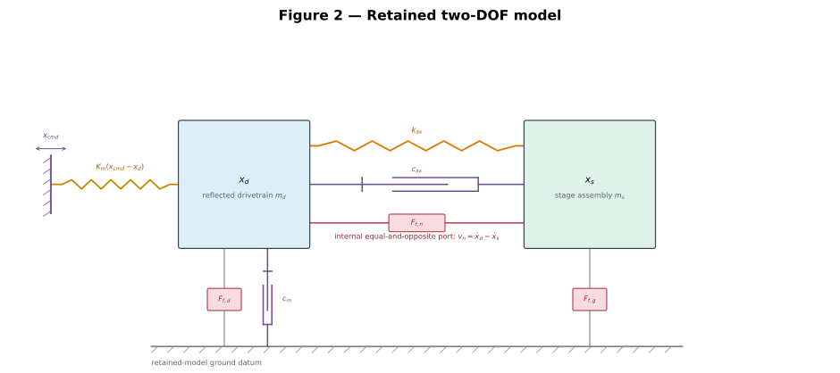

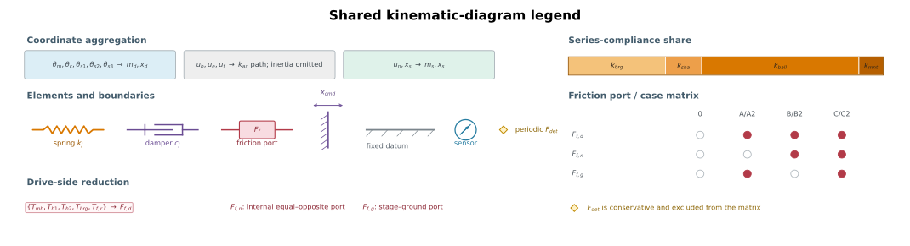

The main axial load path is ground, $k_{brg}$, $u_b$, $k_{sha}$, $u_e$, the screw transformer and $k_{ball}$, $u_n$, $k_{mnt}$, then $x_s$. The $u_f$ and $\theta_{s3}$ coordinates are beyond-nut overhang stubs and do not carry the stage load. The commanded displacement $x_{cmd}$ is drawn as an imposed moving wall, and $x_s$ is the modeled stage coordinate.

Figure 1 is snapped to fixed torsional, transformer, and axial bands and to the nine physical station columns. Ground connections are local to their band. The guideway branch joins the terminal line from $x_s$ at an explicit node, so the stage-to-ground path is continuous. At the nut, $u_e$ and $r\theta_{s2}$ meet at the filled summing node before $k_{ball}$ continues to $u_n$.

Figure 2 retains the two independent coordinates $x_d$ and $x_s$. The spring $k_{ax}$, damper $c_{ax}$, and internal friction port $F_{f,n}$ each terminate on both mass boxes. The shared legend holds the color mapping, reduction map, registry-derived compliance bar, constitutive symbols, and friction-port case matrix rather than repeating them in either mechanism drawing.

For clarity, the distributed dampers are not drawn in Figure 1: every spring $k_j$ has a parallel $c_j$ in the equations. Figure 2 displays $c_{ax}$ and $c_m$ explicitly. The drive-side loss is the identifiable lump $F_{f,d}\leftarrow\{T_{mb},T_{h1},T_{h2},T_{brg},T_{f,r}\}$; $F_{f,n}$ remains internal and $F_{f,g}$ remains stage-to-ground. Detent remains in the executed equations but is omitted from the kinematic drawings because it does not define a kinematic connection.

The one-DOF collapse is not drawn. It remains rejected because it enforces $\dot x_d=\dot x_s$, destroys the relative nut-port velocity, and removes the retained relative mode.

The honest full enumeration is ten mechanical DOFs:

| Index | Coordinate | Physical motion | Native unit |
|---:|---|---|---|
| 1 | $\theta_m$ | motor rotor rotation | rad |
| 2 | $\theta_c$ | coupling body rotation | rad |
| 3 | $\theta_{s1}$ | screw rotation at drive end | rad |
| 4 | $\theta_{s2}$ | screw rotation at nut plane | rad |
| 5 | $\theta_{s3}$ | screw rotation beyond nut | rad |
| 6 | $u_b$ | axial screw motion at bearing | m |
| 7 | $u_e$ | axial screw motion at nut plane | m |
| 8 | $u_f$ | axial screw motion beyond nut | m |
| 9 | $u_n$ | nut-body axial motion | m |
| 10 | $x_s$ | stage axial motion | m |

$x_{cmd}$ is an imposed electromagnetic-field input. It has no independently solved inertia and is not a DOF. LuGre bristle deflections and GMS element forces are constitutive internal states, not mechanical generalized coordinates.

## 4. Full ten-DOF derivation

Define

$$\mathbf q=[\theta_m,\theta_c,\theta_{s1},\theta_{s2},\theta_{s3},u_b,u_e,u_f,u_n,x_s]^T.$$

The full linear mechanical system has the form

$$\mathbf M\ddot{\mathbf q}+\mathbf C\dot{\mathbf q}+\mathbf K\mathbf q=\mathbf b\,x_{cmd}+\mathbf Q_f.$$

<details>
<summary>Step 1: kinetic energy and diagonal mass matrix</summary>

Because every coordinate is defined at a physical inertia or lumped axial mass, no kinematic substitution is made before the energy is written:

$$
\begin{aligned}
\mathcal T={}&\tfrac12J_m\dot\theta_m^2+\tfrac12J_c\dot\theta_c^2
+\tfrac12J_{s1}\dot\theta_{s1}^2+\tfrac12J_{s2}\dot\theta_{s2}^2
+\tfrac12J_{s3}\dot\theta_{s3}^2\\
&+\tfrac12m_b\dot u_b^2+\tfrac12m_e\dot u_e^2+\tfrac12m_f\dot u_f^2
+\tfrac12m_n\dot u_n^2+\tfrac12m_{stage}\dot x_s^2.
\end{aligned}
$$

Therefore

$$\mathbf M=\operatorname{diag}(J_m,J_c,J_{s1},J_{s2},J_{s3},m_b,m_e,m_f,m_n,m_{stage}).$$

The diagonal form is a consequence of coordinate choice, not an assumption that the branches are uncoupled. Their coupling enters through potential energy.

</details>

<details>
<summary>Step 2: every elastic deflection and the complete potential energy</summary>

The elementary deformations are

$$
\begin{array}{lll}
d_m=\theta_m-\theta_{cmd}, & d_{c1}=\theta_m-\theta_c, & d_{c2}=\theta_c-\theta_{s1},\\
d_{\theta a}=\theta_{s1}-\theta_{s2}, & d_{\theta b}=\theta_{s2}-\theta_{s3}, & d_{brg}=u_b,\\
d_{sha}=u_e-u_b, & d_{shb}=u_f-u_e, & d_{mnt}=u_n-x_s.
\end{array}
$$

The thread/ball contact is the only mixed rotational–axial deformation:

$$\boxed{\delta_n=u_n-u_e-r\theta_{s2}}.$$

The complete linearized potential is

$$
\begin{aligned}
\mathcal V={}&\tfrac12 k_m d_m^2+\tfrac12k_{c1}d_{c1}^2+\tfrac12k_{c2}d_{c2}^2
+\tfrac12k_{\theta a}d_{\theta a}^2+\tfrac12k_{\theta b}d_{\theta b}^2\\
&+\tfrac12k_{brg}d_{brg}^2+\tfrac12k_{sha}d_{sha}^2+\tfrac12k_{shb}d_{shb}^2
+\tfrac12k_{ball}\delta_n^2+\tfrac12k_{mnt}d_{mnt}^2.
\end{aligned}
$$

For any scalar element $\tfrac12k(\mathbf h^T\mathbf q)^2$, its matrix contribution is $k\mathbf h\mathbf h^T$. This outer-product rule is the direct bridge from the physical diagram to code.

</details>

<details>
<summary>Step 3: nut-interface virtual work and sign audit</summary>

Let the ball-contact force be positive in extension:

$$F_n=k_{ball}\delta_n+c_{ball}\dot\delta_n.$$

The gradient of the deformation is

$$\mathbf h_n=\frac{\partial\delta_n}{\partial\mathbf q}
=[0,0,0,-r,0,0,-1,0,+1,0]^T.$$

The contact’s generalized force on the coordinates is $-F_n\mathbf h_n$. Hence:

- on $\theta_{s2}$: $+rF_n$;
- on $u_e$: $+F_n$;
- on $u_n$: $-F_n$.

The corresponding stiffness and damping contributions are

$$\mathbf K_n=k_{ball}\mathbf h_n\mathbf h_n^T,\qquad
\mathbf C_n=c_{ball}\mathbf h_n\mathbf h_n^T.$$

This construction guarantees equal-and-opposite internal work and symmetric passive matrices. It also prevents the common sign mistake of applying the same axial force direction to $u_e$ and $u_n$.

</details>

<details>
<summary>Step 4: Rayleigh dissipation and the electromagnetic damping repair</summary>

For each structural element with deformation $d_j=\mathbf h_j^T\mathbf q$, use

$$\mathcal R_j=\tfrac12c_j\dot d_j^2,\qquad \mathbf C_j=c_j\mathbf h_j\mathbf h_j^T.$$

The provisional structural values use $c_j=2\zeta_j\sqrt{k_jm_{rel,j}}$, with $\zeta_j$ selected by interface: steel member, preloaded bearing, ball-nut contact, or bolted nut mount. The adopted values and permissible ranges are listed in Section 2. They are damping assumptions, not identified loss factors.

Revision 2 exposed a separate missing term: the ideal position-source stepper model supplied restoring stiffness but no effective drive damping. That lossless oscillator rang around every command. The same phenomenological term is retained here:

$$c_{\theta m}=2\zeta_m\sqrt{k_mJ_\Sigma},\qquad
c_m=\frac{c_{\theta m}}{r^2}=2\zeta_m\sqrt{K_mm_d}.$$

It enters as $-c_{\theta m}\dot\theta_m$ in the full rotor equation and $-c_m\dot x_d$ in the reduced drive equation. The executed $\zeta_m=0.10$ is the requested 10% baseline, not an identified driver property. The sensitivity plot spans 0.02 to 0.50. The TMC2209 can use StealthChop2 or SpreadCycle, so driver mode and current settings are required before assigning a measured damping ratio. See the [official TMC2209 datasheet](https://www.analog.com/media/en/technical-documentation/data-sheets/TMC2209_datasheet_rev1.09.pdf).

</details>

<details>
<summary>Step 5: scalar equations recovered from Lagrange’s equation</summary>

Using $\frac{d}{dt}(\partial\mathcal T/\partial\dot q_i)-\partial\mathcal T/\partial q_i+\partial\mathcal V/\partial q_i+\partial\mathcal R/\partial\dot q_i=Q_{f,i}$ gives:

$$J_m\ddot\theta_m=T_{mag}+T_{det}-c_{\theta m}\dot\theta_m-k_{c1}(\theta_m-\theta_c)-c_{c1}(\dot\theta_m-\dot\theta_c)-T_{h1}-T_{mb},$$

$$J_c\ddot\theta_c=k_{c1}(\theta_m-\theta_c)+c_{c1}(\dot\theta_m-\dot\theta_c)+T_{h1}-k_{c2}(\theta_c-\theta_{s1})-c_{c2}(\dot\theta_c-\dot\theta_{s1})-T_{h2},$$

$$J_{s1}\ddot\theta_{s1}=k_{c2}(\theta_c-\theta_{s1})+c_{c2}(\dot\theta_c-\dot\theta_{s1})+T_{h2}-k_{\theta a}(\theta_{s1}-\theta_{s2})-T_{brg},$$

$$J_{s2}\ddot\theta_{s2}=k_{\theta a}(\theta_{s1}-\theta_{s2})-k_{\theta b}(\theta_{s2}-\theta_{s3})+rF_n-T_{f,n}-T_{f,r},$$

$$J_{s3}\ddot\theta_{s3}=k_{\theta b}(\theta_{s2}-\theta_{s3}),$$

$$m_b\ddot u_b=-k_{brg}u_b-c_{brg}\dot u_b+k_{sha}(u_e-u_b)+c_{sha}(\dot u_e-\dot u_b),$$

$$m_e\ddot u_e=-k_{sha}(u_e-u_b)-c_{sha}(\dot u_e-\dot u_b)+k_{shb}(u_f-u_e)+c_{shb}(\dot u_f-\dot u_e)+F_n-F_{f,n},$$

$$m_f\ddot u_f=-k_{shb}(u_f-u_e)-c_{shb}(\dot u_f-\dot u_e),$$

$$m_n\ddot u_n=-F_n+F_{f,n}-k_{mnt}(u_n-x_s)-c_{mnt}(\dot u_n-\dot x_s),$$

$$m_{stage}\ddot x_s=k_{mnt}(u_n-x_s)+c_{mnt}(\dot u_n-\dot x_s)-F_{f,g}.$$

The nut contact microslip port uses

$$v_n=r\dot\theta_{s2}+\dot u_e-\dot u_n=-\dot\delta_n,\qquad T_{f,n}=rF_{f,n}.$$

It applies $-T_{f,n}$ to $\theta_{s2}$, $-F_{f,n}$ to $u_e$, and $+F_{f,n}$ to $u_n$. The port is internal and power consistent before reduction.

Gross nut rolling remains a named physical source in the ten-DOF bookkeeping, where $T_{f,r}=rF_{f,r}$. After reduction it shares exactly the velocity $\dot x_d$ and incidence row $[1,0]$ with motor/support-bearing drag, so the executable model folds it into $F_{f,d}$. This retains its force budget without claiming an unidentifiable separation.

</details>

## 5. Stepper input: nonlinear law, linearization, and bound

The commanded linear position maps to field angle through $\theta_{cmd}=x_{cmd}/r$. With $N_r$ rotor teeth,

The FL28STH32-040-24 motor (BOM part number; the earlier "0674A" label is not a BOM identifier) is assumed to run at rated current, so its 0.060 N·m holding torque is used as $T_{max}$. Both $T_{max}$ and $\hat T_{det}$ are amber inputs that set first-order results, and both need the datasheet page attached to their parameter rows.

$$T_{mag}=T_{max}\sin\!\left[N_r(\theta_{cmd}-\theta_m)\right].$$

Under the reduced coordinate $x_d=r\theta_m$,

$$F_{mag}=\frac{T_{max}}r\sin\!\left[\frac{N_r}{r}(x_{cmd}-x_d)\right]
=F_{max}\sin[\kappa(x_{cmd}-x_d)].$$

The small-signal stiffness is

$$K_m=\left.\frac{\partial F_{mag}}{\partial(x_{cmd}-x_d)}\right|_0
=\frac{N_rT_{max}}{r^2}=F_{max}\kappa.$$

For the current inputs, one full step is [[derived:full_step_pitch=5.000e-6]] m. The nonlinear audit bound remains [[derived:quarter_step_bound=1.250e-6]] m. The production Stepper-Board executes 16 STEP/DIR subdivisions per full step, so the position-command grid is the derived [[derived:command_step=3.12500e-7]] m quantum.

This **1/16 setting is adequate on quantization alone**. Its 156.2 nm peak and 90.2 nm RMS uniform-quantization errors consume 7.81% and 4.51% of the 2 µm bidirectional-repeatability target, respectively. Error terms of independent origin combine in quadrature, so the quantization term alone leaves $\sqrt{1-0.0451^2}=99.9\%$ of the RMS budget; the 95% figure quoted previously was a linear subtraction and is conservative rather than wrong. Resolution is not accuracy, however. Microstep nonlinearity is the error between the requested electrical microstep and the rotor position that is actually reached; a typical 10–30% of one 5 µm full step is 0.5–1.5 µm, or 25–75% of the same budget. Microstep nonlinearity, rather than command quantization, is therefore the binding microstepping constraint and remains assigned to the separate ablation described in [Appendix F](#appendix-f-stepper-mode-interpretation-and-model-scope).

At the quarter-step audit bound, $\kappa e=\pi/8$ and

$$\frac{\sin(\pi/8)}{\pi/8}=0.9745.$$

Thus the sine law is only 2.55% below its tangent at the largest commanded increment. It can shift amplitude and frequency slightly, but it was not the source of the old sustained oscillation; missing damping was.

### 5.1 Simulation implementation

The nonlinear simulations evaluate $F_{mag}$ and the periodic detent force directly at every Runge–Kutta trial state. The linear Bode and modal calculations use the commutation tangent $K_m$; detent is excluded from the global stiffness matrix because its tangent changes with position. The executable input is the zero-order-held command grid, with increments bounded to one quarter of a full step. The resulting low-mode interpretation and comparison with the physical modal tests are documented in [Appendix F](#appendix-f-stepper-mode-interpretation-and-model-scope).

### 5.2 Rotor-equivalent drive and stage transfer functions

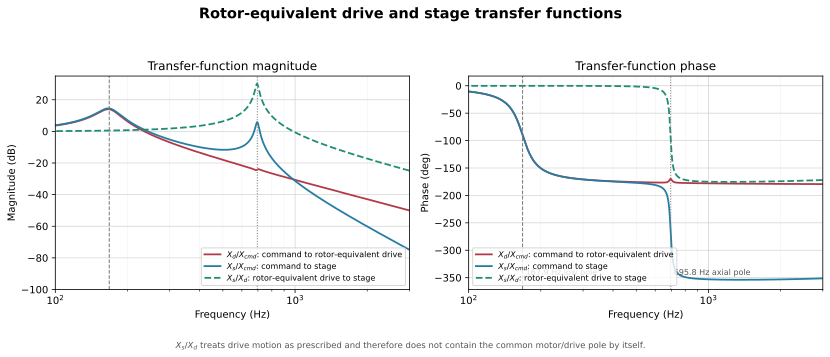

For the frictionless two-DOF linear model define

$$
a(s)=m_ds^2+(c_m+c_{ax})s+K_m+k_{ax},\qquad
b(s)=-(c_{ax}s+k_{ax}),\qquad
d(s)=m_ss^2+c_{ax}s+k_{ax},
$$

and $\Delta(s)=a(s)d(s)-b(s)^2$. The three relevant transfer functions are

$$\boxed{\frac{X_d}{X_{cmd}}=\frac{K_md(s)}{\Delta(s)}},$$

$$\boxed{\frac{X_s}{X_{cmd}}=\frac{-K_mb(s)}{\Delta(s)}},$$

$$\boxed{\frac{X_s}{X_d}=\frac{-b(s)}{d(s)}
=\frac{c_{ax}s+k_{ax}}{m_ss^2+c_{ax}s+k_{ax}}}.$$

$X_d/X_{cmd}$ is the clearest view of the low rotor/drive pole. $X_s/X_{cmd}$ contains both plant poles but can show weaker low-mode participation. $X_s/X_d$ treats rotor-equivalent drive motion as a prescribed input, so the common motor/magnetic pole cancels and only the stage-following dynamics remain. Therefore rotor-to-stage alone cannot be used to prove that the lower mode is absent.

The panel below is computed in the browser. Changing lead, component inertias, screw geometry, holding torque, detent torque, or plant parameters updates the derived values and these curves. Static SVGs still require a Python rebuild.

<div id="live-transfer-panel" class="live-transfer-panel" data-live-transfer-plots></div>

<details>
<summary>Enabled detent torque and its linearization</summary>

The published $\hat T_{det}=0.005$ N·m is enabled in the nonlinear simulation:

$$T_{det}(\theta_m)=-\hat T_{det}\sin(4N_r\theta_m+\phi_{det}).$$

Around an equilibrium $\theta_0$, it contributes the position-dependent tangent stiffness

$$k_{det,lin}=4N_r\hat T_{det}\cos(4N_r\theta_0+\phi_{det}).$$

The report origin uses $\phi_{det}=0$, a stable detent equilibrium. Its current tangent is $K_{det}=$ [[derived:detent_stiffness=3.94784e7]] N/m, but that value is used only for a **local sensitivity calculation**. It is not placed on the drive diagonal of the global stiffness matrix.

The global model therefore has $X_s/X_{cmd}|_{s=0}=1$ in Case 0. A local perturbation about one detent minimum may temporarily use $K_m+K_{det}(x_0)$ on the drive diagonal while retaining $K_m$ in the command vector. That approximation is useful only over roughly $\pm0.4\ \mu$m, where the detent sine remains near its tangent. Over multiple microsteps the tangent changes sign and the nonlinear periodic torque must be used.

Balancing commutation and detent torque gives the worst-case drive-only bound

$$|x_{err}|_{max}=\frac{r}{N_r}\sin^{-1}\!\left(\frac{\hat T_{det}}{T_{max}}\right)=266\ \mathrm{nm}.$$

Its spatial period is one full step, $p_{step}=5.00\ \mu$m, because $\sin(4N_r\theta)$ repeats after $2\pi/(4N_r)=1.8^\circ$. The earlier quarter-step statement confused the four detent cycles per rotor-tooth pitch with the 1.8° full-step interval. The [[derived:detent_equilibrium_error_nm=265.57]] nm equilibrium-error amplitude remains correct. Compliance and friction modify the realized stage error, but the periodic term must not be absorbed into friction identification.

**The command grid cannot express a correction for this term.** Positional pre-distortion places correction values on the command lattice, so resolving a [[derived:detent_equilibrium_error_nm=265.57]] nm periodic error into [[assumed:predistortion_levels=7]] levels needs a quantum of [[derived:predistortion_resolution_nm=37.94]] nm, that is $n_\mu\ge$ [[derived:required_microstep_divisor=131.79]]. The executed 1/16 quantum is 312.5 nm, which places [[derived:predistortion_levels_executed=0.85]] levels inside the entire error: one microstep is larger than the whole periodic term. This is a divisor requirement, and it is independent of the quantization-noise argument above, which 1/16 passes comfortably. See [Appendix C](#appendix-c-critical-error-disposition) item 16 and [Section 11](#11-interpreting-commanded-and-actual-motion) for what the timing channel can and cannot rescue.

Detent alone is not the whole “stepper resonance” mechanism. Current-loop dynamics, back-EMF, driver delay, current quantization, and mechanical damping set the response amplitude and stability. A higher-fidelity model still needs detent phase, an identified damping ratio, and current-controller states.

</details>


The model-scope audit finds a global [[derived:mode_1_hz=167.70]] Hz drive mode, a [[derived:detent_band_low_hz=145.07]]–[[derived:detent_band_high_hz=205.14]] Hz local detent-tangent range, and a [[derived:mode_2_hz=695.82]] Hz relative mode. These overlap the broad measured bands but do not reproduce every reported feature. The evidence limits and minimum defensible model extensions are moved to [Appendix F](#appendix-f-stepper-mode-interpretation-and-model-scope), keeping this chapter focused on the equations that are implemented.

## 6. Reduction from ten DOFs to two

### 6.1 What the reduction must preserve

The reduced plant must preserve the motor-equivalent motion $x_d=r\theta_m$, the measured stage motion $x_s$, the static endpoint compliance, and the two retained resonances. It must also preserve the relative velocity $\dot x_d-\dot x_s$: that is the power-conjugate velocity of the nut microslip port and is required by both friction identification and pre-distortion. Any one-DOF route fails this gate before numerical accuracy is considered.

The reduction is valid only over a declared retained band. Internal coordinates may be eliminated when their fixed-interface modes remain outside that band and their inertial participation is small. The live mass diagnostics are $m_d/m_s=$ [[derived:mass_ratio=261.83]] and $\mu=$ [[derived:reduced_mu=0.4035]] kg, so the drive side is order $10^2$ heavier after reflection and the relative-mode mass is 99.6% of $m_s$.

### 6.2 Reduction approaches

The six approaches answer different validation questions. The first three are mathematically equivalent for this unbranched static load path; the remaining three test frequency-dependent damping, truncation error, and experimental identifiability.

| No. | Approach | What it validates | Detailed derivation |
|---:|---|---|---|
| 1 | Formal static condensation | The two retained coordinates and exact static endpoint relation follow from the ten-DOF matrices | [Appendix E.2](#e-2-formal-static-condensation) |
| 2 | Direct series-compliance reduction | The same result follows from equal force, summed compliance, and reflected/co-moving inertia | [Appendix E.3](#e-3-direct-series-compliance-reduction) |
| 3 | Bond-graph reduction | The transformer and friction power ports survive without double-counting efficiency loss | [Appendix E.4](#e-4-bond-graph-reduction) |
| 4 | Frequency-domain complex-stiffness reduction | Interface damping can be propagated to a local $k_{ax}+i\omega c_{ax}$ equivalent | [Appendix E.5](#e-5-frequency-domain-complex-stiffness-reduction) |
| 5 | Craig–Bampton convergence check | Restoring the first discarded fixed-interface mode bounds dynamic truncation error | [Appendix E.6](#e-6-craig-bampton-convergence-check) |
| 6 | Measured-FRF identification | Modal mass and half-power bandwidth can independently determine executable stiffness and damping | [Appendix E.7](#e-7-measured-frf-identification) |

The link stiffness has two forms, and they are not the same equation:

$$\frac{1}{k_{link}}=r^2\sum_i\frac{1}{k_{\theta i}}+\sum_j\frac{1}{k_{axial,j}}\qquad\text{(full series chain)},$$

$$\frac{1}{k_{ax}}=\frac{1}{k_{brg}}+\frac{1}{k_{sha}}+\frac{1}{k_{ball}}+\frac{1}{k_{mnt}}\qquad\textbf{(executed)}.$$

All analytical approaches also retain $m_d=\sum J/r^2$ and $m_s=m_n+m_{stage}$. The executable model uses the **axial-only** chain: [E.2](#e-2-formal-static-condensation) removes the reflected torsional compliance explicitly, and the $k_{ball}$ closure in the builder contains no torsional term. The numerical difference is [[derived:torsional_share=0.375]]% of the total compliance, so the choice does not move a result, but the two equations must not be copied interchangeably.

The reflected torsional branch is 0.489 nm/N of about 130 nm/N total compliance: [[derived:torsional_share=0.375]]%, not 0.004%. The static-condensation, direct-compliance, and bond-graph results agree because $k_{ball}$ is presently closed from the same calibrated chain; that agreement validates the reduction algebra, not the component measurements.

### 6.3 Reduction evidence

The comparison is outcome-oriented: it asks whether the 2-DOF model preserves the required motions, compliance, modes, damping behavior, and friction port.

| Validation question | Evidence | Interpretation |
|---|---|---|
| Are the endpoint compliance and 696 Hz relative mode preserved? | Approaches 1–3 give $k_{ax}=$ [[derived:route_p_kax=7.710]] MN/m and $f_2=$ [[derived:route_p_f2=695.82]] Hz. | Yes, for the calibrated component chain. |
| Is the first omitted internal mode dynamically important? | Craig–Bampton gives [[derived:route_c_f2=691.75]] Hz; its difference from the full model is [[derived:cb_frequency_delta=0.13]]%. | The structural truncation is small in the retained band. |
| Does a single assumed damper reproduce the full model? | The current 55 N·s/m 2-DOF link settles in [[derived:route_p_settling=57.4]] ms; interface propagation, Craig–Bampton, and the full model give [[derived:route_f_settling=67.3]], [[derived:route_c_settling=67.5]], and [[derived:full_model_settling=68.2]] ms. | Yes, to within 16% in settling time **on the assumption branch only**. The measured relative-mode damping implies [[derived:measured_settling_ms=653.5]] ms instead, an unresolved factor of eleven; see [7.3](#7-3-dwell-consequence) and [E.7](#e-7-measured-frf-identification). |
| Does damping assignment or coordinate truncation dominate the residual? | The Section 7 per-plant audit drives all five candidate plants against the same ten-DOF output: every two-coordinate plant carrying a defensible damping value lands within 0.5% of the same residual, while restoring one eliminated coordinate divides it by 9.9. | Coordinate truncation dominates, and with the damping estimates now agreeing this is a clean one-variable result rather than an inference across two confounded variables. |
| Is the mass/stiffness pair independently identified? | BOM closure implies $k_{ball}=$ [[derived:route_p_kball=15.437]] MN/m; the measured 0.600 kg modal-mass branch implies [[derived:route_m_kball=44.903]] MN/m and settles in [[derived:route_m_settling=637.2]] ms. | No. The modal mass or component stiffness must be remeasured. |
| Is the nut-microslip coordinate retained? | Every 2-DOF approach preserves $\dot x_d-\dot x_s$ and its equal-and-opposite force row. | Yes; a one-DOF lock would fail this gate. |

<div class="live-equation" data-live-equation="route-comparison-summary">Live reduction agreement summary loads in the browser.</div>

<!-- BEGIN GENERATED CALIBRATION BRANCHES -->
Calibration-branch audit pending rebuild.
<!-- END GENERATED CALIBRATION BRANCHES -->

### 6.4 Decision and residual risk

Use the direct series-compliance argument as the concise derivation, formal static condensation as its proof, the bond graph as the power-port audit, and Craig–Bampton as the truncation check. Use the frequency-domain complex-stiffness result for analytical damping propagation. Adopt the measured-FRF values only after modal mass and half-power bandwidth are confirmed.

The 2-DOF structure is validated, and its executable damping is consistent with the ten-DOF assembly to 16% in settling time rather than an order of magnitude, **on the loss-factor branch**. Section 7 is therefore a structural comparison between two comparably damped plants, and its residual is a truncation measurement. The active risks are the 0.405-versus-0.600 kg mass conflict, the still-unmeasured interface loss factors, constrained bearing stiffness, the declared worst-case screw datum of [Appendix A](#appendix-a-position-dependent-axial-stiffness), and detent-dominated settled error. The last of these is now quantified rather than listed: [10.3](#10-3-generated-numerical-summary) reports the paired detent ablation.

## Appendix E. Order-reduction derivations

### E.1 Common setup: coordinates, reflection, and retained set

The retained coordinates are $\mathbf x=[x_d,x_s]^T$ with $x_d=r\theta_m$ and $r=L/(2\pi)$. The two equal coupling half-springs satisfy $k_{c1}=k_{c2}=2k_{c,series}$, so their series value is exactly the datasheet $k_{c,series}$. Rotational inertia and compliance reflect as $J/r^2$ and $r^2/k_\theta$, respectively.

<details><summary>E.1.1 The transformer and why $r^2$ appears everywhere</summary>

Power conservation gives $T\dot\theta=F\dot x$ and $\dot x=r\dot\theta$, hence $F=T/r$. Substitution into kinetic and elastic energy produces $J/r^2$ and $r^2/k_\theta$. The drive-side pole satisfies

$$\frac{K_m}{m_d}=\frac{N_rT_{max}/r^2}{J_\Sigma/r^2}=\frac{N_rT_{max}}{J_\Sigma},$$

so the lead cancels exactly. The current value is approximately 168 Hz and directly explains the band discussed in Appendix F without an order-reduction argument.

</details>

<details><summary>E.1.2 Partitioning convention $rr/re/er/ee$</summary>

After $\mathbf q=\mathbf T_r\mathbf x+\mathbf T_i\boldsymbol\eta$, every transformed matrix is partitioned with retained coordinates first and eliminated coordinates second. Thus $\mathbf M_{re}$ maps eliminated accelerations into retained equations, while $\mathbf K_{er}$ maps retained displacement into eliminated equilibrium equations. Reciprocity gives symmetric $re/er$ blocks for the passive model.

</details>

### E.2 Formal static condensation

#### The reduction in one picture

The ten-DOF model contains the measured stage motion, the motor/screw motion that drives it, and eight internal motions that describe how components deform between those two ends. The reduced model keeps the two end motions and replaces the eight internal motions by equivalent inertia, stiffness, damping, and force-port terms:

$$
\underbrace{\mathbf q\in\mathbb R^{10}}_{\text{all component motions}}
\xrightarrow[\text{retain low-frequency endpoint behaviour}]
{\text{change coordinates, then eliminate internal motion}}
\underbrace{\mathbf x=
\begin{bmatrix}x_d\\x_s\end{bmatrix}}_{\text{drive side and measured stage}}.
$$

$x_d=r\theta_m$ is the motor/screw rotation expressed as an equivalent linear displacement. It is not a second end-effector direction. The second DOF is required because the drivetrain can stretch:

$$x_d-x_s\ne0.$$

If only $x_s$ were retained, that stretch, its stored energy, the approximately 696 Hz relative mode, and the nut differential-friction velocity would all be forced to zero.

The reduction uses four different operations. Keeping them separate is the key to understanding the derivation:

| Operation | Engineering purpose | Exact or approximate? |
|---|---|---|
| Change coordinates | separate overall drive/stage motion from internal deformation | exact |
| Group co-moving inertia | preserve kinetic energy of components moving together in the retained band | low-frequency approximation |
| Condense spring junctions | preserve endpoint force versus endpoint displacement without retaining every junction coordinate | exact statically; frequency dependent dynamically |
| Calibrate $k_{ax}$ | use the measured upper mode because the complete static stiffness has not been measured independently | parameter-identification assumption |

The derivation below is organized around five key equations. Each equation is visible first; its toggle then explains what the operation is for, defines its local variables, and performs the matrix multiplication.

### Key equation A — describe the same ten motions using two endpoint coordinates and eight internal deformations

**Purpose:** separate motion that must remain from deformation that may be eliminated later.

$$
\boxed{
\mathbf q=\mathbf T_r\mathbf x+\mathbf T_i\boldsymbol\eta},
\qquad
\mathbf x=\begin{bmatrix}x_d\\x_s\end{bmatrix}.
$$

This equation is only a change of coordinates. No DOF has been removed yet.

<details>
<summary>Derivation A — define every coordinate and multiply out $\mathbf T_r\mathbf x+\mathbf T_i\boldsymbol\eta$</summary>

The local symbols are:

| Symbol | Meaning |
|---|---|
| $\mathbf T=[\mathbf T_r\ \mathbf T_i]$ | complete $10\times10$ coordinate-transformation matrix. It reconstructs the original coordinates from $[\mathbf x^T\ \boldsymbol\eta^T]^T$. Its columns are motion patterns, not forces, modes, or transfer functions. |
| $\mathbf T_r\in\mathbb R^{10\times2}$ | **retained-coordinate reconstruction block**: $\mathbf T_r\mathbf x$ tells how all ten physical coordinates move when only the two retained endpoint coordinates move and the internal deformations are zero. Here `r` means retained, not rotor. |
| $\mathbf T_i\in\mathbb R^{10\times8}$ | **internal-coordinate reconstruction block**: $\mathbf T_i\boldsymbol\eta$ adds the relative rotations and axial deformations to the retained motion. Here `i` means internal, not the imaginary unit. |
| $\boldsymbol\eta$ | eight-component internal-deformation vector $[\alpha_1,\alpha_2,\alpha_3,\alpha_4,u_b,u_e,u_f,\delta_m]^T$. It measures departures from rigid co-motion; it is a coordinate vector, not an efficiency. |
| $\mathbf q$ | original ten mechanical coordinates |
| $x_d=r\theta_m$ | retained drive displacement obtained from motor angle |
| $x_s$ | retained measured stage displacement |
| $r=L/(2\pi)$ | screw lead conversion, metres per radian |
| $\alpha_1,\ldots,\alpha_4$ | relative rotations across the coupling and screw segments |
| $u_b,u_e,u_f$ | internal screw axial coordinates |
| $\delta_m=u_n-x_s$ | nut-to-stage mount deflection |

In one line, $\mathbf T_r\mathbf x$ supplies the **overall endpoint motion**, while $\mathbf T_i\boldsymbol\eta$ supplies the **internal deformation superposed on it**. Because the two blocks together have ten independent columns, this step relabels the same ten DOFs rather than deleting any of them.

Choose

$$
\mathbf q=
\begin{bmatrix}
\theta_m&\theta_c&\theta_{s1}&\theta_{s2}&\theta_{s3}&
u_b&u_e&u_f&u_n&x_s
\end{bmatrix}^T
$$

and

$$
\boldsymbol\eta=
\begin{bmatrix}
\alpha_1&\alpha_2&\alpha_3&\alpha_4&u_b&u_e&u_f&\delta_m
\end{bmatrix}^T,
$$

where

$$
\alpha_1=\theta_c-\theta_m,\quad
\alpha_2=\theta_{s1}-\theta_c,\quad
\alpha_3=\theta_{s2}-\theta_{s1},\quad
\alpha_4=\theta_{s3}-\theta_{s2}.
$$

The matrices are

$$
\mathbf T_r=
\begin{bmatrix}
1/r&0\\1/r&0\\1/r&0\\1/r&0\\1/r&0\\
0&0\\0&0\\0&0\\0&1\\0&1
\end{bmatrix},
\qquad
\mathbf T_i=
\begin{bmatrix}
0&0&0&0&0&0&0&0\\
1&0&0&0&0&0&0&0\\
1&1&0&0&0&0&0&0\\
1&1&1&0&0&0&0&0\\
1&1&1&1&0&0&0&0\\
0&0&0&0&1&0&0&0\\
0&0&0&0&0&1&0&0\\
0&0&0&0&0&0&1&0\\
0&0&0&0&0&0&0&1\\
0&0&0&0&0&0&0&0
\end{bmatrix}.
$$

Multiplication gives

$$
\mathbf T_r\mathbf x=
\begin{bmatrix}
x_d/r\\x_d/r\\x_d/r\\x_d/r\\x_d/r\\0\\0\\0\\x_s\\x_s
\end{bmatrix},
\qquad
\mathbf T_i\boldsymbol\eta=
\begin{bmatrix}
0\\
\alpha_1\\
\alpha_1+\alpha_2\\
\alpha_1+\alpha_2+\alpha_3\\
\alpha_1+\alpha_2+\alpha_3+\alpha_4\\
u_b\\u_e\\u_f\\\delta_m\\0
\end{bmatrix}.
$$

Adding the two vectors reconstructs

$$
\begin{aligned}
\theta_m&=x_d/r,\\
\theta_c&=x_d/r+\alpha_1,\\
\theta_{s1}&=x_d/r+\alpha_1+\alpha_2,\\
\theta_{s2}&=x_d/r+\alpha_1+\alpha_2+\alpha_3,\\
\theta_{s3}&=x_d/r+\alpha_1+\alpha_2+\alpha_3+\alpha_4,\\
u_n&=x_s+\delta_m.
\end{aligned}
$$

Thus $\mathbf T=[\mathbf T_r\ \mathbf T_i]$ has rank ten and is invertible. The original and transformed descriptions contain exactly the same information. Reduction begins only when the dynamics of $\boldsymbol\eta$ are approximated or eliminated.

</details>

### Key equation B — replace co-moving component inertias by two energy-equivalent masses

**Purpose:** make the reduced model store the same retained-motion kinetic energy as the grouped components.

$$
\boxed{
\mathbf M_r=
\begin{bmatrix}m_d&0\\0&m_s\end{bmatrix}},
\qquad
\boxed{
m_d=\frac{J_m+J_c+J_{s1}+J_{s2}+J_{s3}}{r^2}},
\qquad
\boxed{m_s=m_n+m_{stage}}.
$$

<details>
<summary>Derivation B — kinetic-energy argument and the complete transformed mass multiplication</summary>

The local symbols are:

| Symbol | Meaning |
|---|---|
| $J_m,J_c,J_{s1},J_{s2},J_{s3}$ | motor, coupling, and screw polar inertias |
| $m_n,m_{stage}$ | nut and stage translational masses |
| $m_d$ | rotational drivetrain inertia reflected into linear units |
| $m_s$ | retained nut-plus-stage mass |
| $\mathbf M^{(q)}$ | original diagonal ten-DOF mass matrix |
| $A_1=J_c+J_{s1}+J_{s2}+J_{s3}$ | cumulative inertia moved by the first relative rotation $\alpha_1$; the coupling and every downstream screw segment participate |
| $A_2=J_{s1}+J_{s2}+J_{s3}$ | cumulative inertia moved by $\alpha_2$; only the screw segments downstream of the coupling participate |
| $A_3=J_{s2}+J_{s3}$ | cumulative inertia moved by $\alpha_3$ |
| $A_4=J_{s3}$ | inertia moved by the last relative rotation $\alpha_4$ |
| `r` in $\mathbf M_{rr},\mathbf M_{re}$ | retained set $\mathbf x=[x_d,x_s]^T$; when it is the first subscript it labels matrix rows/equations, and when it is second it labels columns/accelerations |
| `e` in $\mathbf M_{er},\mathbf M_{ee}$ | eliminated set $\boldsymbol\eta$; these are the same eight coordinates called **internal** by the `i` in $\mathbf T_i$, now labelled `e` because they will be eliminated |
| $\mathbf M_{rr}\;(2\times2)$ | retained equations versus retained accelerations; this is the mass block kept by the executable two-DOF approximation |
| $\mathbf M_{re}\;(2\times8)$ | retained equations versus internal accelerations; it measures how internal acceleration reacts on the retained equations |
| $\mathbf M_{er}\;(8\times2)$ | internal equations versus retained accelerations; $\mathbf M_{er}=\mathbf M_{re}^T$ because the mass matrix is energy-derived and symmetric |
| $\mathbf M_{ee}\;(8\times8)$ | internal equations versus internal accelerations; it contains the inertia associated with the coordinates that are subsequently condensed |

The $A_1$--$A_4$ terms are bookkeeping abbreviations produced by the multiplication, not four new bodies or fitted parameters. The first block subscript always names the **equation row group** and the second names the **coordinate/acceleration column group**. For example, `re` reads “retained equations coupled to eliminated-coordinate accelerations.”

The original mass matrix is

$$
\mathbf M^{(q)}=
\operatorname{diag}
(J_m,J_c,J_{s1},J_{s2},J_{s3},m_b,m_e,m_f,m_n,m_{stage}).
$$

For retained motion, set the internal velocities to zero:

$$
\dot{\boldsymbol\eta}=\mathbf0.
$$

This means the five rotating bodies share $\dot\theta=\dot x_d/r$, while the nut and stage share $\dot x_s$. Their energy is

$$
\begin{aligned}
\mathcal T_{ret}
&=\tfrac12(J_m+J_c+J_{s1}+J_{s2}+J_{s3})
\left(\frac{\dot x_d}{r}\right)^2
+\tfrac12(m_n+m_{stage})\dot x_s^2\\
&=\tfrac12m_d\dot x_d^2+\tfrac12m_s\dot x_s^2.
\end{aligned}
$$

The same result follows from matrix multiplication:

$$
\mathbf M_{rr}
=\mathbf T_r^T\mathbf M^{(q)}\mathbf T_r
=
\begin{bmatrix}
(J_m+J_c+J_{s1}+J_{s2}+J_{s3})/r^2&0\\
0&m_n+m_{stage}
\end{bmatrix}.
$$

The complete transformed mass is

$$
\mathbf T^T\mathbf M^{(q)}\mathbf T
=
\begin{bmatrix}
\mathbf M_{rr}&\mathbf M_{re}\\
\mathbf M_{er}&\mathbf M_{ee}
\end{bmatrix}.
$$

Define

$$
A_1=J_c+J_{s1}+J_{s2}+J_{s3},\quad
A_2=J_{s1}+J_{s2}+J_{s3},\quad
A_3=J_{s2}+J_{s3},\quad A_4=J_{s3}.
$$

Then the multiplication results are

$$
\mathbf M_{re}=
\begin{bmatrix}
A_1/r&A_2/r&A_3/r&A_4/r&0&0&0&0\\
0&0&0&0&0&0&0&m_n
\end{bmatrix},
\qquad
\mathbf M_{er}=\mathbf M_{re}^T,
$$

$$
\mathbf M_{ee}=
\begin{bmatrix}
A_1&A_2&A_3&A_4&0&0&0&0\\
A_2&A_2&A_3&A_4&0&0&0&0\\
A_3&A_3&A_3&A_4&0&0&0&0\\
A_4&A_4&A_4&A_4&0&0&0&0\\
0&0&0&0&m_b&0&0&0\\
0&0&0&0&0&m_e&0&0\\
0&0&0&0&0&0&m_f&0\\
0&0&0&0&0&0&0&m_n
\end{bmatrix}.
$$

The off-diagonal block $\mathbf M_{re}$ is the mathematical evidence that exact dynamic elimination would be frequency dependent. The executable model keeps $\mathbf M_{rr}$ and neglects internal acceleration participation. It does **not** add $m_b,m_e,m_f$ arbitrarily to either endpoint; those masses belong to eliminated screw-deformation coordinates.

<div class="live-equation" data-live-equation="inertia-aggregation">Live inertia aggregation loads in the browser.</div>

<div class="live-equation" data-live-equation="reduced-mass">Live stage-side mass aggregation loads in the browser.</div>

</details>

### Key equation C — replace the internal spring network by one endpoint stiffness

**Purpose:** preserve the force needed to create a given relative endpoint displacement $\Delta=x_d-x_s$ after internal spring-junction coordinates are removed.

The exact static condensation of the full ten-DOF topology gives

$$
\boxed{
\frac1{k_{link,full}}
=
\frac1{k_{ball}}
+\frac1{k_{brg}}+\frac1{k_{sha}}+\frac1{k_{mnt}}
+r^2\left(
\frac1{k_{c1}}+\frac1{k_{c2}}+\frac1{k_{\theta a}}
\right)}.
$$

The executable two-DOF model constrains the retained drive train to rotate together and therefore uses the axial-only link

$$
\boxed{
\frac1{k_{ax}}
=
\frac1{k_{ball}}+\frac1{k_{brg}}+\frac1{k_{sha}}+\frac1{k_{mnt}}}.
$$

<details>
<summary>Derivation C — equal-force spring argument, transformed stiffness matrices, and Schur complement</summary>

The local symbols are:

| Symbol | Meaning |
|---|---|
| $\Delta=x_d-x_s$ | total relative displacement between retained endpoints |
| $k_{brg},k_{sha},k_{ball},k_{mnt}$ | bearing, loaded screw, ball-contact, and mount stiffnesses |
| $k_{c1},k_{c2},k_{\theta a}$ | torsional stiffnesses that transmit load before the nut |
| $\mathbf h_r,\mathbf h_e$ | ball-contact deformation incidence vectors in retained/internal coordinates |
| $\mathbf K_{ee}$ | stiffness seen by the eight internal deformation coordinates |
| $\epsilon_j$ | signed extension of compliant element $j$ under the common series force, $\epsilon_j=F/k_j$; it is an element deformation, not an additional retained DOF |
| $j$ | index identifying one spring in the series load path |
| $\mathbf K_{ab}$, $a,b\in\{r,e\}$ | stiffness block with row group $a$ and coordinate column group $b$; `r` means retained and `e` means the internal coordinates being eliminated |
| $s$ | Laplace variable. On a sinusoidal frequency-response sweep $s=\mathrm i\omega$; this $\mathrm i$ is the imaginary unit and is unrelated to the `i` in $\mathbf T_i$. |
| $\mathbf Z_{ab}(s)=s^2\mathbf M_{ab}+s\mathbf C_{ab}+\mathbf K_{ab}$ | **dynamic-stiffness block** between groups $a$ and $b$. It combines inertia, damping, and elasticity at the chosen complex frequency; it is not another physical spring. |
| $\mathbf Z_{rr}$ | retained equations versus retained motion in the frequency domain |
| $\mathbf Z_{re},\mathbf Z_{er}$ | cross-coupling blocks between retained and eliminated motion |
| $\mathbf Z_{ee}$ | internal dynamic stiffness that must be inverted to solve the internal response |
| $\mathbf Z_{cond}(s)$ | exact frequency-dependent dynamic stiffness seen at $x_d,x_s$ after the eight internal coordinates have been eliminated |

The letters `i` and `e` therefore name the same eight-coordinate set from two viewpoints: **internal** when constructing $\mathbf T_i$, and **eliminated** when partitioning $\mathbf M$, $\mathbf C$, $\mathbf K$, or $\mathbf Z$. In $\mathbf Z_{re}$, the first letter identifies the retained equation rows and the second identifies eliminated-coordinate columns, exactly as for $\mathbf M_{re}$.

For springs in series, the same force $F$ passes through every element. Each extension is

$$\epsilon_j=\frac{F}{k_j}.$$

Because total extension is the sum,

$$
\Delta=\sum_j\epsilon_j
=F\sum_j\frac1{k_j},
$$

so

$$
k_{eq}=\frac{F}{\Delta}
=\left(\sum_j\frac1{k_j}\right)^{-1}.
$$

This is why **compliances** $1/k_j$ add in series; the stiffnesses themselves do not.

The same result follows from the matrices. In the transformed coordinates, ball-contact deformation is

$$
\delta_n
=\mathbf h_r^T\mathbf x+\mathbf h_e^T\boldsymbol\eta,
$$

with

$$
\mathbf h_r=
\begin{bmatrix}-1\\1\end{bmatrix},
\qquad
\mathbf h_e=
\begin{bmatrix}-r\\-r\\-r\\0\\0\\-1\\0\\1\end{bmatrix}.
$$

The internal stiffness excluding ball contact is

$$
\mathbf K_{e0}
=
\operatorname{diag}
\left(
k_{c1},k_{c2},k_{\theta a},k_{\theta b},
\mathbf K_{screw},k_{mnt}
\right),
$$

where the $3\times3$ screw-translation block is

$$
\mathbf K_{screw}=
\begin{bmatrix}
k_{brg}+k_{sha}&-k_{sha}&0\\
-k_{sha}&k_{sha}+k_{shb}&-k_{shb}\\
0&-k_{shb}&k_{shb}
\end{bmatrix}.
$$

From

$$
\mathcal V
=\tfrac12K_m(x_d-x_{cmd})^2
+\tfrac12\boldsymbol\eta^T\mathbf K_{e0}\boldsymbol\eta
+\tfrac12k_{ball}
(\mathbf h_r^T\mathbf x+\mathbf h_e^T\boldsymbol\eta)^2,
$$

the matrix multiplication gives

$$
\mathbf K_{rr}
=
\begin{bmatrix}K_m&0\\0&0\end{bmatrix}
+k_{ball}\mathbf h_r\mathbf h_r^T,
$$

$$
\mathbf K_{re}=k_{ball}\mathbf h_r\mathbf h_e^T
=k_{ball}
\begin{bmatrix}
r&r&r&0&0&1&0&-1\\
-r&-r&-r&0&0&-1&0&1
\end{bmatrix},
$$

$$
\mathbf K_{er}=\mathbf K_{re}^T,
\qquad
\mathbf K_{ee}=\mathbf K_{e0}+k_{ball}\mathbf h_e\mathbf h_e^T.
$$

Static equilibrium of the internal coordinates means

$$
\mathbf K_{er}\mathbf x+\mathbf K_{ee}\boldsymbol\eta=\mathbf0,
$$

so

$$
\boldsymbol\eta=-\mathbf K_{ee}^{-1}\mathbf K_{er}\mathbf x.
$$

Substituting this result into the retained equation produces the Schur complement

$$
\boxed{
\mathbf K_{cond}
=\mathbf K_{rr}-\mathbf K_{re}\mathbf K_{ee}^{-1}\mathbf K_{er}}.
$$

Carrying out the inverse quadratic form gives

$$
\mathbf h_e^T\mathbf K_{e0}^{-1}\mathbf h_e
=
r^2\left(
\frac1{k_{c1}}+\frac1{k_{c2}}+\frac1{k_{\theta a}}
\right)
+\frac1{k_{brg}}+\frac1{k_{sha}}+\frac1{k_{mnt}}.
$$

Therefore

$$
\frac1{k_{link,full}}
=\frac1{k_{ball}}
+\mathbf h_e^T\mathbf K_{e0}^{-1}\mathbf h_e,
$$

which is the visible key equation above. $k_{\theta b}$ and $k_{shb}$ vanish from the static result because their far ends are free overhangs; those coordinates follow their upstream nodes without carrying static force.

The executable approximation sets

$$\alpha_1=\alpha_2=\alpha_3=0,$$

which removes the reflected torsional compliance but preserves the four-element axial chain.

<div class="live-equation" data-live-equation="exact-static-condensation">Live exact-versus-executable static condensation loads in the browser.</div>

For dynamic rather than static elimination, replace every stiffness block by

$$
\mathbf Z_{ab}(s)=s^2\mathbf M_{ab}+s\mathbf C_{ab}+\mathbf K_{ab}
$$

and use

$$
\boxed{
\mathbf Z_{cond}(s)
=\mathbf Z_{rr}(s)
-\mathbf Z_{re}(s)\mathbf Z_{ee}^{-1}(s)\mathbf Z_{er}(s)}.
$$

Unlike the constant static Schur complement, this result is frequency dependent and retains the eliminated resonances.

</details>

### Key equation D — determine the executable $k_{ax}$ from the measured upper mode

**Purpose:** supply the missing numerical stiffness datum. No independent static measurement of the complete installed load path is currently available.

With $\lambda_2=(2\pi f_{2,target})^2$,

$$
\boxed{
k_{ax}=
\frac{\lambda_2m_s(K_m-\lambda_2m_d)}
{K_m-\lambda_2(m_d+m_s)}}.
$$

Once $k_{ax}$ is known, the ball-contact stiffness closes the axial compliance budget:

$$
\boxed{
\frac1{k_{ball}}
=\frac1{k_{ax}}-\frac1{k_{brg}}-\frac1{k_{sha}}-\frac1{k_{mnt}}}.
$$

<details>
<summary>Derivation D — determinant expansion, solution for $k_{ax}$, and what calibration means</summary>

The local symbols are:

| Symbol | Meaning |
|---|---|
| $f_{2,target}$ | selected measured upper-mode frequency |
| $\lambda_2=(2\pi f_{2,target})^2$ | corresponding eigenvalue |
| $K_m$ | reflected electromagnetic tangent stiffness |
| $m_d,m_s$ | retained drive-side and stage-side masses |
| $k_{ax}$ | equivalent axial-only stiffness being solved |

For undamped free motion,

$$
\left(\mathbf K_r-\lambda\mathbf M_r\right)\boldsymbol\phi=\mathbf0.
$$

A nonzero mode shape $\boldsymbol\phi$ requires

$$
0=
\det
\begin{bmatrix}
K_m+k_{ax}-\lambda_2m_d&-k_{ax}\\
-k_{ax}&k_{ax}-\lambda_2m_s
\end{bmatrix}.
$$

Multiplying the determinant gives

$$
(K_m+k_{ax}-\lambda_2m_d)
(k_{ax}-\lambda_2m_s)-k_{ax}^2=0,
$$

which expands to

$$
m_dm_s\lambda_2^2
-\left[m_dk_{ax}+m_s(K_m+k_{ax})\right]\lambda_2
+K_mk_{ax}=0.
$$

Collecting terms proportional to $k_{ax}$,

$$
k_{ax}\left[K_m-\lambda_2(m_d+m_s)\right]
=\lambda_2m_s(K_m-\lambda_2m_d),
$$

and division gives the visible formula.

<div class="live-equation" data-live-equation="modal-stiffness">Live modal stiffness calculation loads in the browser.</div>

<div class="live-equation" data-live-equation="axial-compliance">Live axial compliance closure loads in the browser.</div>

This is a calibration, not independent modal validation: the selected upper frequency determines $k_{ax}$. A future static force/displacement test would instead determine $k_{ax}$ directly and turn the upper-mode frequency into a prediction.

</details>

### Key equation E — assemble the final two-DOF equations

**Purpose:** combine the energy-equivalent masses, condensed link, drive stiffness, damping, input, and physical friction ports into one executable plant.

$$
\boxed{
\mathbf M_r\ddot{\mathbf x}
+\mathbf C_r\dot{\mathbf x}
+\mathbf K_r\mathbf x
=\mathbf b_r x_{cmd}+\mathbf Q_f},
\qquad
\mathbf x=\begin{bmatrix}x_d\\x_s\end{bmatrix},
$$

with

$$
\boxed{
\mathbf M_r=
\begin{bmatrix}m_d&0\\0&m_s\end{bmatrix}},
$$

$$
\boxed{
\mathbf C_r=
\begin{bmatrix}
c_m+c_{ax}&-c_{ax}\\
-c_{ax}&c_{ax}
\end{bmatrix}},
\qquad
\boxed{
\mathbf K_r=
\begin{bmatrix}
K_m+k_{ax}&-k_{ax}\\
-k_{ax}&k_{ax}
\end{bmatrix}},
\qquad
\boxed{
\mathbf b_r=
\begin{bmatrix}K_m\\0\end{bmatrix}}.
$$

<details>
<summary>Derivation E — scalar force balances, matrix assembly, friction incidence, and why one DOF is insufficient</summary>

The local symbols are:

| Symbol | Meaning |
|---|---|
| $F_{link}$ | **elastic** link force $k_{ax}(x_d-x_s)+c_{ax}(\dot x_d-\dot x_s)$, friction excluded |
| $F_{ax}=F_{link}+F_{f,n}$ | **total** force transmitted between $x_d$ and $x_s$, used by [E.4](#e-4-bond-graph-reduction) |
| $F_{f,d}$ | identifiable drive-side friction against ground |
| $F_{f,n}$ | internal nut-interface friction |
| $F_{f,g}$ | stage-guideway friction against ground |
| $F_{mag},F_{det}$ | nonlinear magnetic and periodic detent forces |
| $\mathbf H_d=[1\;0]$ | drive-port incidence row; maps generalized velocity to $v_d=\mathbf H_d\dot{\mathbf x}=\dot x_d$ |
| $\mathbf H_n=[1\;-1]$ | nut-interface incidence row; maps to the relative velocity $v_n=\dot x_d-\dot x_s$ |
| $\mathbf H_g=[0\;1]$ | guideway-port incidence row; maps to $v_g=\dot x_s$ |
| subscripts $d,n,g$ | drive side, nut interface, and guideway respectively |
| $\mathbf H_p^TF_{f,p}$ | virtual-work mapping that converts a scalar force at port $p$ into a two-component generalized-force vector |
| $\mathbf Q_f\in\mathbb R^2$ | total generalized friction-force vector added to the right-hand side of the two-DOF equations; it collects the three physical friction ports with their correct signs |
| $v_d,v_n,v_g$ | physical velocities supplied to the selected LuGre or GMS constitutive law at each port |

An incidence row $\mathbf H_p$ contains only the **kinematic wiring and sign convention** of a friction port; it is not a friction coefficient. The model first evaluates the scalar port velocity $v_p=\mathbf H_p\dot{\mathbf x}$, uses that velocity in LuGre or GMS to obtain $F_{f,p}$, and then maps that scalar force back with $-\mathbf H_p^TF_{f,p}$. The minus sign makes a positive friction magnitude oppose positive port motion.

Define

$$
F_{link}
=k_{ax}(x_d-x_s)+c_{ax}(\dot x_d-\dot x_s).
$$

Newton's law on the drive-side equivalent mass is

$$
m_d\ddot x_d
=F_{mag}+F_{det}-c_m\dot x_d-F_{link}-F_{f,n}-F_{f,d},
$$

and on the stage-side mass it is

$$
m_s\ddot x_s
=F_{link}+F_{f,n}-F_{f,g}.
$$

For the global linear baseline,

$$
F_{mag}\approx K_m(x_{cmd}-x_d),\qquad F_{det}=0,
$$

and collecting coefficients of $x_d,x_s,\dot x_d,\dot x_s$ gives the visible matrices.

The friction velocities are described by incidence rows:

$$
v_d=
\underbrace{\begin{bmatrix}1&0\end{bmatrix}}_{\mathbf H_d}
\dot{\mathbf x},
\qquad
v_n=
\underbrace{\begin{bmatrix}1&-1\end{bmatrix}}_{\mathbf H_n}
\dot{\mathbf x},
\qquad
v_g=
\underbrace{\begin{bmatrix}0&1\end{bmatrix}}_{\mathbf H_g}
\dot{\mathbf x}.
$$

Virtual work gives

$$
\boxed{
\mathbf Q_f
=-\mathbf H_d^TF_{f,d}
-\mathbf H_n^TF_{f,n}
-\mathbf H_g^TF_{f,g}}.
$$

Multiplication shows the physical force directions:

$$
\mathbf Q_f
=
\begin{bmatrix}-F_{f,d}\\0\end{bmatrix}
+
\begin{bmatrix}-F_{f,n}\\+F_{f,n}\end{bmatrix}
+
\begin{bmatrix}0\\-F_{f,g}\end{bmatrix}.
$$

The nut force is equal and opposite because it is internal. Drive and guideway friction are grounded forces.

If a one-DOF constraint $x_d=x_s=x$ is imposed, then

$$
x_d-x_s=0,\qquad
\dot x_d-\dot x_s=0.
$$

Consequently the axial spring stores no energy, the upper relative mode disappears, and $v_n=0$, so the nut-interface friction law cannot act. The one-DOF equation

$$
(m_d+m_s)\ddot x+c_m\dot x+K_mx
=K_mx_{cmd}-F_{f,aggregate}
$$

is therefore useful only well below the axial relative mode and cannot answer the friction questions for which this model was built.

</details>

<details class="supplementary-reference">
<summary>Supplementary matrix reference — former step-by-step presentation and every expanded block</summary>

The material below retains the exhaustive coordinate inventory, full $10\times10$ stiffness matrix, transformed block matrices, dynamic condensation, modal polynomial, and transfer-function reference. It is kept for auditability, but it is not required to follow the five-equation derivation above.

The reduction is a **band-limited energy, compliance, and power-port approximation**. It does not claim that eight physical bodies disappear or that every eliminated deformation is zero. The visible reduction ladder is:

| Main step | Operation | Result carried forward |
|---:|---|---|
| 1 | Declare the retained bandwidth, measured output, and friction ports | retain stage motion $x_s$ and one internal drive motion $x_d$ |
| 2 | Collapse the nearly co-rotating drive train | add $J_m,J_c,J_{s1},J_{s2},J_{s3}$ and reflect the sum through $r$ |
| 3 | Allocate translational inertia | add $m_n$ to $m_{stage}$; do not arbitrarily add the three eliminated axial screw masses |
| 4 | Statically condense the internal axial nodes | add the four **compliances** $1/k_{brg}$, $1/k_{sha}$, $1/k_{ball}$, and $1/k_{mnt}$ |
| 5 | Preserve virtual work and friction incidence | retain drive-to-ground, nut differential, and stage-to-ground velocity ports |
| 6 | Calibrate and verify | obtain $k_{ax}$ from the retained upper mode, close $k_{ball}$, then compare the full and reduced plants |

Thus,

$$
\mathbf q\in\mathbb R^{10}
\quad\longrightarrow\quad
\mathbf x=\begin{bmatrix}x_d&x_s\end{bmatrix}^T\in\mathbb R^2,
$$

while the internal elastic effects are retained through equivalent coefficients rather than retained coordinates. Expand the steps below for the full derivation.

<details>
<summary>Detailed Step 0 — why two model DOFs when the end effector has one output direction?</summary>

The stage has one measured output direction, but output dimension is not the same as system DOF count. $x_s$ is the end-effector translation; $x_d$ is an internal reflected rotor/screw coordinate on the same axis. Finite axial compliance permits $x_d-x_s\ne0$, so two independent initial positions and velocities are required.

A two-mass system connected by a spring has two DOFs even when both masses move along the same line and only the second mass is measured. Here the relative coordinate $x_d-x_s$ stores axial elastic energy and produces the [[derived:mode_2_hz=695.82]] Hz mode.

If the complete drivetrain is imposed rigidly, then $x_d=x_s=x$ and a legitimate one-DOF model results:

$$
(m_d+m_s)\ddot x+c_m\dot x+K_mx=K_mx_{cmd}-F_{f,aggregate}.
$$

That model retains the [[derived:mode_1_hz=167.70]] Hz global common-motion pole,

$$f_1\approx\frac{1}{2\pi}\sqrt{\frac{K_m}{m_d+m_s}},$$

but it removes the relative [[derived:mode_2_hz=695.82]] Hz mode, makes the modeled nut-port velocity $\dot x_d-\dot x_s$ identically zero, and merges the remaining friction sites. It is suitable only below the axial mode.

</details>

<details>
<summary>Detailed Step 1 — coordinate-by-coordinate map from ten coordinates to two</summary>

The reduction first classifies every coordinate by four questions:

1. Is it the measured output?
2. Does it carry kinetic energy that moves coherently in the retained band?
3. Does eliminating it remove a load-path compliance?
4. Does it carry a distinct, observable power port?

The resulting map is:

| Full coordinate | Retained-band role | Reduction operation |
|---|---|---|
| $q_1=\theta_m$ | commanded drive-side motion and drive loss | use as the basis of $x_d=r\theta$ |
| $q_2=\theta_c$ | coupling inertia; relative torsional mode is above the retained band | collapse its relative rotation; add $J_c$ to $J_\Sigma$ |
| $q_3=\theta_{s1}$ | screw-drive inertia and an internal torsional mode | collapse its relative rotation; add $J_{s1}$ to $J_\Sigma$ |
| $q_4=\theta_{s2}$ | screw rotation at the nut transformer | map $r\theta_{s2}$ to $x_d$; add $J_{s2}$ to $J_\Sigma$ |
| $q_5=\theta_{s3}$ | beyond-nut rotational overhang | collapse its relative rotation; add $J_{s3}$ to $J_\Sigma$ |
| $q_6=u_b$ | internal bearing-side axial node | eliminate its axial mass; retain $1/k_{brg}$ |
| $q_7=u_e$ | internal screw axial node at the nut plane | eliminate its axial mass; retain $1/k_{sha}$ |
| $q_8=u_f$ | unloaded beyond-nut axial overhang | drop $m_f$ and the unloaded $k_{shb}$ stub |
| $q_9=u_n$ | nut body, nearly co-moving with the stage in the retained band | add $m_n$ to $m_s$; retain $1/k_{ball}$ and $1/k_{mnt}$ in the static path |
| $q_{10}=x_s$ | measured stage translation and guideway port | retain exactly |

This uses three different verbs deliberately:

- **aggregate** means the element's kinetic energy is represented at a retained coordinate;
- **condense** means the independent coordinate is removed but its static force-displacement effect remains;
- **drop** means neither its inertia nor its branch stiffness lies on the retained load path.

The two beyond-nut coordinates $\theta_{s3}$ and $u_f$ require different treatment. $J_{s3}$ is part of the screw's co-rotating polar inertia and therefore contributes to $m_d$. The axial $u_f$ branch is an unloaded overhang, so $m_f$ and $k_{shb}$ do not transmit the retained stage force.

</details>

<details>
<summary>Detailed Step 2 — formal projection, static condensation, and what is approximate</summary>

The expressions below use one explicit, nonsingular coordinate basis. Nothing is left as an unnamed $\mathbf T_r$, $\mathbf T_i$, or partitioned matrix.

<details>
<summary>Step 2A — exact retained/internal coordinate definitions and the complete $\mathbf T_r,\mathbf T_i$ matrices</summary>

Retain

$$
\mathbf x=
\begin{bmatrix}x_d\\x_s\end{bmatrix},
\qquad x_d=r\theta_m,
$$

and define eight internal coordinates

$$
\boldsymbol\eta=
\begin{bmatrix}
\alpha_1\\\alpha_2\\\alpha_3\\\alpha_4\\u_b\\u_e\\u_f\\\delta_m
\end{bmatrix}
=
\begin{bmatrix}
\theta_c-\theta_m\\
\theta_{s1}-\theta_c\\
\theta_{s2}-\theta_{s1}\\
\theta_{s3}-\theta_{s2}\\
u_b\\u_e\\u_f\\u_n-x_s
\end{bmatrix}.
$$

The inverse reconstruction is

$$
\begin{aligned}
\theta_m&=x_d/r,\\
\theta_c&=x_d/r+\alpha_1,\\
\theta_{s1}&=x_d/r+\alpha_1+\alpha_2,\\
\theta_{s2}&=x_d/r+\alpha_1+\alpha_2+\alpha_3,\\
\theta_{s3}&=x_d/r+\alpha_1+\alpha_2+\alpha_3+\alpha_4,\\
u_b&=u_b,\quad u_e=u_e,\quad u_f=u_f,\quad
u_n=x_s+\delta_m.
\end{aligned}
$$

Therefore

$$
\boxed{\mathbf q=\mathbf T_r\mathbf x+\mathbf T_i\boldsymbol\eta}
$$

with the exact $10\times2$ retained matrix

$$
\boxed{
\mathbf T_r=
\begin{bmatrix}
1/r&0\\
1/r&0\\
1/r&0\\
1/r&0\\
1/r&0\\
0&0\\
0&0\\
0&0\\
0&1\\
0&1
\end{bmatrix}}
$$

and exact $10\times8$ internal matrix

$$
\boxed{
\mathbf T_i=
\begin{bmatrix}
0&0&0&0&0&0&0&0\\
1&0&0&0&0&0&0&0\\
1&1&0&0&0&0&0&0\\
1&1&1&0&0&0&0&0\\
1&1&1&1&0&0&0&0\\
0&0&0&0&1&0&0&0\\
0&0&0&0&0&1&0&0\\
0&0&0&0&0&0&1&0\\
0&0&0&0&0&0&0&1\\
0&0&0&0&0&0&0&0
\end{bmatrix}}.
$$

The combined matrix

$$
\mathbf T=\begin{bmatrix}\mathbf T_r&\mathbf T_i\end{bmatrix}\in\mathbb R^{10\times10}
$$

is nonsingular because the definitions above recover all ten original coordinates uniquely. Up to this point there is no approximation: $\mathbf x$ and $\boldsymbol\eta$ are merely a change of coordinates.

</details>

<details>
<summary>Step 2B — full original-coordinate $\mathbf M^{(q)}$, $\mathbf K^{(q)}$, $\mathbf C^{(q)}$, and input vector</summary>

In the original coordinate order

$$
\mathbf q=[\theta_m,\theta_c,\theta_{s1},\theta_{s2},\theta_{s3},u_b,u_e,u_f,u_n,x_s]^T,
$$

the mass matrix is

$$
\boxed{
\mathbf M^{(q)}=
\operatorname{diag}
(J_m,J_c,J_{s1},J_{s2},J_{s3},m_b,m_e,m_f,m_n,m_{stage})
}.
$$

For compact display in the $10\times10$ stiffness matrix, let

$$
k_a=k_{\theta a},\qquad
k_b=k_{\theta b},\qquad
k_N=k_{ball},\qquad
k_T=k_{mnt}.
$$

Direct expansion of every outer-product contribution from Section 4 gives

$$
\boxed{
\mathbf K^{(q)}=
\begin{bmatrix}
k_m+k_{c1}&-k_{c1}&0&0&0&0&0&0&0&0\\
-k_{c1}&k_{c1}+k_{c2}&-k_{c2}&0&0&0&0&0&0&0\\
0&-k_{c2}&k_{c2}+k_a&-k_a&0&0&0&0&0&0\\
0&0&-k_a&k_a+k_b+r^2k_N&-k_b&0&rk_N&0&-rk_N&0\\
0&0&0&-k_b&k_b&0&0&0&0&0\\
0&0&0&0&0&k_{brg}+k_{sha}&-k_{sha}&0&0&0\\
0&0&0&rk_N&0&-k_{sha}&k_{sha}+k_{shb}+k_N&-k_{shb}&-k_N&0\\
0&0&0&0&0&0&-k_{shb}&k_{shb}&0&0\\
0&0&0&-rk_N&0&0&-k_N&0&k_N+k_T&-k_T\\
0&0&0&0&0&0&0&0&-k_T&k_T
\end{bmatrix}}.
$$

The signs in rows 4, 7, and 9 come from

$$
\delta_n=u_n-u_e-r\theta_{s2},
\qquad
\mathbf h_n=
[0,0,0,-r,0,0,-1,0,1,0]^T,
$$

through $k_N\mathbf h_n\mathbf h_n^T$.

The full damping matrix has exactly the same element topology:

$$
\boxed{
\mathbf C^{(q)}
=
\left.
\mathbf K^{(q)}
\right|_{
k_m=0,\;
k_j\mapsto c_j
}
+c_{\theta m}\mathbf e_1\mathbf e_1^T
}.
$$

Here $k_j\mapsto c_j$ applies to
$c_{c1},c_{c2},c_{\theta a},c_{\theta b},c_{brg},c_{sha},
c_{shb},c_{ball},c_{mnt}$; electromagnetic damping is the separate
$c_{\theta m}$ term.

When the imposed input is $x_{cmd}=r\theta_{cmd}$, the original-coordinate input vector is

$$
\boxed{
\mathbf b_x^{(q)}
=\frac{k_m}{r}\mathbf e_1
=
\begin{bmatrix}
k_m/r&0&0&0&0&0&0&0&0&0
\end{bmatrix}^T
}.
$$

</details>

<details>
<summary>Step 2C — complete transformed mass blocks $\mathbf M_{rr},\mathbf M_{re},\mathbf M_{er},\mathbf M_{ee}$</summary>

The transformed mass matrix is

$$
\overline{\mathbf M}
=
\mathbf T^T\mathbf M^{(q)}\mathbf T
=
\begin{bmatrix}
\mathbf M_{rr}&\mathbf M_{re}\\
\mathbf M_{er}&\mathbf M_{ee}
\end{bmatrix},
$$

where

$$
\mathbf M_{rr}=\mathbf T_r^T\mathbf M^{(q)}\mathbf T_r,\quad
\mathbf M_{re}=\mathbf T_r^T\mathbf M^{(q)}\mathbf T_i,\quad
\mathbf M_{er}=\mathbf M_{re}^T,\quad
\mathbf M_{ee}=\mathbf T_i^T\mathbf M^{(q)}\mathbf T_i.
$$

Define the cumulative rotational inertias

$$
\begin{aligned}
A_1&=J_c+J_{s1}+J_{s2}+J_{s3},\\
A_2&=J_{s1}+J_{s2}+J_{s3},\\
A_3&=J_{s2}+J_{s3},\\
A_4&=J_{s3},\\
J_\Sigma&=J_m+A_1.
\end{aligned}
$$

Then all four blocks are explicitly

$$
\boxed{
\mathbf M_{rr}=
\begin{bmatrix}
J_\Sigma/r^2&0\\
0&m_n+m_{stage}
\end{bmatrix}}
$$

$$
\boxed{
\mathbf M_{re}=
\begin{bmatrix}
A_1/r&A_2/r&A_3/r&A_4/r&0&0&0&0\\
0&0&0&0&0&0&0&m_n
\end{bmatrix},
\qquad
\mathbf M_{er}=\mathbf M_{re}^T
}
$$

and

$$
\boxed{
\mathbf M_{ee}=
\begin{bmatrix}
A_1&A_2&A_3&A_4&0&0&0&0\\
A_2&A_2&A_3&A_4&0&0&0&0\\
A_3&A_3&A_3&A_4&0&0&0&0\\
A_4&A_4&A_4&A_4&0&0&0&0\\
0&0&0&0&m_b&0&0&0\\
0&0&0&0&0&m_e&0&0\\
0&0&0&0&0&0&m_f&0\\
0&0&0&0&0&0&0&m_n
\end{bmatrix}}.
$$

The nonzero $\mathbf M_{re}$ terms show exactly what is neglected when the internal accelerations are removed. Retaining only $\mathbf M_{rr}$ is the coherent-motion kinetic projection used by the executable two-DOF model; it is not the exact dynamic condensation.

</details>

<details>
<summary>Step 2D — complete transformed stiffness, damping, and input blocks</summary>

In the new coordinates the ball-contact deformation becomes

$$
\delta_n
=
\underbrace{\begin{bmatrix}-1&1\end{bmatrix}}_{\mathbf h_r^T}\mathbf x
+
\underbrace{\begin{bmatrix}-r&-r&-r&0&0&-1&0&1\end{bmatrix}}_{\mathbf h_e^T}
\boldsymbol\eta.
$$

All non-ball internal stiffness terms form

$$
\boxed{
\mathbf K_{e0}=
\begin{bmatrix}
k_{c1}&0&0&0&0&0&0&0\\
0&k_{c2}&0&0&0&0&0&0\\
0&0&k_{\theta a}&0&0&0&0&0\\
0&0&0&k_{\theta b}&0&0&0&0\\
0&0&0&0&k_{brg}+k_{sha}&-k_{sha}&0&0\\
0&0&0&0&-k_{sha}&k_{sha}+k_{shb}&-k_{shb}&0\\
0&0&0&0&0&-k_{shb}&k_{shb}&0\\
0&0&0&0&0&0&0&k_{mnt}
\end{bmatrix}}.
$$

The transformed potential energy is therefore

$$
\mathcal V=
\tfrac12K_m(x_d-x_{cmd})^2
+\tfrac12\boldsymbol\eta^T\mathbf K_{e0}\boldsymbol\eta
+\tfrac12k_{ball}
(\mathbf h_r^T\mathbf x+\mathbf h_e^T\boldsymbol\eta)^2,
\qquad K_m=\frac{k_m}{r^2}.
$$

Reading off the Hessian gives every transformed stiffness block:

$$
\boxed{
\mathbf K_{rr}
=
\begin{bmatrix}K_m&0\\0&0\end{bmatrix}
+k_{ball}\mathbf h_r\mathbf h_r^T
=
\begin{bmatrix}
K_m+k_{ball}&-k_{ball}\\
-k_{ball}&k_{ball}
\end{bmatrix}}
$$

$$
\boxed{
\mathbf K_{re}=k_{ball}\mathbf h_r\mathbf h_e^T,\qquad
\mathbf K_{er}=k_{ball}\mathbf h_e\mathbf h_r^T}
$$

$$
\boxed{
\mathbf K_{ee}
=\mathbf K_{e0}+k_{ball}\mathbf h_e\mathbf h_e^T}.
$$

For absolute clarity, the $2\times8$ coupling block is

$$
\boxed{
\mathbf K_{re}
=k_{ball}
\begin{bmatrix}
r&r&r&0&0&1&0&-1\\
-r&-r&-r&0&0&-1&0&1
\end{bmatrix}}.
$$

The internal $8\times8$ ball-contact addition is the following explicit rank-one matrix:

$$
\boxed{
k_{ball}\mathbf h_e\mathbf h_e^T
=k_{ball}
\begin{bmatrix}
r^2&r^2&r^2&0&0&r&0&-r\\
r^2&r^2&r^2&0&0&r&0&-r\\
r^2&r^2&r^2&0&0&r&0&-r\\
0&0&0&0&0&0&0&0\\
0&0&0&0&0&0&0&0\\
r&r&r&0&0&1&0&-1\\
0&0&0&0&0&0&0&0\\
-r&-r&-r&0&0&-1&0&1
\end{bmatrix}}.
$$

Define $\mathbf C_{e0}$ by replacing every structural stiffness in
$\mathbf K_{e0}$ with its parallel damper:

$$
\mathbf C_{e0}
=
\left.\mathbf K_{e0}\right|_{k_j\mapsto c_j}.
$$

Then the complete transformed damping blocks are

$$
\boxed{
\mathbf C_{rr}
=
\begin{bmatrix}c_m&0\\0&0\end{bmatrix}
+c_{ball}\mathbf h_r\mathbf h_r^T,\qquad
c_m=\frac{c_{\theta m}}{r^2}}
$$

$$
\boxed{
\mathbf C_{re}=c_{ball}\mathbf h_r\mathbf h_e^T,\qquad
\mathbf C_{er}=\mathbf C_{re}^T,\qquad
\mathbf C_{ee}=\mathbf C_{e0}+c_{ball}\mathbf h_e\mathbf h_e^T}.
$$

Finally, transformation of the command input gives

$$
\boxed{
\overline{\mathbf b}_x
=\mathbf T^T\mathbf b_x^{(q)}
=
\begin{bmatrix}
K_m&0&0&0&0&0&0&0&0&0
\end{bmatrix}^T}.
$$

The command therefore excites only $x_d$; it does not directly force an eliminated coordinate.

</details>

<details>
<summary>Step 2E — exact dynamic condensation and the full static Schur complement</summary>

For $a,b\in\{r,e\}$ define the complete dynamic-stiffness blocks

$$
\boxed{
\mathbf Z_{ab}(s)
=s^2\mathbf M_{ab}+s\mathbf C_{ab}+\mathbf K_{ab}}.
$$

The transformed equations are

$$
\begin{bmatrix}
\mathbf Z_{rr}&\mathbf Z_{re}\\
\mathbf Z_{er}&\mathbf Z_{ee}
\end{bmatrix}
\begin{bmatrix}\mathbf X\\\boldsymbol\Eta\end{bmatrix}
=
\begin{bmatrix}\mathbf F_r\\\mathbf F_e\end{bmatrix}.
$$

Solving the internal row gives

$$
\boldsymbol\Eta
=\mathbf Z_{ee}^{-1}
(\mathbf F_e-\mathbf Z_{er}\mathbf X).
$$

Substitution into the retained row yields the exact condensed plant

$$
\boxed{
\mathbf Z_{cond}(s)
=
\mathbf Z_{rr}(s)
-\mathbf Z_{re}(s)\mathbf Z_{ee}^{-1}(s)\mathbf Z_{er}(s)}
$$

and the condensed force

$$
\boxed{
\mathbf F_{cond}(s)
=\mathbf F_r(s)-\mathbf Z_{re}(s)\mathbf Z_{ee}^{-1}(s)\mathbf F_e(s)}.
$$

This rational matrix retains the poles of the eliminated coordinates and is not a constant-matrix two-DOF model.

In the static, unforced-internal limit,

$$
\boldsymbol\eta=-\mathbf K_{ee}^{-1}\mathbf K_{er}\mathbf x
$$

and

$$
\boxed{
\mathbf K_{cond}
=
\mathbf K_{rr}-\mathbf K_{re}\mathbf K_{ee}^{-1}\mathbf K_{er}}.
$$

Using the rank-one structure in Step 2D gives

$$
\mathbf K_{cond}
=
\begin{bmatrix}K_m&0\\0&0\end{bmatrix}
+k_{link,full}\mathbf h_r\mathbf h_r^T,
$$

where

$$
\boxed{
\frac1{k_{link,full}}
=
\frac1{k_{ball}}
+\mathbf h_e^T\mathbf K_{e0}^{-1}\mathbf h_e}.
$$

Evaluation of the inverse quadratic form gives the complete full-model static compliance:

$$
\boxed{
\frac1{k_{link,full}}
=
\frac1{k_{ball}}
+r^2\left(
\frac1{k_{c1}}+\frac1{k_{c2}}+\frac1{k_{\theta a}}
\right)
+\frac1{k_{brg}}+\frac1{k_{sha}}+\frac1{k_{mnt}}}.
$$

Two apparent omissions are physical:

- $k_{\theta b}$ terminates in the free rotational overhang $\theta_{s3}$, which follows $\theta_{s2}$ statically and carries no retained static force;
- $k_{shb}$ terminates in the free axial overhang $u_f$, which follows $u_e$ statically and also carries no retained static force.

<div class="live-equation" data-live-equation="exact-static-condensation">Live exact-versus-executable static condensation loads in the browser.</div>

The executable two-DOF model imposes the common-rotation constraint

$$
\alpha_1=\alpha_2=\alpha_3=0
$$

instead of statically relaxing those three rotations. Its retained axial stiffness is consequently

$$
\boxed{
\frac1{k_{ax}}
=
\frac1{k_{ball}}+\frac1{k_{brg}}+\frac1{k_{sha}}+\frac1{k_{mnt}}}.
$$

The difference is precisely the excluded reflected torsional compliance

$$
\boxed{
\Delta C_\theta
=r^2\left(
\frac1{k_{c1}}+\frac1{k_{c2}}+\frac1{k_{\theta a}}
\right)}.
$$

This is small for the present parameters but is not mathematically zero. The full-versus-reduced residual in Section 7 measures the combined consequence of this constraint and the discarded internal inertia.

For comparison, a strict Guyan mass would use

$$
\mathbf R=-\mathbf K_{ee}^{-1}\mathbf K_{er},\qquad
\mathbf T_G=
\begin{bmatrix}\mathbf I_2\\\mathbf R\end{bmatrix}
$$

and

$$
\boxed{
\mathbf M_{Guyan}
=
\mathbf M_{rr}
+\mathbf M_{re}\mathbf R
+\mathbf R^T\mathbf M_{er}
+\mathbf R^T\mathbf M_{ee}\mathbf R}.
$$

The executable model deliberately uses $\mathbf M_{rr}$ instead. It is therefore a **hybrid coherent-inertia/static-compliance/modal-calibrated reduction**, not an exact Guyan or exact dynamic condensation.

</details>

</details>

<details>
<summary>Detailed Step 3 — rotational inertias: which ones add, how they reflect, and which terms do not</summary>

In the retained band the five drive-side bodies are assumed to have a common angular velocity. Their kinetic energies therefore add:

$$
\begin{aligned}
\mathcal T_{rot}
&=\tfrac12J_m\dot\theta^2+\tfrac12J_c\dot\theta^2
+\tfrac12J_{s1}\dot\theta^2+\tfrac12J_{s2}\dot\theta^2
+\tfrac12J_{s3}\dot\theta^2\\
&=\tfrac12
\underbrace{(J_m+J_c+J_{s1}+J_{s2}+J_{s3})}_{J_\Sigma}
\dot\theta^2.
\end{aligned}
$$

Because $J_{s1}+J_{s2}+J_{s3}=J_s$,

$$
\boxed{J_\Sigma=J_m+J_c+J_s}.
$$

The screw lead gives $x_d=r\theta$, so $\dot\theta=\dot x_d/r$. Equating rotational and translational kinetic energy gives

$$
\tfrac12J_\Sigma\left(\frac{\dot x_d}{r}\right)^2
=\tfrac12m_d\dot x_d^2
\quad\Rightarrow\quad
\boxed{m_d=\frac{J_\Sigma}{r^2}}.
$$

<div class="live-equation" data-live-equation="inertia-aggregation">Live inertia aggregation loads in the browser.</div>

The same reflection follows from virtual work:

$$
T\,d\theta=F\,dx_d,\qquad dx_d=r\,d\theta
\quad\Rightarrow\quad
F=\frac{T}{r}.
$$

Consequently a rotational stiffness and damping referred to $x_d$ become

$$
\boxed{K=\frac{k_\theta}{r^2}},\qquad
\boxed{c=\frac{c_\theta}{r^2}}.
$$

Only inertias constrained to the same retained angular motion add directly. The coupling's published physical mass is **not** added again after its polar inertia $J_c$ has been included. Likewise, the screw's axial masses $m_b,m_e,m_f$ are not added to $m_d$: they belong to separate axial deformation coordinates in the ten-DOF energy.

The coupling and screw torsional springs do not enter the executable four-element $k_{ax}$ sum because that reduction imposes $\alpha_1=\alpha_2=\alpha_3=0$. They are not all absent from the exact full-model condensation: Step 2E shows that $k_{c1}$, $k_{c2}$, and $k_{\theta a}$ contribute the reflected compliance $r^2(1/k_{c1}+1/k_{c2}+1/k_{\theta a})$. Only $k_{\theta b}$ drops out of the static link because it terminates in the free beyond-nut rotational stub. The full dynamic model retains all four and therefore retains their internal-mode content.

</details>

<details>
<summary>Detailed Step 4 — translational masses: why $m_n$ adds to the stage but $m_b,m_e,m_f$ do not</summary>

The retained stage-side kinetic approximation is

$$
\mathcal T_s
\approx\tfrac12m_n\dot x_s^2+\tfrac12m_{stage}\dot x_s^2
=\tfrac12(m_n+m_{stage})\dot x_s^2,
$$

so

$$
\boxed{m_s=m_n+m_{stage}}.
$$

The current measured stage body is 0.355 kg and the nut estimate is 0.050 kg:

<div class="live-equation" data-live-equation="reduced-mass">Live reduced-mass calculation loads in the browser.</div>

This does **not** assert that the nut-mount deflection is mathematically zero. It says that the nut and stage have nearly the same velocity for the purpose of retained-band kinetic energy, while the small quasi-static relative displacement is still allowed to store energy through $k_{mnt}$. In the perfectly rigid attachment limit,

$$
k_{mnt}\rightarrow\infty,\qquad \frac1{k_{mnt}}\rightarrow0,
$$

and the mount disappears from the compliance sum.

The three axial screw masses $m_b,m_e,m_f$ are not added to either retained mass. Their coordinates are internal deformation fields, and the present reduction neglects their axial kinetic energy after confirming that the associated modes lie above the retained comparison band. Assigning their entire mass to $x_d$ or $x_s$ would imply a rigid co-motion constraint that the full topology does not provide. If their inertial participation becomes important, the remedy is the frequency-dependent condensation in Step 2 or an extra retained axial coordinate—not an arbitrary mass addition.

</details>

<details>
<summary>Detailed Step 5 — axial compliances: complete series derivation and element membership</summary>

After the internal axial masses are neglected, every element on the main load path carries the same quasi-static force magnitude $F$. Define element extensions along the force path as

$$
\epsilon_{brg},\quad\epsilon_{sha},\quad\epsilon_{ball},\quad\epsilon_{mnt},
$$

with signs chosen so their sum is the retained relative displacement:

$$
\Delta=x_d-x_s
=\epsilon_{brg}+\epsilon_{sha}+\epsilon_{ball}+\epsilon_{mnt}.
$$

For each linear element,

$$
\epsilon_j=\frac{F}{k_j}.
$$

Therefore

$$
\begin{aligned}
\Delta
&=F\left(
\frac1{k_{brg}}+\frac1{k_{sha}}+
\frac1{k_{ball}}+\frac1{k_{mnt}}
\right),\\
F&=k_{ax}\Delta,
\end{aligned}
$$

and hence

$$
\boxed{
\frac1{k_{ax}}=
\frac1{k_{brg}}+\frac1{k_{sha}}+
\frac1{k_{ball}}+\frac1{k_{mnt}}
}.
$$

The same result follows by minimizing the stored energy

$$
\mathcal V_{path}=\tfrac12\sum_j k_j\epsilon_j^2
$$

subject to $\sum_j\epsilon_j=\Delta$. A Lagrange multiplier gives $k_j\epsilon_j=F$ for every element, so the equal-force condition and reciprocal sum are not an ad hoc rule.

<div class="live-equation" data-live-equation="axial-compliance">Live compliance closure loads in the browser.</div>

<div class="live-equation" data-live-equation="compliance-breakdown">Live compliance shares load in the browser.</div>

Exactly four compliances belong to this chain:

- $1/k_{brg}$: support-bearing axial compliance;
- $1/k_{sha}$: loaded screw segment between bearing and nut;
- $1/k_{ball}$: ball/thread contact compliance;
- $1/k_{mnt}$: nut-body-to-stage mount compliance.

The following terms do **not** belong to the executable axial-only chain, but their reasons differ:

- $k_{shb}$ is the unloaded beyond-nut stub, so no retained stage force crosses it;
- $k_{c1}$, $k_{c2}$, and $k_{\theta a}$ are excluded by the common-rotation approximation even though the exact full static Schur complement contains their reflected compliances;
- $k_{\theta b}$ terminates in the free rotational overhang and vanishes even from the exact static link;
- $K_m=k_m/r^2$ grounds the drive coordinate to the commanded electromagnetic field and remains a separate spring;
- detent is periodic and position dependent, so it is not absorbed into a global $k_{ax}$.

This is a series path, so **compliances add**. For parallel branches between the same two nodes, stiffnesses would add instead. Damping requires additional care: for Kelvin-Voigt elements the series dynamic compliance is

$$
\frac1{Z_{ax}(s)}=\sum_j\frac1{k_j+c_js}.
$$

It is generally invalid to obtain a constant $c_{ax}$ merely by applying the stiffness reciprocal rule to the $c_j$. The executable $c_{ax}$ is therefore a retained equivalent damping parameter, while the ten-DOF model keeps the element dampers separately.

</details>

<details>
<summary>Detailed Step 6 — modal calibration and compliance closure</summary>

Collapsing a coordinate does not mean deleting its spring. No independent static measurement of the complete axial chain is available, so the present executable model first calibrates $k_{ax}$ to the measured upper mode. With $\lambda_2=(2\pi f_{2,target})^2$, substitute the undamped trial motion $\mathbf x=\boldsymbol\phi e^{i\omega t}$ into

$$
\mathbf M_r\ddot{\mathbf x}+\mathbf K_r\mathbf x=\mathbf0.
$$

A nonzero mode shape requires

$$
\det\!\left(
\begin{bmatrix}K_m+k_{ax}&-k_{ax}\\-k_{ax}&k_{ax}\end{bmatrix}
-\lambda_2
\begin{bmatrix}m_d&0\\0&m_s\end{bmatrix}
\right)=0
$$

or, after expansion,

$$
m_dm_s\lambda_2^2
-\left[m_dk_{ax}+m_s(K_m+k_{ax})\right]\lambda_2
+K_mk_{ax}=0.
$$

Collecting the terms in $k_{ax}$ gives

$$
k_{ax}\left[K_m-\lambda_2(m_d+m_s)\right]
=\lambda_2m_s(K_m-\lambda_2m_d),
$$

and therefore

$$
\boxed{
k_{ax}=
\frac{\lambda_2m_s(K_m-\lambda_2m_d)}
{K_m-\lambda_2(m_d+m_s)}
}.
$$

<div class="live-equation" data-live-equation="modal-stiffness">Live modal stiffness calculation loads in the browser.</div>

The calibrated load-path stiffness is then reconciled with the component chain:

$$
\boxed{
\frac1{k_{ball}}=
\frac1{k_{ax}}-\frac1{k_{brg}}-\frac1{k_{sha}}-\frac1{k_{mnt}}
}.
$$

<div class="live-equation" data-live-equation="axial-compliance">Live compliance closure loads in the browser.</div>

$k_{ball}$ is therefore a closure-derived value, not an independently identified contact stiffness. The dependency direction is

$$
\{J_m,J_c,J_s,r,m_{stage},m_n,T_{max},N_r,f_{2,target}\}
\longrightarrow
\{m_d,m_s,K_m,k_{ax}\}
\longrightarrow k_{ball}.
$$

Changing either retained mass, the measured modal target, the drive parameters, or any independent series stiffness updates $k_{ax}$, $k_{ball}$, the matrices, and the live transfer functions as one dependency chain. A direct static force/displacement measurement of $k_{ax}$ would reverse this logic: it would replace the modal calibration and make the upper mode a prediction.

</details>

<details>
<summary>Detailed Step 7 — virtual work, retained friction ports, and final equations</summary>

Let $F_{link}=k_{ax}(x_d-x_s)+c_{ax}(\dot x_d-\dot x_s)$, the **elastic** link force with friction excluded. Then

$$m_d\ddot x_d=F_{mag}+F_{det}-c_m\dot x_d-F_{link}-F_{f,n}-F_{f,d},$$

$$m_s\ddot x_s=F_{link}+F_{f,n}-F_{f,g}.$$

The bond graph in [E.4](#e-4-bond-graph-reduction) carries the **total** transmitted force $F_{ax}=F_{link}+F_{f,n}$ on its $0_{ax}$ junction instead, which is why the nut friction term appears there once rather than twice. Both systems are correct; implementing one with the other's definition drops or double counts $F_{f,n}$.

The three retained relative velocities can be written as incidence rows:

$$
\begin{aligned}
v_d&=\begin{bmatrix}1&0\end{bmatrix}\dot{\mathbf x}=\dot x_d,\\
v_n&=\begin{bmatrix}1&-1\end{bmatrix}\dot{\mathbf x}=\dot x_d-\dot x_s,\\
v_g&=\begin{bmatrix}0&1\end{bmatrix}\dot{\mathbf x}=\dot x_s.
\end{aligned}
$$

For a friction magnitude $F_f$ opposing a port velocity $v=\mathbf H\dot{\mathbf x}$, virtual work gives

$$
\delta W_f=-F_f\,\delta(\mathbf H\mathbf x)
\quad\Rightarrow\quad
\mathbf Q_f=-\mathbf H^TF_f.
$$

Thus the nut force is automatically equal and opposite on the two masses, guideway friction acts only on the stage, and all losses sharing $v_d$ collapse into one identifiable drive-side law.

In matrix form for the frictionless linear baseline,

$$
\underbrace{\begin{bmatrix}m_d&0\\0&m_s\end{bmatrix}}_{\mathbf M_r}\ddot{\mathbf x}
+\underbrace{\left[c_{ax}\begin{bmatrix}1&-1\\-1&1\end{bmatrix}
+c_m\begin{bmatrix}1&0\\0&0\end{bmatrix}\right]}_{\mathbf C_r}\dot{\mathbf x}
+\underbrace{\begin{bmatrix}K_m+k_{ax}&-k_{ax}\\-k_{ax}&k_{ax}\end{bmatrix}}_{\mathbf K_r}\mathbf x
=\underbrace{\begin{bmatrix}K_m\\0\end{bmatrix}}_{\mathbf b_r}x_{cmd}.
$$

The nut microslip port is internal and equal/opposite. Guideway friction acts against ground on the stage. All physical losses with reduced velocity $\dot x_d$, including gross nut rolling, motor bearings, and support-bearing drag, form the one identifiable drive-side law $F_{f,d}$. Separate names on the same incidence row would not make them experimentally separable.

</details>

<details>
<summary>Detailed Step 8 — analytical modal polynomial, transfer function, and reduction limits</summary>

Ignoring damping for the closed-form modal calculation,

$$\det(\mathbf K_r-\omega^2\mathbf M_r)=0,$$

which expands to

$$m_dm_s\omega^4-\left[m_dk_{ax}+m_s(K_m+k_{ax})\right]\omega^2+K_mk_{ax}=0.$$

This is the **global** linearization used in every Bode plot. For a declared equilibrium $x_0$ only, the local detent sensitivity replaces the drive diagonal $K_m+k_{ax}$ by $K_m+K_{det}(x_0)+k_{ax}$ while the input vector remains $[K_m,0]^T$. It is never promoted to a full-range origin spring.

The command-to-stage transfer function used for the Bode plot is

$$G(s)=\frac{X_s(s)}{X_{cmd}(s)}
=\mathbf e_2^T\left(\mathbf M_rs^2+\mathbf C_rs+\mathbf K_r\right)^{-1}\mathbf b_r.$$

The full ten-DOF response uses the identical dynamic-stiffness expression with $\mathbf e_{10}$ and the full matrices. No fitted transfer-function numerator is introduced.

The reduction should be read with four explicit limits:

1. it is intended for the retained comparison band, below the discarded internal modes;
2. it preserves the static axial chain but not the complete frequency-dependent condensed impedance;
3. it preserves only friction sites with distinct reduced incidence rows;
4. it must be re-audited if parameter changes pull an eliminated mode into the band or enlarge the full-versus-reduced residual.

This is why the one-output system still needs two mechanical DOFs, and why “ten to two” is a controlled approximation rather than a claim that the physical assembly contains only two moving bodies.

</details>

</details>

### E.3 Direct series-compliance reduction

This is the route adopted in [Section 6.4](#6-4-decision-and-residual-risk) as the concise derivation, so its conditions are stated as conditions rather than assumed. The three-line algebra below reproduces [E.2](#e-2-formal-static-condensation) exactly, but only when all three hold.

| # | Condition | What fails without it | Status here |
|---:|---|---|---|
| C1 | No external force acts on any eliminated coordinate | the equal-force step: a load applied inside the chain makes $F$ different on either side of it | **Holds.** The only external ports are $F_{mag}+F_{det}$ at $x_d$ and the three friction ports at $\dot x_d$, $\dot x_d-\dot x_s$, and $\dot x_s$. Nothing is applied to $\alpha_1\ldots\alpha_4$, $u_b$, $u_e$, $u_f$, or $\delta_m$. |
| C2 | The load path from $x_s$ to its reactions is unbranched | the reciprocal-compliance sum: a branch divides $F$ and the compliances combine in parallel, not in series | **Holds.** $k_{\theta b}$ and $k_{shb}$ are dead ends: $\theta_{s3}$ and $u_f$ have no second connection, so they carry zero static force and drop out of the endpoint compliance. |
| C3 | The internal response is quasi-static across the retained band | replacing eliminated inertia by static equilibrium: near an eliminated pole the condensed impedance is frequency dependent | **Conditional.** The first fixed-interface mode is [[derived:first_fixed_interface_hz=1269.12]] Hz against a retained [[derived:route_p_f2=695.82]] Hz, a separation of only 1.82. [E.6](#e-6-craig-bampton-convergence-check) measures the resulting error rather than assuming it is small. |

C2 deserves one clarification, because the branch that matters is not obvious. The ball contact reacts the transmitted force into two places at once: axially through $k_{sha}$ and $k_{brg}$ to ground, and torsionally through $k_{\theta a}$, $k_{c2}$, $k_{c1}$ to the drive. Those are not parallel paths. The contact deflection is $\delta_n=u_n-u_e-r\theta_{s2}$, so one contact force $F_b$ produces both the axial deflection at $u_e$ and the rotation at $\theta_{s2}$, and both displacements add into the endpoint travel. They are in series, which is why one reciprocal sum covers the axial and reflected torsional terms together.

<details><summary>Equal-force compliance and energy-equivalent inertia</summary>

Let the endpoint force be $F$. Under C1 and C2 every element on the path carries that force, so

$$\Delta=\sum_j\Delta_j=F\sum_j\frac1{k_j},\qquad
k_{eq}=\frac{F}{\Delta}=\left(\sum_j\frac1{k_j}\right)^{-1}.$$

For a torsional element, $T=Fr$ and $\Delta_x=r\Delta_\theta=rT/k_\theta=Fr^2/k_\theta$, which supplies the reflected term $r^2/k_\theta$. Co-moving rotational bodies have $\dot\theta=\dot x_d/r$, hence $\tfrac12\sum J_i\dot\theta^2=\tfrac12(\sum J_i/r^2)\dot x_d^2$. Co-moving nut and stage bodies similarly give $m_s=m_n+m_{stage}$.

</details>

<details><summary>Why the three axial screw-segment masses join neither endpoint</summary>

Every other body in the model is assigned by co-motion: $J_m$, $J_c$, and $J_{s1..s3}$ turn with $\theta_m$ and reflect into $m_d$; $m_n$ and $m_{stage}$ translate with $x_s$ and add into $m_s$. The three axial screw-segment masses are the exception, and dropping them is the one step in this route that is not self-evident. It is also not a smallness argument: together they are

$$m_b+m_e+m_f=3\times0.02525=0.0758\ \text{kg},$$

which is 18.7% of $m_s$ and would be a serious omission if it belonged to the stage.

**They are not co-moving with either endpoint.** The drive coordinate $x_d=r\theta_m$ is a *rotation* expressed in linear units. Rotating the screw does not translate the screw body, whose axial position is held by the grounded thrust bearing, so a pure $x_d$ motion leaves $u_b$, $u_e$, and $u_f$ at zero. A pure $x_s$ motion does not carry them either: the screw body is separated from the stage by the ball contact and the nut mount, and both are load-carrying compliances rather than rigid links. Formally, the coordinate change of Key equation A already records this — $u_b$, $u_e$, and $u_f$ appear directly in $\boldsymbol\eta$, so their rows of $\mathbf T_r$ are identically zero and they contribute nothing to either kinetic-energy sum.

**So they are eliminated by C3, not absorbed.** What C3 has to be good for is their local dynamics, and the relevant frequencies are all far above the retained band:

| Body | Restrained by | Local frequency | Ratio to the retained mode |
|---|---|---:|---:|
| $m_b$ | $k_{brg}$ to ground | 5008 Hz | 7.2 |
| $m_e$, $m_n$, $J_{s2}$ | $k_{ball}$ | 4833 Hz | 6.9 |
| $m_f$ | $k_{shb}$, dead-end branch | 14164 Hz | 20.4 |

$m_f$ is the easiest case: it hangs on the branch that C2 already showed carries no static force, so it never enters the compliance sum at all and its only possible effect is that 14.2 kHz resonance. The assembled first fixed-interface mode, [[derived:first_fixed_interface_hz=1269.12]] Hz, is lower than any single-element estimate because the eliminated coordinates move together, which is exactly why the check in [E.6](#e-6-craig-bampton-convergence-check) is run against the assembled partition and not against this table.

</details>

### E.4 Bond-graph reduction

The reduced graph has four junctions, not three. Each one is listed below with the elements that sit on it, so the structure can be rebuilt without [Appendix B](#appendix-b-reduced-model-bond-graph) open alongside.

| Junction | Common variable | Elements attached | Bonds |
|---|---|---|---|
| $1_d$ | flow $\dot x_d$ | `I`: $m_d$ · `Se`: $F_{mag}+F_{det}$ · `R`: $c_m$ · `R`: $F_{f,d}$ | one to $0_{ax}$ |
| $0_{ax}$ | effort $F_{ax}=F_{link}+F_{f,n}$, the **total** transmitted force | none | three: from $1_d$, to $1_{rel}$, to $1_s$ |
| $1_{rel}$ | flow $v_n=\dot x_d-\dot x_s$ | `C`: $1/k_{ax}$ · `R`: $c_{ax}$ · `R`: $F_{f,n}$ | one from $0_{ax}$ |
| $1_s$ | flow $\dot x_s$ | `I`: $m_s$ · `R`: $F_{f,g}$ | one from $0_{ax}$ |

The junction a friction element sits on *is* its incidence row: $\mathbf H_d=[1,0]$ for $1_d$, $\mathbf H_n=[1,-1]$ for $1_{rel}$, $\mathbf H_g=[0,1]$ for $1_s$. Nothing else in [Section 8.1](#8-1-how-the-friction-laws-attach-to-the-plant) has to be remembered separately.

The rendered figure in Appendix B draws $0_{ax}$ and $1_{rel}$ as one central node. That is the usual shorthand, and it is safe only while the three parallel elements stay as they are: $k_{ax}$, $c_{ax}$, and $F_{f,n}$ all see the same relative velocity and their efforts add, which is a 1-junction property, whereas the effort-common 0-junction is what forces the transmitted force to be equal and opposite at the two endpoints. The distinction has to be restored before any fourth element is attached, because attaching it to the wrong node of the merged pair changes whether it shares $v_n$ or divides it.

<details><summary>Junction equations, and why they reproduce the two-DOF plant</summary>

Applying the two junction laws — a 0-junction has common effort and summing flows, a 1-junction has common flow and summing efforts — gives

$$0_{ax}:\quad \dot x_d=v_n+\dot x_s,$$
$$1_{rel}:\quad F_{ax}=k_{ax}\!\int\! v_n\,dt+c_{ax}v_n+F_{f,n},$$
$$1_d:\quad m_d\ddot x_d=F_{mag}+F_{det}-c_m\dot x_d-F_{f,d}-F_{ax},$$
$$1_s:\quad m_s\ddot x_s=F_{ax}-F_{f,g}.$$

Eliminating $F_{ax}$ and $v_n$ returns the Key equation E system line for line, which is the audit this route exists to perform. Note the symbol convention: $F_{ax}$ here is the **total** transmitted force including $F_{f,n}$, whereas Key equation E writes the elastic pair alone as $F_{link}$ and applies $F_{f,n}$ separately. The two are equivalent, and mixing them is the one substitution error this section can cause.

At a 1-junction all attached storage elements share flow, so their kinetic co-energy adds and produces the same $m_d$ and $m_s$ as the direct series-compliance reduction. The transmitted-effort path is a series chain: each compliance contributes displacement under the common force. The transformer obeys $e_1f_1=e_2f_2$ with modulus $r$ and therefore introduces no loss; in the executed graph it has already been absorbed by working in reflected coordinates.

The reduced friction velocities remain $v_d=\dot x_d$, $v_n=\dot x_d-\dot x_s$, and $v_g=\dot x_s$. An efficiency multiplier at the transformer would be an `R` element in disguise sitting on top of a lossless `TF`. It would add a second loss on top of these ports and violate the declared power audit.

</details>

### E.5 Frequency-domain complex-stiffness reduction

This route is the only analytical source of a retained damping value, and [Section 7](#7-full-versus-reduced-verification) shows that the whole full-versus-reduced damping argument rests on the four numbers in the $\eta_j$ column below. The interface **loss factor at the retained mode** is now the declared input; each $\zeta_j$ is derived from it.

| Interface | $k_j$ (MN/m) | $m_{rel,j}$ (kg) | $f_j=\tfrac1{2\pi}\sqrt{k_j/m_{rel,j}}$ | target $\eta_j$ at $f_2$ | derived $\zeta_j$ | $c_j$ (N·s/m) | compliance weight $w_j$ | share of $\eta_{eq}$ |
|---|---:|---:|---:|---:|---:|---:|---:|---:|
| Thrust bearing $k_{brg}$ | 25.000 | 0.025253 | 5008 Hz | 0.0300 | 0.10795 | 171.55 | 0.3084 | 34.8% |
| Loaded screw segment $k_{sha}$ | 67.000 | 0.012627 | 11594 Hz | 0.0005 | 0.00417 | 7.66 | 0.1151 | 0.2% |
| Ball contact $k_{ball}$ | 15.437 | 0.016744 | 4833 Hz | 0.0300 | 0.10418 | 105.93 | 0.4994 | 56.3% |
| Nut mount $k_{mnt}$ | 100.000 | 0.043827 | 7602 Hz | 0.0300 | 0.16389 | 686.19 | 0.0771 | 8.7% |

$\eta_j=\omega_2c_j/k_j$ is the element loss factor evaluated at the retained mode, and $w_j=(1/k_j)/\sum_i(1/k_i)$ is the share of the chain's compliance that the element owns. The ball contact carries half the compliance and, with the bearing, produces 91% of the assembled loss. The $\zeta_j$ column reproduces the four editable entries in [Section 2](#2-entry-parameters); it is shown as text here so that only one field per parameter is live.

**Why $\zeta_j$ is derived rather than declared.** A frequency-independent dashpot has

$$\eta_j(\omega)=\frac{\omega c_j}{k_j}=2\zeta_j\frac{\omega}{\omega_j},$$

so $\eta_j=2\zeta_j$ holds **only at the element's own resonance** $\omega_j$. Every $\omega_j$ here is 7 to 17 times the retained mode, so declaring $\zeta_j=\eta_j/2$ — as Revision 3 did — delivered one to two orders of magnitude less loss than intended in the band that matters. The executed entries instead solve $\zeta_j=\eta_j f_j/(2f_2)$, and the builder aborts if a $\zeta_j$ is edited without its $\eta_j$ following.

**The compliance-weighted identity.** For a series chain of lightly lossy elements the assembled loss factor is the compliance-weighted mean of the element loss factors,

$$\eta_{eq}=\sum_j w_j\eta_j
=\sum_j w_j\,2\zeta_j\frac{f_2}{f_j},
\qquad
\zeta_2=\frac{\eta_{eq}}{2}=\sum_j w_j\zeta_j\frac{f_2}{f_j}.$$

Evaluated on the table this gives $\eta_{eq}=2.6605\times10^{-2}$, and $\zeta_2=$ [[derived:route_f_zeta=1.330e-2]], which is the reported route-F value. The identity is what makes the result interpretable: a stiff element cannot contribute damping no matter how lossy it is, and the $f_2/f_j$ factor discounts every interface whose own resonance is far above the retained band. It is also why the nut mount, the stiffest and most heavily damped element in the chain, contributes only 8.7% of the assembled loss.

**What that implies.** $\eta_{eq}=2.66\times10^{-2}$ is a quality factor of about 38 for the assembled axial chain, which is an ordinary number for a preloaded, bolted, ball-recirculating assembly. The propagated link damper is [[derived:route_f_cax=46.92]] N·s/m against the executed 55 N·s/m, an agreement of 15%. Under the Revision 3 loss factors the same calculation returned 4.56 N·s/m and $Q\approx386$, and the resulting twelve-fold disagreement with the executed damper was the single largest open item in [Section 7](#7-full-versus-reduced-verification). Correcting the conversion closed it.

<details><summary>Complex series stiffness at the retained frequency</summary>

For harmonic displacement $\delta_j(t)=\Re\{\hat\delta_je^{\mathrm i\omega t}\}$, a Kelvin-Voigt element carries $\hat F=(k_j+\mathrm i\omega c_j)\hat\delta_j$. Equal force in series gives

$$\hat\Delta=\hat F\sum_j\frac1{k_j+\mathrm i\omega c_j},\qquad
K_{eq}(\omega)=\frac{\hat F}{\hat\Delta}.$$

Writing $k_j+\mathrm i\omega c_j=k_j(1+\mathrm i\eta_j)$ and expanding to first order in $\eta_j$ recovers the weighted identity above; the executed code evaluates the exact complex sum instead, which is why the two agree to five figures rather than exactly. The executable pair is then $k_{ax}=\Re K_{eq}$ and $c_{ax}=\Im K_{eq}/\omega_2$, giving [[derived:route_f_kax=7.710]] MN/m and [[derived:route_f_cax=4.56]] N·s/m.

Changing geometry, masses, stiffnesses, any interface damping ratio, or $f_2$ updates the frequency-domain reduction after rebuild and in the live HTML.

</details>

<details><summary>Justifying each relative mass, including the three-way ball-contact form</summary>

The implementation reuses the ten-DOF damping rule rather than assigning every element the stage mass:

$$c_j=2\zeta_j\sqrt{k_jm_{rel,j}}.$$

The rule needs a mass, and the only defensible one is the mass the element actually accelerates when its own deflection coordinate moves. For any element whose deflection is a linear combination of physical coordinates,

$$\delta=\sum_i a_iq_i
\qquad\Longrightarrow\qquad
m_{rel}=\left(\sum_i\frac{a_i^2}{m_i}\right)^{-1},$$

which is the generalized mass of $\delta$ obtained by minimizing kinetic energy subject to a unit deflection. Every entry follows from that one formula:

| Interface | Deflection coordinate | $a_i$ | Resulting $m_{rel,j}$ |
|---|---|---|---|
| $k_{brg}$ | $u_b$ (one end grounded) | $a=1$ on $m_b$ | $m_b$ |
| $k_{sha}$ | $u_e-u_b$ | $+1,-1$ on $m_e$, $m_b$ | $\dfrac{m_bm_e}{m_b+m_e}$ |
| $k_{ball}$ | $\delta_n=u_n-u_e-r\theta_{s2}$ | $+1,-1,-r$ on $m_n$, $m_e$, $J_{s2}$ | $\left[\dfrac{r^2}{J_{s2}}+\dfrac1{m_e}+\dfrac1{m_n}\right]^{-1}$ |
| $k_{mnt}$ | $x_s-u_n$ | $+1,-1$ on $m_{stage}$, $m_n$ | $\dfrac{m_nm_{stage}}{m_n+m_{stage}}$ |

The grounded case has one term because ground has infinite mass, so its $1/m_i$ vanishes. The two-body cases give the familiar reduced mass. The ball contact is the only non-obvious one, and it is a three-way series reduced mass because the contact deflection is shared by three independent bodies at once: the nut moving axially, the screw segment moving axially, and the screw segment *rotating*. The rotational term enters as $r^2/J_{s2}$ rather than $1/J_{s2}$ because $a=-r$ for $\theta_{s2}$, and $a^2/J=r^2/J_{s2}$ carries the same reflection that appears everywhere else in [E.1.1](#e-1-common-setup-coordinates-reflection-and-retained-set).

For the executed numbers $r^2/J_{s2}=0.125$ kg⁻¹, $1/m_e=39.6$ kg⁻¹, and $1/m_n=20.0$ kg⁻¹, summing to 59.7 kg⁻¹, so the rotational path contributes 0.21% of the total mobility and the ball-contact reduced mass is dominated by the two axial bodies. That is a result, not an assumption: at a longer lead the $r^2$ term would grow as $L^2$, and at 2 mm it would still be under 1%.

</details>

<details><summary>Comparison with reported interface damping ranges</summary>

No source is cited for the four executed $\eta_j$; they are engineering placeholders. The ranges they sit inside are tabulated once, in [Section 2](#2-entry-parameters), and this section quotes that table rather than repeating it with different numbers. The ranges are order-of-magnitude expectations, not measurements.

Against those ranges: the monolithic steel entry is mid-range and carries $w_j=0.115$, though its contribution is 0.2% either way; the preloaded bearing is mid-range; the ball-nut contact is conservative and carries $w_j=0.4994$, so it dominates the result; the bolted mount is conservative with $w_j=0.077$, so it barely matters.

Every joint entry sits at or below the middle of its range, so $\eta_{eq}$ and the ten-DOF $\zeta_2$ are conservative rather than flattering. The ball contact is the sensitive one: taking the upper end of its range alone would raise $\eta_{eq}$ to roughly $6\times10^{-2}$ and $\zeta_2$ to $3\times10^{-2}$, which would overshoot the executed 55 N·s/m link instead of undershooting it. That brackets the executed damper between the low and high ends of one plausible range, which is a much healthier position than Revision 3's, and is still not a substitute for the [E.7](#e-7-measured-frf-identification) half-power extraction. This is consistent with, and does not substitute for, the half-power extraction in [E.7](#e-7-measured-frf-identification), which is the only step that replaces the whole column with data.

</details>

### E.6 Craig–Bampton convergence check

The number that makes the truncation argument is the first fixed-interface frequency, $\varphi_1=\omega_1/2\pi=$ [[derived:first_fixed_interface_hz=1269.12]] Hz, against a retained $f_2=$ [[derived:route_p_f2=695.82]] Hz.

The separation is only [[derived:baseline_fixed_interface_ratio=2.10]] against the frictionless target and [[derived:operating_fixed_interface_ratio=1.80]] against the friction-on operating mode of [[derived:operating_mode_hz=810.63]] Hz, where the machine actually runs. The crude participation bound $(f_2/\varphi_1)^2$ is [[derived:fixed_interface_separation=0.301]] at the calibration target and [[derived:operating_fixed_interface_separation=0.309]] at the operating mode, so the bound that should be quoted is the operating one. The measured error is [[derived:cb_frequency_delta=0.13]]%. Restoring $\boldsymbol\phi_1$ therefore changes the retained band by more than two orders of magnitude less than the frequency ratio alone permits, which is the actual justification for condition C3 in [E.3](#e-3-direct-series-compliance-reduction): the eliminated coordinates are not far away in frequency, they simply barely participate.

<details><summary>Constraint modes, first fixed-interface mode, and convergence result</summary>

Reorder the transformed ten-DOF coordinates as $[x_d,x_s,\mathbf q_e^T]^T$. Static internal equilibrium gives the constraint modes $\boldsymbol\Psi=-\mathbf K_{ee}^{-1}\mathbf K_{er}$. The fixed-interface modes solve

$$\mathbf K_{ee}\boldsymbol\phi_i=\omega_i^2\mathbf M_{ee}\boldsymbol\phi_i,\qquad
\boldsymbol\phi_i^T\mathbf M_{ee}\boldsymbol\phi_i=1.$$

The eight fixed-interface frequencies are 1269, 2687, 3418, 6075, 7687, 9126, 10457, and 21320 Hz. Only the first is retained.

Keeping only $\boldsymbol\phi_1$ yields $\mathbf T_{CB}=[\mathbf I,\mathbf0;\boldsymbol\Psi,\boldsymbol\phi_1]$. Projection gives $\mathbf M_{CB}=\mathbf T_{CB}^T\mathbf M\mathbf T_{CB}$ and likewise for $\mathbf C$ and $\mathbf K$. The generated model predicts [[derived:route_c_f1=166.93]] and [[derived:route_c_f2=691.75]] Hz; the upper damping ratio is [[derived:route_c_zeta=1.334e-2]], which differs from the ten-DOF value by [[derived:cb_damping_delta=1.01]]%.

That damping agreement is the property that separates this route from every other one in Section 6: $\mathbf C_{CB}$ is projected from the ten-DOF matrices, so no link damper has to be assumed. It is also why the Craig–Bampton plant is the best performer in the [Section 7](#7-full-versus-reduced-verification) per-plant residual audit, and why its advantage there is not evidence about damping.

</details>

### E.7 Measured-FRF identification

The two damping estimates that this measurement used to arbitrate now agree. From $\Delta f_{3dB}=2\zeta f_2$:

| Hypothesis | $\zeta_2$ | $f_2$ | Expected 3 dB bandwidth | Implied $Q$ |
|---|---:|---:|---:|---:|
| Executed reduced link, 55 N·s/m | [[derived:route_p_zeta=1.559e-2]] | [[derived:route_p_f2=695.82]] Hz | [[derived:route_p_bandwidth_hz=21.70]] Hz | 32 |
| Ten-DOF plant and interface propagation | [[derived:full_model_zeta=1.321e-2]] | [[derived:full_model_upper_hz=690.87]] Hz | [[derived:full_model_bandwidth_hz=18.25]] Hz | 38 |

**The purpose of this measurement has changed.** Under the Revision 3 loss factors these two widths were 21.7 Hz and 1.97 Hz, a factor of eleven apart, and the FRF existed to decide between them. They are now 1.19 apart, which no realistic measurement will separate — but there is nothing left to separate, because the disagreement was an artefact of the $\eta=2\zeta$ conversion error described in [E.5](#e-5-frequency-domain-complex-stiffness-reduction). The measurement is now a confirmation of an agreed prediction rather than a tie-break between two conflicting ones.

That is a weaker role, and it should be stated as such: agreement between two estimates that now share a corrected convention is not independent evidence, and the executed 55 N·s/m damper has still never been measured. What the FRF now has to do is confirm that the assembled $\Delta f_{3dB}$ really is near 18 to 22 Hz rather than an order of magnitude away in either direction.

The resolution requirement collapses with the argument. An 18 Hz half-power width needs only about 1.8 Hz line spacing for ten lines across the band, so a 0.5 s acquisition block suffices where the narrow hypothesis demanded 5 s, and ordinary analyzer defaults are adequate. The mass-loading cross-check, not the bandwidth, is now the demanding part of this experiment.

<details><summary>Driving-point FRF fit and mass-loading cross-check</summary>

Measure a co-located force-to-acceleration FRF at the stage, fit the 681 to 700 Hz pole over the same boundary condition, and extract $f_2$, modal mass, and half-power bandwidth. Use $\zeta=(f_+-f_-)/(2f_2)$ only after verifying a single isolated mode and adequate coherence. Repeat with the +992.6 g and +1952.4 g loads; the fitted frequency shift supplies an independent effective-mass estimate, and with the damping question largely closed this mass branch is now the dominant open item in the section.

Then compute $k_{ax}=\omega_2^2m_{eff}$ and $c_{ax}=2\zeta\sqrt{k_{ax}\mu}$. Compare the implied $k_{ball}$ with an independent contact estimate. A disagreement should remain a reported model discrepancy rather than being hidden by recalibrating $k_{ball}$.

The same run settles the [E.5](#e-5-frequency-domain-complex-stiffness-reduction) loss-factor column: an assembled $\eta_{eq}=2\zeta_2$ measured against the compliance-weighted prediction of $2.66\times10^{-2}$ says directly whether the four assumed $\eta_j$ are right, and the ball contact at $w_j=0.4994$ is where any correction lands.

</details>

### E.8 Equivalence proofs and error bounds

<details><summary>E.8.1 Direct compliance equals formal condensation for a series topology</summary>

The stationary potential-energy condition for every eliminated series junction is equal force. Substituting those stationary extensions into $V=\tfrac12\sum k_j\Delta_j^2$ gives $V=\tfrac12k_{eq}\Delta^2$ with $1/k_{eq}=\sum1/k_j$, exactly the scalar Schur complement. The two current axial results are both [[derived:route_s_kax=7.710]] MN/m; this equality follows to machine precision because $k_{ball}$ was back-substituted from the formal result.

</details>

<details><summary>E.8.2 Timescale-separation bound</summary>

Dynamic condensation replaces $\mathbf K_{ee}^{-1}$ by $(\mathbf K_{ee}-\omega^2\mathbf M_{ee}+\mathrm i\omega\mathbf C_{ee})^{-1}$. Away from eliminated poles, the leading inertial correction scales as $O[(\omega/\omega_{e,1})^2]$, so the crude bound is a squared frequency ratio. Two ratios are available and they bound the same quantity from different directions:

| Separation measure | Frequency | $(f_2/f_e)^2$ | Reading |
|---|---:|---:|---|
| First fixed-interface mode of the eliminated partition | [[derived:first_fixed_interface_hz=1269.12]] Hz | [[derived:fixed_interface_separation=0.301]] | the formal bound for this condensation: 30% |
| First discarded ten-DOF system pole, owned by [Section 7](#7-full-versus-reduced-verification) | [[derived:first_discarded_hz=2001.95]] Hz | [[derived:discarded_pole_separation=0.121]] | the separation the time-domain audit actually sees: 12% |

Against either bound the measured error is far smaller. The one-mode CB run evaluates the correction directly: the retained upper frequency differs from the full ten-DOF value by [[derived:cb_frequency_delta=0.13]]%, and its damping differs by [[derived:cb_damping_delta=1.01]]%.

**That gap is the useful result.** A crude bound of 12% against a measured 0.13% is conservative by two orders of magnitude, and the reason is participation, not separation: the eliminated modes are close enough in frequency to permit a large correction and simply do not take part in the retained motion. This is why the reduction survives a frequency ratio as small as 1.82, and why the acceptance criterion has to stay the measured CB delta rather than any frequency-ratio rule of thumb. It is also why [Section 7](#7-full-versus-reduced-verification) still finds a residual dominated by truncation: low participation in the *modal* sense does not make the discarded content invisible to an ideal zero-rise-time edge, which excites everything.

</details>

<details><summary>E.8.3 Why Kelvin-Voigt elements do not condense like springs</summary>

For two elements in series,

$$K_{eq}(\omega)=\frac{(k_1+\mathrm i\omega c_1)(k_2+\mathrm i\omega c_2)}
{k_1+k_2+\mathrm i\omega(c_1+c_2)}.$$

This is rational in $\omega$ and cannot generally be written as one frequency-independent $k+\mathrm i\omega c$. Static condensation sees only $K_{eq}(0)$ and therefore cannot determine the retained loss factor.

</details>

<details><summary>E.8.4 Auditable numeric checks</summary>

| Check | Live/generated result | Acceptance |
|---|---:|---|
| Direct-compliance versus formal-condensation axial stiffness | [[derived:route_s_kax=7.710]] versus [[derived:route_p_kax=7.710]] MN/m | identical at current closure |
| $\mu/m_s$ | [[derived:mu_fraction=0.9962]] | near-ground drive side |
| $m_d/m_s$ | [[derived:mass_ratio=261.83]] | order $10^2$ |
| $\sqrt{k_{ax}/m_s}/(2\pi)$ versus 2-DOF $f_2$ | [[derived:relative_mode_nearground_hz=694.39]] versus [[derived:route_p_f2=695.82]] Hz | within 1% |
| torsional compliance share | [[derived:torsional_share=0.375]]% | below 1%; four times larger at 2 mm lead |
| Frequency-domain reduction versus full-model $\zeta$ | [[derived:route_f_zeta=1.330e-2]] versus [[derived:full_model_zeta=1.321e-2]] | agree to 0.7%; both propagate the same $\eta_j$ |
| $\sqrt{K_m/m_d}/(2\pi)$ | [[derived:drive_pole_hz=168.18]] Hz | inside Appendix F band |

The exact identity $K_m/m_d=N_rT_{max}/J_\Sigma$ proves that the last check is independent of screw lead.

</details>


## Appendix F. Stepper-mode interpretation and model scope

### F.1 Low-frequency stepper-mode visibility

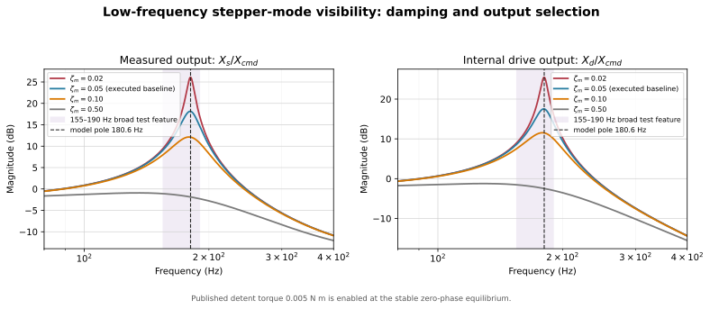

The global command-to-position model has a commutation-only pole of [[derived:mode_1_hz=167.70]] Hz, approximately

$$f_m\approx\frac{1}{2\pi}\sqrt{\frac{K_m}{m_d}}.$$

The executed $\zeta_m=0.10$ is a provisional electromagnetic damping assumption. Stage motion has weaker participation in this mode than the internal drive coordinate, so output selection can hide the feature. The local detent tangent instead sweeps [[derived:detent_band_low_hz=145.07]]–[[derived:detent_band_high_hz=205.14]] Hz with microstep phase; this is a local sensitivity band, not an additional global spring.

### F.2 Measurement evidence

The motor-excited chirps show a broad 155–190 Hz feature, but only the +1 kg up/down pair near 159–160 Hz cleared the report's local-floor criterion. Chirp normalization amplifies low-frequency noise, the second-pass impact analysis begins at 200 Hz, DitherV2 high-passes the range, and the fixed ~345 Hz feature was already flagged as probable chopper or measurement contamination. The data are compatible with the predicted 137–194 Hz band and 168 Hz pole, but do not identify detent phase or damping.

### F.3 Representability and required extensions

The 2-DOF transfer matrix has only two mechanical modal pairs. The rebuilt ten-DOF plant adds internal modes but still cannot independently represent every reported 256, 345, or 1007–1044 Hz feature. Friction may shift or damp existing poles; it cannot create a missing coordinate.

| Observed feature | Present interpretation | Required action |
|---|---|---|
| 155–190 Hz broad response | overlaps the 168 Hz global pole and local detent-tangent sweep | repeat with matched input/output and identify driver damping |
| 256 Hz weak candidate | insufficient evidence for a new plant pole | repeat with a reliable mount |
| ~345 Hz fixed notch | likely chopper/ambient contamination | do not fit as a mechanical mode |
| 592–614 Hz impact and 685–700 Hz chirp bands | different boundaries and transfer functions; the relative mode is plausible | acquire co-located FRFs |
| 1007–1044 Hz PLA-mounted peaks | likely payload/bracket or sensor-mount compliance | add a coordinate only after a mode-shape or mass-loading test |

The minimum defensible extension order is: first match the measured transfer function; then add a grounded base/support coordinate if the weakly payload-dependent low feature remains; then add payload/bracket compliance for a confirmed ~1 kHz mode; then identify current-controller and motor damping dynamics. Transverse or rocking coordinates require cross-axis evidence. This is a representability limit, not justification for arbitrary fitted resonances.


## Appendix G. Memory-experiment design and identification order

<a id="9-1-exact-1-16-microstep-commands"></a>
### G.1 Exact 1/16-microstep commands

One pre-distortion subdivision is

$$q_\mu=\frac{p_{step}}{n_\mu}.$$

The live derived value is [[derived:command_step=3.12500e-7]] m, or 312.5 nm at the production default.

After a 5 ms zero dwell, every listed level is held for [[derived:plateau_dwell=100.0]] ms. The builder computes

$$t_{detent}=\frac{4}{\zeta_m\omega_{min}},\qquad
t_{axial}=\frac{4}{\zeta_{ax}\omega_{ax}},\qquad
t_{dwell}=\max(100\ \mathrm{ms},t_{detent},t_{axial}),$$

where $\omega_{min}$ uses the softest local detent tangent. The live reduced estimates are [[derived:detent_settling_time_2pct=0.0464]] ms and [[derived:axial_settling_time_2pct=0.0583]] ms, the loss-factor branch gives [[derived:interface_settling_ms=71.7]] ms, and the measured relative-mode damping gives [[derived:measured_settling_ms=653.5]] ms. The dwell is the maximum over all of them together with the 100 ms floor, so it is currently governed by the **measured** branch at [[derived:plateau_dwell=653.5]] ms rather than by the floor. Resolving the damping question in [E.7](#e-7-measured-frf-identification) is what would shorten it; see [7.3](#7-3-dwell-consequence).

| Plateau | A/A2 guideway (microsteps) | B/B2 blocked nut (microsteps) | Purpose |
|---:|---:|---:|---|
| 1 | 0 | 0 | origin |
| 2 | +12 | +3 | positive outer reversal |
| 3 | +4 | +1 | first inner return level |
| 4 | +10 | +2 | nested reversal |
| 5 | +4 | +1 | revisit inner level |
| 6 | +12 | +3 | revisit outer level |
| 7 | 0 | 0 | close positive branch |
| 8 | -11 | -3 | negative outer reversal |
| 9 | -4 | -1 | second inner return level |
| 10 | -9 | -2 | nested reversal |
| 11 | -4 | -1 | revisit inner level |
| 12 | -11 | -3 | revisit outer level |
| 13 | 0 | 0 | final positive step back to the origin |

The guideway levels are +3.750/+3.125/+1.250 µm and -3.4375/-2.8125/-1.250 µm. **The one-microstep offset is applied to the outer and nested pairs only, and that is the whole of the rule.** Those are the pairs whose return points carry the nested-memory comparison, so exact mirroring there would let the positive and negative branches mask an asymmetry. The guideway inner pair is deliberately symmetric at ±1.250 µm, and every blocked-nut level is symmetric at ±0.9375, ±0.6250 and ±0.3125 µm, because the nut sequence has no headroom: its outer level must stay below the third yield distance, so a 312.5 nm offset on a 937.5 nm outer level would move it across a threshold rather than break a symmetry. The former half-microstep offset is not executable at 1/16. All commands use the nonlinear magnetic law and close at their starting command.


The reproducibility conditions omitted from the result captions are: one STEP/DIR quantum is 312.5 nm; the guideway peak friction is 2.090 N and the nut peak friction is 1.074 N; every plateau is 100 ms and every endpoint marker is a final-20-ms mean.

<a id="9-2-why-this-remains-presliding-while-still-activating-gms-memory"></a>
### G.2 Why this remains presliding while still activating GMS memory

For the first guideway GMS element, the zero-speed yield displacement predicted by the provisional parameters is

$$z_{y,1}=\frac{\nu_1F_s}{k_1}
=\frac{0.10(3.0)}{0.40(7.60\times10^5)}.$$

Its live value is [[derived:yield_g_1_fs=0.99]] µm.

The second guideway element yields at

$$z_{y,2}=\frac{0.20(3.0)}{0.30(7.60\times10^5)}.$$

Its live value is [[derived:yield_g_2_fs=2.63]] µm.

These thresholds are conditional on provisional `g_Fs`. At 1.2 N the four guideway thresholds become 0.39, 1.05, 2.37, and 6.32 µm: the 1.250 µm inner level then lies above threshold 2, while the 3.750 µm outer level crosses threshold 3. Recheck the command design whenever `g_Fs` changes.

The 3.7500 µm outer command crosses the nominal yield distances of two elements. The 1.250 µm inner level clears threshold 1 by 0.263 µm, rather than sitting 50 nm below it as a three-microstep command would. The generated force audit checks whether the aggregate interface remains below gross breakaway.

For the nut microslip site, the first three nominal yield deflections are [[derived:yield_n_1_fs=0.20]], [[derived:yield_n_2_fs=0.53]], and [[derived:yield_n_3_fs=1.20]] µm. A free stage follows most of a slow drive command, so the original free-stage B/B2 memory run produced too little differential motion and did **not** test those thresholds. In the corrected dedicated fixture, $x_s=0$ and the measured port coordinate is $x_d-x_s=x_d$. Its ±0.9375 µm outer command traverses the first two thresholds but remains 0.2625 µm below the third. This is the partial-slip region needed to distinguish $\sigma_{0,n}$ from conservative $k_{ax}$ instead of merely repeating the same small-signal spring or driving every element into slip.

At 1/16 microstepping the nut-port experiment has exactly three usable levels between the origin and the third yield threshold, and the command quantum of 312.5 nm is larger than the first yield distance of 0.200 µm. The nested-reversal structure is preserved but with no spare resolution: any downward revision of $F_{s,n}$, which moves all four thresholds proportionally, will push the outer level past the third threshold and invalidate the amplitude argument. The design is executable but not robust to parameter change.

This distinction matters. If every element stayed perfectly elastic, both laws would reduce almost to a spring and their loops would be indistinguishable. If every element entered gross sliding, the nested presliding memory would be erased. The chosen amplitude lies between those two uninformative limits for the current provisional parameters.


<a id="9-3-nonlocal-memory-mechanism-one-lugre-state-versus-four-gms-states"></a>
### G.3 Nonlocal-memory mechanism: one LuGre state versus four GMS states

LuGre compresses the guideway interface into one average bristle state $z_g$. At a given current $z_g$ and velocity it has no independent record of several earlier reversal points. It produces a local hysteresis loop, but nested minor-loop closure is not an independently stored property.

GMS carries four element-force states $F_{1,g},\ldots,F_{4,g}$ with different stiffnesses and yield thresholds. A reversal can unload one element while another remains on a different branch. The vector of retained states therefore depends on more than the latest displacement and preserves the order of prior extrema. This is the nonlocal memory being exercised when the +12/+10/+4 and -11/-9/-4 microstep levels are revisited.


<a id="9-5-detent-contamination-and-the-forced-identification-order"></a>
### G.4 Detent contamination and the forced identification order

**Measuring with the motor unpowered does not remove detent.** Detent is the unpowered cogging torque of the permanent-magnet rotor against the salient stator poles; it is present precisely when the phases are de-energized. It completes one cycle per full step, so at a 1 mm lead and 1.8° steps its spatial period is 5 µm. Reflected at 5 to 15% of the 60 mN·m holding torque it is 19 to 57 N, larger than every friction term on the drive port combined, and any breakaway or constant-torque measurement that does not cancel it folds most of it into `d_Fs`.

Three methods cancel it, in order of preference:

1. **Bidirectional averaging at matched rotor positions.** Detent is an odd function of position and even in the direction of travel; friction is the reverse. At the same rotor angle $\theta$, $T_+(\theta)=T_{fric}+T_{det}(\theta)$ and $T_-(\theta)=-T_{fric}+T_{det}(\theta)$, so $T_{fric}=(T_+-T_-)/2$ and $T_{det}(\theta)=(T_++T_-)/2$. This needs no disassembly and returns both quantities from one dataset.
2. **Constant-velocity sweep averaged over an integer number of full steps.** Detent has zero mean over one full-step period; friction does not. Average the drive effort over $N$ complete 5 µm intervals and the detent term cancels exactly.
3. **Motor-decoupled measurement.** Remove the coupling and measure screw, bearing, and nut drag alone, then the motor alone. This is the only method that also separates rotor-bearing drag from the rest, but it requires disassembly and loses the preload state if the bearing is disturbed.

**Velocity hazard for method 2.** Detent excites the structure at $v/5\ \mu\mathrm m$, so specific feedrates place it directly on a structural mode:

| Mode | Frequency source | Detent-resonant velocity | Avoid band, ±5% |
|---|---:|---:|---:|
| Drive pole | model: [[derived:route_p_f1=167.86]] Hz | [[derived:detent_velocity_drive=0.839]] mm/s | 0.797–0.881 mm/s |
| Axial mode | measured: 681–690 Hz | 3.405–3.450 mm/s | 3.235–3.623 mm/s |
| First eliminated mode | model: [[derived:first_discarded_hz=2001.95]] Hz | [[derived:detent_velocity_discarded=10.010]] mm/s | 9.509–10.511 mm/s |

The measured axial band, rather than the calibrated [[derived:route_p_f2=695.82]] Hz model target, is used for experiment planning. All three velocities sit inside the operating range. Stay outside the bands for friction sweeps, or enter them deliberately for modal excitation.

The 312.5 nm command jumps introduce a second, lower-speed hazard because the microstep pulse train excites the structure at $v/q_\mu$:

| Mode | Frequency | Microstep-ripple resonant velocity | Avoid band, ±5% |
|---|---:|---:|---:|
| Drive pole | model: [[derived:route_p_f1=167.86]] Hz | 52.5 µm/s | 49.8–55.1 µm/s |
| Axial mode | measured: 681–690 Hz | 212.8–215.6 µm/s | 202–226 µm/s |
| First eliminated mode | model: [[derived:first_discarded_hz=2001.95]] Hz | 625.6 µm/s | 594–657 µm/s |

The detent and microstep-ripple hazards are separated by a factor of 16 in velocity, so a sweep speed chosen to avoid one can land on the other. These feedrates are well inside the operating range and a quasi-static identification sweep would naturally traverse them; the corresponding 1/256 values were only 3.3, 13.5, and 39.1 µm/s.

At 1/16 there are 16 commanded samples per 5 µm detent cycle, so each microstep advances detent phase by 22.5°. Detent torque is no longer approximately constant across one microstep: the per-microstep position error gains a systematic full-step-period component that compounds with microstep nonlinearity and cannot be removed by averaging over full steps. This confound is assigned to the planned ablation rather than added to the present model.

**The identification order is forced by the port structure, not chosen for convenience.** As [8.1](#8-1-how-the-friction-laws-attach-to-the-plant) shows, $F_g$ and $F_d$ are near-perfectly correlated in steady motion while the nut port is silent:

1. **Guideway alone, before the screw is coupled.** Quasi-static ramp and reverse. This is the only configuration in which $F_g$ is observable by itself.
2. **Assembled axis, bidirectionally averaged constant-velocity sweep**, at a velocity away from the three resonant values above. Returns $F_g+F_d$; subtract step 1 to obtain $F_d$.
3. **Blocked-stage reversal experiments for the nut port**, against two already-known ports.

### G.5 Settled-force retention diagnostic

<!-- BEGIN GENERATED RETENTION DIAGNOSTIC -->
LuGre's plotted settled force sits near zero at every deflection in Section 9 while GMS holds up a substantial fraction. The mechanism is the `|v|` term in $\dot z=v-\sigma_0|v|z/s(v)$: it relaxes $z$ for as long as any velocity exists, and a plateau is not quiescent because every command edge rings the plant. The table below reports settled friction force at every plateau, using the identical 20 ms settled window as every other metric in this document.

**Guideway (A, A2): settled friction force versus plateau index**

| Plateau | Commanded level | LuGre A | GMS A2 |
|---:|---:|---:|---:|
| 1 | 0.0000 µm | 0.0000 N | 0.0000 N |
| 2 | +3.7500 µm | +0.0239 N | +0.6832 N |
| 3 | +1.2500 µm | -0.0477 N | -0.0830 N |
| 4 | +3.1250 µm | +0.0757 N | +0.7461 N |
| 5 | +1.2500 µm | -0.0644 N | -0.2003 N |
| 6 | +3.7500 µm | +0.0473 N | +0.7609 N |
| 7 | 0.0000 µm | -0.0087 N | -0.1821 N |
| 8 | -3.4375 µm | -0.0286 N | -0.6725 N |
| 9 | -1.2500 µm | +0.0553 N | +0.0666 N |
| 10 | -2.8125 µm | -0.1108 N | -0.7427 N |
| 11 | -1.2500 µm | +0.0773 N | +0.1153 N |
| 12 | -3.4375 µm | -0.0525 N | -0.8270 N |
| 13 | 0.0000 µm | +0.0051 N | +0.1137 N |

**A2's settled force changes sign inside the positive branch.** Plateau 2 holds +0.683 N at +3.7500 µm, and plateau 3 holds -0.083 N at +1.2500 µm, both at positive commanded levels. That is the nested-return signature in raw digits: on the inner return the elements that yielded on the way out are reloaded in the opposite direction, so the stack unloads past zero while the command is still positive. LuGre A changes sign at the same pair, but its whole column stays within 0.111 N of zero, so that sign is the post-edge relaxation residue of a single bristle rather than a held return-point state; the retention gap in [9.1](#9-1-guideway-result) is the same observation stated as a fraction.


**Blocked nut (B, B2): settled friction force versus plateau index**

| Plateau | Commanded level | LuGre B | GMS B2 |
|---:|---:|---:|---:|
| 1 | 0.0000 µm | 0.0000 N | 0.0000 N |
| 2 | +0.9375 µm | +0.0003 N | +0.3054 N |
| 3 | +0.3125 µm | -0.0080 N | -0.0372 N |
| 4 | +0.6250 µm | +0.0485 N | +0.2532 N |
| 5 | +0.3125 µm | -0.0441 N | -0.0620 N |
| 6 | +0.9375 µm | +0.0066 N | +0.4028 N |
| 7 | 0.0000 µm | -0.0014 N | -0.0772 N |
| 8 | -0.9375 µm | -0.0004 N | -0.3047 N |
| 9 | -0.3125 µm | +0.0080 N | +0.0385 N |
| 10 | -0.6250 µm | -0.0485 N | -0.2518 N |
| 11 | -0.3125 µm | +0.0441 N | +0.0633 N |
| 12 | -0.9375 µm | -0.0066 N | -0.4015 N |
| 13 | 0.0000 µm | +0.0014 N | +0.0785 N |

**B2 shows the same sign change on this fixture.** Plateau 2 holds +0.305 N at +0.9375 µm, and plateau 3 holds -0.037 N at +0.3125 µm, both at positive commanded levels. The mechanism is the one stated under the guideway table.


LuGre's column stays within 0.111 N of zero at every plateau at both sites, while GMS's column tracks the commanded deflection up to 0.827 N. **The mechanism is confirmed**: this is not a plotting artifact, LuGre's column genuinely holds almost nothing.

#### Demoted ablation and branch diagnostics

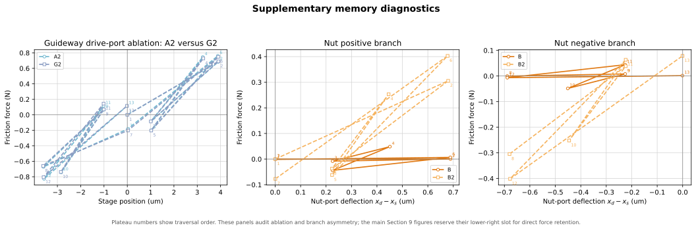

The A2/G2 ablation and the nut positive/negative branch split remain available here as confirmation diagnostics. The parallel main figures use the freed panel for the direct settled-force retention comparison.

#### High-damping confirmation run

The retained-mode pole at baseline structural damping sits at 729.0 Hz with $\zeta_2=0.01507$, decaying with $\tau=14.49$ ms (envelope to 5%: 43.5 ms) — far longer than the millisecond-scale bristle relaxation time computed in 9.3, which is why the ringing wipes the bristle before the settled window opens. Scaling $c_{ax}$ and $c_m$ by 50$\times$ raises the same pole to $\zeta_2=0.74264$, $\tau=0.29$ ms, envelope to 5% in 0.88 ms — ringing now dies within about a millisecond.

Rerunning the guideway A/A2 experiment at this damping, with everything else unchanged:

| Plateau | Commanded level | LuGre A (baseline damping) | LuGre A (ringing suppressed) | GMS A2 (ringing suppressed) |
|---:|---:|---:|---:|---:|
| 1 | 0.0000 µm | 0.0000 N | 0.0000 N | 0.0000 N |
| 2 | +3.7500 µm | +0.0239 N | +1.8025 N | +1.7482 N |
| 3 | +1.2500 µm | -0.0477 N | -0.5393 N | -0.0834 N |
| 4 | +3.1250 µm | +0.0757 N | +0.9213 N | +1.4697 N |
| 5 | +1.2500 µm | -0.0644 N | -0.6893 N | -0.0834 N |
| 6 | +3.7500 µm | +0.0473 N | +1.1370 N | +1.7482 N |
| 7 | 0.0000 µm | -0.0087 N | -1.3373 N | -0.5098 N |
| 8 | -3.4375 µm | -0.0286 N | -2.2709 N | -1.6804 N |
| 9 | -1.2500 µm | +0.0553 N | +0.0788 N | +0.0212 N |
| 10 | -2.8125 µm | -0.1108 N | -1.0215 N | -1.2848 N |
| 11 | -1.2500 µm | +0.0773 N | +0.3938 N | +0.0212 N |
| 12 | -3.4375 µm | -0.0525 N | -1.1662 N | -1.6804 N |
| 13 | 0.0000 µm | +0.0051 N | +1.2040 N | +0.4466 N |

With ringing suppressed, LuGre's settled force recovers from a mean 0.0583 N over the nonzero plateaus to 1.0020 N — 17.2$\times$ larger, comparable to or exceeding GMS at the same raised damping. **The dither-driven relaxation mechanism is confirmed from both directions**: it is present when ringing is left alone and it disappears when ringing is suppressed.

#### Continuous presliding loop

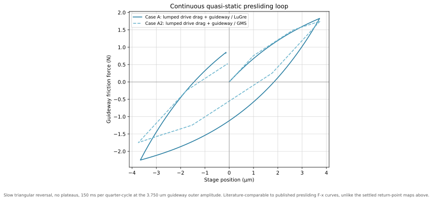

A slow continuous triangular ramp-reversal, no plateaus, at the guideway outer amplitude. Unlike the settled return-point maps in 9.1, this is a literature-comparable presliding $F$-$x$ loop and is the signal a quasi-static Kistler identification sweep will actually produce.
<!-- END GENERATED RETENTION DIAGNOSTIC -->

## Appendix H. Full friction-case response audit

The complete Bode view and ten-case metric dump support Section 10 without competing with its retained-mode result.

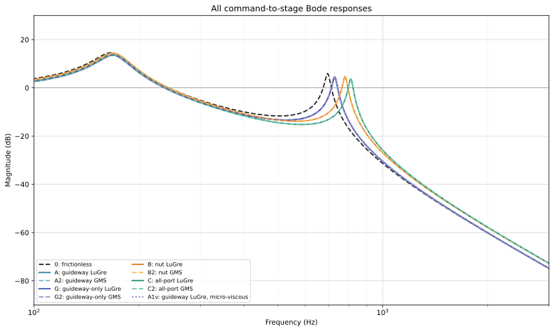

<!-- BEGIN GENERATED FULL RESPONSE SUMMARY -->
| Case | Friction law | Global-linear modes (Hz) | Local tangent gain $X_s/X_{cmd}$ | Smallest first-yield travel | First-step overshoot | Settled RMS deviation | Settled maximum | All-time peak | Final-window RMS |
|---|---|---:|---:|---:|---:|---:|---:|---:|---:|
| 0 | none | 167.9, 695.8 | 1.00000 | not applicable | 41.0% | 160.6 nm | 234.4 nm | 1147.8 nm | 0.1 nm |
| A | LuGre | 170.5, 729.1 | 0.88275 | 0.583 µm | 26.6% | 172.4 nm | 261.2 nm | 1170.1 nm | 20.6 nm |
| A2 | GMS | 170.5, 729.1 | 0.88275 | 0.583 µm | 25.8% | 215.7 nm | 358.7 nm | 1210.5 nm | 16.2 nm |
| G | LuGre | 168.4, 729.1 | 0.90498 | 0.987 µm | 28.7% | 171.0 nm | 258.0 nm | 1167.9 nm | 18.8 nm |
| G2 | GMS | 168.4, 729.1 | 0.90498 | 0.987 µm | 28.1% | 207.7 nm | 339.3 nm | 1201.7 nm | 12.0 nm |
| B | LuGre | 170.0, 780.9 | 0.97530 | 0.200 µm | 38.4% | 161.3 nm | 235.9 nm | 1148.9 nm | 1.1 nm |
| B2 | GMS | 170.0, 780.9 | 0.97530 | 0.200 µm | 38.3% | 168.4 nm | 253.7 nm | 1157.0 nm | 4.5 nm |
| C | LuGre | 170.5, 810.6 | 0.89928 | 0.200 µm | 27.5% | 173.9 nm | 265.2 nm | 1173.6 nm | 22.3 nm |
| C2 | GMS | 170.5, 810.6 | 0.89928 | 0.200 µm | 27.0% | 207.2 nm | 341.2 nm | 1200.6 nm | 13.6 nm |
| A1v | LuGre | 170.5, 729.1 | 0.88275 | 0.583 µm | 26.5% | 172.5 nm | 261.5 nm | 1170.4 nm | 20.8 nm |

The displayed modes and gains are the global commutation linearization; periodic detent is excluded from the global stiffness matrix. The friction tangent is local and valid only below the listed first-yield travel. The nonlinear cases include periodic detent torque and use a 100 ms dwell. Settled values collect the last 20 ms of every plateau. All deviation columns use $d(t)=x_{cmd}(t)-x_s(t)$ and describe open-loop modeled plant behavior, not servo tracking.

The first-yield travel independently checks the ablation: A/A2 begins at 0.583 µm on the drive port, whereas G/G2 begins at 0.987 µm on the guideway after the drive port is removed.
<!-- END GENERATED FULL RESPONSE SUMMARY -->

## 7. Full-versus-reduced verification

<!-- BEGIN GENERATED SECTION 7 TAKEAWAY -->
<div class="section-takeaway">
**Answers.** Can [[derived:section7_reduced_coordinate_count=2]] coordinates stand in for [[derived:section7_full_coordinate_count=10]]?

**The number.** [[derived:section7_rms_pct=1.99]]% command RMS, or [[derived:section7_rms_nm=99.6]] nm.

**Why it matters.** About [[derived:section7_drive_share_pct=74.9]]% of the residual is removed by correcting a [[derived:section7_drive_pole_error_pct=0.54]]% drive-pole error, versus [[derived:section7_frequency_share_pct=15.0]]% from retained-frequency alignment and [[derived:section7_damping_share_pct=0.5]]% from damping. Coordinate truncation dominates.

**What it is not.** Model agreement is not hardware accuracy.
</div>
<!-- END GENERATED SECTION 7 TAKEAWAY -->

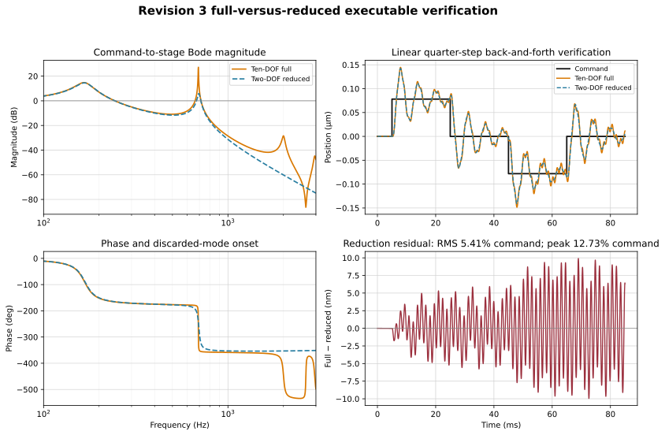

The comparison is deliberately global-linear and frictionless so that it isolates structural reduction from friction memory and the position-dependent detent tangent. Both models receive the same zero-order-held sequence: 0 → +5 µm → 0 → −5 µm → 0. This is one physical full-step pitch and ends at its starting level. Because the audit is linear, changing from one 1/16 pre-distortion subdivision to one full step scales all displacements by 16 while leaving the normalized reduction error unchanged.

The full model includes every discarded internal resonance, including modes above the 3 kHz plot limit. This is a reduction and numerical-convergence check, not independent modal validation or a nonlinear actuator prediction. The same [[derived:route_p_f2=695.82]] Hz calibration target sets $k_{ax}$ and is then reproduced approximately by the reduced model; that target is selected rather than measured, and the measured band is 681–690 Hz. See [Appendix A](#appendix-a-position-dependent-axial-stiffness) for the carriage-position stiffness sweep.

<!-- BEGIN GENERATED REDUCTION CONVERGENCE -->
### 7.1 Solver convergence

The time-domain comparison now uses the physical 5.000 µm full-step pitch. Because both verification plants are linear, this rescales the displacement and residual in nanometres but does not change the normalized RMS or peak percentages.

| RK4 step $h$ | Points/cycle at 2002.0 Hz | Maximum $\lvert R(h\lambda)\rvert$ | Result | RMS residual | Peak residual |
|---:|---:|---:|---|---:|---:|
| 25.00 µs | 20.0 | 2.882548 | **unstable** | not reportable | not reportable |
| 12.50 µs | 40.0 | 0.999283 | stable | 99.567 nm (1.99134%) | 245.618 nm (4.91237%) |
| 6.25 µs | 79.9 | 0.999642 | stable | 99.570 nm (1.99140%) | 245.619 nm (4.91238%) |
| 2.50 µs | 199.8 | 0.999857 | stable | 99.572 nm (1.99144%) | 245.619 nm (4.91238%) |

The 25 µs result is not a coarse but usable answer: it is mathematically unstable **for this ten-DOF state matrix**, which is a different plant from the two-DOF nonlinear campaign of [12.1](#12-1-gms-step-halving-convergence) where 25 µs is the production step. The unplotted full model reaches 21.32 kHz, and the largest RK4 amplification magnitude is greater than one. The 12.5, 6.25, and production 2.5 µs results converge to the same output residual, so the inter-edge growth below is not integration drift.

Both static gains are unity to numerical precision ($G_{full}(0)=1.000000000000$ and $G_{red}(0)=1.000000000000$), and the residual is zero before the first edge. The four successive inter-edge peak magnitudes are 191.0, 213.0, 225.4, 245.6 nm. The strongest residual spectral energy is near 162.5 Hz; the visibly faster ripple is near 2012.4 Hz.

The residual is not explained by the 2002.0 Hz ripple alone. That full-model mode has $\zeta=0.01257$ and retains only 4.2% of its amplitude over the 20 ms edge spacing. It is also the pole that sets the timescale-separation ratio used in [Appendix E.8.2](#e-8-equivalence-proofs-and-error-bounds): $(695.82/2002.0)^2=0.121$. The retained upper mode carries some of the rest: the full model has 690.9 Hz with $\zeta_2=0.01321$ against the reduced model's 695.8 Hz with $\zeta_2=0.01569$, the two damping ratios differing by 19%. The two plants now agree about how fast that mode decays, so what remains is not a damping inconsistency.

The peaks still climb, by a factor of 1.29 across the four edges, and no single-mode carryover argument reproduces that. The upper mode retains 31.8% of its amplitude over the 20 ms edge spacing, which would cap the accumulation at 1.47; the drive pole, which the per-plant audit below identifies as the dominant residual line, retains only 12.8% at $\zeta_1=0.0981$ and would cap it at 1.15. Matching the observed 1.29 from the drive pole alone would need $\zeta_1\approx0.072$ against the executed 0.0981. The growth is therefore bounded and modest but is not attributed to one mode here: it is a difference signal between two plants whose poles differ in frequency as well as amplitude, and a scalar carryover argument does not apply to it.

### 7.2 Per-plant residual audit

Every Section 6 candidate is driven with the same command and differenced against the same ten-DOF stage output at the **ten-DOF verification step of 2.5 µs**. The two-DOF nonlinear campaign runs at its own production step of 25 µs; the two are different plants with different stability limits and neither number is "the" production step. The damping question and the truncation question are then separated by measurement instead of inference.

| Reduced plant | Coordinates | Damping basis | $f_1$ (Hz) | $\zeta_1$ | $f_2$ (Hz) | $\zeta_2$ | RMS residual | Peak residual |
|---|---:|---|---:|---:|---:|---:|---:|---:|
| Formal static condensation | 2 | assumed 55 N·s/m link damper | 167.86 | 0.0998 | 695.82 | 1.569e-02 | 99.572 nm (1.991%) | 245.619 nm (4.912%) |
| Frequency-domain complex stiffness | 2 | interface loss factors propagated to $c_{ax}$ | 167.86 | 0.0998 | 695.85 | 1.340e-02 | 99.089 nm (1.982%) | 251.255 nm (5.025%) |
| Measured-FRF identification | 2 | 0.600 kg modal mass and measured $\zeta$ | 167.70 | 0.0997 | 697.90 | 1.552e-03 | 156.051 nm (3.121%) | 412.222 nm (8.244%) |
| Craig–Bampton, condensed to two coordinates | 2 | Craig–Bampton frequency and damping, two coordinates | 167.86 | 0.0998 | 691.74 | 1.345e-02 | 84.601 nm (1.692%) | 195.971 nm (3.919%) |
| Craig–Bampton, three coordinates | 3 | damping projected from the ten-DOF matrices | 166.97 | 0.0981 | 691.74 | 1.334e-02 | 10.039 nm (0.201%) | 22.946 nm (0.459%) |
| **Ten-DOF reference** | 10 | element-wise $\eta_j$ | **166.95** | **0.0981** | **690.87** | **1.321e-02** | - | - |

Every plant in the table has unity static gain, so none of the residual is a compliance error.

Damping assignment is now nearly irrelevant to the residual. The executed plant and the interface-propagated plant differ in $\zeta_2$ by only a factor of 1.17, and their RMS residuals differ by 0.5%. The measured-mass plant is the exception at 57% worse, and it is worse precisely because its $\zeta_2$ is set by the separately assumed measured relative damping rather than by the interface loss factors, leaving it an order of magnitude underdamped against the ten-DOF plant. Coordinate content does the rest: the 2-DOF plant rebuilt at the Craig-Bampton frequency of 691.74 Hz drops the RMS residual to 84.6 nm, and restoring one eliminated coordinate drops it to 10.0 nm, a factor of 9.9 below the executed plant.

**With the damping question removed, coordinate truncation is what is left.** Every two-coordinate plant that carries a defensible damping value lands within 0.5% of the same residual, and only adding a coordinate moves it, by a factor of 9.9. This is the measurement behind the [Section 6.3](#6-3-reduction-evidence) row, and it is now a clean one-variable result rather than an inference drawn across two confounded variables.

**The $f_1$ column locates the error, and it is not where the section previously looked.** The strongest residual line has moved to 162.5 Hz, near the drive pole rather than near the axial mode. Every two-coordinate plant places that pole at 167.86 Hz against the ten-DOF value of 166.95 Hz, a 0.54% error that static condensation cannot remove because it is a dynamic-participation effect, not a static-stiffness one. Restoring one fixed-interface coordinate corrects it to 166.97 Hz, within 0.007%. The decomposition is therefore explicit: damping assignment is worth 0.5%, aligning the upper mode is worth 15%, and correcting the drive pole is worth a further 75%; the last 10% is removed by none of the three and is the residual the three-coordinate plant still carries. This also prices the one assumption that [E.3](#e-3-direct-series-compliance-reduction) could previously only bound: dropping the eliminated axial inertia costs half a percent on the drive pole, and that half percent is now the largest single term in the reduction residual.

### 7.3 Dwell consequence

The ten-DOF upper mode now implies a 2% settling time of 69.8 ms, against 58.3 ms for the reduced plant. [Section 10](#10-friction-case-responses-and-generated-summary) runs its nonlinear campaign on a 100 ms plateau dwell, set by the maximum of the 100 ms floor, the 46.4 ms detent-softened drive estimate, and the 58.3 ms reduced axial-mode estimate. That floor is adequate: it exceeds the axial-mode settling time by a factor of 1.4, so the settled-window statistics are collected after the 691 Hz mode has decayed. The earlier finding that the dwell was short by a factor of six was a consequence of the understated interface loss factors and does not survive their correction.

### 7.4 Reading the trajectory

The large oscillation is expected **inside this deliberately frictionless, global-linear audit**, but it is not a quantitative prediction of a real repeated full-step move. One full step changes the electrical equilibrium by 1.571 rad (90°). Applying the small-signal magnetic tangent across that entire jump initially requests 1.571 times the sinusoidal force limit. The ideal zero-rise-time edge also injects energy into every retained and discarded mode, while friction, detent nonlinearity, current-loop bandwidth, current rise, and torque saturation are absent.

Accordingly, the top-right panel should be read as an amplitude-scaled structural comparison: do the two mathematical plants react alike to the same broadband edge? A physically predictive full-step trajectory requires applying the nonlinear magnetic force and driver/current dynamics to the full-order plant. The normalized reduction residual remains useful, but the absolute overshoot in this linear panel should not be interpreted as expected stage motion.
<!-- END GENERATED REDUCTION CONVERGENCE -->

## 8. Friction constitutive laws

<!-- BEGIN GENERATED SECTION 8 TAKEAWAY -->
<div class="section-takeaway">
**Answers.** Where do the friction laws attach, and what can the current model distinguish?

**The number.** [[derived:friction_port_count=3]] ports; [[derived:gms_states_per_site=4]] GMS states per site versus [[derived:lugre_states_per_site=1]] LuGre state.

**Why it matters.** There are [[derived:structural_identifiability_result_count=2]] structural identifiability results: rotor/drive drag cannot be separated, and $k_{ax}$ versus $\sigma_{0,n}$ cannot be separated in small signal.

**What it is not.** Provisional does not mean nothing is identified.
</div>
<!-- END GENERATED SECTION 8 TAKEAWAY -->

### 8.1 How the friction laws attach to the plant

The plant is the two-DOF reduced model with mechanical state $[x_d,x_s,\dot x_d,\dot x_s]$. Each friction site is a scalar port defined by a row $\mathbf H_\alpha$ that maps plant velocity to a single sliding velocity, and the site force is applied back as $-\mathbf H_\alpha^TF_{f,\alpha}$. The constitutive law inside the port is interchangeable: LuGre carries one state per site, GMS carries four.

$$\dot{\mathbf x}=\begin{bmatrix}\dot x_d\\\dot x_s\end{bmatrix},\qquad
v_\alpha=\mathbf H_\alpha\dot{\mathbf x},\qquad
\mathbf Q_{f,\alpha}=-\mathbf H_\alpha^TF_{f,\alpha},\qquad
\mathbf H_g=[0,1],\ \mathbf H_n=[1,-1],\ \mathbf H_d=[1,0].$$

| Site | Row $\mathbf H_\alpha$ | Driving velocity $v_\alpha$ | Applied generalized force | Active cases |
|---|---|---|---|---|
| Guideway $g$ | $[0,1]$ | $\dot x_s$ | $[0,-F_{f,g}]^T$ | A, A2, G, G2, C, C2, A1v |
| Nut microslip $n$ | $[1,-1]$ | $\dot x_d-\dot x_s$ | $[-F_{f,n},+F_{f,n}]^T$ | B, B2, C, C2 |
| Lumped drive side $d$ | $[1,0]$ | $\dot x_d$ | $[-F_{f,d},0]^T$ | A, A2, B, B2, C, C2, A1v |

Case 0 activates none of the friction ports. G/G2 are the drive-port ablation of A/A2; A1v has A's placement but restores the former LuGre micro-viscous term. The minus-transpose rule guarantees dissipated power $\dot{\mathbf x}^T(-\mathbf H^TF_f)=-vF_f\le0$ when the constitutive force opposes motion. [Appendix B](#appendix-b-reduced-model-bond-graph) draws the same rows as power bonds and [E.4](#e-4-bond-graph-reduction) names the junction each one sits on; the rows are not repeated anywhere else.

> **Standing constraint: the lead-screw transformer carries no efficiency term.** All lead-screw losses are represented by the drive-port law $F_{f,d}$ acting on $\dot x_d$. Introducing an efficiency multiplier into the transformer would represent the same dissipation twice and would corrupt every identified friction parameter. `eta_screw` exists only to *estimate* $F_{s,d}$ in [8.3](#8-3-executed-provisional-friction-values), and for nothing else.

<details>
<summary>What physically sits on each port row</summary>

A reader cannot identify a parameter without knowing which hardware it stands for. Every contributor below names the parameter that carries it.

**Guideway port, $\mathbf H_g=[0,1]$, driven by $\dot x_s$.** Identified by case A/A2 in 9.4. No gravity term: the axis is horizontal.

| Contributor | Enters as | Where parametrised |
|---|---|---|
| Ball-raceway rolling resistance, four MNN9-G1 carriages at V1 preload | `g_Fc` | 8.3 friction table |
| Carriage seal and wiper drag | `g_Fc` | 8.3 |
| Ball recirculation entry and exit losses | `g_Fc` | 8.3 |
| Presliding microslip in the Hertzian ball-raceway contacts | `g_sigma0`, split into `g_k1..4` by `gms_nu1..4` | 8.3, yield distances in 8.3 |
| Stribeck rise from boundary to mixed lubrication | `g_Fs`, `g_vs`, `stribeck_delta` | 8.3 |
| Lubricant shear in the raceways | `g_sigma2` | 8.3 |
| Drag from any cabling routed to the moving stage | `g_Fc` | 8.3, not separately identified |

**Nut microslip port, $\mathbf H_n=[1,-1]$, driven by $\dot x_d-\dot x_s$.** Identified by case B/B2 in 9.4.

| Contributor | Enters as | Where parametrised |
|---|---|---|
| Partial slip inside the ball-raceway contact ellipses before gross rolling begins | `n_sigma0`, split into `n_k1..4` | 8.3 |
| Nonlocal presliding memory across the four element yield thresholds | `gms_nu1..4`, yield distances $d_{i,n}$ | 8.3 |
| Stribeck level bounding the microslip force | `n_Fs`, `n_Fc`, `n_vs` | 8.3 |
| Micro-viscous and lubricant shear across the port | `n_sigma2` | 8.3 |

*Explicitly not on this row.* The gross rolling resistance of the screw is on $\mathbf H_d$. The axial elastic compliance of the screw shaft and support is $k_{ax}$, which is conservative and is not a friction term at all; $\sigma_{0,n}$ and $k_{ax}$ are indistinguishable at small signal, which is why the blocked-stage fixture in [Section 9](#9-force-instrumented-partial-slip-memory-experiment) exists.

**Drive port, $\mathbf H_d=[1,0]$, driven by $\dot x_d$.** No case isolates this port: A/A2 excites $d$ together with $g$, and B/B2 excites $d$ together with $n$.

| Contributor | Enters as | Where parametrised |
|---|---|---|
| Preloaded ball-nut drag torque, from the zero-axial-play "O" designation. Dominant term | `d_Fs`, `d_Fc` | 8.3, magnitude derived there |
| Barden duplex angular-contact pair preload starting torque | `d_Fs` | 8.3 |
| Motor rotor bearings, two per motor | `d_Fs` | 8.3 |
| Nut seal and wiper drag against the screw | `d_Fc` | 8.3 |
| Screw ball recirculation losses | `d_Fc` | 8.3 |
| Motor iron losses: eddy-current and hysteresis drag, velocity proportional | `d_sigma2` | 8.3, currently no stated basis |
| Lubricant churning in the nut and bearings | `d_sigma2` | 8.3 |
| Presliding of the bearing and nut contacts before gross rotation | `d_sigma0`, split into `d_k1..4` | 8.3 |

*Explicitly not on this row.* Detent torque is conservative and position dependent, is modeled separately, and must not be folded into `d_Fs`; see [9.5](#9-5-detent-contamination-and-the-forced-identification-order). The applied magnetic force is a source term, not a friction term: both act on $x_d$, but one injects power and the other removes it.

*Merged laws.* The former rotor-drag law $F_{f,r}$ and $F_{f,d}$ shared this row and were perfectly correlated. They are one law now; the table still names both physical groups so a reader can price them separately when identifying.

</details>

A third structural identifiability result follows from the rows, and it constrains the experiment rather than the model. In steady motion $\dot x_d=\dot x_s$, so the guideway and drive ports see the same velocity and the drive must overcome their sum: $F_g$ and $F_d$ are near-perfectly correlated in any constant-velocity or rigid-body experiment. Transients separate them in principle, but the difference is micrometre scale and poorly conditioned, so separation requires measuring the guideway in isolation before the screw is coupled. The useful half of the same observation is that in steady motion the nut-port velocity $\dot x_d-\dot x_s$ is *exactly* zero, because the elastic deformation is constant and every nut element is stuck. Constant-velocity sweeps therefore identify $F_g+F_d$ with the nut port silent, and reversal experiments identify the nut port against two already-known ports. This is also why the [12.2](#12-2-gms-branch-selection-census) census records zero threshold flips at the nut site.

What RK4 advances:

| Block | States | Count |
|---|---|---|
| Mechanical | $x_d$, $x_s$, $\dot x_d$, $\dot x_s$ | 4 |
| LuGre site, cases A/B/C | $z_\alpha$ | 1 per active site |
| GMS site, cases A2/B2/C2 | $F_1\ldots F_4$ per site | 4 per active site |

<div class="live-equation" data-live-equation="friction-port-summary">Live friction-port summary loads in the browser.</div>

Friction states are integrated together with the mechanical states in the same RK4 vector; the memory is never evaluated afterward as a plotting correction. Cases A/A2 activate $d,g$; B/B2 activate $d,n$; C/C2 activate all three identifiable sites; case 0 has no friction state.

<details>
<summary>Two structural consequences of the rows, and what the choice of law changes</summary>

$F_{f,r}$ and the former $F_{f,d}$ shared the row $[1,0]$ and were therefore perfectly correlated in every experiment this reduced model supports, so they are now one identifiable drive-side law $F_{f,d}$; physical bookkeeping may still name the sources, but the case map does not claim to separate them. For the same structural reason the presliding tangent cannot separate $k_{ax}$ from $\sigma_{0,n}$, because both enter the differential stiffness as the identical outer product $[1,-1]^T[1,-1]$ — separation needs finite-amplitude B/B2 reversal data, where microslip yields and dissipates while $k_{ax}$ stays conservative.

Choosing LuGre or GMS inside a port changes the reversal loop and the settled error while leaving the small-signal stiffness, and therefore the modal frequencies, nearly unchanged: GMS retains non-local memory through separately yielding elements, LuGre has one local bristle state. Friction can add damping at some amplitudes but can also produce stick–slip, lost motion, amplitude-dependent apparent stiffness, and nonzero final error, none of which is inferable from the linear Bode curve.

</details>

### 8.2 Constitutive laws

At each active site the Stribeck level is

$$s(v)=F_c+(F_s-F_c)\exp\left[-\left|v/v_s\right|^\delta\right].$$

<details>
<summary>LuGre derivation used in A, B, and C</summary>

The average bristle displacement $z$ evolves as

$$\dot z=v-\sigma_0\frac{|v|}{s(v)}z,$$

and the friction output is

$$F_f=\sigma_0z+\sigma_1\dot z+\sigma_2v.$$

Near rest, $\dot z\approx v$ and $F_f\approx\sigma_0z+(\sigma_1+\sigma_2)v$, so the frequency-response linearization adds $\sigma_0$ stiffness and $\sigma_1+\sigma_2$ damping along the site’s velocity vector.

</details>

<details>
<summary>GMS derivation and corrected slip-attractor sign used in A2, B2, and C2</summary>

Four parallel elements carry force states $F_i$. While an element sticks,

$$\dot F_i=k_iv,\qquad |F_i|\lt\nu_i s(v).$$

Once it yields in the current direction, the stable slip branch is

$$\boxed{\dot F_i=C\left[\operatorname{sgn}(v)-\frac{F_i}{\nu_i s(v)}\right]}.$$

Its equilibrium is $F_i=\operatorname{sgn}(v)\nu_i s(v)$ and the derivative points back toward that equilibrium on either velocity sign. Writing an extra $\operatorname{sgn}(v)$ outside the entire bracket makes the negative-velocity branch repelling; that was the sign defect corrected in the Revision 2 work and is not repeated here.

The output is

$$F_f=\sum_{i=1}^{4}F_i+\sigma_2v.$$

The element force fractions and stiffnesses are normalized so that

$$\boxed{\sum_{i=1}^{4}\nu_i=1},\qquad
\boxed{\sum_{i=1}^{4}k_i=\sigma_0}.$$

The builder verifies both identities before any simulation or rendering starts. It aborts rather than silently renormalizing an inconsistent parameter set. Therefore the element breakaway forces sum to the site Stribeck force and the stuck elements sum to the specified aggregate presliding stiffness.

On reversal the affected element returns to the stuck branch. Different $k_i$ and $\nu_i$ create different yield distances and preserve non-local presliding memory.

<details>
<summary>Exact re-stick test and derivative-evaluation ordering</summary>

Every Runge–Kutta evaluation first forms $v_g=\dot x_s$, $v_n=\dot x_d-\dot x_s$, and $v_d=\dot x_d$ from the current mechanical velocities, then advances each active site's law and applies its force through the row of [8.1](#8-1-how-the-friction-laws-attach-to-the-plant).

Each GMS call is evaluated from the **current Runge–Kutta trial state** in this order:

1. Read the current site velocity $v$ and element forces $F_i$; compute $s(v)$, the thresholds $\nu_i s(v)$, and $k_i$.
2. If $|v|\le10^{-14}$ m/s, hold every element state with $\dot F_i=0$. No branch transition is inferred from a zero-velocity sign.
3. Otherwise evaluate the reversal/re-stick predicate **before assigning a derivative**: $vF_i\le0$. If true, select the stuck derivative $\dot F_i=k_iv$.
4. If it is not a reversal, test the current-state yield condition $|F_i|\lt\nu_i s(v)$. A sub-threshold element also receives $\dot F_i=k_iv$.
5. Only when neither test is true is the stable slip-attractor derivative evaluated.
6. Compute the friction output from the unadvanced trial-state forces, $F_f=\sum_iF_i+\sigma_2v$, and return all derivatives to RK4. RK4 then forms its next trial state and repeats every test.

Thus a derivative never selects its own branch during the same evaluation. There is no event localization at the threshold crossing. Branch switching uses the RK trial grid, so Section 12 includes a time-step check.

</details>

</details>

### 8.3 Executed provisional friction values

Element yield distances $d_i=\nu_i s/k_i$ make the parameter table readable without a calculator. Values are µm and update live.

| Site | Level | $d_1$ | $d_2$ | $d_3$ | $d_4$ | $d_4/d_1$ | $F_s/\sigma_0$ |
|---|---|---:|---:|---:|---:|---:|---:|
| Guideway $g$ | $s=F_s$ | [[derived:yield_g_1_fs=0.99]] | [[derived:yield_g_2_fs=2.63]] | [[derived:yield_g_3_fs=5.92]] | [[derived:yield_g_4_fs=15.79]] | [[derived:yield_span_g=16.0]] | [[derived:static_deflection_g=3.95]] |
| Guideway $g$ | $s=F_c$ | [[derived:yield_g_1_fc=0.79]] | [[derived:yield_g_2_fc=2.11]] | [[derived:yield_g_3_fc=4.74]] | [[derived:yield_g_4_fc=12.63]] | | |
| Nut microslip $n$ | $s=F_s$ | [[derived:yield_n_1_fs=0.20]] | [[derived:yield_n_2_fs=0.53]] | [[derived:yield_n_3_fs=1.20]] | [[derived:yield_n_4_fs=3.20]] | [[derived:yield_span_n=16.0]] | [[derived:static_deflection_n=0.80]] |
| Nut microslip $n$ | $s=F_c$ | [[derived:yield_n_1_fc=0.15]] | [[derived:yield_n_2_fc=0.40]] | [[derived:yield_n_3_fc=0.90]] | [[derived:yield_n_4_fc=2.40]] | | |
| Drive side $d$ | $s=F_s$ | [[derived:yield_d_1_fs=0.58]] | [[derived:yield_d_2_fs=1.56]] | [[derived:yield_d_3_fs=3.50]] | [[derived:yield_d_4_fs=9.33]] | [[derived:yield_span_d=16.0]] | [[derived:static_deflection_d=2.33]] |
| Drive side $d$ | $s=F_c$ | [[derived:yield_d_1_fc=0.46]] | [[derived:yield_d_2_fc=1.22]] | [[derived:yield_d_3_fc=2.75]] | [[derived:yield_d_4_fc=7.33]] | | |

The guideway's fourth element does not yield until 15.8 µm, more than three full steps at the 5 µm pitch. For single-step and few-step moves elements 3 and 4 never reach gross slip, so the simulated output is dominated by presliding. Two consequences follow. This supports the premise that presliding compensation is the relevant mechanism for this axis. And $F_c$ and $v_s$ are close to unidentifiable from single-step data, because no part of that data reaches the gross-sliding branch, so identification requires a separate constant-velocity sweep.

The yield span $d_4/d_1$ is 16.0 at every site because the $\nu_i$ and $k_i$ ratios are exact mirrors, $[0.10,0.20,0.30,0.40]$ against $[0.40,0.30,0.20,0.10]$. **That identical span is a construction convenience, not a physical property of three different contacts**: a rolling guideway and a preloaded ball nut have no reason to share a normalized presliding shape, and breaking the mirror at any one site would give it a different span without changing anything else in the model. A spread of this order is what gives the Maxwell-slip stack distinct yield points; a spread near unity would collapse the model toward a single Jenkins element with no non-local memory left to distinguish it from LuGre.

<details class="parameter-group">
<summary>Friction and GMS entry parameters</summary>

| Site | $\sigma_0$ | $\sigma_1$ | $\sigma_2$ | $F_s$ | $F_c$ | $v_s$ | derived $C$ (N/s) |
|---|---:|---:|---:|---:|---:|---:|---:|
| Guideway | [[input:g_sigma0=7.600e5]] | [[assumed:g_sigma1=0.0]] | [[assumed:g_sigma2=0.40]] | [[assumed:g_Fs=3.0]] | [[assumed:g_Fc=2.4]] | [[assumed:g_vs=2.5e-4]] | [[derived:gms_rate_g=3000]] |
| Nut microslip $n$ | [[assumed:n_sigma0=2.000e6]] | [[assumed:n_sigma1=0.0]] | [[assumed:n_sigma2=0.25]] | [[assumed:n_Fs=1.6]] | [[assumed:n_Fc=1.2]] | [[assumed:n_vs=2.0e-4]] | [[derived:gms_rate_n=2000]] |
| Lumped drive side $d$ | [[assumed:d_sigma0=3.000e6]] | [[assumed:d_sigma1=0.0]] | [[assumed:d_sigma2=0.45]] | [[assumed:d_Fs=7.0]] | [[assumed:d_Fc=5.5]] | [[assumed:d_vs=2.3e-4]] | [[derived:gms_rate_d=7500]] |

Shared parameters:

| Symbol | Meaning | Value | Unit |
|---|---|---:|---|
| $\delta$ | Stribeck exponent | [[assumed:stribeck_delta=2.0]] | – |
| $\tau_C$ | Stribeck relaxation time, shared across sites | [[assumed:tau_C=2.0e-4]] | s |
| $\eta_{screw}$ | screw efficiency, provenance estimate only | [[assumed:eta_screw=0.90]] | – |
| $F_{preload,n}$ | ball-nut preload, provenance estimate only | [[assumed:F_preload_nut=100]] | N |

$\delta$ controls how sharply the Stribeck level falls with speed; 2.0 is the conventional Gaussian form and it is fixed rather than identified in the present work. It executed at 1.0 in the previous revision, where it was never surfaced in any parameter table, so exposing it changed every nonlinear result; see [Appendix C](#appendix-c-critical-error-disposition) item 14. $\tau_C$ replaces three independent $C$ values, as described in [8.4](#8-4-implementation-choices).

**$\sigma_1$ is zero by design, not by omission.** It is set to zero at every site so that LuGre and GMS contribute the identical tangent damping $\sigma_2\mathbf H^T\mathbf H$ and the A/A2 comparison isolates memory structure. The former values, 3.0, 5.0, and 9.0 N·s/m, are restored by case A1v.

**These force levels are provisional and several are suspect.** They are not silently corrected, because replacing one guess with another hides the uncertainty:

| Parameter | Executed | Likely range | Basis |
|---|---:|---|---|
| `g_Fs` | 3.0 N | **1.0 to 1.5 N** | four MNN9 carriages at V1 preload give roughly 0.2 to 0.7 N rolling plus 0.4 to 0.8 N seal drag. Kamenar and Zelenika measured breakaway up to 0.9 N on a comparable Schneeberger Minirail MN7 stage |
| `g_Fc` | 2.4 N | scale with `g_Fs` at 0.80 | ratio preserved until measured |
| `d_Fs` | 7.0 N | **6 to 35 N** | 7.0 N is only [[derived:d_Fs_torque_equivalent=1.114]] mN·m. A preloaded zero-axial-play ball nut alone plausibly contributes 0.9 to 5.6 mN·m, which reflects to 6 to 35 N. The executed value sits at the bottom of the range |
| `d_sigma2` | 0.45 N·s/m | no number yet | should absorb motor eddy-current and hysteresis drag, which is velocity proportional. Currently has no stated basis |

⚠️ **Do not fold detent into `d_Fs`.** Detent at 5 to 15% of the 60 mN·m holding torque reflects to 19 to 57 N, larger than every friction term on the drive port combined. It is conservative and position dependent, is modeled separately, and must stay that way. Any breakaway measurement on an assembled motor captures both at once; see [9.5](#9-5-detent-contamination-and-the-forced-identification-order).

Estimating `d_Fs` from screw efficiency gives $F_{f,d}=F(1/\eta-1)=$ [[derived:d_Fs_efficiency_estimate=11.11]] N at the entered preload and efficiency. For a preloaded nut under light external load, $F$ is the nut preload, not the payload, which is why the drive port is large in this system despite the light stage. If the manufacturer quotes a no-load drag torque $T_0$ for the KGT-F1-08-01, use $F_{s,d}=T_0/r$ directly and skip the efficiency estimate. This estimate never touches the transformer.

The four executed GMS elements use shared force fractions $\nu_i$ and site-scaled stiffnesses $k_i$:

| Element $i$ | Force fraction $\nu_i$ | Guideway $k_{i,g}$ | Nut $k_{i,n}$ | Lumped drive $k_{i,d}$ |
|---:|---:|---:|---:|---:|
| 1 | [[assumed:gms_nu1=0.10]] | [[assumed:g_k1=3.040e5]] | [[assumed:n_k1=8.000e5]] | [[assumed:d_k1=1.200e6]] |
| 2 | [[assumed:gms_nu2=0.20]] | [[assumed:g_k2=2.280e5]] | [[assumed:n_k2=6.000e5]] | [[assumed:d_k2=9.000e5]] |
| 3 | [[assumed:gms_nu3=0.30]] | [[assumed:g_k3=1.520e5]] | [[assumed:n_k3=4.000e5]] | [[assumed:d_k3=6.000e5]] |
| 4 | [[assumed:gms_nu4=0.40]] | [[assumed:g_k4=7.600e4]] | [[assumed:n_k4=2.000e5]] | [[assumed:d_k4=3.000e5]] |
| **Executed sum** | **1.00** | **$7.600\times10^5$** | **$2.000\times10^6$** | **$3.000\times10^6$** |

These values support comparison, but still require identification.

</details>

### 8.4 Implementation choices

Four properties of the executed code are decisions, not properties of the published GMS model. They are listed so a reader can tell which is which.

| Choice | Canonical GMS | This implementation | Why it matters |
|---|---|---|---|
| Branch state | persistent per-element stick/slip flag | reconstructed each RK call from $vF_i\le0$ and $\lvert F_i\rvert\lt\nu_is(v)$ | a rising Stribeck level during deceleration can reclassify a slipping element as stuck without a velocity reversal |
| Element fractions | $\nu_i$ identified per contact | one shared $\nu_i$ set, site-scaled $k_i$ | forces an identical normalized presliding shape at guideway, nut, and drive |
| Stiffness closure | $k_i$ independent | $\sum_ik_i=\sigma_0$ | makes LuGre and GMS share a small-signal tangent so A/A2 is controlled; propagates the $\sigma_0$-versus-$k_{ax}$ non-identifiability into all four elements |
| Tangent damping | $\sigma_1$ identified per contact | $\sigma_1=0$ in A/B/C, restored in A1v | the closure equalizes stiffness but not damping; zeroing $\sigma_1$ is what makes the controlled claim true rather than approximate |
| Attractor rate | $C$ identified from measured loops | $C_\alpha=(F_{s,\alpha}-F_{c,\alpha})/\tau_C$, one shared $\tau_C$ | one relaxation time replaces three unanchored N/s constants |
| Switching | event localization at the threshold crossing | RK trial grid only | RK4 does not retain fourth order across a switching surface; expect an observed order near one to two |

<div class="live-equation" data-live-equation="gms-branch-census">Live GMS branch census loads in the browser.</div>

<details>
<summary>Branch state: what the stateless test does differently</summary>

During deceleration $|v|$ falls and $s(v)$ rises from $F_c$ toward $F_s$, so every threshold $\nu_is(v)$ rises with it. An element slipping at $F_i\approx\nu_is(v_{high})$ can then satisfy $|F_i|\lt\nu_is(v_{low})$ and be assigned the stuck derivative $k_iv$ instead of the slip attractor, with no velocity reversal anywhere. A persistent-state model would keep the element slipping and let it chase the rising threshold at rate $C$.

This is exactly the deceleration-into-stop regime that the settled-window statistics measure, so the departure cannot be dismissed as a corner case on inspection. [Section 12.2](#12-2-gms-branch-selection-census) counts it, prices it against the reported metric, and shows why the 1/256 and production 1/16 conclusions differ.

</details>

<details>
<summary>Element fractions: one $\nu_i$ set for three different contacts</summary>

Four-carriage rolling guideways and a preloaded ball nut are not expected to have the same normalized presliding curve, so tying them biases identification toward whichever site dominates the fitting residual. The assumption reduces twelve element parameters to four fractions plus three site scale factors, which is why it is made; it is not a physical claim and should be released once any single site has been identified independently.

</details>

<details>
<summary>Stiffness closure: why $\sum_ik_i=\sigma_0$ is imposed</summary>

The closure exists to make the A/A2, B/B2, and C/C2 comparisons controlled: with it, LuGre and GMS share the same zero-velocity presliding **stiffness**, so a difference in the plotted response is not a stiffness difference. The cost is that it carries an existing identifiability problem into all four elements. As [8.1](#8-1-how-the-friction-laws-attach-to-the-plant) notes, $\sigma_{0,n}$ and $k_{ax}$ enter the differential stiffness as the same outer product $[1,-1]^T[1,-1]$ and cannot be separated by the presliding tangent; fixing $\sum_ik_i$ to $\sigma_0$ means that ambiguity now sets all four $k_{i,n}$ as well.

The closure alone does **not** equalize tangent damping, and this was previously claimed too broadly. LuGre contributes $(\sigma_1+\sigma_2)\mathbf H^T\mathbf H$ while GMS contributes only $\sigma_2\mathbf H^T\mathbf H$. At the former $\sigma_1$ values that was a factor of 8.5 to 21:

| Site | LuGre $\sigma_1+\sigma_2$ | GMS $\sigma_2$ | Ratio |
|---|---:|---:|---:|
| Guideway | 3.40 N·s/m | 0.40 | 8.5× |
| Nut microslip | 5.25 | 0.25 | 21× |
| Drive side | 9.45 | 0.45 | 21× |

For scale, the nut port's 5.25 N·s/m sat against $c_{ax}\approx55$ N·s/m, roughly 10% of the relative mode's damping. Setting $\sigma_1=0$ in A/B/C removes the asymmetry outright, so both laws now contribute exactly $\sigma_2\mathbf H^T\mathbf H$ and the controlled claim holds as written. Case A1v restores the former values so micro-viscous damping can be studied as its own effect. B1v and C1v are not executed; they differ only in which ports are active and the effect is identical in kind.

</details>

<details>
<summary>What $C$ represents and why it is not a numerical constant</summary>

$C$ has units of N/s and sets the rate at which a yielded element relaxes toward $\nu_is(v)$. A single value shared across sites therefore means *different* relaxation times wherever the force scale differs, which is why the executed 5000 N/s previously gave 0.120 ms at the guideway, 0.080 ms at the nut, and 0.300 ms at the drive side with no stated reason for the spread.

The executed parameterization removes that arbitrariness by declaring the time constant instead of the rate:

$$C_\alpha=\frac{F_{s,\alpha}-F_{c,\alpha}}{\tau_C}.$$

The executed $\tau_C$ is [[derived:tau_C_g=0.200]] ms, shared across all sites, so the three relaxation times are equal by construction rather than by coincidence.

$\tau_C$ is bounded from above by the structure. The retained mode has a period of [[derived:retained_mode_period=1.447]] ms, and the executed $\tau_C$ is [[derived:tau_C_mode_ratio=7.24]] times faster; if it approaches the mode period the attractor dynamics alias into the structural response. Below roughly 0.05 ms it stiffens the ODE without adding physics. $C$ is therefore dynamically active and participates in the structural response — it is not a smoothing parameter that can be set arbitrarily large.

In the original GMS work $C$ is identified from measured hysteresis loops. It is assumed here and is the least anchored parameter in Section 8. [Section 12.3](#12-3-stribeck-relaxation-time-sensitivity) measures what that assumption is worth.

</details>

<details>
<summary>Switching: what the step-halving check can and cannot show</summary>

Because branch transitions are resolved on the RK trial grid with no event localization, the step-halving study in [12.1](#12-1-gms-step-halving-convergence) is expected to show an observed order below four. That is the correct behaviour for a hybrid system integrated this way, not a convergence defect, and the table there should be read as a sensitivity check rather than an order verification.

</details>

<details>
<summary>Linear Bode implementation versus nonlinear stepping implementation</summary>

A nonlinear hysteretic law has no single amplitude-independent Bode response. The displayed Bode curves use the zero-velocity presliding tangent. For each active site,

$$\Delta\mathbf K=\sigma_0\mathbf H^T\mathbf H.$$

LuGre adds tangent damping $(\sigma_1+\sigma_2)\mathbf H^T\mathbf H$; the present GMS tangent adds $\sigma_2\mathbf H^T\mathbf H$, while its four elastic states supply the presliding stiffness. With $\sigma_1=0$ these are equal and the two curves differ only through the memory structure. Restoring the former $\sigma_1$ values, as case A1v does, makes LuGre's tangent damping 8.5× the GMS value at the guideway and 21× at the nut and drive ports, so the asymmetry is large whenever $\sigma_1$ is nonzero. The time-domain plots use the complete nonlinear state equations, including Stribeck variation, yielding, and reversal memory.

</details>

## 9. Force-instrumented partial-slip memory experiment

<!-- BEGIN GENERATED SECTION 9 TAKEAWAY -->
<div class="section-takeaway">
**Answers.** Which experiment can distinguish the constitutive laws?

**The number.** At the executed damping, GMS retains [[derived:guideway_r_hold_gms_pct=24.1]]% of the available elastic force at rest against LuGre's [[derived:guideway_r_hold_lugre_pct=4.0]]%, a factor of [[derived:guideway_r_hold_ratio=6.02]]. **That factor is damping-conditional**: across the unresolved $\zeta_2$ range it spans [[derived:retention_ratio_low=1.00]]× to [[derived:retention_ratio_high=6.02]]× ([9.4](#9-4-the-retention-gap-is-a-function-of-damping)).

**Why it matters.** Non-closure on repeated returns is the constitutive-memory signature, but $F_{ret}$ is a consequence of the retention gap rather than an independent result, and the gap itself depends on how long post-edge ringing lasts. The continuous loop in [9.1](#9-1-continuous-presliding-loop-the-primary-discriminator) is the discriminator that does not; Appendix G.5 provides the per-plateau and high-damping checks.

**What it is not.** This is not a claim that either law is better; force is the discriminator because displacement is near the [[derived:project_adev_floor_nm=4.6]] nm project ADEV floor.
</div>
<!-- END GENERATED SECTION 9 TAKEAWAY -->

The normal free-stage A/A2 experiment identifies the combined guideway-plus-drive response. G/G2 repeat the same trajectory with the lumped drive-friction port disabled in simulation, so they are an **ablation** that reveals how much that port influences the guideway-memory result; they are not a separate physical fixture. Cases C/C2 are absent because adding the internal nut port and all external ports would confound the site-specific memory signature rather than improve its identification.

The blocked-stage B/B2 fixture instead fixes $x_s=0$, commands $x_d$, and measures the reaction force across the nut/axial-compliance port. This supplies enough differential travel to break the $k_{ax}$/$\sigma_{0,n}$ presliding correlation; it does not replace the normal Section 10 plant. Force is the primary discriminator. Interferometer displacement is secondary because the expected return mismatch is close to the [[derived:project_adev_floor_nm=4.6]] nm project ADEV floor.

<a id=9-4-metrics-equations-and-interpretation></a>
<!-- BEGIN GENERATED PRESLIDING SUMMARY -->
### 9.1 Guideway result

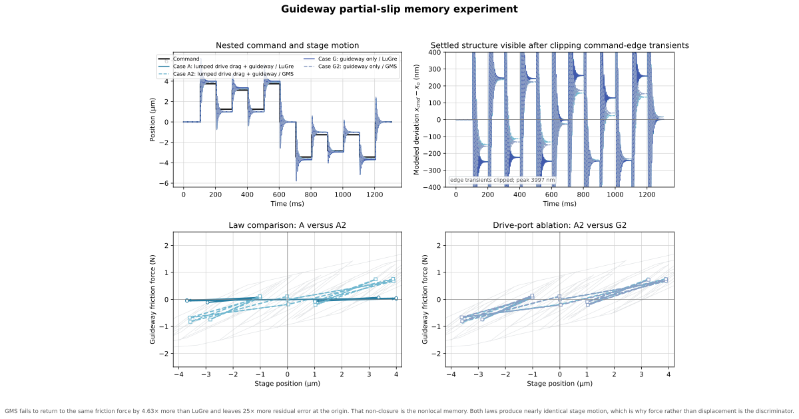

| Executed metric | LuGre A | GMS A2 | GMS / LuGre | LuGre G | GMS G2 | A2 minus G2 (% vs G2) |
|---|---:|---:|---:|---:|---:|---:|
| Return-force mismatch $F_{ret}$ | 0.0215 N | 0.0996 N | 4.63× | 0.0211 N | 0.0987 N | +0.0009 N (+0.9%) |
| Final-origin magnitude | 0.68 nm | 16.80 nm | 24.74× | 1.21 nm | 15.63 nm | +1.17 nm (+7.5%) |
| Closed-loop energy $A_{loop}$ | 53.32 µJ | 31.88 µJ | 0.60× | 55.49 µJ | 32.99 µJ | -1.11 µJ (-3.4%) |
| Whole-sequence RMS deviation † | 454.95 nm | 440.16 nm | 0.97× | 464.53 nm | 449.93 nm | -9.77 nm (-2.2%) |
| Peak absolute deviation † | 3995.67 nm | 3882.25 nm | 0.97× | 3997.30 nm | 3899.49 nm | -17.24 nm (-0.4%) |
| Retention $R_{hold}$ ‡ | 4.0% | 24.1% | 6.02× | 3.6% | 24.2% | -0.05 pp (-0.2%) |

† Edge-dominated response descriptor; included for context, not as a memory discriminator.

‡ $R_{hold}=|F_{settled}|/\min(\sigma_0|x_{plateau}|,s(0))$, the fraction of the available elastic force actually held at rest, averaged over the six non-zero plateau levels. See [Appendix G.5](#g-5-settled-force-retention-diagnostic).

The two laws produce almost the same stage motion: whole-sequence RMS differs by 3.3% and peak deviation by 2.8%. They differ sharply in what the interface remembers. GMS's return-force mismatch is 4.63× LuGre's and its residual error at the origin is 25× larger. GMS also dissipates only 59.8% of the LuGre loop energy, which is consistent rather than contradictory: elements below yield store elastic energy instead of burning it, and that same partial yielding is what prevents return-point closure.

**That $F_{ret}$ ratio is a consequence of a retention gap, not an independent result.** LuGre retains just 4.0% of the available elastic force at rest ($R_{hold}$); GMS retains 24.1%, 6.0× more. Post-edge structural ringing bleeds the single LuGre bristle state down within a few milliseconds of every command edge, long before the settled window opens at 80 to 100 ms, so LuGre's near-zero settled force makes the levels agree with each other trivially and makes $F_{ret,LuGre}$ small by construction rather than by genuine return-point closure. GMS's four yielded-and-stuck elements survive the same ringing far better. See [Appendix G.5](#g-5-settled-force-retention-diagnostic) for the per-plateau diagnostic and a high-damping confirmation run.

Ablating the drive port moves every guideway metric by under 10%, and $F_{ret}$, the metric the comparison rests on, by 0.9%. A/A2 is therefore a serviceable proxy for the guideway law comparison despite not being a physical uncoupled fixture. This supersedes the pre-1/16 estimate of a 27 to 32% drive-port contribution, computed on the finer command grid, which no longer holds.

### 9.2 Nut microslip result

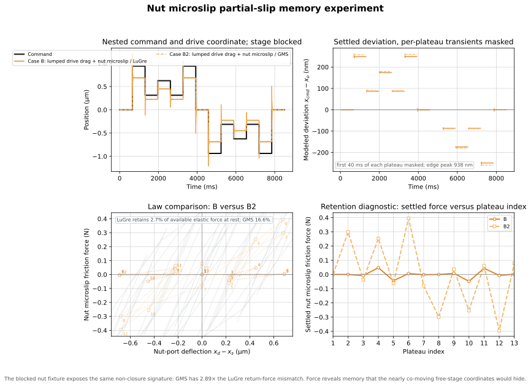

| Executed metric | LuGre B | GMS B2 | GMS / LuGre | GMS minus LuGre |
|---|---:|---:|---:|---:|
| Return-force mismatch $F_{ret}$ | 0.0212 N | 0.0610 N | 2.88× | +0.0398 N |
| Final-origin magnitude | 0.94 nm | 0.63 nm | 0.67× | -0.31 nm |
| Closed-loop energy $A_{loop}$ | 5.00 µJ | 2.61 µJ | 0.52× | -2.39 µJ |
| Whole-sequence RMS deviation † | 177.11 nm | 182.40 nm | 1.03× | +5.29 nm |
| Peak absolute deviation † | 938.46 nm | 938.14 nm | 1.00× | -0.32 nm |
| Retention $R_{hold}$ ‡ | 2.8% | 16.8% | 6.09× | +14.02 pp |

† Edge-dominated response descriptor; included for context, not as a memory discriminator.

‡ $R_{hold}=|F_{settled}|/\min(\sigma_0|x_{plateau}|,s(0))$, the fraction of the available elastic force actually held at rest, averaged over the six non-zero plateau levels. See [Appendix G.5](#g-5-settled-force-retention-diagnostic).

The nut port shows the same signature at 2.88× on $F_{ret}$ and 52.2% relative loop energy, on a command 4× smaller. The blocked fixture is what makes this visible: on a free stage the drive and stage move together, the port sees almost no relative travel, and no element yields.

The same retention gap that drives the guideway $F_{ret}$ ratio is present here: LuGre holds 2.8% of the available elastic force at rest against GMS's 16.8%, 6.1× more. $F_{ret,LuGre}$ at the nut is the same order as the settled force level itself, the signature of a degenerate denominator rather than a genuinely closed return point.

### 9.3 What this means for identification

Return-point force non-closure, not edge-dominated displacement, is the discriminating observable. The comparison does not assume that GMS is better; measured force loops must select and fit the constitutive law. Appendix G records the exact commands, yield-window rationale, memory mechanism, and forced identification order.

Drift under a zero-mean or oscillating velocity is a documented deficiency of the single-state LuGre bristle, not a defect introduced here, and it is one of the reasons the literature moved to multi-state Maxwell-slip constructions. The retention gap measured in [9.1](#9-1-guideway-result) is that known property appearing on this plant's post-edge ringing; see [Appendix G.5](#g-5-settled-force-retention-diagnostic) for the per-plateau diagnostic and the high-damping confirmation run.
<!-- END GENERATED PRESLIDING SUMMARY -->

<a id="10-response-comparison-across-friction-cases"></a>
<a id="11-generated-numerical-summary"></a>

## 10. Friction-case responses and generated summary

<div class="section-takeaway">
**Answers.** How much does friction change the plant's linear response?

**The number.** The retained mode moves from 695.8 Hz frictionless to 810.6 Hz with all three ports, a 16.5% shift.

**Why it matters.** Presliding stiffness is comparable to structural stiffness, so the mode identified in Section 7 is not the mode the machine runs at. Matched LuGre/GMS pairs are linearly identical, so Section 9's differences are memory, not tangent.

**What it is not.** These are zero-velocity tangents. They describe small-signal behaviour about rest, not the response to a real move.
</div>

All [[derived:case_count=10]] cases use the same mechanical plant. Their active ports are defined once in [8.1](#8-1-how-the-friction-laws-attach-to-the-plant).

### 10.1 Presliding stiffness shifts the retained mode

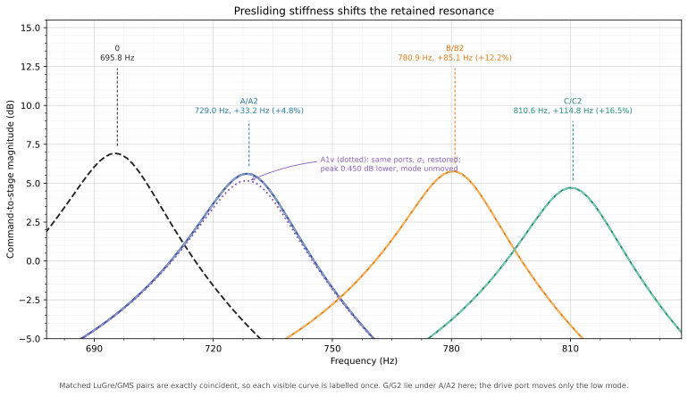

<!-- BEGIN GENERATED BODE COMPARISON -->
| Active ports | Low mode | Retained mode | Shift |
|---|---:|---:|---:|
| none (case 0) | 167.9 Hz | 695.8 Hz | — |
| guideway only (G/G2) | 168.4 Hz | 729.1 Hz | +4.8% |
| drive + guideway (A/A2) | 170.5 Hz | 729.1 Hz | +4.8% |
| drive + nut (B/B2) | 170.0 Hz | 780.9 Hz | +12.2% |
| all three (C/C2) | 170.5 Hz | 810.6 Hz | +16.5% |

The drive port shifts only the low mode, from 168.4 to 170.5 Hz, and leaves the retained mode at 729.1 Hz untouched. Its presliding stiffness acts on $x_d$, which barely participates in the relative mode because $m_d/m_s\approx262$. That is the reflected-inertia result of [Section 6](#6-reduction-from-ten-dofs-to-two) reappearing as a friction measurement.

The nut port shifts the mode nearly three times as much as the guideway despite carrying roughly half the friction force, because $\sigma_{0,n}=2.0\times10^6$ N/m against the guideway's $7.6\times10^5$ N/m and because it acts on the relative coordinate, directly in series with $k_{ax}$.
<!-- END GENERATED BODE COMPARISON -->

### 10.2 Matched pairs are linearly identical

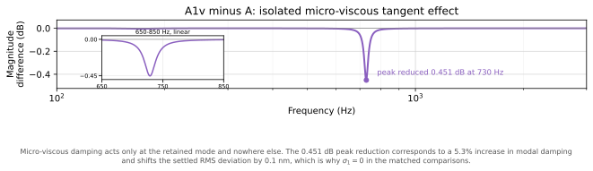

<!-- BEGIN GENERATED MICRO VISCOUS -->
Matched LuGre and GMS pairs are linearly identical by construction: with $\sigma_1=0$ both contribute the same $\sigma_2$ tangent damping, and $\sum k_i=\sigma_0$ equalizes presliding stiffness. Any difference in the nonlinear results of Section 9 is therefore memory structure, not tangent. Every matched pair in the figure above is exactly coincident for the same reason. A1v is the only case with $\sigma_1$ restored, and its difference against A is the isolated micro-viscous effect.

The effect is small and confined to the mode. Restoring $\sigma_1=3.0$ N·s/m at the guideway lowers the 729 Hz peak by 0.451 dB and leaves the response unchanged everywhere else, which moves the settled RMS deviation from 172.4 nm to 172.5 nm. A 0.1 nm change is the empirical justification for setting $\sigma_1=0$ in the matched comparisons.

<details>
<summary>Cross-check: is the damper landing on the right coordinate?</summary>

A peak drop of 0.451 dB implies the modal damping rose by a factor of 1.053, so $\Delta\zeta=8.03\times10^{-4}$ against case A's $\zeta_2=1.507\times10^{-2}$. The direct prediction for an added port damper is $\Delta\zeta=c/(2m_s\omega)=3.0/(2\times0.405\times2\pi\times729.1)=8.09\times10^{-4}$. Those agree to 0.7%, which confirms the tangent assembly is placing the damper on the stage coordinate that carries the guideway port.

The state-space eigenvalues say the same thing without the decibel step: $\zeta_2$ moves from $1.507\times10^{-2}$ in A to $1.587\times10^{-2}$ in A1v, a direct $\Delta\zeta=8.06\times10^{-4}$.

</details>
<!-- END GENERATED MICRO VISCOUS -->

### 10.3 Generated numerical summary

<!-- BEGIN GENERATED DETENT ABLATION -->
Detent ablation pending rebuild.
<!-- END GENERATED DETENT ABLATION -->

The nonlinear campaign uses

$$[+1,-1,+2,-2,0,+3,0,-3,-6,-3,0,+3,+6,+3,0]q_\mu,$$

with 312.5 nm quanta, a largest increment of 1.250 µm, and a derived [[derived:plateau_dwell=653.5]] ms dwell. The digest reports the settled result; the complete metric set is in Appendix H.

<details>
<summary>Per-case nonlinear response figures</summary>

#### Case 0 — frictionless global baseline

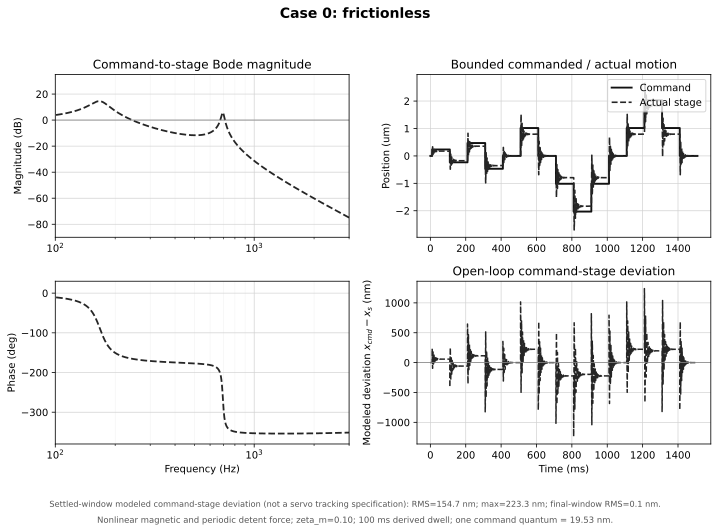

#### A/A2 — guideway LuGre/GMS

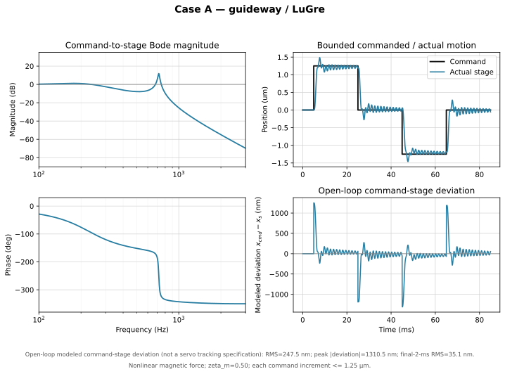

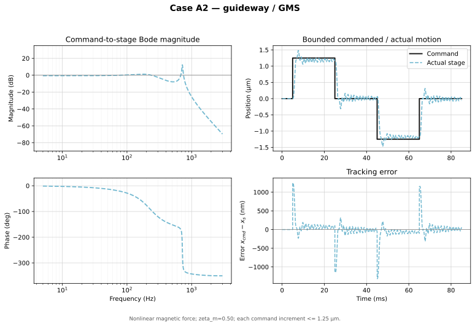

#### G/G2 — guideway-only drive-port ablation

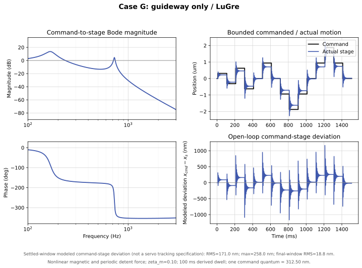

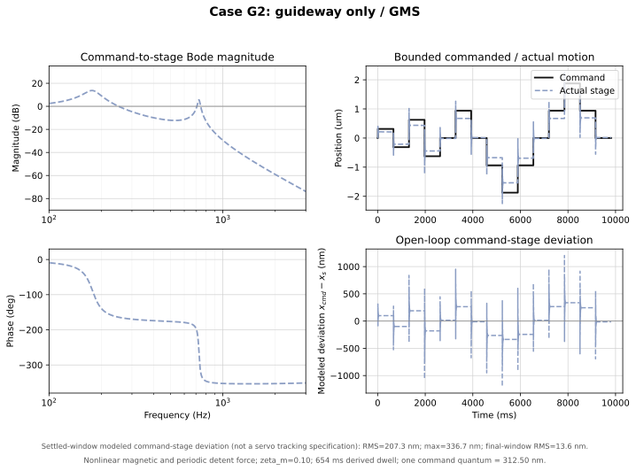

#### B/B2 — nut-microslip LuGre/GMS

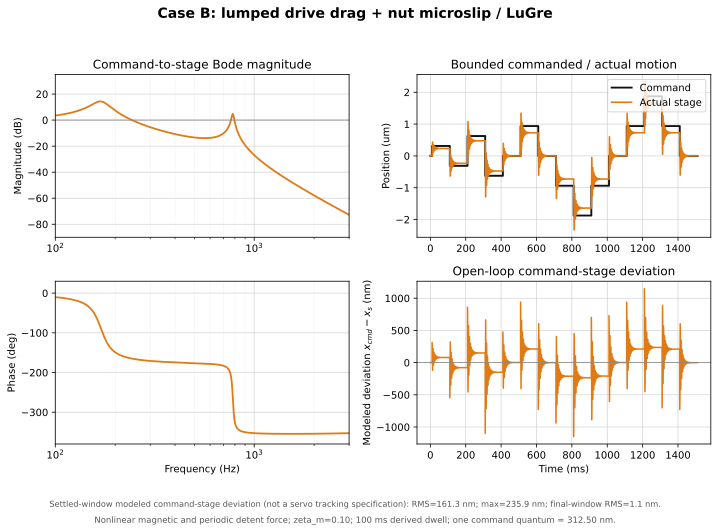

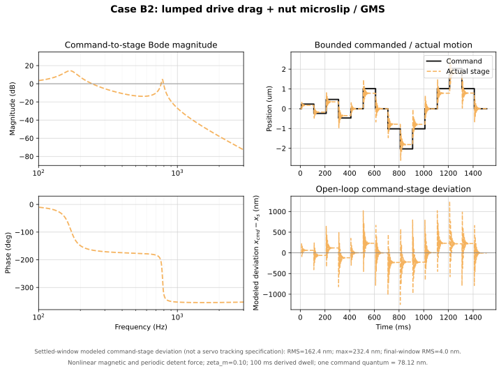

#### A1v — restored micro-viscous sensitivity

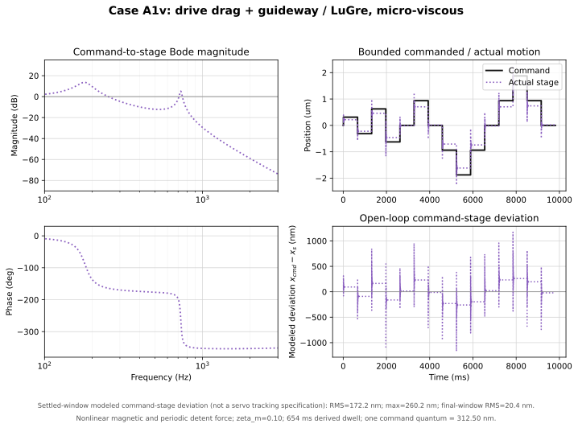

#### C/C2 — all identifiable ports

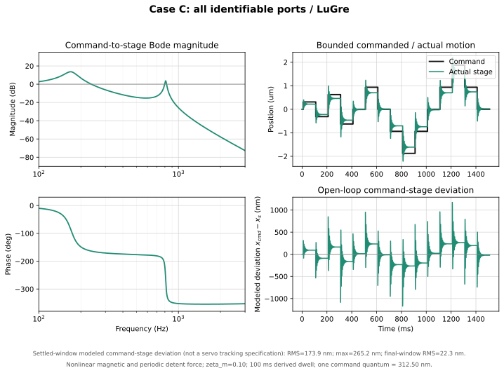

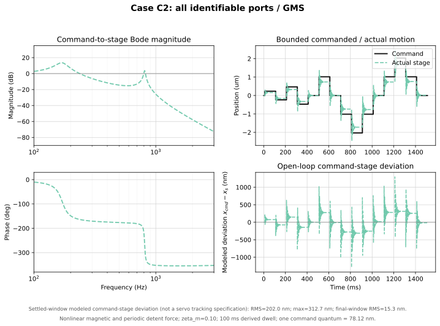

The legends report settled-window RMS and maximum modeled command-stage deviation. These are simulated open-loop outcomes, not closed-loop tracking-error specifications.

</details>

<!-- BEGIN GENERATED RESPONSE SUMMARY -->
| Case | Retained mode | Settled RMS deviation |
|---|---:|---:|
| 0 | 695.8 Hz | 160.6 nm |
| A | 729.1 Hz | 172.4 nm |
| A2 | 729.1 Hz | 215.7 nm |
| G | 729.1 Hz | 171.0 nm |
| G2 | 729.1 Hz | 207.7 nm |
| B | 780.9 Hz | 161.3 nm |
| B2 | 780.9 Hz | 168.4 nm |
| C | 810.6 Hz | 173.9 nm |
| C2 | 810.6 Hz | 207.2 nm |
| A1v | 729.1 Hz | 172.5 nm |

This digest keeps the two values needed to compare topology and settled motion. Appendix H contains the full ten-case metrics dump and the complete Bode overlay.

### 10.4 Generated reduction audit

| Quantity | Executed value |
|---|---:|
| Measured stage body mass | 0.355 kg |
| Nut body mass retained at stage node | 0.050 kg |
| Derived retained stage-side mass | [[derived:reduced_stage_mass=0.405]] kg |
| Upper-mode calibration target | 695.82 Hz |
| Modal-calibrated $k_{ax}$ | [[derived:reduced_axial_stiffness@mnm=7.710]] MN/m |
| Closure-derived $k_{ball}$ | [[derived:k_ball@mnm=15.437]] MN/m |
| Motor rotor inertia | 9.000e-07 kg m² |
| Coupling inertia | 1.180e-06 kg m² |
| 0.192 m screw inertia | 6.061e-07 kg m² |
| 0.192 m screw mass | 0.0758 kg |
| Stage travel / usable screw distance | 150 / 170 mm |
| Full-model reflected drivetrain mass | 106.042 kg |
| Rated-current holding torque | 0.060 N m |
| Enabled detent torque | 0.005 N m |
| Global commutation low pole | 167.86 Hz |
| Local detent-tangent low-pole band | 137.06 to 193.82 Hz |
| Full/reduced sequence RMS residual | 99.572 nm |
| Full/reduced sequence peak residual | 245.619 nm |
| RMS residual / command amplitude | 1.991% |
| Peak residual / command amplitude | 4.912% |

The reduced drive mass is derived from the listed component inertias and the current lead. It is not an independent input. The normalized residual, unlike its nanometre value, is invariant to a simple rescaling of this linear verification command.
<!-- END GENERATED RESPONSE SUMMARY -->

<a id="12-interpreting-commanded-and-actual-motion"></a>

## 11. Interpreting commanded and actual motion

The plotted difference is defined as

$$d_{model}(t)=x_{cmd}(t)-x_s(t).$$

The reported metrics are

$$d_{RMS}=\sqrt{\frac{1}{T}\int_0^T d_{model}^2(t)\,dt},\qquad
d_{max}=\max_{0\le t\le T}|d_{model}(t)|.$$

| Metric | Window | Interpretation |
|---|---|---|
| Whole-sequence RMS | full sequence | Includes every command edge; retained as a transient descriptor |
| Settled-window RMS / maximum | final 20 ms of every plateau | Compares the friction hypotheses after drive ringing has decayed |
| Peak absolute deviation | full sequence | Usually occurs at a command edge |
| Final-window RMS | final 20 ms | Describes the last zero-command dwell |

These are open-loop model descriptors, not tracking specifications. The model has no position controller, estimator, sensor dynamics, or shaped trajectory. The damping term $c_m$ removes the earlier unphysical sustained ringing. Remaining values are provisional until $c_{ax}$ and the friction parameters are identified; the requested electromagnetic baseline is $\zeta_m=0.10$. The installed lead screw is recorded as IT3 in the entry table.

Pre-distortion has separate position and timing channels, and they address different error classes. Pulse issue times are limited only by the motion-controller timer, so **velocity-shaped terms**, deceleration shaping, approach-speed matching and dwell placement, are unaffected by the position grid. **Position-periodic terms are not in that class.** Detent equilibrium error and lead error are functions of where the rotor is, not of when it arrives, so no timing adjustment corrects them; only the position channel can, and it inherits the 312.5 nm floor against a [[derived:detent_equilibrium_error_nm=265.57]] nm term. See [Section 5](#5-stepper-input-nonlinear-law-linearization-and-bound) for the divisor requirement this implies.

<a id="13-verification-checks-and-limitations"></a>

## 12. Verification checks and limitations

<details>
<summary>Checks performed by construction</summary>

1. $\mathbf M$ is diagonal and positive for all executed parameters.
2. Every passive spring and damper is added by a positive-semidefinite outer product.
3. The nut virtual-work vector applies $+rF_n$, $+F_n$, and $-F_n$ with consistent power.
4. The GMS negative-velocity slip equilibrium is attracting.
5. The nonlinear command is held constant over all four RK4 stages at a discontinuity.
6. The main response uses 312.5 nm 1/16 microsteps, spans 0.3125 to 1.8750 µm absolute levels, and limits adjacent increments to 1.250 µm. The separate memory-identification test intentionally reaches 3.7500 µm and uses the nonlinear magnetic law.
7. Full and reduced verification use the same command, sample grid, and damping repair.
8. The generated metrics table is rewritten by the builder, tying numbers to executed code.
9. The builder asserts $\sum_i\nu_i=1$ and $\sum_i k_i=\sigma_0$ for every defined GMS site before simulation.

</details>

<a id="13-1-gms-step-halving-convergence"></a>

### 12.1 GMS step-halving convergence

The nonlinear campaign plots use its **two-DOF production step**, fixed-step RK4 with $h=25$ µs. The ten-DOF verification of [7.1](#7-1-solver-convergence) uses a separate 2.5 µs step because that plant reaches 21 kHz. To test sensitivity of the requested final-window RMS result on the longer settled trajectory, the builder reruns A2, B2, and C2 using $h=50$, 25, and 12.5 µs, then adds an A2-only $h=6.25$ µs run. All command transitions fall exactly on these grids, and the command remains one zero-order-held value across the four RK stages of each step.

Because branch switching is resolved on the RK trial grid without event localization ([8.4](#8-4-implementation-choices)), the observed convergence order is expected to fall below four. This table is therefore a sensitivity check, not an order verification.

<!-- BEGIN GENERATED STEP HALVING SUMMARY -->
| Case | 50.0 us | 25.0 us | 12.5 us | 6.25 us (A2 only) | $\Delta R_{50\to25}$ | $\Delta R_{25\to12.5}$ | $\Delta R_{12.5\to6.25}$ | Observed $p$ |
|---|---:|---:|---:|---:|---:|---:|---:|---:|
| A2 | 16.13778 nm | 16.18075 nm | 16.29398 nm | 16.32724 nm | 0.04297 nm | 0.11323 nm | 0.03326 nm | -1.40 |
| B2 | 4.41395 nm | 4.46698 nm | 4.47532 nm | — | 0.05303 nm | 0.00834 nm | — | 2.67 |
| C2 | 13.52097 nm | 13.59914 nm | 13.62751 nm | — | 0.07817 nm | 0.02837 nm | — | 1.46 |

B2 and C2 show reduced successive differences under step halving: B2 ($p=2.67$), C2 ($p=1.46$). Their observed orders are empirical hybrid-trajectory indicators, not an RK4 order claim.

A2 does not show the same trend over the first three grids: $p=$[[derived:a2_convergence_order=-1.40]]. The additional A2 difference falls from 0.11323 nm to 0.03326 nm. **The 12.5 us A2 point was a grid-sensitive branch-switching artifact; the finer point reverses the apparent divergence.**

These values use the identical 1510 ms zero-order-held, yield-spanning command and the identical final 20 ms RMS definition. Since GMS branch switching is evaluated at RK trial states without event localization, the observed order is a sensitivity indicator, not a claimed fourth-order convergence rate for the hybrid trajectory.
<!-- END GENERATED STEP HALVING SUMMARY -->

<a id="13-2-gms-branch-selection-census"></a>

### 12.2 GMS branch-selection census

<!-- BEGIN GENERATED BRANCH CENSUS -->
The executed GMS branch test is stateless: it reconstructs stick or slip from $(v,F_i)$ at every Runge-Kutta evaluation instead of carrying a persistent per-element flag. This census advances a shadow persistent flag alongside the executed trajectory and counts where the two disagree. The shadow flag never feeds a derivative, so collecting it cannot change any reported result. Counts are element-evaluations: four elements per site per RK stage, over the 1510 ms main sequence. The re-priced comparison below uses the Section 9 memory trajectory, which is a different trajectory.

| Case | Site | `flips_reversal` | `flips_threshold` | `evals_total` | Threshold share |
|---|---|---:|---:|---:|---:|
| A2 | Drive side $d$ | 24 | 2,000 | 959,996 | 0.208% |
| A2 | Guideway $g$ | 12 | 668 | 959,992 | 0.070% |
| G2 | Guideway $g$ | 14 | 784 | 959,992 | 0.082% |
| B2 | Drive side $d$ | 24 | 2,026 | 959,996 | 0.211% |
| B2 | Nut microslip $n$ | 0 | 0 | 959,996 | 0.000% |
| C2 | Drive side $d$ | 24 | 2,010 | 959,996 | 0.209% |
| C2 | Guideway $g$ | 12 | 808 | 959,992 | 0.084% |
| C2 | Nut microslip $n$ | 0 | 0 | 959,996 | 0.000% |

`flips_reversal` counts transitions to stick caused by $vF_i\le0$, which both models make. `flips_threshold` counts transitions to stick caused by $|F_i|\lt\nu_is(v)$ with no velocity reversal, which the persistent-state model would not make. Only the second column is a departure.

**`flips_threshold` is not zero: 8,296 element-evaluations across the executed GMS cases**, against 110 genuine reversals and 7,679,956 evaluations. The departure is therefore active, and it is the dominant re-stick mechanism rather than a rare corner: threshold-driven reclassification outnumbers reversal-driven re-stick by 75 to 1. Its cost is priced by rerunning each affected case with the shadow flag enforced, so that a yielded element keeps slipping and chases the rising threshold at rate $C$ until an actual reversal.

| Case | Executed settled-window RMS | Persistent-flag rerun | Change |
|---|---:|---:|---:|
| A2 | 215.718 nm | 217.344 nm | +1.627 nm (+0.75%) |
| G2 | 207.685 nm | 208.627 nm | +0.943 nm (+0.45%) |
| B2 | 168.401 nm | 168.849 nm | +0.448 nm (+0.27%) |
| C2 | 207.155 nm | 208.764 nm | +1.609 nm (+0.78%) |

The largest settled-window change is 0.78%. **That number understates the departure, and the reason is structural.** The settled window is the final 20 ms of a single plateau, sampled after motion has stopped, whereas the departure occurs during deceleration while $s(v)$ is rising. A metric evaluated at rest on one plateau has no mechanism for seeing it.

The nut site records zero threshold flips in both B2 and C2. In steady motion the nut-port velocity $\dot x_d-\dot x_s$ is identically zero because the elastic deformation is constant, so every nut element is stuck and no branch decision is ever contested. See [8.1](#8-1-how-the-friction-laws-attach-to-the-plant).

#### Memory-sequence branch census

The Section 9 memory trajectory lasts 1305 ms. Its branch counts are measured on that trajectory itself; they are not copied or duration-scaled from the main-sequence census.

| Case | Site | `flips_reversal` | `flips_threshold` | `evals_total` | Threshold share |
|---|---|---:|---:|---:|---:|
| A2 | Drive side $d$ | 89 | 4,546 | 767,996 | 0.592% |
| A2 | Guideway $g$ | 54 | 2,007 | 767,992 | 0.261% |
| G2 | Guideway $g$ | 55 | 2,154 | 767,992 | 0.280% |
| B2 | Drive side $d$ | 8 | 679 | 767,996 | 0.088% |
| B2 | Nut microslip $n$ | 44 | 3,178 | 767,996 | 0.414% |

The memory-sequence threshold-to-reversal ratio is 50.3:1, versus 75.4:1 on the main sequence. It **materially differs** under the stated 20% relative-change criterion (33.4% here).

#### Re-priced against the Section 9.4 loop metrics

The repeated-return metrics compare settled means at the *same* command level reached by different histories, so their value depends on every intervening deceleration. The loop area is integrated along the dynamic trace itself. Both can see what the settled window cannot. The threshold column is the GMS-minus-LuGre gap on the same metric: the effect the Section 9 experiment exists to detect, and therefore the level the departure has to stay below to count as bookkeeping.

| Case | Metric | Executed (stateless) | Persistent-flag rerun | Change | GMS − LuGre gap | Exceeds? |
|---|---|---:|---:|---:|---:|---|
| A2 | $E_{ret}$ | 15 nm | 17 nm | +2.7 nm | 12 nm | no |
| A2 | $F_{ret}$ | 0.09957 N | 0.1244 N | +0.02484 N | 0.07805 N | no |
| A2 | final-origin magnitude $D_{13}$ | 17 nm | 16 nm | -0.46 nm | 16 nm | no |
| A2 | loop area $A_{loop}$ | 31.88 µJ | 29.42 µJ | -2.46 µJ | 21.44 µJ | no |
| B2 | $E_{ret}$ | 1.1 nm | 1.1 nm | -0.058 nm | 0.89 nm | no |
| B2 | $F_{ret}$ | 0.06096 N | 0.05824 N | -0.002718 N | 0.03979 N | no |
| B2 | final-origin magnitude $D_{13}$ | 0.63 nm | 0.74 nm | +0.11 nm | 0.31 nm | no |
| B2 | loop area $A_{loop}$ | 2.61 µJ | 2.39 µJ | -0.22 µJ | 2.39 µJ | no |

On the metric the experiment is built around, the departure moves $F_{ret}$ for A2 by 0.0248 N against a law gap of 0.0781 N, which is 32% of the effect being measured.

This conclusion is conditional on command resolution. The earlier 1/256 run priced the same A2 $F_{ret}$ departure at 91.5% of the law gap; the rebuilt production 1/16 sequence prices it at 32%. Coarser executable commands changed the loop trajectory and the comparison margin, so the branch-model warning must be re-evaluated whenever the microstep divisor or reversal sequence changes.

**That denominator is not a clean two-law difference.** [Appendix G.5](#g-5-settled-force-retention-diagnostic) shows $F_{ret,LuGre}$ at the guideway is degenerate: LuGre's settled force is wiped by post-edge ringing before every settled window opens, so the law gap above is dominated by $F_{ret,GMS}$ rather than by a genuine LuGre-versus-GMS contrast. Equivalently, the departure moves GMS's own return-force mismatch by about 32% of its own value. That is still a meaningful bound on the branch-selection departure, but it is not the two-law comparison the percentage suggests at first read.

No Section 9.4 metric moves by more than the GMS-minus-LuGre difference on that metric, so the departure stays below the effect the experiment is designed to detect. It remains a defect to close before identification, because the margin is not large.
<!-- END GENERATED BRANCH CENSUS -->

<a id="13-3-stribeck-relaxation-time-sensitivity"></a>

### 12.3 Stribeck relaxation-time sensitivity

<!-- BEGIN GENERATED TAU C SENSITIVITY -->
$C$ is the least anchored parameter in Section 8: it is identified from measured hysteresis loops in the source GMS work and is assumed here. The A/A2 guideway memory sequence is rerun at three relaxation times spanning a factor of four, and the two metrics that can see the attractor dynamics are reported.

| $\tau_C$ | Guideway $C$ | $F_{ret}$ (A2) | $A_{loop}$ (A2) |
|---:|---:|---:|---:|
| 0.1 ms | 6000 N/s | 0.10010 N | 31.878 µJ |
| 0.2 ms | 3000 N/s | 0.09957 N | 31.880 µJ |
| 0.4 ms | 1500 N/s | 0.10020 N | 31.926 µJ |

Across a four-fold change in $\tau_C$ the return-force mismatch spreads by 0.00063 N and the loop area by 0.05 µJ, against GMS-minus-LuGre gaps of 0.07805 N and 21.44 µJ on the same metrics. **$C$ is not a dominant uncertainty over this range.** The spread is 0.8% of the force gap and 0.2% of the loop-area gap, so the law comparison in Section 9 survives the assumption. This bounds a weakness rather than removing it: the reported insensitivity holds over the tested range and does not license an arbitrary value.

The upper bound on $\tau_C$ is dynamic, not statistical. The retained mode has a period of 1.437 ms, and the executed $\tau_C$ is 7.2 times faster. At 0.4 ms that margin falls to 3.6, which is inside the range where the attractor dynamics begin to alias into the structural response; below roughly 0.05 ms it stiffens the ODE without adding physics.
<!-- END GENERATED TAU C SENSITIVITY -->

### 12.4 Guideway breakaway-force sensitivity

<!-- BEGIN GENERATED BREAKAWAY SENSITIVITY -->
Breakaway-force variant pending rebuild.
<!-- END GENERATED BREAKAWAY SENSITIVITY -->

<details>
<summary>Known limitations and measurements that would remove assumptions</summary>

- Coupling inertia and torsional stiffness require CAD or datasheet values.
- Bearing stiffness/contact angle and preload require BOM confirmation or static loading.
- $k_{ball}$ is a closure-derived remainder, not a direct Hertzian calculation or measurement.
- Driver mode and effective damping should still be identified; the requested $\zeta_m=0.10$ baseline is accompanied by a 0.02 to 0.50 sensitivity sweep.
- LuGre and GMS values require velocity sweeps and nested reversal tests.
- A2 final/settled-window RMS does not converge monotonically under step halving (observed order [[derived:a2_convergence_order=-1.40]]). Branch switching without event localization is the suspected cause. The observed spread across the tested 8× step range is 0.19 nm, or 1.2% of the A2 value, so the metric carries a **bounded but unconverged** discretization error of that size rather than an unbounded one; see the [12.1](#12-1-gms-step-halving-convergence) table.
- The nut memory experiment cannot resolve its own first GMS element at the production divisor. The 312.5 nm quantum exceeds the 200 nm first nut yield distance, so element 1 is never observed as a distinct yield and element 4 is never reached: only elements 2 and 3 are exercised distinctly. This is an identifiability limit on the $\sigma_{0,n}$ element split, not only a design inconvenience, and it is a second independent argument for reopening the microstep divisor ([G.2](#g-2-why-this-remains-presliding-while-still-activating-gms-memory), [Appendix C](#appendix-c-critical-error-disposition) item 16).
- The production microstep divisor is an unconfirmed amber input. [12.2](#12-2-gms-branch-selection-census) shows the branch-departure conclusion depends on it, and [Section 5](#5-stepper-input-nonlinear-law-linearization-and-bound) shows the pre-distortion requirement does. The board MRES setting must be read back before the divisor is fixed anywhere in the model; on the TMC2209 rig this means confirming that `mstep_reg_select` in GCONF is 1, so the UART MRES bits take effect instead of being overridden by the MS1/MS2 pins.
- The installed screw is IT3. A measured lead-error map is still absent and remains a full-range uncertainty.
- Yaw, pitch, roll, rail bending, cyclic error, runout, temperature, and load-dependent nut friction are omitted.
- The electrical winding/current-controller dynamics are represented only by effective stiffness and damping.
- Editing inputs in the rendered HTML recomputes dependent scalars, the marked live equations, and the live Bode plots. Publication SVGs and nonlinear LuGre/GMS simulations remain static until the Python builder is rerun.

</details>

## Appendix A. Position-dependent axial stiffness

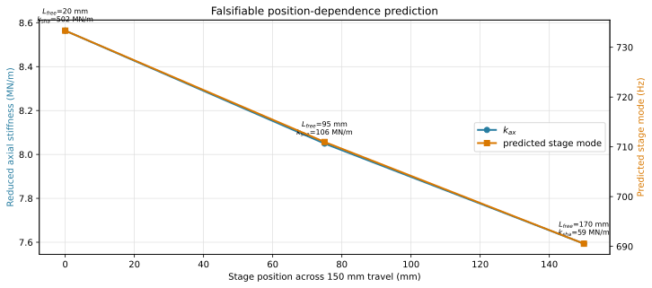

For the screw segment before the nut, $k_{sha}=EA_{root}/L_{free}$, using the same modulus, root section and datum as the Section 2 entry table. A longer free length reduces both $k_{sha}$ and the series stiffness $k_{ax}$. The plot covers stage positions 0, 75, and 150 mm, corresponding to support-to-nut free lengths of 20, 95, and 170 mm within the approximately 170 mm usable screw distance.

**The executed model sits near the soft end of this curve, deliberately.** The declared datum is $L_a=$ [[derived:screw_length_a@mm=158.0]] mm, a 138 mm stage position of 150 mm travel, so every downstream closure ($k_{ball}$, $c_{ax}$, the reduction residual) is evaluated at close to the lowest axial stiffness the axis presents. That is the worst case for the retained mode and it is labelled as such in [Section 2](#2-entry-parameters) and [6.3](#6-3-reduction-evidence) rather than presented as a mid-stroke value. Re-baselining to mid-stroke would raise $k_{sha}$ by roughly 60% and move every closure with it; the exact machine datum should be measured before either choice is fixed.

## Appendix B. Reduced-model bond graph

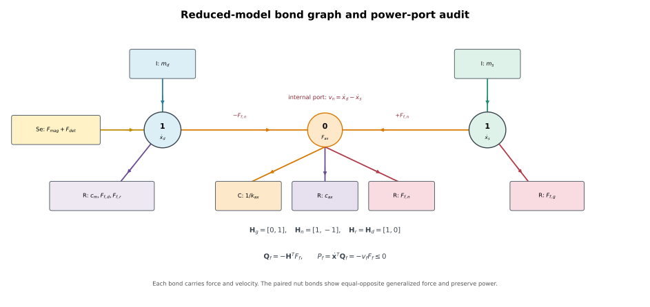

The two 1-junctions carry $\dot x_d$ and $\dot x_s$. The central 0-junction carries the common internal force. Structural compliance, damping, and nut microslip are distinct parallel constitutive elements. One identifiable drive-side drag connects to the drive junction and includes the physical gross-rolling contribution. The bond directions reproduce $\mathbf Q_f=-\mathbf H^TF_f$ and $P_f=-v_fF_f\le0$.

This graph is the visual form of the [Section 8.1](#8-1-how-the-friction-laws-attach-to-the-plant) incidence rows. It adds no model elements.

## Appendix C. Critical-error disposition

| Item | Evaluation | Implemented disposition |
|---:|---|---|
| 1 | Corrected | The two $[1,0]$ laws are one identifiable drive-side drag. The B/B2 test now exercises the 0.20 µm nut first yield and the $k_{ax}$/$\sigma_{0,n}$ correlation. |
| 2 | Confirmed | Execute $F_{f,d}$ in A/A2, B/B2, and C/C2. |
| 3 | Corrected | Periodic detent remains nonlinear; it is excluded from global $\mathbf K$ and reported as a [[derived:detent_band_low_hz=145.07]]–[[derived:detent_band_high_hz=205.14]] Hz local band. Period is 5 µm; the [[derived:detent_equilibrium_error_nm=265.57]] nm amplitude is unchanged. |
| 4 | Corrected | Both A/A2 and B/B2 memory tests use the damping-derived dwell of [[derived:plateau_dwell=653.5]] ms and settled 20 ms means. |
| 5 | Corrected | The production 312.5 nm sequence spans 0.3125–1.8750 µm, crosses yield, and keeps each adjacent increment at or below 1.25 µm. |
| 6 | Updated | Execute the requested 0.10 electromagnetic damping and retain the 0.02 to 0.50 sensitivity sweep. |
| 7 | Confirmed | Keep the failed compliance budget prominent. State that reproducing the [[derived:route_p_f2=695.82]] Hz calibration target is calibration, not validation; the measured band is 681–690 Hz and the target's own provenance is undocumented ([G.4](#g-4-detent-contamination-and-the-forced-identification-order)). |
| 8 | Confirmed | Rename DC gain to presliding tangent gain and report the first-yield validity travel. |
| 9 | Corrected | The installed screw is IT3 per the BOM; the earlier IT1 entry was wrong and is now corrected in the parameter defaults. The removed Section 12.1 comparison is still not needed. |
| 10 | Stale in the supplied review | Full equations already apply equal and opposite microslip reactions. The bond graph audits the signs. |
| 11 | Updated | $J_m$ and $J_c$ are retained; the complete 192 mm screw inertia is recalculated and $m_d$ rebuilt from the component sum. |
| 12 | Corrected, then re-corrected | Static damping condensation overstated retained damping by about an order of magnitude, and the frequency-domain replacement then understated it by a further order because the interface entries applied $\eta=2\zeta$ at the wrong frequency. Interface loss factors are now declared at the retained mode and $\zeta_j$ is derived from them, so the propagated link damper agrees with the executed value to 15%. Measured-FRF identification remains the decision path. |
| 13 | Open | The 0.405 kg BOM mass and 0.600 kg modal effective mass imply materially different $k_{ax}$ and $k_{ball}$. Section 6 now exposes both branches and requires an independent contact-stiffness or mass-loading resolution. |
| 14 | Corrected | Three Section 8 constitutive parameters changed, and every nonlinear result in Sections 9 to 13 moves with them. **The Stribeck exponent $\delta$ was executing at 1.0**, an exponential decay, while being invisible in the parameter tables; it is now an exposed input at the conventional Gaussian 2.0. **$\sigma_1$ was 3.0, 5.0, and 9.0 N·s/m** and is now zero at every site, because the [8.4](#8-4-implementation-choices) closure claim was true for stiffness but false for damping by a factor of 8.5 to 21; case A1v restores the former values so micro-viscous damping is studied rather than confounded. **$C$ was three unanchored 5000 N/s constants** and is now $C_\alpha=(F_{s,\alpha}-F_{c,\alpha})/\tau_C$ from one shared relaxation time, giving 3000, 2000, and 7500 N/s. Comparisons against any earlier revision must account for all three. |
| 15 | Open | Across A2, G2, B2, and C2, the stateless GMS branch test departs from the persistent-state model on 8,296 element-evaluations. Priced against the Section 10 settled window it is at most a 0.78% effect; against the [Section 9](#9-force-instrumented-partial-slip-memory-experiment) loop metrics it reaches 32% of the GMS-minus-LuGre gap on $F_{ret}$. See [12.2](#12-2-gms-branch-selection-census). Persistent branch flags must still be added before any GMS parameter is identified. |
| 16 | Reopened, split into three questions | The earlier single conclusion conflated three separate questions. **(a) Baseline quantization noise:** 1/16 is adequate, at a 90.2 nm RMS floor and 4.51% of the 2 µm budget. **(b) Microstep nonlinearity:** divisor-independent at 0.5–1.5 µm (25–75%), so the earlier conclusion holds and it remains the binding accuracy term. **(c) Positional pre-distortion authority against position-periodic terms:** divisor-dependent, and 1/16 fails it. One 312.5 nm microstep exceeds the entire [[derived:detent_equilibrium_error_nm=265.57]] nm detent equilibrium error, so no correction table can be expressed on this grid; the requirement is $n_\mu\ge$ [[derived:required_microstep_divisor=131.79]]. [G.2](#g-2-why-this-remains-presliding-while-still-activating-gms-memory) adds an independent identifiability argument at the nut. The divisor decision is therefore re-opened as an experiment: confirm the production board MRES setting first. |

## Appendix D. Variable and parameter glossary

<details>
<summary>Expand all symbols, states, ports, and units</summary>

| Symbol | Definition | Unit |
|---|---|---|
| $L$ | screw lead | m/rev |
| $r=L/(2\pi)$ | screw transmission ratio | m/rad |
| $N_r$ | rotor tooth count | – |
| $\theta_m,\theta_c,\theta_{s1..s3}$ | full-model torsional coordinates | rad |
| $u_b,u_e,u_f,u_n,x_s$ | full-model axial coordinates | m |
| $x_d$ | reduced effective drive coordinate | m |
| $x_{cmd}$ | commanded field-equivalent linear position | m |
| $d_{model}=x_{cmd}-x_s$ | modeled open-loop command-stage deviation; not a servo tracking specification | m |
| $J_m,J_c,J_{s1..s3}$ | rotational inertias | kg·m² |
| $m_b,m_e,m_f,m_n,m_{stage}$ | axial lumped masses | kg |
| $m_d,m_s$ | reduced drive and stage masses | kg |
| $k_m$ | rotational magnetic stiffness | N·m/rad |
| $K_m=k_m/r^2$ | reflected magnetic stiffness | N/m |
| $T_{max},F_{max}$ | peak magnetic torque and reflected force | N·m, N |
| $\kappa=N_r/r$ | magnetic spatial wavenumber | rad/m |
| $k_{c1},k_{c2}$ | coupling torsional stiffnesses | N·m/rad |
| $k_{\theta a},k_{\theta b}$ | screw torsional stiffnesses | N·m/rad |
| $k_{brg}$ | support-bearing axial stiffness | N/m |
| $k_{sha},k_{shb}$ | screw axial stiffnesses before/after nut | N/m |
| $k_{ball}$ | normal ball-contact axial stiffness | N/m |
| $k_{mnt}$ | nut-mount axial stiffness | N/m |
| $k_{ax}$ | reduced series axial stiffness | N/m |
| $c_{ax}$ | reduced axial structural damping | N·s/m |
| $c_m,c_{\theta m}$ | reduced/rotational electromagnetic damping | N·s/m, N·m·s/rad |
| $u_t=u_e+r\theta_{s2}$ | full-model screw-transformer output | m |
| $\delta_n$ | ball-contact deformation $u_n-u_e-r\theta_{s2}$ | m |
| $F_n$ | normal axial ball-contact force | N |
| $F_{f,g}$ | guideway friction force | N |
| $F_{f,n}$ | axial-equivalent nut differential microslip force | N |
| $F_{f,d}$ | single identifiable drive-side drag, including gross nut rolling and other $\dot x_d$ losses | N |
| $s(v)$ | velocity-dependent Stribeck force level | N |
| $F_s,F_c$ | static and Coulomb force levels | N |
| $v_s,\delta$ | Stribeck velocity and exponent | m/s, – |
| $z$ | LuGre bristle deflection | m |
| $\sigma_0,\sigma_1,\sigma_2$ | LuGre stiffness, microdamping, viscous coefficients | N/m, N·s/m, N·s/m |
| $F_i,k_i,\nu_i$ | GMS element force, stiffness, threshold weight | N, N/m, – |
| $C$ | GMS slip-attraction rate coefficient | N/s |
| $\mathbf M,\mathbf C,\mathbf K$ | mass, damping, stiffness matrices | mixed native units |
| $\mathbf h_n$ | nut-deformation incidence/virtual-work vector | mixed |

</details>
