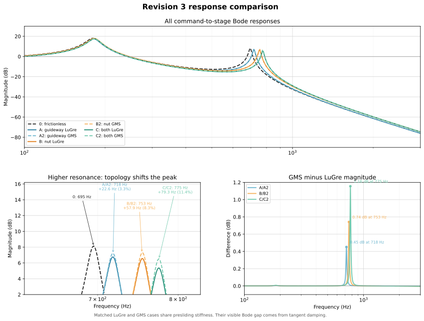

# Revision 3 — Analytical Derivation and Executable Responses

This document is the transparent, executable companion to [the Revision 3 model specification](ball_screw_stage_dynamic_derivation_v3.html). It starts from the ten-coordinate decomposed plant already defined there, derives the equations without skipping the coupling signs, audits the reduction to two mechanical degrees of freedom, and then executes the baseline and paired LuGre/GMS cases.

> **Reproducibility boundary.** All static figures and generated metrics come from the single `build_model_documentation.py` script. Editable HTML cells persist in the browser and can be saved into a copy of the HTML, but editing a cell does not silently rerun Python or change a static SVG. Rerun the builder after changing model constants in the script.

The amber editable cells are assumptions or pre-emptive values that still require identification. They are intentionally highlighted instead of being assigned an “assumed” status label.

<details open>
<summary>How to reproduce both HTML documents and every figure</summary>

From the `Rev 3` folder, run:

```text
python build_model_documentation.py
```

The build writes this HTML document, the rendered model specification, the kinematic diagram, one response figure per case, the full/reduced verification, the position-dependence prediction, and the matched LuGre/GMS comparison. There is no second simulation or rendering script.

</details>

## 1. Model hierarchy and case map

There are two structural models and seven executed friction cases.

| Layer | Coordinates | Purpose |
|---|---:|---|
| Full Revision 3 plant | 10 mechanical DOFs | Trace every inertia, compliance, and nut-interface sign; expose discarded modes |
| Reduced plant | 2 mechanical DOFs | Execute the ≤900 Hz response and keep nut/guideway friction identifiable |
| Friction states | 0, 1/site, or 4/site | Internal constitutive memory; these are states, not additional mechanical DOFs |

| Case | Active sites | Law | Role |
|---|---|---|---|
| 0 | none | none | frictionless modal baseline |
| A | guideway | LuGre | guideway hypothesis |
| A2 | guideway | GMS | topology-matched alternative to A |
| B | nut differential | LuGre | nut hypothesis |
| B2 | nut differential | GMS | topology-matched alternative to B |
| C | guideway + nut | LuGre | combined hypothesis |
| C2 | guideway + nut | GMS | topology-matched alternative to C |

Case D from the source specification is retained conceptually as the full-plant correlation case, but is not executed because its aggregated drivetrain friction parameters have not been identified. It is not silently populated with invented numbers.

## 2. Editable executable parameter tables

### 2.1 Geometry, reduced plant, and excitation

| Symbol | Meaning | Executed value | Unit |
|---|---|---:|---|
| $L$ | screw lead | [[input:lead=1.000e-3]] | m/rev |
| $N_r$ | rotor teeth | [[input:rotor_teeth=50]] | – |
| $r=L/(2\pi)$ | transmission ratio | [[input:transmission_ratio=1.59155e-4]] | m/rad |
| $m_d$ | reduced reflected drivetrain mass | [[assumed:reduced_drive_mass=59.0]] | kg |
| $m_s$ | reduced nut + stage effective mass | [[input:reduced_stage_mass=0.600]] | kg |
| $K_m$ | linearized magnetic stiffness | [[assumed:magnetic_stiffness=1.200e8]] | N/m |
| $k_{ax}$ | measured reduced axial-path stiffness | [[input:reduced_axial_stiffness=1.140e7]] | N/m |
| $c_{ax}$ | retained structural damping | [[assumed:axial_damping=55.0]] | N·s/m |
| $\zeta_m$ | electromagnetic modal damping ratio | [[assumed:electromagnetic_zeta=0.50]] | – |
| $p_{step}$ | 1.8° full-step linear pitch | [[input:full_step_pitch=5.000e-6]] | m |
| $p_{step}/4$ | maximum command increment | [[input:quarter_step_bound=1.250e-6]] | m |

### 2.2 Ten-DOF inertias and masses

| Symbol | Meaning | Executed value | Unit |
|---|---|---:|---|
| $J_m$ | motor rotor inertia | [[assumed:J_m=1.200e-6]] | kg·m² |
| $J_c$ | coupling inertia, closure-consistent value | [[assumed:J_c=5.000e-8]] | kg·m² |
| $J_{s1}$ | drive-end screw inertia | [[assumed:J_s1=8.150e-8]] | kg·m² |
| $J_{s2}$ | nut-plane screw inertia | [[assumed:J_s2=8.150e-8]] | kg·m² |
| $J_{s3}$ | beyond-nut screw inertia | [[assumed:J_s3=8.150e-8]] | kg·m² |
| $m_b$ | axial screw mass at bearing node | [[assumed:m_b=0.015]] | kg |
| $m_e$ | axial screw mass at nut plane | [[assumed:m_e=0.015]] | kg |
| $m_f$ | axial screw mass beyond nut | [[assumed:m_f=0.010]] | kg |
| $m_n$ | nut body mass | [[assumed:m_n=0.050]] | kg |
| $m_{stage}$ | stage body portion used with $m_n$ | [[assumed:m_stage=0.550]] | kg |

### 2.3 Full-model stiffnesses

| Symbol | Meaning | Executed value | Unit |
|---|---|---:|---|
| $k_{c1}$ | coupling motor-side torsion | [[assumed:k_c1=100.0]] | N·m/rad |
| $k_{c2}$ | coupling screw-side torsion | [[assumed:k_c2=100.0]] | N·m/rad |
| $k_{\theta a}$ | screw torsion before nut | [[assumed:k_theta_a=211.0]] | N·m/rad |
| $k_{\theta b}$ | screw torsion beyond nut | [[assumed:k_theta_b=211.0]] | N·m/rad |
| $k_{brg}$ | support-bearing axial stiffness | [[assumed:k_brg=2.500e7]] | N/m |
| $k_{sha}$ | screw axial stiffness before nut | [[assumed:k_sha=6.700e7]] | N/m |
| $k_{shb}$ | screw axial stiffness beyond nut | [[assumed:k_shb=2.000e8]] | N/m |
| $k_{ball}$ | ball-contact stiffness from closure | [[assumed:k_ball=4.387e7]] | N/m |
| $k_{mnt}$ | nut-mount stiffness | [[assumed:k_mnt=1.000e8]] | N/m |
| $\zeta_{int}$ | proportional element damping ratio | [[assumed:zeta_internal=0.010]] | – |

<details>
<summary>Parameter interpretation and the important inertia conflict</summary>

The supplied source table lists $J_c\approx1.2\times10^{-6}$ kg·m², equal to the rotor inertia. Taken literally with the screw inertia, it gives

$$m_{d,literal}=\frac{J_m+J_{c,literal}+J_{s1}+J_{s2}+J_{s3}}{r^2}\approx 104\text{–}106\ \mathrm{kg},$$

not the stated $m_d\approx59$ kg. That literal value also moves the magnetic/drivetrain mode away from the stated 226 Hz result. The executable default therefore uses the amber $J_c=5.0\times10^{-8}$ kg·m² so that

$$J_\Sigma\approx1.4945\times10^{-6}\ \mathrm{kg\,m^2},\qquad J_\Sigma/r^2\approx59.0\ \mathrm{kg}.$$

This is a visible closure assumption, not a claim that the coupling inertia has been measured. The remedy is to obtain the coupling CAD/datasheet inertia and rerun the audit.

</details>

## 3. Kinematic diagram and degrees of freedom


The honest full enumeration is ten mechanical DOFs:

| Index | Coordinate | Physical motion | Native unit |
|---:|---|---|---|
| 1 | $\theta_m$ | motor rotor rotation | rad |
| 2 | $\theta_c$ | coupling body rotation | rad |
| 3 | $\theta_{s1}$ | screw rotation at drive end | rad |
| 4 | $\theta_{s2}$ | screw rotation at nut plane | rad |
| 5 | $\theta_{s3}$ | screw rotation beyond nut | rad |
| 6 | $u_b$ | axial screw motion at bearing | m |
| 7 | $u_e$ | axial screw motion at nut plane | m |
| 8 | $u_f$ | axial screw motion beyond nut | m |
| 9 | $u_n$ | nut-body axial motion | m |
| 10 | $x_s$ | stage axial motion | m |

$x_{cmd}$ is an imposed electromagnetic-field input. It has no independently solved inertia and is not a DOF. LuGre bristle deflections and GMS element forces are constitutive internal states, not mechanical generalized coordinates.

## 4. Full ten-DOF derivation

Define

$$\mathbf q=[\theta_m,\theta_c,\theta_{s1},\theta_{s2},\theta_{s3},u_b,u_e,u_f,u_n,x_s]^T.$$

The full linear mechanical system has the form

$$\mathbf M\ddot{\mathbf q}+\mathbf C\dot{\mathbf q}+\mathbf K\mathbf q=\mathbf b\,x_{cmd}+\mathbf Q_f.$$

<details open>
<summary>Step 1 — kinetic energy and diagonal mass matrix</summary>

Because every coordinate is defined at a physical inertia or lumped axial mass, no kinematic substitution is made before the energy is written:

$$
\begin{aligned}
\mathcal T={}&\tfrac12J_m\dot\theta_m^2+\tfrac12J_c\dot\theta_c^2
+\tfrac12J_{s1}\dot\theta_{s1}^2+\tfrac12J_{s2}\dot\theta_{s2}^2
+\tfrac12J_{s3}\dot\theta_{s3}^2\\
&+\tfrac12m_b\dot u_b^2+\tfrac12m_e\dot u_e^2+\tfrac12m_f\dot u_f^2
+\tfrac12m_n\dot u_n^2+\tfrac12m_{stage}\dot x_s^2.
\end{aligned}
$$

Therefore

$$\mathbf M=\operatorname{diag}(J_m,J_c,J_{s1},J_{s2},J_{s3},m_b,m_e,m_f,m_n,m_{stage}).$$

The diagonal form is a consequence of coordinate choice, not an assumption that the branches are uncoupled. Their coupling enters through potential energy.

</details>

<details open>
<summary>Step 2 — every elastic deflection and the complete potential energy</summary>

The elementary deformations are

$$
\begin{array}{lll}
d_m=\theta_m-\theta_{cmd}, & d_{c1}=\theta_m-\theta_c, & d_{c2}=\theta_c-\theta_{s1},\\
d_{\theta a}=\theta_{s1}-\theta_{s2}, & d_{\theta b}=\theta_{s2}-\theta_{s3}, & d_{brg}=u_b,\\
d_{sha}=u_e-u_b, & d_{shb}=u_f-u_e, & d_{mnt}=u_n-x_s.
\end{array}
$$

The thread/ball contact is the only mixed rotational–axial deformation:

$$\boxed{\delta_n=u_n-u_e-r\theta_{s2}}.$$

The complete linearized potential is

$$
\begin{aligned}
\mathcal V={}&\tfrac12 k_m d_m^2+\tfrac12k_{c1}d_{c1}^2+\tfrac12k_{c2}d_{c2}^2
+\tfrac12k_{\theta a}d_{\theta a}^2+\tfrac12k_{\theta b}d_{\theta b}^2\\
&+\tfrac12k_{brg}d_{brg}^2+\tfrac12k_{sha}d_{sha}^2+\tfrac12k_{shb}d_{shb}^2
+\tfrac12k_{ball}\delta_n^2+\tfrac12k_{mnt}d_{mnt}^2.
\end{aligned}
$$

For any scalar element $\tfrac12k(\mathbf h^T\mathbf q)^2$, its matrix contribution is $k\mathbf h\mathbf h^T$. This outer-product rule is the direct bridge from the physical diagram to code.

</details>

<details open>
<summary>Step 3 — nut-interface virtual work and sign audit</summary>

Let the ball-contact force be positive in extension:

$$F_n=k_{ball}\delta_n+c_{ball}\dot\delta_n.$$

The gradient of the deformation is

$$\mathbf h_n=\frac{\partial\delta_n}{\partial\mathbf q}
=[0,0,0,-r,0,0,-1,0,+1,0]^T.$$

The contact’s generalized force on the coordinates is $-F_n\mathbf h_n$. Hence:

- on $\theta_{s2}$: $+rF_n$;
- on $u_e$: $+F_n$;
- on $u_n$: $-F_n$.

The corresponding stiffness and damping contributions are

$$\mathbf K_n=k_{ball}\mathbf h_n\mathbf h_n^T,\qquad
\mathbf C_n=c_{ball}\mathbf h_n\mathbf h_n^T.$$

This construction guarantees equal-and-opposite internal work and symmetric passive matrices. It also prevents the common sign mistake of applying the same axial force direction to $u_e$ and $u_n$.

</details>

<details>
<summary>Step 4 — Rayleigh dissipation and the electromagnetic damping repair</summary>

For each structural element with deformation $d_j=\mathbf h_j^T\mathbf q$, use

$$\mathcal R_j=\tfrac12c_j\dot d_j^2,\qquad \mathbf C_j=c_j\mathbf h_j\mathbf h_j^T.$$

The executable provisional values use $c_j=2\zeta_{int}\sqrt{k_jm_{rel,j}}$ with $\zeta_{int}=0.01$. These are damping assumptions, not identified loss factors.

Revision 2 exposed a separate missing term: the ideal position-source stepper model supplied restoring stiffness but no current-regulator/back-EMF damping. That lossless oscillator rang around every command and created the unrealistic commanded/actual plot. The same fix is retained here:

$$c_{\theta m}=2\zeta_m\sqrt{k_mJ_\Sigma},\qquad
c_m=\frac{c_{\theta m}}{r^2}=2\zeta_m\sqrt{K_mm_d}.$$

It enters as $-c_{\theta m}\dot\theta_m$ in the full rotor equation and $-c_m\dot x_d$ in the reduced drive equation. The default $\zeta_m=0.50$ is highlighted because electrical measurements are still required.

</details>

<details>
<summary>Step 5 — scalar equations recovered from Lagrange’s equation</summary>

Using $\frac{d}{dt}(\partial\mathcal T/\partial\dot q_i)-\partial\mathcal T/\partial q_i+\partial\mathcal V/\partial q_i+\partial\mathcal R/\partial\dot q_i=Q_{f,i}$ gives:

$$J_m\ddot\theta_m=T_{mag}-c_{\theta m}\dot\theta_m-k_{c1}(\theta_m-\theta_c)-c_{c1}(\dot\theta_m-\dot\theta_c)-T_{h1}-T_{mb},$$

$$J_c\ddot\theta_c=k_{c1}(\theta_m-\theta_c)+c_{c1}(\dot\theta_m-\dot\theta_c)+T_{h1}-k_{c2}(\theta_c-\theta_{s1})-c_{c2}(\dot\theta_c-\dot\theta_{s1})-T_{h2},$$

$$J_{s1}\ddot\theta_{s1}=k_{c2}(\theta_c-\theta_{s1})+c_{c2}(\dot\theta_c-\dot\theta_{s1})+T_{h2}-k_{\theta a}(\theta_{s1}-\theta_{s2})-T_{brg},$$

$$J_{s2}\ddot\theta_{s2}=k_{\theta a}(\theta_{s1}-\theta_{s2})-k_{\theta b}(\theta_{s2}-\theta_{s3})+rF_n-T_{f,n},$$

$$J_{s3}\ddot\theta_{s3}=k_{\theta b}(\theta_{s2}-\theta_{s3}),$$

$$m_b\ddot u_b=-k_{brg}u_b-c_{brg}\dot u_b+k_{sha}(u_e-u_b)+c_{sha}(\dot u_e-\dot u_b),$$

$$m_e\ddot u_e=-k_{sha}(u_e-u_b)-c_{sha}(\dot u_e-\dot u_b)+k_{shb}(u_f-u_e)+c_{shb}(\dot u_f-\dot u_e)+F_n,$$

$$m_f\ddot u_f=-k_{shb}(u_f-u_e)-c_{shb}(\dot u_f-\dot u_e),$$

$$m_n\ddot u_n=-F_n-k_{mnt}(u_n-x_s)-c_{mnt}(\dot u_n-\dot x_s),$$

$$m_{stage}\ddot x_s=k_{mnt}(u_n-x_s)+c_{mnt}(\dot u_n-\dot x_s)-F_{f,g}.$$

Every internal elastic/damping force appears once with each sign. Summing the axial equations cancels the nut and mount forces, which is a useful implementation check.

</details>

## 5. Stepper input: nonlinear law, linearization, and bound

The commanded linear position maps to field angle through $\theta_{cmd}=x_{cmd}/r$. With $N_r$ rotor teeth,

$$T_{mag}=T_{max}\sin\!\left[N_r(\theta_{cmd}-\theta_m)\right].$$

Under the reduced coordinate $x_d=r\theta_m$,

$$F_{mag}=\frac{T_{max}}r\sin\!\left[\frac{N_r}{r}(x_{cmd}-x_d)\right]
=F_{max}\sin[\kappa(x_{cmd}-x_d)].$$

The small-signal stiffness is

$$K_m=\left.\frac{\partial F_{mag}}{\partial(x_{cmd}-x_d)}\right|_0
=\frac{N_rT_{max}}{r^2}=F_{max}\kappa.$$

For a 1 mm lead and 50-tooth motor, one 1.8° full step is 5 µm. The executed increments are bounded to one quarter of that, 1.25 µm. At the bound, $\kappa e=\pi/8$ and

$$\frac{\sin(\pi/8)}{\pi/8}=0.9745.$$

Thus the sine law is only 2.55% below its tangent at the largest commanded increment. It can shift amplitude and frequency slightly, but it was not the source of the old sustained oscillation; missing damping was.

### 5.1 Why the 150–250 Hz stepper feature is difficult to see


The model does contain a low pole at approximately 226 Hz. It is the common-motion mode dominated by the reflected drivetrain inertia and magnetic stiffness, approximately

$$f_m\approx\frac{1}{2\pi}\sqrt{\frac{K_m}{m_d}}.$$

It does not appear as a sharp artifact in the baseline Bode plot because the executed $\zeta_m=0.50$ is a strong provisional damping assumption and because the plotted output is stage motion $X_s/X_{cmd}$, not rotor motion or impact-test inertance. Lower damping makes the same pole visibly resonant, especially at the internal drive coordinate.

### 5.2 Rotor-equivalent drive and stage transfer functions


For the frictionless two-DOF linear model define

$$
a(s)=m_ds^2+(c_m+c_{ax})s+K_m+k_{ax},\qquad
b(s)=-(c_{ax}s+k_{ax}),\qquad
d(s)=m_ss^2+c_{ax}s+k_{ax},
$$

and $\Delta(s)=a(s)d(s)-b(s)^2$. The three relevant transfer functions are

$$\boxed{\frac{X_d}{X_{cmd}}=\frac{K_md(s)}{\Delta(s)}},$$

$$\boxed{\frac{X_s}{X_{cmd}}=\frac{-K_mb(s)}{\Delta(s)}},$$

$$\boxed{\frac{X_s}{X_d}=\frac{-b(s)}{d(s)}
=\frac{c_{ax}s+k_{ax}}{m_ss^2+c_{ax}s+k_{ax}}}.$$

$X_d/X_{cmd}$ is the clearest view of the low rotor/drive pole. $X_s/X_{cmd}$ contains both plant poles but can show weaker low-mode participation. $X_s/X_d$ treats rotor-equivalent drive motion as a prescribed input, so the common motor/magnetic pole cancels and only the stage-following dynamics remain. Therefore rotor-to-stage alone cannot be used to prove that the lower mode is absent.

The panel below is computed directly in the browser. Changing $m_d$, $m_s$, $K_m$, $k_{ax}$, $c_{ax}$, or $\zeta_m$ in the editable table immediately redraws these Bode curves. The publication SVGs elsewhere remain fixed snapshots from the Python build.

<div id="live-transfer-panel" class="live-transfer-panel" data-live-transfer-plots></div>

<details>
<summary>What detent torque would add, and why it is currently disabled</summary>

The nonlinear simulation presently includes commutation torque but does not execute detent torque because neither its amplitude nor its equilibrium phase has been measured or sourced. A suitable term is

$$T_{det}(\theta_m)=-\hat T_{det}\sin(4N_r\theta_m+\phi_{det}).$$

Around an equilibrium $\theta_0$, it contributes the position-dependent tangent stiffness

$$k_{det,lin}=4N_r\hat T_{det}\cos(4N_r\theta_0+\phi_{det}).$$

Reflected to the linear coordinate, $K_{det}=k_{det,lin}/r^2$ is added to the drive-node diagonal of $\mathbf K$. Depending on rotor equilibrium it can increase or decrease the local stiffness, move the low pole, and make the frequency vary with microstep index. In the nonlinear stepping model it also creates periodic equilibrium error and harmonic content.

Detent alone is not the whole “stepper resonance” mechanism. The commutation stiffness already creates the low rotor mode; its visible amplitude and stability are then set by current-loop dynamics, back-EMF, driver delay, phase-current quantization, mechanical damping, and detent/cogging torque. A defensible higher-fidelity model therefore needs measured $\hat T_{det}$ and phase, an identified low-mode damping ratio, and—if drive-induced instability is of interest—phase-current/current-controller states rather than a single fitted $c_m$.

</details>

<details>
<summary>Cautious comparison with the physical modal-test folder</summary>

The motor-excited chirp results in `TempScripts/Modal Comparison` show a broad 155–190 Hz feature in all payload configurations. Only the +1 kg up/down pair, about 159–160 Hz, passed the report’s 3× local-floor criterion. Its weak payload dependence is compatible with a motor/base/grounded mode, but does not uniquely prove detent resonance.

Important limitations prevent treating all plotted features as identified modes:

- the chirp normalization divides acceleration by $f^2$, amplifying the low-SNR region below about 250 Hz;
- the second-pass impact analysis starts at 200 Hz, so it cannot validate most of the 155–190 Hz band;
- its +1 kg PLA result retained only 4 of 15 impacts and reported a weak 256.3 Hz candidate;
- DitherV2 applies a high-pass centered at 250 Hz and therefore intentionally removes the frequency range in question;
- the fixed approximately 345 Hz feature does not shift with payload and was already flagged as probable chopper/measurement contamination;
- the 0 kg 685–700 Hz chirp feature is direction-dependent and did not clear the formal prominence threshold.

The physical data therefore justify investigating a low grounded/motor mode, but not yet fitting a detent amplitude from those plots alone.

</details>

## 6. Reduction from ten DOFs to two

<details open>
<summary>Why two model DOFs when the end effector moves along only one axis?</summary>

The stage has one measured output direction, but output dimension is not the same as system DOF count. $x_s$ is the end-effector translation; $x_d$ is an internal reflected rotor/screw coordinate on the same axis. Finite axial compliance permits $x_d-x_s\ne0$, so two independent initial positions and velocities are required.

A two-mass system connected by a spring has two DOFs even when both masses move along the same line and only the second mass is measured. Here the relative coordinate $x_d-x_s$ stores axial elastic energy and produces the approximately 698 Hz mode.

If the complete drivetrain is imposed rigidly, then $x_d=x_s=x$ and a legitimate one-DOF model results:

$$
(m_d+m_s)\ddot x+c_m\dot x+K_mx=K_mx_{cmd}-F_{f,aggregate}.
$$

That model retains the approximately 226 Hz common-motion pole,

$$f_1\approx\frac{1}{2\pi}\sqrt{\frac{K_m}{m_d+m_s}},$$

but it removes the relative 698 Hz mode, makes the modeled nut-port velocity $\dot x_d-\dot x_s$ identically zero, and merges the remaining friction sites. It is suitable for low-bandwidth end-position studies well below the axial mode. It is not sufficient for the present 150–900 Hz modal comparison or for separating guideway and nut hypotheses.

</details>

<details open>
<summary>Step 1 — retain compliance even when an internal mass is collapsed</summary>

Collapsing a coordinate does not mean deleting its spring. The load-path stiffness is retained as a series compliance:

$$\boxed{\frac1{k_{ax}}=\frac1{k_{brg}}+\frac1{k_{sha}}+\frac1{k_{ball}}+\frac1{k_{mnt}}}.$$

At the executable 150 mm position,

$$
\frac1{25.0\times10^6}+\frac1{67.0\times10^6}
+\frac1{43.87\times10^6}+\frac1{100\times10^6}
\approx\frac1{11.4\times10^6}.
$$

$k_{ball}$ is derived from the remainder after selecting the highlighted $k_{brg}=25$ MN/m. The published 15 MN/m upper value alone consumes more compliance than the measured chain permits; this is the original Revision 3 closure warning.

</details>

<details open>
<summary>Step 2 — reflect rotational inertia and define retained coordinates</summary>

With $x_d=r\theta$ and equal kinetic energy,

$$\tfrac12J_\Sigma\dot\theta^2=\tfrac12m_d\dot x_d^2
\quad\Rightarrow\quad
\boxed{m_d=J_\Sigma/r^2}.$$

The stage-side retained mass is $m_s=m_n+m_{stage}=0.60$ kg in this implementation. The retained coordinates are

$$\mathbf x=[x_d,x_s]^T.$$

$x_d$ represents the collapsed motor/coupling/screw drive side; $x_s$ remains the measured stage coordinate.

</details>

<details open>
<summary>Step 3 — assemble the reduced equations and force ports</summary>

Let $F_{ax}=k_{ax}(x_d-x_s)+c_{ax}(\dot x_d-\dot x_s)$. Then

$$m_d\ddot x_d=F_{mag}-c_m\dot x_d-F_{ax}-F_{f,n}-F_{f,d},$$

$$m_s\ddot x_s=F_{ax}+F_{f,n}-F_{f,g}.$$

In matrix form for the frictionless linear baseline,

$$
\underbrace{\begin{bmatrix}m_d&0\\0&m_s\end{bmatrix}}_{\mathbf M_r}\ddot{\mathbf x}
+\underbrace{\left[c_{ax}\begin{bmatrix}1&-1\\-1&1\end{bmatrix}
+c_m\begin{bmatrix}1&0\\0&0\end{bmatrix}\right]}_{\mathbf C_r}\dot{\mathbf x}
+\underbrace{\begin{bmatrix}K_m+k_{ax}&-k_{ax}\\-k_{ax}&k_{ax}\end{bmatrix}}_{\mathbf K_r}\mathbf x
=\underbrace{\begin{bmatrix}K_m\\0\end{bmatrix}}_{\mathbf b_r}x_{cmd}.
$$

The nut port is internal and equal/opposite. The guideway and drivetrain ports act against ground. That distinction is preserved through the reduction.

</details>

<details>
<summary>Step 4 — analytical modal polynomial and transfer function</summary>

Ignoring damping for the closed-form modal calculation,

$$\det(\mathbf K_r-\omega^2\mathbf M_r)=0,$$

which expands to

$$m_dm_s\omega^4-\left[m_dk_{ax}+m_s(K_m+k_{ax})\right]\omega^2+K_mk_{ax}=0.$$

The command-to-stage transfer function used for the Bode plot is

$$G(s)=\frac{X_s(s)}{X_{cmd}(s)}
=\mathbf e_2^T\left(\mathbf M_rs^2+\mathbf C_rs+\mathbf K_r\right)^{-1}\mathbf b_r.$$

The full ten-DOF response uses the identical dynamic-stiffness expression with $\mathbf e_{10}$ and the full matrices. No fitted transfer-function numerator is introduced.

</details>

## 7. Full-versus-reduced verification


The comparison is deliberately linear and frictionless so that it tests structural reduction rather than confounding it with different friction memories. The same zero-order-held closed command sequence drives both models: 0 → +1.25 µm → 0 → −1.25 µm → 0. The final transition is a positive step, every increment is at or below one quarter of a 5 µm full step, and the sequence ends at its starting level.

The full model includes the discarded internal resonances. Agreement is expected only in the intended ≤900 Hz band and on the associated stepping sequence. Above that band, divergence is evidence of the modes removed by the reduction, not an error to tune away.

## 8. Position-dependent axial stiffness


For the screw segment before the nut, $k_{sha}=EA/L_{free}$. Increasing distance from the support bearing lowers $k_{sha}$ and therefore the series $k_{ax}$. The 50/150/250 mm prediction is falsifiable with an impact test at three carriage positions.

## 9. Friction constitutive laws

At each active site the Stribeck level is

$$s(v)=F_c+(F_s-F_c)\exp\left[-\left|v/v_s\right|^\delta\right].$$

<details open>
<summary>LuGre derivation used in A, B, and C</summary>

The average bristle displacement $z$ evolves as

$$\dot z=v-\sigma_0\frac{|v|}{s(v)}z,$$

and the friction output is

$$F_f=\sigma_0z+\sigma_1\dot z+\sigma_2v.$$

Near rest, $\dot z\approx v$ and $F_f\approx\sigma_0z+(\sigma_1+\sigma_2)v$, so the frequency-response linearization adds $\sigma_0$ stiffness and $\sigma_1+\sigma_2$ damping along the site’s velocity vector.

</details>

<details open>
<summary>GMS derivation and corrected slip-attractor sign used in A2, B2, and C2</summary>

Four parallel elements carry force states $F_i$. While an element sticks,

$$\dot F_i=k_iv,\qquad |F_i|<\nu_i s(v).$$

Once it yields in the current direction, the stable slip branch is

$$\boxed{\dot F_i=C\left[\operatorname{sgn}(v)-\frac{F_i}{\nu_i s(v)}\right]}.$$

Its equilibrium is $F_i=\operatorname{sgn}(v)\nu_i s(v)$ and the derivative points back toward that equilibrium on either velocity sign. Writing an extra $\operatorname{sgn}(v)$ outside the entire bracket makes the negative-velocity branch repelling; that was the sign defect corrected in the Revision 2 work and is not repeated here.

The output is

$$F_f=\sum_{i=1}^{4}F_i+\sigma_2v.$$

The element force fractions and stiffnesses are normalized so that

$$\boxed{\sum_{i=1}^{4}\nu_i=1},\qquad
\boxed{\sum_{i=1}^{4}k_i=\sigma_0}.$$

The builder verifies both identities before any simulation or rendering starts. It aborts rather than silently renormalizing an inconsistent parameter set. Therefore the element breakaway forces sum to the site Stribeck force and the stuck elements sum to the specified aggregate presliding stiffness.

On reversal the affected element returns to the stuck branch. Different $k_i$ and $\nu_i$ create different yield distances and preserve non-local presliding memory.

<details open>
<summary>Exact re-stick test and derivative-evaluation ordering</summary>

Each GMS call is evaluated from the **current Runge–Kutta trial state** in this order:

1. Read the current site velocity $v$ and element forces $F_i$; compute $s(v)$, the thresholds $\nu_i s(v)$, and $k_i$.
2. If $|v|\le10^{-14}$ m/s, hold every element state with $\dot F_i=0$. No branch transition is inferred from a zero-velocity sign.
3. Otherwise evaluate the reversal/re-stick predicate **before assigning a derivative**: $vF_i\le0$. If true, select the stuck derivative $\dot F_i=k_iv$.
4. If it is not a reversal, test the current-state yield condition $|F_i|<\nu_i s(v)$. A sub-threshold element also receives $\dot F_i=k_iv$.
5. Only when neither test is true is the stable slip-attractor derivative evaluated.
6. Compute the friction output from the unadvanced trial-state forces, $F_f=\sum_iF_i+\sigma_2v$, and return all derivatives to RK4. RK4 then forms its next trial state and repeats every test.

Thus a derivative never selects its own branch during the same right-hand-side evaluation. There is currently no event localization or force-state projection at the exact threshold crossing; branch switching is resolved on the RK trial grid. This is why the time-step convergence check in Section 18 is required.

</details>

</details>

### 9.1 Executed provisional friction values

| Site | $\sigma_0$ | $\sigma_1$ | $\sigma_2$ | $F_s$ | $F_c$ | $v_s$ | GMS $C$ (N/s) |
|---|---:|---:|---:|---:|---:|---:|---:|
| Guideway | [[input:g_sigma0=7.600e5]] | [[assumed:g_sigma1=3.0]] | [[assumed:g_sigma2=0.40]] | [[assumed:g_Fs=3.0]] | [[assumed:g_Fc=2.4]] | [[assumed:g_vs=2.5e-4]] | [[assumed:g_C=5.000e3]] |
| Nut | [[assumed:n_sigma0=2.000e6]] | [[assumed:n_sigma1=5.0]] | [[assumed:n_sigma2=0.25]] | [[assumed:n_Fs=5.0]] | [[assumed:n_Fc=4.0]] | [[assumed:n_vs=2.0e-4]] | [[assumed:n_C=5.000e3]] |

The four executed GMS elements use shared force fractions $\nu_i$ and site-scaled stiffnesses $k_i$:

| Element $i$ | Force fraction $\nu_i$ | Guideway $k_{i,g}$ (N/m) | Nut $k_{i,n}$ (N/m) |
|---:|---:|---:|---:|
| 1 | [[assumed:gms_nu1=0.10]] | [[assumed:g_k1=3.040e5]] | [[assumed:n_k1=8.000e5]] |
| 2 | [[assumed:gms_nu2=0.20]] | [[assumed:g_k2=2.280e5]] | [[assumed:n_k2=6.000e5]] |
| 3 | [[assumed:gms_nu3=0.30]] | [[assumed:g_k3=1.520e5]] | [[assumed:n_k3=4.000e5]] |
| 4 | [[assumed:gms_nu4=0.40]] | [[assumed:g_k4=7.600e4]] | [[assumed:n_k4=2.000e5]] |
| **Executed sum** | **1.00** | **$7.600\times10^5=\sigma_{0,g}$** | **$2.000\times10^6=\sigma_{0,n}$** |

These values make the two laws executable and comparable; they are not a substitute for identification data.

### 9.2 Where the friction laws enter the equations and code

Define the reduced velocity vector $\dot{\mathbf x}=[\dot x_d,\dot x_s]^T$. Each friction site is a power-conjugate port:

| Site | Velocity row $\mathbf H_\alpha$ | Driving velocity $v_\alpha=\mathbf H_\alpha\dot{\mathbf x}$ | Applied generalized force $-\mathbf H_\alpha^TF_{f,\alpha}$ |
|---|---|---|---|
| Guideway $g$ | $[0,1]$ | $\dot x_s$ | $[0,-F_{f,g}]^T$ |
| Nut $n$ | $[1,-1]$ | $\dot x_d-\dot x_s$ | $[-F_{f,n},+F_{f,n}]^T$ |
| Drivetrain $d$ | $[1,0]$ | $\dot x_d$ | $[-F_{f,d},0]^T$ |

The minus-transpose rule guarantees dissipated power $\dot{\mathbf x}^T(-\mathbf H^TF_f)=-vF_f\le0$ when the constitutive force opposes motion.

<details open>
<summary>Nonlinear time-domain implementation</summary>

At every Runge–Kutta evaluation the model performs the following operations.

1. Compute $v_g$, $v_n$, and $v_d$ from the current mechanical velocities.
2. For each active site, advance either one LuGre state $z_\alpha$ or four GMS force states $F_{i,\alpha}$.
3. Evaluate the site force from that state and velocity.
4. Apply guideway friction only to the stage, nut friction equal-and-opposite across the two bodies, and drivetrain friction only to the drive body.
5. Integrate the friction states together with $x_d,x_s,\dot x_d,\dot x_s$; the memory is not evaluated afterward as a plotting correction.

Cases A/A2 activate only $g$, B/B2 only $n$, and C/C2 both. Case 0 has no friction state. The drivetrain port is defined but is not executed because its identified parameters are unavailable.

</details>

<details>
<summary>Linear Bode implementation versus nonlinear stepping implementation</summary>

A nonlinear hysteretic law has no single amplitude-independent Bode response. The displayed Bode curves use the zero-velocity presliding tangent. For each active site,

$$\Delta\mathbf K=\sigma_0\mathbf H^T\mathbf H.$$

LuGre adds tangent damping $(\sigma_1+\sigma_2)\mathbf H^T\mathbf H$; the present GMS tangent adds $\sigma_2\mathbf H^T\mathbf H$, while its four elastic states supply the presliding stiffness. The time-domain plots use the complete nonlinear state equations, including Stribeck variation, yielding, and reversal memory.

</details>

<details>
<summary>What changes in the simulated outcome?</summary>

- Guideway friction is ground-referenced. Its presliding stiffness reduces the static command-to-stage gain, creates steady tracking bias, and adds reversal hysteresis.
- Nut friction is an internal equal-and-opposite port. It does not directly create net external force; it mainly changes differential deformation, the higher relative mode, overshoot, and settling.
- Combining both sites changes both absolute tracking and internal load transfer.
- LuGre and GMS can share the same small-signal stiffness and therefore similar modal frequencies, while producing different reversal loops and final errors. GMS retains non-local memory through separately yielding elements; LuGre has one local bristle state.
- Friction can add damping at some amplitudes but can also produce stick–slip, lost motion, amplitude-dependent apparent stiffness, and nonzero final error. These effects cannot be inferred from the linear Bode curve alone.

</details>

## 10. Presliding nested-reversal memory experiment

The ordinary quarter-step sequence tests settling after large isolated reversals. It does not deliberately revisit nested reversal points, so it is a weak discriminator between a one-state LuGre law and a distributed-state GMS law. This separate experiment uses matched guideway cases A and A2 because guideway displacement is the directly observed stage displacement and reaches partial slip; the much smaller internal nut differential would hide the effect.


<details open>
<summary>10.1 Exact quantized command and quarter-step-bound audit</summary>

One experiment microstep is defined as

$$q_\mu=\frac{1}{8}\left(\frac{1}{4}\text{ full step}\right)
=\frac{5\ \mu\mathrm m}{32}=156.25\ \mathrm{nm}.$$

After a 5 ms zero dwell, each listed level is held for 10 ms:

| Plateau | Command (microsteps) | Command (nm) | Purpose |
|---:|---:|---:|---|
| 1 | 0 | 0.00 | origin |
| 2 | +7 | +1093.75 | positive outer reversal |
| 3 | +2 | +312.50 | first inner return level |
| 4 | +6 | +937.50 | nested reversal |
| 5 | +2 | +312.50 | revisit +2 |
| 6 | +7 | +1093.75 | revisit +7 |
| 7 | 0 | 0.00 | close positive branch |
| 8 | -6 | -937.50 | negative outer reversal |
| 9 | -2 | -312.50 | second inner return level |
| 10 | -5 | -781.25 | nested reversal |
| 11 | -2 | -312.50 | revisit -2 |
| 12 | -6 | -937.50 | revisit -6 |
| 13 | 0 | 0.00 | final positive step back to the origin |

The largest increment is 7 microsteps = 1.09375 µm, below the 1.25 µm quarter-step bound. The sequence is back-and-forth, contains four repeated return-point pairs, and ends at the same command level at which it starts.

</details>

<details open>
<summary>10.2 Why this remains presliding while still activating GMS memory</summary>

For the first guideway GMS element, the zero-speed yield displacement predicted by the provisional parameters is

$$z_{y,1}=\frac{\nu_1F_s}{k_1}
=\frac{0.10(3.0)}{0.40(7.60\times10^5)}
=0.987\ \mu\mathrm m.$$

The 1.094 µm outer command can therefore yield the most compliant/lowest-threshold part of the distributed contact while the other elements remain stuck. That is partial slip: individual asperity groups can change branch without the aggregate interface reaching gross sliding. The executed force audit below also checks this dynamically; the maximum force remains far below the provisional macroscopic breakaway level $F_s=3$ N.

This distinction matters. If every element stayed perfectly elastic, both laws would reduce almost to a spring and their loops would be indistinguishable. If every element entered gross sliding, the nested presliding memory would be erased. The chosen amplitude lies between those two uninformative limits for the current provisional parameters.

</details>

<details open>
<summary>10.3 Nonlocal-memory mechanism: one LuGre state versus four GMS states</summary>

LuGre compresses the guideway interface into one average bristle state $z_g$. At a given current $z_g$ and velocity it has no independent record of several earlier reversal points. It produces a local hysteresis loop, but nested minor-loop closure is not an independently stored property.

GMS carries four element-force states $F_{1,g},\ldots,F_{4,g}$ with different stiffnesses and yield thresholds. A reversal can unload one element while another remains on a different branch. The vector of retained states therefore depends on more than the latest displacement and preserves the order of prior extrema. This is the nonlocal memory being exercised when +2, +7, -2, and -6 microsteps are revisited.

The plotted force-position loops use the friction forces produced inside the time integration. They are not reconstructed from position afterward. Faint lines show the full dynamic trace; markers show the mean over the final 2 ms of each plateau.

</details>

<details open>
<summary>10.4 Metrics, equations, and interpretation</summary>

Let $\bar e_j$ and $\bar F_j$ be the mean tracking error and guideway friction force over the final 2 ms of plateau $j$. For the repeated-level pair set

$$\mathcal P=\{(2,6),(3,5),(8,12),(9,11)\},$$

where the plateau numbers are one-based as in the table, define

$$E_{ret}=\frac{1}{|\mathcal P|}\sum_{(i,j)\in\mathcal P}|\bar e_i-\bar e_j|,$$

$$F_{ret}=\frac{1}{|\mathcal P|}\sum_{(i,j)\in\mathcal P}|\bar F_i-\bar F_j|.$$

$E_{ret}$ measures how closely tracking returns to the same result at a repeated command level; $F_{ret}$ directly measures constitutive return-point closure. The final-origin metric is $|\bar e_{13}|$. Whole-sequence RMS is also reported, but it is dominated by the commanded jumps and is less sensitive to hysteretic memory.

<!-- BEGIN GENERATED PRESLIDING SUMMARY -->
| Executed metric | LuGre A | GMS A2 | GMS change relative to LuGre |
|---|---:|---:|---:|
| Whole-sequence RMS tracking error | 210.75 nm | 209.85 nm | 0.4% lower |
| Mean repeated-return tracking mismatch | 7.50 nm | 4.66 nm | 37.8% lower |
| Mean repeated-return friction-force mismatch | 0.0986 N | 0.0035 N | 96.4% lower |
| Absolute mean error after final return to zero | 16.06 nm | 2.75 nm | 82.9% lower |

The maximum executed guideway friction magnitude is **0.940 N**, or **31.3%** of the provisional 3.0 N macro breakaway level. The sequence therefore probes partial slip rather than gross sliding.

The whole-sequence RMS includes the unavoidable error at every instantaneous command edge. The repeated-return and final-origin measures isolate the history dependence that this experiment is intended to distinguish.
<!-- END GENERATED PRESLIDING SUMMARY -->

The comparison does **not** assert that GMS has lower pointwise error on every plateau. It asks the narrower, physically relevant question: does a model with distributed internal memories close repeated minor loops and return to the origin more consistently? For the current executable assumptions, the generated return-point and final-origin metrics answer yes. These are simulation results, not validation evidence; nested-reversal measurements are still required to identify the element distribution and decide whether the real guideway exhibits the predicted advantage.

</details>

## 11. Case 0 — frictionless modal baseline

$$\mathbf f_0=[F_{mag}-c_m\dot x_d,\;0]^T.$$


This is the reference for structural modes and the damping repair. No LuGre or GMS state is present.

## 12. Cases A and A2 — guideway friction

The site velocity is $v_g=\dot x_s$ and the force vector is

$$\mathbf f_A=\begin{bmatrix}F_{mag}-c_m\dot x_d\\-F_{f,g}(\dot x_s)\end{bmatrix}.$$

### Case A — LuGre


### Case A2 — GMS


The mechanical topology is identical; only the guideway constitutive state law changes.

## 13. Cases B and B2 — nut differential friction

The nut-site velocity is the relative motion $v_n=\dot x_d-\dot x_s$. Because the port is internal,

$$\mathbf f_B=\begin{bmatrix}F_{mag}-c_m\dot x_d-F_{f,n}(v_n)\\+F_{f,n}(v_n)\end{bmatrix}.$$

### Case B — LuGre


### Case B2 — GMS


Equal-and-opposite placement ensures that nut friction cannot create net external linear momentum.

## 14. Cases C and C2 — guideway plus nut friction

$$\mathbf f_C=\begin{bmatrix}F_{mag}-c_m\dot x_d-F_{f,n}(v_n)\\F_{f,n}(v_n)-F_{f,g}(\dot x_s)\end{bmatrix}.$$

### Case C — LuGre


### Case C2 — GMS


## 15. Generated numerical summary

<!-- BEGIN GENERATED RESPONSE SUMMARY -->
| Case | Friction law | Presliding modes (Hz) | DC gain $X_s/X_{cmd}$ | First-step overshoot | Final-window RMS error |
|---|---|---:|---:|---:|---:|
| 0 | none | 225.7, 697.7 | 1.00000 | 26.1% | 21.1 nm |
| A | LuGre | 226.5, 720.0 | 0.93197 | 18.8% | 35.1 nm |
| A2 | GMS | 226.5, 720.0 | 0.93197 | 18.6% | 38.8 nm |
| B | LuGre | 225.7, 756.3 | 1.00000 | 25.4% | 19.8 nm |
| B2 | GMS | 225.7, 756.3 | 1.00000 | 25.6% | 22.2 nm |
| C | LuGre | 226.5, 777.0 | 0.94069 | 18.8% | 28.6 nm |
| C2 | GMS | 226.5, 777.0 | 0.94069 | 19.1% | 34.8 nm |

The final column summarizes the last 2 ms of the nonlinear run; it is not an identified settling specification. All cases include the separately highlighted electromagnetic damping assumption; Case 0 remains frictionless.

### Generated reduction audit

| Quantity | Executed value |
|---|---:|
| Closure-derived $k_{ball}$ | 43.871 MN/m |
| Full-model reflected drivetrain mass | 59.000 kg |
| Literal source-table reflected mass | 104.401 kg |
| Full/reduced sequence RMS residual | 56.545 nm |
| Full/reduced sequence peak residual | 130.526 nm |

The literal table value is reported as an audit only; it is not silently used. The executable default uses the highlighted coupling-inertia assumption that closes the stated 59 kg reduction.
<!-- END GENERATED RESPONSE SUMMARY -->

## 16. Matched comparisons only



The comparison is organized by physical topology. A is compared only with A2, B only with B2, and C only with C2. The seven trajectories are not overlaid in one unreadable endpoint plot.

## 17. Interpretation of commanded/actual motion

The tracking error plotted throughout is

$$e(t)=x_{cmd}(t)-x_s(t).$$

The input is a sequence of finite held positions, not a motion profile with shaped velocity and acceleration. A passive second-order plant therefore has transient motion at each switch. What was not realistic in the earlier plot was sustained, nearly undamped ringing about the command. Its cause was the ideal magnetic stiffness with no electrical damping, not the bounded sine nonlinearity. The implemented $c_m$ removes that modeling omission while keeping the nonlinear sine force in every nonlinear case.

Residual overshoot or friction-dependent settling in these provisional simulations should not be treated as identified hardware behavior until $\zeta_m$, $c_{ax}$, and all friction parameters are fitted.

## 18. Verification checks and limitations

<details>
<summary>Checks performed by construction</summary>

1. $\mathbf M$ is diagonal and positive for all executed parameters.
2. Every passive spring and damper is added by a positive-semidefinite outer product.
3. The nut virtual-work vector applies $+rF_n$, $+F_n$, and $-F_n$ with consistent power.
4. The GMS negative-velocity slip equilibrium is attracting.
5. The nonlinear command is held constant over all four RK4 stages at a discontinuity.
6. Every command increment is ≤1.25 µm.
7. Full and reduced verification use the same command, sample grid, and damping repair.
8. The generated metrics table is rewritten by the builder, tying numbers to executed code.
9. The builder asserts $\sum_i\nu_i=1$ and $\sum_i k_i=\sigma_0$ for every defined GMS site before simulation.

</details>

### 18.1 GMS step-halving convergence

The production nonlinear plots use fixed-step RK4 with $h=5$ µs. To test sensitivity of the requested final-window RMS result, the builder reruns A2, B2, and C2 using $h=10$, 5, and 2.5 µs. All command transitions fall exactly on all three grids, and the command remains one zero-order-held value across the four RK stages of each step.

<!-- BEGIN GENERATED STEP HALVING SUMMARY -->
| Case | 10.0 us | 5.0 us | 2.5 us | $\Delta R_{10\to5}$ | $\Delta R_{5\to2.5}$ | Difference ratio |
|---|---:|---:|---:|---:|---:|---:|
| A2 | 38.82684 nm | 38.79534 nm | 38.77948 nm | 0.03150 nm | 0.01586 nm | 1.99 |
| B2 | 22.20974 nm | 22.19847 nm | 22.19280 nm | 0.01127 nm | 0.00567 nm | 1.99 |
| C2 | 34.81904 nm | 34.78613 nm | 34.78818 nm | 0.03291 nm | 0.00204 nm | 16.11 |

The successive change decreases for all three GMS cases, which is consistent with time-step convergence for this reported metric. The largest 5.0-to-2.5 us relative change is **0.0409%**.

These values use the identical 85 ms zero-order-held command and the identical final 2 ms RMS definition. Since GMS branch switching is evaluated at RK trial states without event localization, the difference ratio is a sensitivity indicator, not a claimed fourth-order convergence rate for the hybrid trajectory.
<!-- END GENERATED STEP HALVING SUMMARY -->

<details>
<summary>Known limitations and measurements that would remove assumptions</summary>

- Coupling inertia and torsional stiffness require CAD or datasheet values.
- Bearing stiffness/contact angle and preload require BOM confirmation or static loading.
- $k_{ball}$ is a closure-derived remainder, not a direct Hertzian calculation or measurement.
- Electrical current-loop/back-EMF damping must be identified; $\zeta_m=0.50$ is provisional.
- LuGre and GMS values require velocity sweeps and nested reversal tests.
- Yaw, pitch, roll, rail bending, lead error, cyclic error, runout, temperature, and load-dependent nut friction are omitted.
- The electrical winding/current-controller dynamics are represented only by effective stiffness and damping.
- Editing inputs in the rendered HTML does not recompute the static plots; the browser cannot safely execute the local Python model.

</details>

## 19. Variable and parameter glossary

<details>
<summary>Expand all symbols, states, ports, and units</summary>

| Symbol | Definition | Unit |
|---|---|---|
| $L$ | screw lead | m/rev |
| $r=L/(2\pi)$ | screw transmission ratio | m/rad |
| $N_r$ | rotor tooth count | – |
| $\theta_m,\theta_c,\theta_{s1..s3}$ | full-model torsional coordinates | rad |
| $u_b,u_e,u_f,u_n,x_s$ | full-model axial coordinates | m |
| $x_d$ | reduced effective drive coordinate | m |
| $x_{cmd}$ | commanded field-equivalent linear position | m |
| $e=x_{cmd}-x_s$ | tracking error | m |
| $J_m,J_c,J_{s1..s3}$ | rotational inertias | kg·m² |
| $m_b,m_e,m_f,m_n,m_{stage}$ | axial lumped masses | kg |
| $m_d,m_s$ | reduced drive and stage masses | kg |
| $k_m$ | rotational magnetic stiffness | N·m/rad |
| $K_m=k_m/r^2$ | reflected magnetic stiffness | N/m |
| $T_{max},F_{max}$ | peak magnetic torque and reflected force | N·m, N |
| $\kappa=N_r/r$ | magnetic spatial wavenumber | rad/m |
| $k_{c1},k_{c2}$ | coupling torsional stiffnesses | N·m/rad |
| $k_{\theta a},k_{\theta b}$ | screw torsional stiffnesses | N·m/rad |
| $k_{brg}$ | support-bearing axial stiffness | N/m |
| $k_{sha},k_{shb}$ | screw axial stiffnesses before/after nut | N/m |
| $k_{ball}$ | normal ball-contact axial stiffness | N/m |
| $k_{mnt}$ | nut-mount axial stiffness | N/m |
| $k_{ax}$ | reduced series axial stiffness | N/m |
| $c_{ax}$ | reduced axial structural damping | N·s/m |
| $c_m,c_{\theta m}$ | reduced/rotational electromagnetic damping | N·s/m, N·m·s/rad |
| $\delta_n$ | ball-contact deformation $u_n-u_e-r\theta_{s2}$ | m |
| $F_n$ | normal axial ball-contact force | N |
| $F_{f,g}$ | guideway friction force | N |
| $F_{f,n}$ | reduced nut differential friction force | N |
| $F_{f,d}$ | aggregated drivetrain-to-ground friction | N |
| $s(v)$ | velocity-dependent Stribeck force level | N |
| $F_s,F_c$ | static and Coulomb force levels | N |
| $v_s,\delta$ | Stribeck velocity and exponent | m/s, – |
| $z$ | LuGre bristle deflection | m |
| $\sigma_0,\sigma_1,\sigma_2$ | LuGre stiffness, microdamping, viscous coefficients | N/m, N·s/m, N·s/m |
| $F_i,k_i,\nu_i$ | GMS element force, stiffness, threshold weight | N, N/m, – |
| $C$ | GMS slip-attraction rate coefficient | N/s |
| $\mathbf M,\mathbf C,\mathbf K$ | mass, damping, stiffness matrices | mixed native units |
| $\mathbf h_n$ | nut-deformation incidence/virtual-work vector | mixed |

</details>
