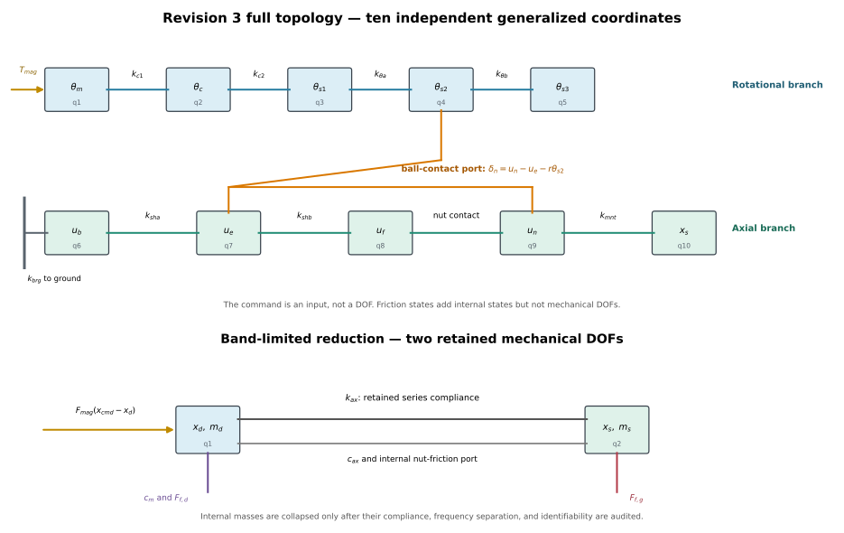

# Dynamic Modeling of a Precision Ball Screw Drive Stage

**Revision 3.** Full decomposed model, followed by a derived reduction.

Revision 2 asserted a lumped two-mass model as a modeling assumption. This revision builds the decomposed model first and derives the reduction as a result, with stated criteria and quantified residuals.

> **Rendered-document guide.** The [comprehensive analytical derivation and executed responses](Analytical_derivation_and_responses_v3.html) is the companion to this model specification. Amber editable cells in either rendered HTML are provisional assumptions. Browser edits persist locally and can be saved into an HTML copy; static plots are regenerated only by the single `build_model_documentation.py` builder.

---

## 0. Method

Three stages, in order.

1. **Enumerate.** Every distinguishable inertia, compliance and dissipation site, with no collapses.
2. **Reduce.** Apply three independent criteria element by element. An element is removed only if it fails all three.
3. **Verify.** Quantify what each collapse discards, and record a fallback for each.

| # | Criterion | Question | Governs |
|---|---|---|---|
| C1 | Series compliance share | Does its deflection contribute meaningfully to the lost-motion budget? | DC accuracy |
| C2 | Mode separation | Does the mode it creates lie above the excitation bandwidth? | Dynamics |
| C3 | Structural identifiability | Does removing it merge two friction sites into one? | Parameter transfer |

C1 and C2 are independent. A stiff but light element can resonate in band while contributing negligible compliance. A soft element far above the band still contributes DC error. C3 is independent of both and is the criterion that retains the axial degree of freedom.

---

## 1. Full Degree-of-Freedom Enumeration

The intended scope was eight degrees of freedom. Honest enumeration produces ten. The two extra are the screw sections beyond the nut, retained for completeness and first in line for removal.

### 1.1 Topology

```
 TORSIONAL BRANCH                            AXIAL BRANCH
 ================                            ============

  [theta_cmd]                                  ground
      |                                          |
   (k_m nonlinear + detent)                   (k_brg)
      v                                          v
  q1: theta_m   J_m  --(T_mb to gnd)         q6: u_b   m_b
      |                                          |
   (k_c1) || hub-1 micro-slip                 (k_sha)
      v                                          v
  q2: theta_c   J_c                           q7: u_e   m_e
      |                                          |
   (k_c2) || hub-2 micro-slip                 (k_shb)
      v                                          v
  q3: theta_s1  J_s1 --(T_brg to gnd)         q8: u_f   m_f
      |
   (k_th_a)
      v
  q4: theta_s2  J_s2 <==[ NUT INTERFACE ]==>  q9: u_n   m_n
      |         delta_n = u_n - u_e - r*theta_s2      |
   (k_th_b)     F_n = k_ball * delta_n            (k_mnt)
      v         T_f,n = rolling friction              v
  q5: theta_s3  J_s3                          q10: x_s  m_s
                                                     |
                                              (guideway friction)
                                                     v
                                                  ground
```

The two branches couple **only** at the nut interface, and only through $r = L/2\pi = 1.592\times10^{-4}$ m/rad. The smallness of this factor is what ultimately permits the reduction.

### 1.2 Coordinates

| # | Symbol | Body | Domain |
|---|---|---|---|
| q1 | $\theta_m$ | Motor rotor | torsional |
| q2 | $\theta_c$ | Coupling body (lattice) | torsional |
| q3 | $\theta_{s1}$ | Screw, drive end | torsional |
| q4 | $\theta_{s2}$ | Screw, at nut engagement | torsional |
| q5 | $\theta_{s3}$ | Screw, beyond nut | torsional |
| q6 | $u_b$ | Screw, at support bearing | axial |
| q7 | $u_e$ | Screw, at nut engagement | axial |
| q8 | $u_f$ | Screw, far end | axial |
| q9 | $u_n$ | Ball nut body | axial |
| q10 | $x_s$ | Stage assembly | axial |

Torsion and axial extension of a shaft are elastically decoupled, so $\theta_{s2}$ and $u_e$ are independent coordinates on the same physical body.



$x_{cmd}$ is an input, not a mechanical DOF. Friction-law memory variables are internal constitutive states and likewise do not change the mechanical DOF count.

### 1.3 Elements

**Torsional compliances:** $k_m$ magnetic, $k_{c1}$ and $k_{c2}$ coupling half-stiffnesses, $k_{\theta a}$ screw torsion drive-end to nut, $k_{\theta b}$ screw torsion nut to far end.

**Axial compliances:** $k_{brg}$ support bearing pair, $k_{sha}$ screw extension bearing to nut, $k_{shb}$ screw extension nut to far end, $k_{ball}$ ball-raceway normal contact, $k_{mnt}$ nut body and nut-to-stage mounting.

**Friction sites (six):**

| Site | Symbol | Driving velocity | Acts between |
|---|---|---|---|
| Motor bearings | $T_{mb}$ | $\dot\theta_m$ | rotor, ground |
| Coupling hub 1 micro-slip | $T_{h1}$ | $\dot\theta_m - \dot\theta_c$ | rotor, coupling |
| Coupling hub 2 micro-slip | $T_{h2}$ | $\dot\theta_c - \dot\theta_{s1}$ | coupling, screw |
| Support bearings | $T_{brg}$ | $\dot\theta_{s1}$ | screw, ground |
| Ball nut rolling | $T_{f,n}$ | $\dot\theta_{s2}$ | screw, nut |
| Linear guideways | $F_{f,g}$ | $\dot x_s$ | stage, ground |

The two hub micro-slip sites exist only because the coupling was decomposed. They correspond to set-screw hub slip on the lattice coupling and are invisible in any lumped drivetrain model.

---

## 2. Nut Interface Kinematics

The thread imposes a nominal relation between screw rotation and nut advance. The ball contact compliance is the deviation from it. Define

$$\delta_n = u_n - u_e - r\,\theta_{s2}, \qquad F_n = k_{ball}\,\delta_n + c_{ball}\,\dot\delta_n$$

By virtual work, $\partial\delta_n/\partial u_n = +1$, $\partial\delta_n/\partial u_e = -1$, $\partial\delta_n/\partial\theta_{s2} = -r$. Generalized forces are $-F_n$ on $u_n$, $+F_n$ on $u_e$, $+rF_n$ on $\theta_{s2}$.

### 2.1 Two distinct nut compliances

Decomposition resolves the Revision 2 double-counting question, and resolves it differently.

$k_{ball}$ is the **normal-load Hertzian axial stiffness** of the ball-raceway contact. It sits in the axial load path and is conservative.

$\sigma_{0,n}$, the presliding stiffness of the nut friction model, is the **tangential traction compliance** of the rolling contact. By Mindlin contact theory these are related but distinct, and they act on different coordinates: $k_{ball}$ on $\delta_n$, the friction on $\dot\theta_{s2}$.

They are therefore not the same element and there is no double counting. Revision 2 resolved this by convention, defining $k_{ax}$ as a sliding-regime stiffness. That convention is unnecessary and should be dropped.

---

## 3. Full Equations of Motion

### Drive torque (switchable)

$$T_{mag} = (1-\lambda_{mag})\,k_m(\theta_{cmd}-\theta_m) + \lambda_{mag}\,T_{max}\sin\!\big(N_r(\theta_{cmd}-\theta_m)\big) - \lambda_{det}\,T_{det}\sin\!\big(4N_r\theta_m\big)$$

with $k_m = N_r T_{max}$, $N_r = 50$ for a 1.8° motor, $\lambda_{mag},\lambda_{det}\in\{0,1\}$.

The executable nonlinear stepping cases use $\lambda_{mag}=1$ and $\lambda_{det}=0$. Detent is disabled because no measured or sourced $T_{det}$ amplitude and equilibrium phase are available. The approximately 226 Hz magnetic/drivetrain pole is still present, but the provisional $\zeta_m=0.50$ strongly suppresses its visible Bode peak; the analytical companion includes an explicit damping/output sensitivity plot.

### Torsional branch

**q1, rotor**

$$J_m\ddot\theta_m = T_{mag} - c_{\theta m}\dot\theta_m - k_{c1}(\theta_m-\theta_c) - c_{c1}(\dot\theta_m-\dot\theta_c) - T_{h1} - T_{mb}$$

where $c_{\theta m}=2\zeta_m\sqrt{k_mJ_\Sigma}$. This effective current-regulator/back-EMF damping is the inherited Revision 2 repair for the unrealistic sustained command ringing. Its executed $\zeta_m$ remains a highlighted assumption until identified electrically.

**q2, coupling**

$$J_c\ddot\theta_c = k_{c1}(\theta_m-\theta_c) + c_{c1}(\dot\theta_m-\dot\theta_c) + T_{h1} - k_{c2}(\theta_c-\theta_{s1}) - c_{c2}(\dot\theta_c-\dot\theta_{s1}) - T_{h2}$$

**q3, screw drive end**

$$J_{s1}\ddot\theta_{s1} = k_{c2}(\theta_c-\theta_{s1}) + c_{c2}(\dot\theta_c-\dot\theta_{s1}) + T_{h2} - k_{\theta a}(\theta_{s1}-\theta_{s2}) - T_{brg}$$

**q4, screw at nut**

$$J_{s2}\ddot\theta_{s2} = k_{\theta a}(\theta_{s1}-\theta_{s2}) - k_{\theta b}(\theta_{s2}-\theta_{s3}) + r\,F_n - T_{f,n}$$

**q5, screw beyond nut**

$$J_{s3}\ddot\theta_{s3} = k_{\theta b}(\theta_{s2}-\theta_{s3})$$

### Axial branch

**q6, screw at bearing**

$$m_b\ddot u_b = -k_{brg}u_b - c_{brg}\dot u_b + k_{sha}(u_e-u_b) + c_{sha}(\dot u_e-\dot u_b)$$

**q7, screw at nut**

$$m_e\ddot u_e = -k_{sha}(u_e-u_b) - c_{sha}(\dot u_e-\dot u_b) + k_{shb}(u_f-u_e) + F_n$$

**q8, screw far end**

$$m_f\ddot u_f = -k_{shb}(u_f-u_e)$$

**q9, nut body**

$$m_n\ddot u_n = -F_n - k_{mnt}(u_n-x_s) - c_{mnt}(\dot u_n-\dot x_s)$$

**q10, stage**

$$m_s\ddot x_s = k_{mnt}(u_n-x_s) + c_{mnt}(\dot u_n-\dot x_s) - F_{f,g}$$

### Structural observations

The mass matrix is diagonal in this coordinate set. The stiffness matrix is tridiagonal within each branch, with exactly one off-branch coupling, at $(q4,q7)$ and $(q4,q9)$, arising from $r\theta_{s2}$ in $\delta_n$. The system is a chain, not a general network. That structure is what makes element-by-element reduction legitimate.

---

## 4. Common-Footing Parameter Table

### 4.0 Executable defaults

The source estimates below remain the provenance record. The following cells show exactly which values the executable model uses. Highlighted cells are deliberately visible assumptions, including the values needed to close the stiffness and inertia budgets.

| Parameter | Executed value | Unit |
|---|---:|---|
| lead $L$ | [[input:spec_lead=1.000e-3]] | m/rev |
| rotor teeth $N_r$ | [[input:spec_rotor_teeth=50]] | – |
| reduced $m_d$ | [[assumed:spec_m_d=59.0]] | kg |
| reduced $m_s$ | [[input:spec_m_s=0.600]] | kg |
| $K_m$ | [[assumed:spec_K_m=1.200e8]] | N/m |
| measured $k_{ax}$ | [[input:spec_k_ax=1.140e7]] | N/m |
| coupling $J_c$ | [[assumed:spec_J_c=5.000e-8]] | kg·m² |
| support bearing $k_{brg}$ | [[assumed:spec_k_brg=2.500e7]] | N/m |
| closure-derived $k_{ball}$ | [[assumed:spec_k_ball=4.387e7]] | N/m |
| electromagnetic damping ratio $\zeta_m$ | [[assumed:spec_zeta_m=0.50]] | – |

The source-table $J_c\approx1.2\times10^{-6}$ kg·m² would make the reflected drive mass approximately 104–106 kg rather than 59 kg and is therefore not used silently. The executable $J_c$ above closes the stated inertia budget but requires CAD/datasheet verification.

All compliances reflected to the linear domain via $k_{lin}=k_{rot}/r^2$, with $r^2 = 2.533\times10^{-8}$.

| Element | Native | Linear equiv. [N/m] | Compliance [m/N] | Share | Status |
|---|---|---|---|---|---|
| $k_m$ magnetic | ~3 N·m/rad | 1.2×10⁸ | 8.33×10⁻⁹ | 9.5% | from $T_{max}$, unverified |
| coupling $k_{c1},k_{c2}$ | ~100 N·m/rad | 4.0×10⁹ | 2.5×10⁻¹⁰ | 0.3% | placeholder |
| $k_{\theta a}$ screw torsion | ~211 N·m/rad | 8.3×10⁹ | 1.2×10⁻¹⁰ | 0.1% | computed, $GJ/L$ |
| $k_{sha}$ screw axial | — | 6.7×10⁷ | 1.49×10⁻⁸ | 17% | computed $EA/L$, position dep. |
| $k_{brg}$ support bearings | — | 3–15×10⁶ | 6.7–33×10⁻⁸ | **76–380%** | spec range, ambiguous |
| $k_{ball}$ ball contact | — | unknown | unknown | ? | not estimated |
| $k_{mnt}$ nut mount | — | ~1×10⁸ | 1.0×10⁻⁸ | 11% | placeholder |
| **Measured total** | — | **1.14×10⁷** | **8.77×10⁻⁸** | **100%** | modal, 694 Hz |

Inertias, reflected:

| Element | Native | Linear equiv. [kg] | Status |
|---|---|---|---|
| $J_m$ rotor | ~1.2×10⁻⁶ kg·m² | ~47 | placeholder |
| $J_c$ coupling | ~1.2×10⁻⁶ kg·m² | ~47 | placeholder |
| $J_{s1..s3}$ screw | ~3×10⁻⁷ kg·m² | ~12 | placeholder |
| $m_b+m_e+m_f$ | ~0.04 kg | 0.04 | computed |
| $m_n$ nut body | ~0.05 kg | 0.05 | placeholder |
| $m_s$ stage | 0.60 kg | 0.60 | measured, modal |

### 4.1 Compliance budget closure check — does not close

| Item | Compliance [m/N] | Running total |
|---|---|---|
| Measured total available | — | 8.77×10⁻⁸ |
| less $k_m$ | 8.33×10⁻⁹ | 7.94×10⁻⁸ |
| less $k_{sha}$ at 150 mm free length | 1.49×10⁻⁸ | 6.45×10⁻⁸ |
| less coupling and screw torsion | 3.7×10⁻¹⁰ | 6.41×10⁻⁸ |
| **available for $k_{brg}$, $k_{ball}$, $k_{mnt}$** | — | **6.41×10⁻⁸** |

The support bearing pair at the **top** of its spec range, 15 N/µm, consumes 6.67×10⁻⁸ m/N alone. That exceeds the entire remaining budget, before allocating anything to the ball contact or the nut mount.

**Conclusion.** The measured 694 Hz stage mode requires the support bearing pair to be stiffer than the upper bound of its published range. One of the following holds.

1. The bearing is the 25° contact angle variant, not 15°. Axial stiffness scales strongly with contact angle. This is the most likely explanation and would resolve the BOM ambiguity in favour of 25°.
2. Preload exceeds the light-preload assumption, or the mounting adds stiffness not credited to $k_{brg}$.
3. $m_{eff}=0.60$ kg is an underestimate. Larger effective mass at the same frequency implies a stiffer chain.
4. The 694 Hz feature is not the axial drivetrain mode.

This check is the principal product of decomposition. A lumped $k_{ax}$ absorbs the discrepancy into one fitted number and the inconsistency never surfaces.

**Resolving measurement:** dead-weight axial loading of the stage with interferometric readout gives $k_{ax}$ statically, independent of $m_{eff}$. That single test separates hypotheses 3 and 4 from 1 and 2.

---

## 5. Reduction

### 5.1 Element-by-element

| Coordinate | C1 compliance share | C2 blocked freq. | C3 identifiability | Verdict |
|---|---|---|---|---|
| q1 $\theta_m$ | drive node | — | carries $T_{mb}$ | **retain** |
| q2 $\theta_c$ | 0.3% | ~2.9 kHz | merges $T_{h1}$, $T_{h2}$ | collapse |
| q3 $\theta_{s1}$ | 0.1% | ~6 kHz | merges $T_{brg}$ | collapse |
| q4 $\theta_{s2}$ | 0.1% | ~6 kHz | — | collapse |
| q5 $\theta_{s3}$ | none | ~6 kHz | none | collapse |
| q6 $u_b$ | $k_{brg}$, 76%+ | ~2.9 kHz | none | collapse mass, **retain compliance** |
| q7 $u_e$ | $k_{sha}$, 17% | ~2.9 kHz | none | collapse mass, **retain compliance** |
| q8 $u_f$ | none | high | none | collapse |
| q9 $u_n$ | $k_{mnt}$, ~11% | ~7 kHz | none | collapse mass, **retain compliance** |
| q10 $x_s$ | stage node | 694 Hz | carries $F_{f,g}$ | **retain** |

Every internal mass fails C1 and C2 by wide margins. The compliances do not, and four are retained in series. Two coordinates survive.

**On C3.** Collapsing q2 and q3 merges $T_{h1}$, $T_{h2}$, $T_{mb}$ and $T_{brg}$ into a single drivetrain-to-ground term $F_{f,d}$. This is an accepted loss: none of the four is separately observable in the deployed open-loop configuration. Retaining the split of $F_{f,n}$ from $F_{f,g}$ is not optional, and is the sole reason a second coordinate is kept at all.

### 5.2 Discarded mode inventory

| Mode | Frequency | Reason for discard |
|---|---|---|
| Rotor against coupling | ~2.9 kHz | 3.2× above band |
| Rotor/coupling against screw torsion | ~6 kHz | 6.7× above band |
| Screw axial against bearings | ~2.9 kHz | 3.2× above band |
| Nut body against mount | ~7 kHz | 7.8× above band |

Band of interest taken as ≤900 Hz. Nearest discarded mode has 3.2× separation.

> **Open item.** All four rest on placeholder values. The coupling mode is most exposed: at $k_c = 10$ N·m/rad rather than 100 it falls to roughly 0.9 kHz and enters the band. Bellows torsional stiffness from the datasheet is the highest-value single number to obtain.

### 5.3 Derived reduced model

$$m_d = \frac{J_m + J_c + J_{s1} + J_{s2} + J_{s3}}{r^2}, \qquad m_s = m_{stage} + m_{nut} + 4m_{cart} + m_{payload}$$

$$\frac{1}{k_{ax}} = \frac{1}{k_{brg}} + \frac{1}{k_{sha}} + \frac{1}{k_{ball}} + \frac{1}{k_{mnt}}$$

$k_{ax}$ is carried as a scalar. Note that $k_{sha}$ is position dependent through the free screw length, so $k_{ax}$ is position dependent. See Section 6.2.

$K_m = k_m/r^2$ is **not** part of $k_{ax}$. It grounds the drive node separately, so the two appear in series in the static stage-to-ground path.

$$
\begin{bmatrix} m_d & 0 \\ 0 & m_s \end{bmatrix}
\begin{bmatrix} \ddot x_d \\ \ddot x_s \end{bmatrix}
+ c_{ax}\begin{bmatrix} 1 & -1 \\ -1 & 1 \end{bmatrix}
\begin{bmatrix} \dot x_d \\ \dot x_s \end{bmatrix}
+ k_{ax}\begin{bmatrix} 1 & -1 \\ -1 & 1 \end{bmatrix}
\begin{bmatrix} x_d \\ x_s \end{bmatrix}
=
\begin{bmatrix} F_{mag} - F_{f,n} - F_{f,d} \\[2pt] F_{f,n} - F_{f,g} \end{bmatrix}
$$

with $x_d = u_e + r\theta_{s2}$ the effective drive-side coordinate and $F_{mag} = T_{mag}/r$.

This is structurally identical to the Revision 2 result. The difference is that it is now a derived object with stated provenance, a discarded-mode inventory and a failing closure check attached, rather than an assumption.

The stage end effector has one output translation, $x_s$, but the compliant plant has two generalized coordinates. $x_d$ is an internal reflected rotor/screw coordinate, not a second end-effector direction. A one-DOF model follows only after imposing the additional rigid constraint $x_d=x_s$; it retains the low common-motion pole but deletes the relative approximately 698 Hz axial mode and collapses the modeled nut differential velocity to zero.

### 5.4 Linearized modal form

$$
\begin{bmatrix} m_d & 0 \\ 0 & m_s \end{bmatrix}\ddot{\mathbf{x}}
+
\begin{bmatrix} K_m + k_{ax} & -k_{ax} \\ -k_{ax} & k_{ax} \end{bmatrix}\mathbf{x}
=
\begin{bmatrix} K_m x_{cmd} \\ 0 \end{bmatrix}
$$

$$m_d m_s\,\omega^4 - \big[m_d k_{ax} + m_s(K_m+k_{ax})\big]\omega^2 + K_m k_{ax} = 0$$

With placeholder values: **226 Hz** and **698 Hz**, against 239 Hz analytical rotor-in-detent and 620–690 Hz measured. Both predicted modes correspond to observed features, subject to the Section 4.1 closure failure.

---

## 6. Verification and Residuals

### 6.1 Full-versus-reduced protocol

Simulate both models on identical input and report the discrepancy.

1. Single microstep, 156 nm at $\mu = 32$, from rest.
2. Bidirectional reversal at the target repeatability scale.
3. Trapezoidal move over full travel with deceleration shaping.
4. Frequency sweep 10 Hz to 3 kHz, drive-to-stage transfer function.

Report peak and RMS position discrepancy. Case 4 shows where the discarded modes live and tests the 3.2× separation claim empirically.

### 6.2 Position dependence prediction

$k_{sha} = EA/L_{free}$ varies across travel. Holding all other budget items fixed:

| Nut position | $k_{sha}$ [N/m] | $k_{ax}$ [N/m] | Predicted mode |
|---|---|---|---|
| 50 mm from bearing | 2.0×10⁸ | 1.29×10⁷ | ~736 Hz |
| 150 mm | 6.7×10⁷ | 1.14×10⁷ | ~694 Hz |
| 250 mm | 4.0×10⁷ | 1.02×10⁷ | ~657 Hz |

Roughly 80 Hz of variation across travel, which brackets the observed 620–690 Hz spread. Falsifiable with impact hammer at three carriage positions. If confirmed, the spread is physical position dependence rather than measurement scatter. If not, $k_{sha}$ is not the element it appears to be and the budget must be reallocated.

### 6.3 Fallback register

| If measurement disagrees with | Relax first |
|---|---|
| Predicted mode 2 frequency | $k_{brg}$ contact angle assumption, then $m_{eff}$ |
| Predicted mode 1 frequency | $J_m$ placeholder, then $T_{max}$ at 400 mA |
| Presence of a mode near 1 kHz | Coupling collapse, restore q2 |
| Position dependence of mode 2 | $k_{sha}$ estimate, restore q6 and q7 separately |
| Hysteresis not reproduced at reversal | Hub micro-slip collapse, restore $T_{h1}$, $T_{h2}$ |

---

## 7. Friction Models

Both given in identical notation so the forcing terms of Section 8 are interchangeable. Each applies independently at each site, with $v$ the site driving velocity.

### 7.1 Shared Stribeck attractor

$$s(v) = F_c + (F_s - F_c)\exp\!\left(-\left|\frac{v}{v_s}\right|^{\delta}\right)$$

### 7.2 Generalized Maxwell-Slip

A parallel bank of $N$ elastoplastic elements. Element $i$ carries force state $F_i$, stiffness $k_i$, normalized weight $\nu_i$ with $\sum\nu_i = 1$. Each element is independently stuck or slipping, giving a switched hybrid system with $2^N$ discrete modes.

**Stuck:** $\dot F_i = k_i v$, valid while $|F_i| < \nu_i s(v)$.

**Slipping:** $\dot F_i = C\!\left(\operatorname{sgn}(v) - \dfrac{F_i}{\nu_i s(v)}\right)$, reverting to stuck at velocity reversal.

This signed-attractor form is important: its equilibrium $F_i=\operatorname{sgn}(v)\nu_i s(v)$ is stable for both velocity signs. Placing $\operatorname{sgn}(v)$ outside the whole bracket makes the negative-velocity branch repelling.

**Output:** $F_f = \sum_{i=1}^N F_i + \sigma_2 v$, with $\sigma_0 = \sum_i k_i$ and total breakaway $F_s$.

Elements reach their thresholds at different deflections, so the model retains **non-local memory**. This is the property that motivates GMS and is not reproducible with a single internal state.

### 7.3 LuGre and elastoplastic extension

**State:** $\dot z = v - \sigma_0\dfrac{|v|}{s(v)}z$

**Output:** $F_f = \sigma_0 z + \sigma_1\dot z + \sigma_2 v$

**Elastoplastic:** $\dot z = v\left[1 - \alpha(z,v)\operatorname{sgn}(v)\dfrac{\sigma_0 z}{s(v)}\right]$, recovering LuGre at $\alpha = 1$.

### 7.4 Comparison

| Property | GMS | LuGre |
|---|---|---|
| States per site | $N$ | 1 |
| Form | switched hybrid, $2^N$ modes | smooth ODE |
| Presliding memory | non-local | local |
| True stick | exact | only with $\alpha$ |
| Parameters per site | $2N+4$ | 6 |
| Integration cost | high, event detection | low |

---

## 8. Friction Site Variants

The reduced equation of Section 5.3 is unchanged. Only the forcing vector changes. Each active site takes either friction model without structural change.

| Case | $F_{f,g}$ | $F_{f,n}$ | $F_{f,d}$ | Purpose |
|---|:---:|:---:|:---:|---|
| 0 | – | – | – | Modal baseline |
| A | ✓ | – | – | Guideway, LuGre |
| A2 | ✓ | – | – | Guideway, matched GMS |
| B | – | ✓ | – | Nut, LuGre |
| B2 | – | ✓ | – | Nut, matched GMS |
| C | ✓ | ✓ | – | Guideway + nut, LuGre |
| C2 | ✓ | ✓ | – | Guideway + nut, matched GMS |
| D | ✓ | ✓ | ✓ | Full plant, testbed correlation |

Cases with suffix `2` use the same mechanical force vector as their unsuffixed counterpart; only the constitutive law changes from LuGre to GMS. Case 0 is always frictionless. Case D is not executed until drivetrain-friction parameters are identified.

**Case 0:** $\mathbf{f} = \begin{bmatrix} F_{mag} \\ 0\end{bmatrix}$

**Case A:** $\mathbf{f} = \begin{bmatrix} F_{mag} \\ -F_{f,g}(\dot x_s) \end{bmatrix}$

**Case B:** $\mathbf{f} = \begin{bmatrix} F_{mag} - F_{f,n}(\dot x_d - \dot x_s) \\ +F_{f,n}(\dot x_d - \dot x_s) \end{bmatrix}$

**Case C:** $\mathbf{f} = \begin{bmatrix} F_{mag} - F_{f,n}(\dot x_d-\dot x_s) \\ F_{f,n}(\dot x_d-\dot x_s) - F_{f,g}(\dot x_s) \end{bmatrix}$

**Case D:** $\mathbf{f} = \begin{bmatrix} F_{mag} - F_{f,n}(\dot x_d-\dot x_s) - F_{f,d}(\dot x_d) \\ F_{f,n}(\dot x_d-\dot x_s) - F_{f,g}(\dot x_s) \end{bmatrix}$

$F_{f,d}$ aggregates the four drivetrain-to-ground sites merged in Section 5.1: motor bearings, both coupling hubs, and the support bearings.

---

## 9. Identifiability

**Single-coordinate model.** A rigid kinematic lock forces $\dot x_d = \dot x_s$, so $v_n \equiv 0$ and $v_g \equiv v_d$. The guideway and drivetrain friction terms are driven by the same velocity and sum at the same node. Only the aggregate is identifiable. The split is structurally unrecoverable regardless of measurement quality or excitation richness.

**Two-coordinate model.** Three sites, three distinct velocity arguments, two distinct bodies:

- $F_{f,g}$ sets absolute stage lost motion, visible to a stage-referenced measurement.
- $F_{f,n}$ appears only as differential deflection across $k_{ax}$, requiring a differential measurement spanning drivetrain and stage pickups.
- $F_{f,d}$ acts on the drive node against ground, separable only if the drive coordinate is instrumented.

In the deployed open-loop configuration neither the drive coordinate nor the differential deflection is measurable, so only the aggregate is observable. Identification must be performed on the instrumented testbed and the split transferred. This is the formal statement of why the differential interferometer topology is necessary rather than merely convenient.

---

## 10. Known Limitations

1. Every inertia and most stiffnesses are placeholders. All frequencies in Sections 4, 5 and 6 are provisional.
2. **The compliance budget does not close.** See Section 4.1. Unresolved, and takes priority.
3. $k_{ax}$ is carried as a scalar despite the position dependence quantified in Section 6.2.
4. Carriage skirt compliance and rail bending are absorbed into the rigid stage assumption.
5. Yaw, pitch and roll are not modeled. Drive axis only.
6. Thermal dependence of all friction parameters is omitted.
7. Screw lead error, cyclic error and runout are not represented.
8. Stepper electrical dynamics omitted. Defensible below 900 RPM, not above.
9. Nut friction load dependence, $T_{f,n}$ as a function of $|F_n|$, is written but not parameterized.

---

## Nomenclature

| Symbol | Description | Units |
|---|---|---|
| $r = L/2\pi$ | Screw transmission ratio | m/rad |
| $L$ | Screw lead, 1 mm | m |
| $\theta_m,\theta_c,\theta_{s1..s3}$ | Torsional coordinates | rad |
| $u_b,u_e,u_f,u_n,x_s$ | Axial coordinates | m |
| $x_d = u_e + r\theta_{s2}$ | Effective drive-side coordinate | m |
| $J_m,J_c,J_{s1..s3}$ | Torsional inertias | kg·m² |
| $m_b,m_e,m_f,m_n,m_s$ | Axial masses | kg |
| $m_d$ | Reflected drivetrain mass | kg |
| $k_m$, $K_m = k_m/r^2$ | Magnetic stiffness | N·m/rad, N/m |
| $k_{c1},k_{c2}$ | Coupling half-stiffnesses | N·m/rad |
| $k_{\theta a},k_{\theta b}$ | Screw torsional stiffnesses | N·m/rad |
| $k_{brg}$ | Support bearing axial stiffness | N/m |
| $k_{sha},k_{shb}$ | Screw axial extension stiffnesses | N/m |
| $k_{ball}$ | Ball contact normal axial stiffness | N/m |
| $k_{mnt}$ | Nut mount stiffness | N/m |
| $k_{ax}$ | Reduced series axial stiffness | N/m |
| $\delta_n$, $F_n$ | Nut interface deflection and force | m, N |
| $T_{mb},T_{h1},T_{h2},T_{brg},T_{f,n}$ | Friction torques | N·m |
| $F_{f,g},F_{f,n},F_{f,d}$ | Reduced-model friction forces | N |
| $N_r$, $T_{max}$, $T_{det}$ | Rotor teeth (50), peak torque, detent amplitude | –, N·m, N·m |
| $\lambda_{mag},\lambda_{det}$ | Model switches | – |
| $F_s,F_c,v_s,\delta$ | Stribeck parameters | N, N, m/s, – |
| $N,\nu_i,k_i,F_i,C$ | GMS element count, weight, stiffness, state, attraction | –, –, N/m, N, N/s |
| $z,\sigma_0,\sigma_1,\sigma_2$ | LuGre state and coefficients | m, N/m, N·s/m, N·s/m |
