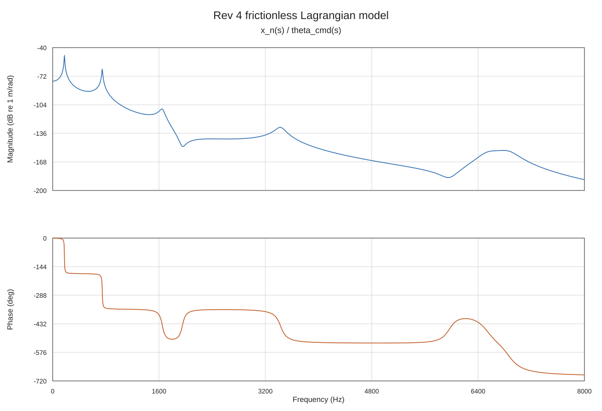

# Rev 4 frictionless model — Lagrangian derivation

This directory provides an independent derivation of the Rev 4
six-coordinate drivetrain using Lagrange's equations and a Rayleigh
dissipation function. It is the first, **frictionless** member of this
derivation route:

- no LuGre bristle states are present;
- all guideway, nut and support-bearing nonlinear friction forces are zero;
- the structural screw–nut stiffness and damping, $k_{nut}$ and $c_{nut}$,
  remain in the plant;
- the nonlinear detent torque is represented by its small-signal tangent at
  $\theta_m=0$ so that a linear Bode response can be calculated.

The structural parameters are read from
`../lugre_friction/Rev 4.2/model_parameters.json`. That file contains the
current complete structural set as well as LuGre parameters; this derivation
uses only the structural entries. No `sigma0`, `sigma1`, `sigma2`, Stribeck
force or friction state enters the equations below.

The purpose is algebraic cross-validation. The Newton/free-body and
Lagrangian routes use the same coordinates and physical assumptions but
assemble the equations differently. Agreement verifies the matrix assembly
and sign convention; it does not identify or validate the parameter values.

## 1. Coordinates and convention

Positive screw rotation drives positive axial translation. Define

$$
r=\frac{L}{2\pi},
\qquad
x=r\theta
$$

and retain

$$
\mathbf q=
\begin{bmatrix}
\theta_m&\theta_c&\theta_s&\theta_{sb}&x_s&x_n
\end{bmatrix}^{T}.
$$

| Coordinate | Physical body | Inertia coefficient | Unit |
|---|---|---:|---|
| $\theta_m$ | Motor rotor | $I_m$ | rad |
| $\theta_c$ | Bellows coupling | $I_c$ | rad |
| $\theta_s$ | Screw rotation | $I_s$ | rad |
| $\theta_{sb}$ | Support-bearing inner ring | $I_{sb}$ | rad |
| $x_s$ | Screw axial translation | $M_{screw}$ | m |
| $x_n$ | Nut and stage | $M_s$ | m |

The screw has independent rotational and axial coordinates because the
screw–nut interface is compliant. The commanded motor angle
$\theta_{cmd}(t)$ is prescribed; it is not another degree of freedom.

## 2. Element deformation coordinates

Each linear two-terminal element is described by

$$
\rho_i=\mathbf J_i\mathbf q,
$$

where $\mathbf J_i$ is a constant element row. The structural rows are

| Element | Deformation $\rho_i$ | $\mathbf J_i$ |
|---|---|---|
| Coupling $k_c,c_c$ | $\theta_m-\theta_c$ | $[1,-1,0,0,0,0]$ |
| Screw 1 $k_{s1},c_{s1}$ | $\theta_c-\theta_s$ | $[0,1,-1,0,0,0]$ |
| Screw 2 $k_{s2},c_{s2}$ | $\theta_s-\theta_{sb}$ | $[0,0,1,-1,0,0]$ |
| Nut contact $k_{nut},c_{nut}$ | $r\theta_s+x_s-x_n$ | $[0,0,r,0,1,-1]$ |
| Axial bearing $k_{brg},c_{brg}$ | $x_s$ | $[0,0,0,0,1,0]$ |
| Motor ground | $\theta_m$ | $[1,0,0,0,0,0]$ |

The nut-seat position is

$$
x_{seat}=x_s+r\theta_s,
$$

so the oriented nut-contact deformation is

$$
\rho_{nut}=x_{seat}-x_n=r\theta_s+x_s-x_n.
$$

The opposite orientation describes the same stored energy because the
potential contains $\rho_{nut}^2$. Fixing the orientation once prevents the
four screw-rotation/axial cross-term signs from being assigned by hand.

## 3. Kinetic energy

The kinetic energy is

$$
T=\frac12\left(
I_m\dot\theta_m^2+I_c\dot\theta_c^2+I_s\dot\theta_s^2
+I_{sb}\dot\theta_{sb}^2+M_{screw}\dot x_s^2+M_s\dot x_n^2
\right)
=\frac12\dot{\mathbf q}^{T}\mathbf M\dot{\mathbf q},
$$

with

$$
\boxed{
\mathbf M=\operatorname{diag}
\left(I_m,I_c,I_s,I_{sb},M_{screw},M_s\right)
}.
$$

The diagonal mass matrix follows from retaining a compliant nut interface.
A rigid constraint $x_n=x_s+r\theta_s$ would eliminate a coordinate and
produce inertial coupling after reduction.

## 4. Potential energy

The quadratic structural potential is

$$
\begin{aligned}
V_{struct}={}&
\frac12k_c(\theta_m-\theta_c)^2
+\frac12k_{s1}(\theta_c-\theta_s)^2
+\frac12k_{s2}(\theta_s-\theta_{sb})^2\\
&+\frac12k_{nut}(r\theta_s+x_s-x_n)^2
+\frac12k_{brg}x_s^2.
\end{aligned}
$$

### 4.1 Commanded electromagnetic spring

The motor spring connects $\theta_m$ to the prescribed command:

$$
V_{EM}=\frac12k_{EM}(\theta_{cmd}-\theta_m)^2.
$$

Expanding it gives

$$
V_{EM}
=\frac12k_{EM}\theta_m^2
-k_{EM}\theta_{cmd}\theta_m
+\frac12k_{EM}\theta_{cmd}^2.
$$

The first term contributes $k_{EM}$ to $K_{11}$. The second produces the
command vector

$$
\boxed{
\mathbf G=k_{EM}\mathbf e_m,
\qquad
\mathbf e_m=\begin{bmatrix}1&0&0&0&0&0\end{bmatrix}^{T}
}.
$$

The final term is independent of $\mathbf q$ and vanishes when differentiated.

### 4.2 Detent potential and Bode linearization

The conservative detent potential is

$$
V_{det}=-\frac{T_d}{4N_r}\cos(4N_r\theta_m),
$$

which produces

$$
\frac{\partial V_{det}}{\partial\theta_m}
=T_d\sin(4N_r\theta_m).
$$

For the frictionless Bode model, linearization at $\theta_m=0$ gives

$$
T_d\sin(4N_r\theta_m)\approx k_d\theta_m,
\qquad
\boxed{k_d=4N_rT_d}.
$$

The detent is grounded, so $k_d$ contributes to $K_{11}$ but not to
$\mathbf G$. This is the convention used by the Rev 4.2 nonlinear model and
its small-signal tangent.

## 5. Rayleigh dissipation

The Rayleigh function is

$$
\begin{aligned}
\mathcal R={}&
\frac12c_c(\dot\theta_m-\dot\theta_c)^2
+\frac12c_{s1}(\dot\theta_c-\dot\theta_s)^2
+\frac12c_{s2}(\dot\theta_s-\dot\theta_{sb})^2\\
&+\frac12c_{nut}(r\dot\theta_s+\dot x_s-\dot x_n)^2
+\frac12c_{brg}\dot x_s^2
+\frac12c_{EM}\dot\theta_m^2.
\end{aligned}
$$

Here $c_{EM}$ is grounded on the motor coordinate, matching the implemented
Rev 4 and Rev 4.2 structural matrices. It does not generate a
$\dot\theta_{cmd}$ input.

## 6. Lagrangian assembly rule

For one elastic element,

$$
V_i=\frac12k_i(\mathbf J_i\mathbf q)^2,
$$

and therefore

$$
\frac{\partial V_i}{\partial\mathbf q}
=k_i\mathbf J_i^T\mathbf J_i\mathbf q.
$$

Summing all elements yields

$$
\boxed{
\mathbf K=\sum_i k_i\mathbf J_i^T\mathbf J_i
},
\qquad
\boxed{
\mathbf C=\sum_i c_i\mathbf J_i^T\mathbf J_i
}.
$$

Every outer product $\mathbf J_i^T\mathbf J_i$ is symmetric,
positive-semidefinite and rank one. Thus symmetry and reaction consistency
are consequences of the energy construction.

For example,

$$
\mathbf J_{nut}=
\begin{bmatrix}0&0&r&0&1&-1\end{bmatrix}
$$

generates

$$
k_{nut}\mathbf J_{nut}^T\mathbf J_{nut}=
\begin{bmatrix}
0&0&0&0&0&0\\
0&0&0&0&0&0\\
0&0&r^2k_{nut}&0&rk_{nut}&-rk_{nut}\\
0&0&0&0&0&0\\
0&0&rk_{nut}&0&k_{nut}&-k_{nut}\\
0&0&-rk_{nut}&0&-k_{nut}&k_{nut}
\end{bmatrix}.
$$

The $r^2$ reflection and all four cross-term signs therefore follow from
one deformation coordinate.

## 7. Euler–Lagrange equations

With $\mathcal L=T-V$ and Rayleigh dissipation,

$$
\frac{d}{dt}\frac{\partial\mathcal L}{\partial\dot{\mathbf q}}
-\frac{\partial\mathcal L}{\partial\mathbf q}
+\frac{\partial\mathcal R}{\partial\dot{\mathbf q}}=\mathbf0.
$$

After moving the rheonomic electromagnetic cross term to the right,

$$
\boxed{
\mathbf M\ddot{\mathbf q}
+\mathbf C\dot{\mathbf q}
+\mathbf K\mathbf q
=\mathbf G\theta_{cmd}
}.
$$

There is no nonlinear generalized-force vector in this first derivation.

The assembled tangent stiffness is

$$
\mathbf K=
\begin{bmatrix}
k_c+k_{EM}+k_d&-k_c&0&0&0&0\\
-k_c&k_c+k_{s1}&-k_{s1}&0&0&0\\
0&-k_{s1}&k_{s1}+k_{s2}+r^2k_{nut}&-k_{s2}&rk_{nut}&-rk_{nut}\\
0&0&-k_{s2}&k_{s2}&0&0\\
0&0&rk_{nut}&0&k_{brg}+k_{nut}&-k_{nut}\\
0&0&-rk_{nut}&0&-k_{nut}&k_{nut}
\end{bmatrix},
$$

and the damping matrix is

$$
\mathbf C=
\begin{bmatrix}
c_c+c_{EM}&-c_c&0&0&0&0\\
-c_c&c_c+c_{s1}&-c_{s1}&0&0&0\\
0&-c_{s1}&c_{s1}+c_{s2}+r^2c_{nut}&-c_{s2}&rc_{nut}&-rc_{nut}\\
0&0&-c_{s2}&c_{s2}&0&0\\
0&0&rc_{nut}&0&c_{brg}+c_{nut}&-c_{nut}\\
0&0&-rc_{nut}&0&-c_{nut}&c_{nut}
\end{bmatrix}.
$$

## 8. First-order state space

Define

$$
\mathbf z=
\begin{bmatrix}\mathbf q\\\dot{\mathbf q}\end{bmatrix}.
$$

Then

$$
\dot{\mathbf z}=\mathbf A\mathbf z+\mathbf B\theta_{cmd},
$$

with

$$
\mathbf A=
\begin{bmatrix}
\mathbf0&\mathbf I\\
-\mathbf M^{-1}\mathbf K&-\mathbf M^{-1}\mathbf C
\end{bmatrix},
\qquad
\mathbf B=
\begin{bmatrix}
\mathbf0\\\mathbf M^{-1}\mathbf G
\end{bmatrix}.
$$

The output is stage position:

$$
y=x_n=\mathbf C_y\mathbf z,
\qquad
\mathbf C_y=
\begin{bmatrix}0&0&0&0&0&1&0&0&0&0&0&0\end{bmatrix}.
$$

## 9. Frequency response

For $s=j\omega$, the second-order frequency-domain equation is

$$
\left(-\omega^2\mathbf M+j\omega\mathbf C+\mathbf K\right)
\hat{\mathbf q}=\mathbf G\hat\theta_{cmd}.
$$

Therefore

$$
\boxed{
H(j\omega)=\frac{x_n(j\omega)}{\theta_{cmd}(j\omega)}
=\mathbf e_n^T
\left(-\omega^2\mathbf M+j\omega\mathbf C+\mathbf K\right)^{-1}
\mathbf G
},
$$

where $\mathbf e_n=[0,0,0,0,0,1]^T$.

The generated response covers 0–8 kHz at 0.1 Hz spacing:



The six damped modal frequencies are:

| Mode | Frequency | Damping ratio |
|---:|---:|---:|
| 1 | 176.690 Hz | 0.019999 |
| 2 | 745.965 Hz | 0.007267 |
| 3 | 1650.229 Hz | 0.021762 |
| 4 | 3429.322 Hz | 0.019945 |
| 5 | 6536.223 Hz | 0.024016 |
| 6 | 6863.226 Hz | 0.021868 |

The DC gain is

$$
H(0)=1.326291\times10^{-4}\ \mathrm{m/rad}.
$$

Because the detent tangent is grounded,

$$
H(0)=\frac{k_{EM}}{k_{EM}+k_d}\,r
=\frac{3.0}{3.0+0.6}(1.591549\times10^{-4})
=1.326291\times10^{-4}\ \mathrm{m/rad}.
$$

## 10. Parameters used

| Parameter | Value | Unit |
|---|---:|---|
| $L$ | $1.0\times10^{-3}$ | m/rev |
| $N_r$ | 50 | — |
| $T_{hold}$ | 0.06 | N m |
| $T_d$ | $3.0\times10^{-3}$ | N m |
| $I_m$ | $9.0\times10^{-7}$ | kg m² |
| $I_c$ | $1.18\times10^{-6}$ | kg m² |
| $I_s$ | $6.06\times10^{-7}$ | kg m² |
| $I_{sb}$ | $1.5\times10^{-7}$ | kg m² |
| $M_{screw}$ | 0.0758 | kg |
| $M_s$ | 0.405 | kg |
| $k_c$ | 68.75 | N m/rad |
| $k_{s1}$ | 211.0 | N m/rad |
| $k_{s2}$ | 211.0 | N m/rad |
| $k_{nut}$ | $1.0\times10^8$ | N/m |
| $k_{brg}$ | $1.14\times10^7$ | N/m |
| $c_c$ | $2.4\times10^{-4}$ | N m s/rad |
| $c_{s1}$ | $3.7\times10^{-4}$ | N m s/rad |
| $c_{s2}$ | $2.0\times10^{-4}$ | N m s/rad |
| $c_{nut}$ | 101.0 | N s/m |
| $c_{brg}$ | 37.2 | N s/m |
| $c_{EM}$ | $1.3283\times10^{-4}$ | N m s/rad |

Derived values are $k_{EM}=N_rT_{hold}=3.0$ N m/rad and
$k_d=4N_rT_d=0.6$ N m/rad.

These remain the provisional values and caveats recorded in the source
parameter files; this derivation does not promote them to identified values.

## 11. Verification and convention difference

The generated script independently assembles $\mathbf M$, $\mathbf C$ and
$\mathbf K$ from the element outer products. It then compares them with the
frictionless tangent of `lugre_model_rev42.py`:

- maximum residual in $\mathbf M$: 0;
- maximum residual in $\mathbf C$: 0;
- maximum residual in tangent $\mathbf K$: 0;
- maximum residual in $\mathbf G$: 0;
- maximum complex transfer-response residual over 0–8 kHz: 0.

Thus the Lagrangian assembly reproduces the Rev 4.2 zero-friction tangent
exactly for the same parameters.

One convention difference remains in the older root script
`../scripts/build_bode_rev4.py`: it uses

$$
G_1=k_{EM}+k_d,
$$

whereas the grounded-detent Lagrangian/Rev 4.2 model uses

$$
G_1=k_{EM}.
$$

Both have $K_{11}=k_c+k_{EM}+k_d$. The older root convention effectively
moves the detent equilibrium with the command and therefore preserves
$H(0)=r$. The grounded-detent convention treats cogging as a torque against
the fixed motor frame and gives the reduced DC gain derived in Section 9.
This is a modelling choice, not a matrix-assembly error, and it must be kept
fixed when comparing Bode results.

## 12. Reproduction files

- `scripts/build_bode_lagrange_frictionless.py` — independent Lagrangian
  assembly, validation and plot generation.
- `rendered_assets/bode_lagrange_frictionless.svg` — generated Bode plot.
- `rendered_assets/bode_lagrange_frictionless_data.npz` — frequencies,
  complex response and assembled matrices.
- `rendered_assets/bode_lagrange_frictionless_summary.json` — numerical
  modes, damping, DC gain and validation residuals.

Regenerate from the repository root with:

```bash
python3 "Rev 4/Lagrange Derivation/scripts/build_bode_lagrange_frictionless.py"
```
